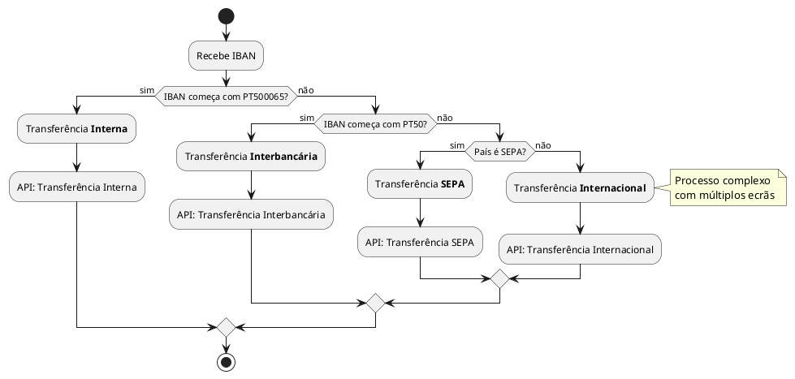
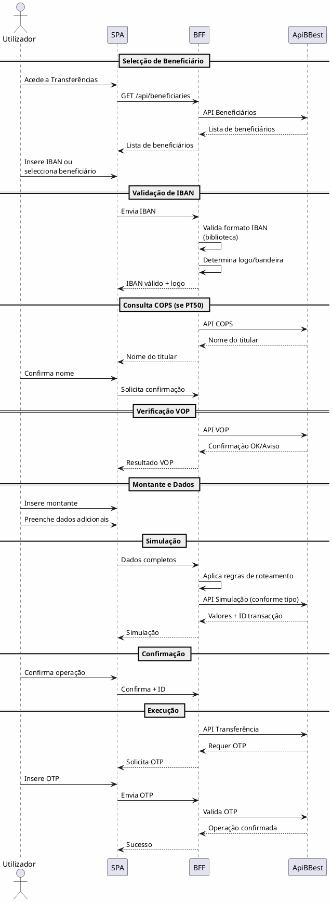
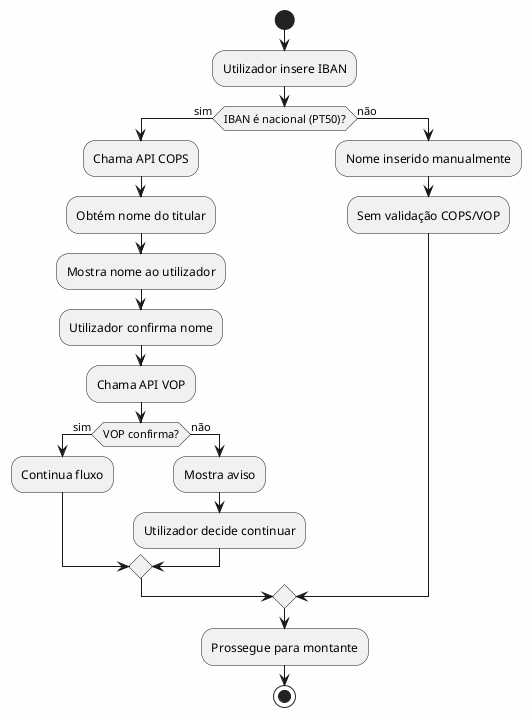

# DEF-03: Regras de Transferências

> **Secção relacionada:** [3 - Visão Geral da Solução](../sections/SEC-03-visao-geral-solucao.md)
> **Fonte:** Diagramas de sequência do cliente (`customer_sequences/`)

## Contexto

Definir as regras de negócio para roteamento e processamento de transferências no HomeBanking Web. O BFF é responsável por aplicar estas regras para determinar qual API utilizar.

## Tipos de Transferência

### Classificação por IBAN

### Tabela de Roteamento

| Condição IBAN | Tipo | API | Complexidade |
|---------------|------|-----|--------------|
| PT500065* | Interna (mesmo banco) | API Transferência Interna | Baixa |
| PT50* (não 0065) | Interbancária Nacional | API Transferência Interbancária | Média |
| País SEPA (não PT) | SEPA | API Transferência SEPA | Média |
| País não-SEPA | Internacional | API Transferência Internacional | **Alta** |

> **Nota:** PT500065 é o BIC/código do Banco Best. Transferências para este BIC são internas.

## Fluxo de Transferência

### Fluxo Geral

### Dados do Pedido de Transferência

| Campo | Descrição | Obrigatório |
|-------|-----------|-------------|
| home_account_number | Conta de origem | Sim |
| destination_iban | IBAN de destino | Sim |
| destination_name | Nome do beneficiário | Sim |
| amount | Montante | Sim |
| description | Descrição/motivo | Não |
| destination_email | Email do beneficiário | Não |
| destination_phone | Telefone do beneficiário | Não |
| transfer_type | Tipo de transferência | Sim (calculado) |
| beneficiary_id | ID do beneficiário (se existente) | Não |

## Validação de IBAN

### Biblioteca de Validação

O BFF deve utilizar uma biblioteca para:
1. Validar formato do IBAN
2. Validar dígitos de controlo
3. Identificar país de origem

> **Pendência:** Definir biblioteca a utilizar (sugestões: IbanNet para .NET)

### Logo/Bandeira por País

O BFF mantém mapeamento entre código de país do IBAN e recursos visuais:

| Código País | País | Moeda | Logo/Bandeira |
|-------------|------|-------|---------------|
| PT | Portugal | EUR | Logo do banco (se nacional) |
| ES | Espanha | EUR | flag_es |
| FR | França | EUR | flag_fr |
| DE | Alemanha | EUR | flag_de |
| ... | ... | ... | ... |

**Regra:**
- Se IBAN nacional (PT): mostrar logo do banco destino
- Se IBAN internacional: mostrar bandeira do país

## APIs COPS e VOP

### COPS (Confirmation of Payee Service)

| Aspecto | Descrição |
|---------|-----------|
| **Propósito** | Obter nome do titular de conta nacional |
| **Aplicável a** | IBANs PT50 (nacionais) |
| **Retorno** | Nome do titular |

### VOP (Verification of Payee)

| Aspecto | Descrição |
|---------|-----------|
| **Propósito** | Confirmar se nome inserido corresponde ao titular |
| **Input** | IBAN + Nome |
| **Retorno** | OK ou Aviso de discrepância |

### Fluxo COPS/VOP

## Transferências Internacionais Não-SEPA

> **Nota:** O processo para transferências internacionais não-SEPA é significativamente mais complexo.

| Aspecto | Descrição |
|---------|-----------|
| **Complexidade** | Alta - múltiplos ecrãs e validações |
| **Dados adicionais** | Código SWIFT, taxas, câmbio |
| **Tempo** | Mais demorado |

> **Pendência:** Solicitar ao cliente diagrama de sequência específico para transferências não-SEPA.

## Decisões

### Biblioteca de Validação IBAN
- **Decisão:** _A definir_
- **Alternativas:** IbanNet (.NET), implementação própria

### Cache de Beneficiários
- **Decisão:** Cache em Redis
- **TTL:** _A definir_

### Cache de Mapeamento País/Bandeira
- **Decisão:** Estático no BFF (não volátil)

## Restrições

- COPS/VOP apenas para IBANs nacionais
- Transferências não-SEPA requerem fluxo específico
- OTP obrigatório para todas as transferências

## Referências

- Diagramas de sequência: `customer_sequences/`
- [DEF-09-integracao-interfaces.md](DEF-09-integracao-interfaces.md) - APIs de transferência
