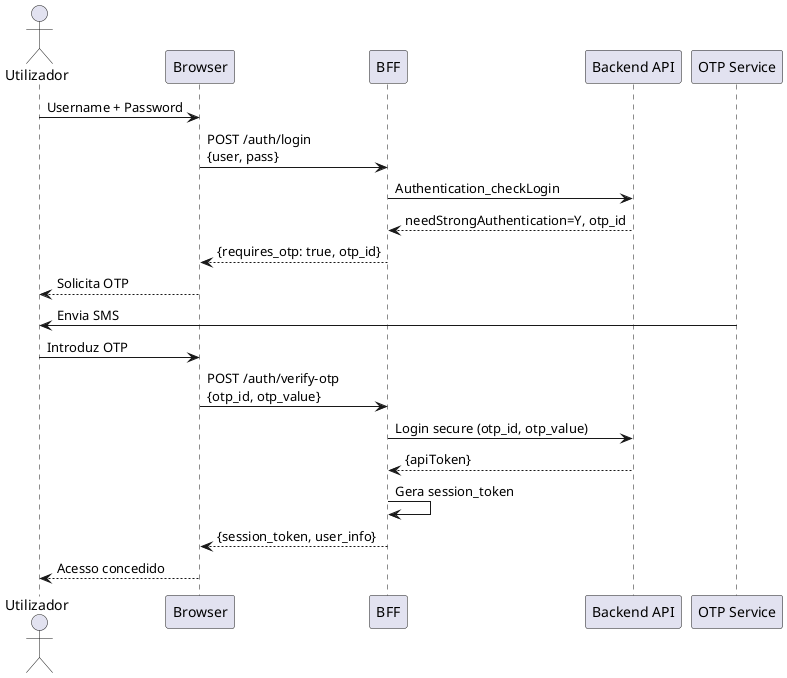
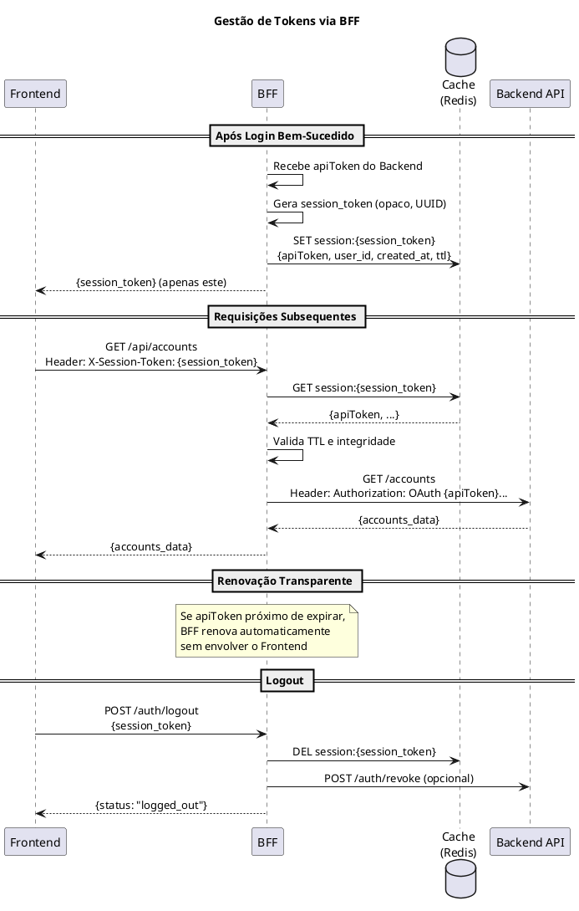
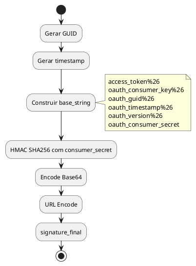
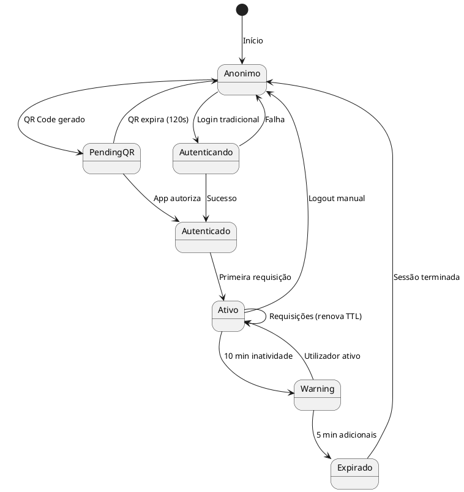

# DEF-05: Autenticação e OAuth

> **Secção relacionada:** [SEC-07 - Autenticação & Autorização](../sections/SEC-07-autenticacao-autorizacao.md)

## Contexto

Este documento define os fluxos de autenticação, mecanismos OAuth, gestão de tokens e integração com a App Mobile para autorização na plataforma de Homebanking do Novo Banco.

## Resumo dos Métodos de Autenticação

A plataforma suporta **4 métodos de autenticação**, ordenados por preferência:

| Caso | Método | Descrição | Recomendação |
|------|--------|-----------|--------------|
| 1 | QR Code Específico de Sessão | QR dinâmico por sessão, vinculação automática via App | **Principal** - Melhor UX e segurança |
| 2 | QR Code Genérico | QR fixo, utilizador recebe código para introduzir manualmente | Alternativo - Simplicidade |
| 3 | User + Pass + OTP SMS | Login tradicional com código OTP enviado por SMS | Fallback - Compatibilidade |
| 4 | User + Pass + Push App | Login tradicional com aprovação via notificação na App | Fallback - Sem SMS |

> **Nota:** Os casos 1 e 2 (QR Code) dispensam CAPTCHA por requererem dispositivo físico autorizado com biometria.

---

## Decisões Arquiteturais

### Resumo de Decisões

| Tópico | Decisão | Justificativa |
|--------|---------|---------------|
| Fluxos principais | QR Code (2 variantes) | Segurança via dispositivo autorizado + biometria |
| Gestão de tokens | BFF como intermediário | Frontend nunca expõe tokens reais |
| Armazenamento de tokens | Cache (Redis) no BFF | Performance e segurança |
| Anti-automação | QR Code + dispositivo autorizado | Dispensa CAPTCHA, requer App vinculada |
| Rate Limiting | Gateway | Centralizado, configurável |
| Sessões múltiplas | Permitidas | Browser + App podem coexistir |

---

## Fluxos de Autenticação

### Visão Geral dos Cenários

| Cenário | Descrição | Uso Recomendado |
|---------|-----------|-----------------|
| QR Code Genérico | Utilizador scan QR fixo, recebe código para introduzir | Fallback, simplicidade |
| QR Code Específico | QR dinâmico por sessão, vinculação automática | **Principal**, melhor UX |
| User + Pass + OTP SMS | Login tradicional com OTP via SMS | Fallback legacy |
| User + Pass + Push App | Login tradicional com aprovação na App | Fallback |

### Cenário Principal: QR Code Específico de Sessão

Este é o fluxo recomendado para a maioria dos utilizadores.


### Cenário Alternativo: QR Code Genérico

Utilizado quando o QR dinâmico não está disponível ou como opção simplificada.


### Cenário Fallback: User + Pass + OTP

Mantido para compatibilidade e casos onde o utilizador não tem a App.



### Cenário Fallback: User + Pass + Push App


---

## Estratégia de Tokens

### Arquitetura BFF como Intermediário

O BFF atua como intermediário de segurança, garantindo que o token real (apiToken) nunca é exposto ao Frontend.



### Tipos de Tokens

| Token | Localização | Propósito | Visibilidade |
|-------|-------------|-----------|--------------|
| session_token | Frontend (cookie/storage) | Identificar sessão no BFF | Frontend |
| apiToken | Cache do BFF | Autenticação com Backend | Apenas BFF |

### Ciclo de Vida dos Tokens

| Evento | Ação | Responsável |
|--------|------|-------------|
| Login bem-sucedido | Criar session_token, armazenar tokens reais | BFF |
| Requisição | Traduzir session_token para tokens reais | BFF |
| Proximidade de expiração | Renovar apiToken automaticamente | BFF |
| Logout | Eliminar session_token e tokens do cache | BFF |
| Inatividade (15 min) | Invalidar sessão | BFF |

---

## Protocolos OAuth por Backend

O BFF comunica com dois backends diferentes usando variantes de OAuth:

| Backend | Protocolo | Assinatura | Propósito |
|---------|-----------|------------|-----------|
| **ApiPsd2** | OAuth + SHA256 | `SHA256(consumer_key & GUID & timestamp & version & secret_key)` | Autenticação PSD2 |
| **ApiBBest** | OAuth 1.1 HMAC | `HMAC-SHA256(base_string, consumer_secret)` | APIs bancárias |

### Header de Identificação de Canal

Todas as chamadas ao backend devem incluir o header de identificação de canal:

```http
x-nb-channel: best.spa
```

---

## Protocolo OAuth 1.1 (ApiBBest)

### Tokens Anónimos (Pré-Login)

Utilizados para operações antes do login (ex: obter configurações).

| Token | Propósito | Armazenamento |
|-------|-----------|---------------|
| access_token_anonimo | Autenticação inicial | Código da App/BFF |
| consumer_key | Identificação do cliente | Código da App/BFF |
| secret_key | Assinatura de requests | Código da App/BFF |

### Estrutura do Header OAuth

```
Authorization: OAuth access_token={{access_token}},
                      oauth_consumer_key={{consumer_key}},
                      oauth_timestamp={{timestamp}},
                      oauth_version=1.1,
                      oauth_signature={{signature}},
                      oauth_guid={{GUID}}
```

### Geração de Assinatura



---

## Códigos de Operação ApiPsd2

| Código | Operação | Descrição | Token Usado |
|--------|----------|-----------|-------------|
| AUT_004 | Authentication_checkLogin | Validação de credenciais | access_token_anonimo |
| AUT_001 | ReenviaOTP | Solicita envio de OTP | apiToken |
| DEV_005.2 | RegistarDispositivoSecure | Valida OTP e regista dispositivo | apiToken |
| CLI_005 | ConsultaCliente | Consulta dados do cliente (pós-login) | apiToken |

---

## API Authentication_checkLogin (AUT_004)

### Parâmetros do Login - Canal Web

| Parâmetro | Descrição | Valor Web |
|-----------|-----------|-----------|
| `user` | Identificador do utilizador | Input do utilizador |
| `pass` | Password (pode ser cifrada) | Input do utilizador |
| `encrypt` | Indica se password está cifrada | "Y" ou "N" |
| `device_id` | Identificador do dispositivo | User-Agent ou GUID gerado |
| `app_version` | Versão da aplicação | Versão do SPA |
| `so_id` | Sistema operativo | "SPA" |

### Request

```json
{
    "user": "5.9.85.7.4.0.5.82",
    "pass": "",
    "token": "98.110.54.101.115.111",
    "encrypt": "Y",
    "device_id": "Device Id 3",
    "app_version": "1.0",
    "so_id": "2"
}
```

| Campo | Descrição |
|-------|-----------|
| user | Username encriptado |
| pass | Password encriptada (vazio se biometria) |
| token | Token biométrico (se aplicável) |
| encrypt | Flag de encriptação (Y/N) |
| device_id | Identificador do dispositivo |
| app_version | Versão da aplicação |
| so_id | ID do sistema operativo |

### Response

```json
{
    "returnCode": "0",
    "returnMsg": "Sucesso",
    "outputData": {
        "apiToken": "914e55d8ea3b4e19b1aa63c9efbad2ba",
        "mustChangePassword": "N",
        "needStrongAuthentication": "N",
        "firstLogin": "N",
        "otp_id": null,
    }
}
```

### Flags de Resposta

| Flag | Valor | Ação |
|------|-------|------|
| mustChangePassword | Y | Forçar alteração de password |
| needStrongAuthentication | Y | Solicitar OTP, usar otp_id |
| firstLogin | Y | Mostrar wizard de preferências |

---

## Autenticação Forte (SCA) - PSD2

### Fatores de Autenticação

| Fator | Tipo | Exemplos |
|-------|------|----------|
| Conhecimento | Algo que sabe | Password, PIN |
| Posse | Algo que tem | Telemóvel, App autorizada |
| Inerência | Algo que é | Biometria (fingerprint, face) |

### Operações que Requerem SCA

| Operação | SCA Obrigatória | Fatores |
|----------|-----------------|---------|
| Login | Sim | 2 fatores (QR Code + Biometria) |
| Transferências | Sim | Confirmação na App |
| Pagamentos | Sim | Confirmação na App |
| Alteração de dados sensíveis | Sim | Confirmação na App |
| Consultas | Não | Após login válido |

---

## Gestão de Sessões

### Ciclo de Vida



### Timeouts

| Evento | Tempo | Ação |
|--------|-------|------|
| QR Code expiração | 120 seg | Gerar novo QR |
| Inatividade warning | 10 min | Notificar utilizador |
| Inatividade logout | 15 min | Terminar sessão |
| Token expiration | Configurável | BFF renova automaticamente |

### Sessões Múltiplas

- **Permitido:** Um utilizador pode ter múltiplas sessões simultâneas
- **Justificativa:** Browser e App coexistem naturalmente (App necessária para autorizar Browser)
- **Rastreabilidade:** Cada sessão tem session_token único, permitindo auditoria

---

## Anti-Automação e Segurança

### Mecanismos Implementados

| Mecanismo | Descrição | Responsável |
|-----------|-----------|-------------|
| QR Code + Dispositivo autorizado | Requer App previamente vinculada | Backend |
| Biometria | Confirma identidade do utilizador | App Mobile |
| Rate Limiting | Limita tentativas por IP/utilizador | **Gateway** |
| Device fingerprint | Identifica dispositivos suspeitos | Backend |

### Dispensa de CAPTCHA

O fluxo via QR Code dispensa CAPTCHA porque:
1. Requer dispositivo físico (App instalada)
2. Requer dispositivo previamente autorizado pelo cliente
3. Requer autenticação biométrica na App
4. QR Code expira em 120 segundos

---

## Dependências

| Componente | Responsabilidade | Status |
|------------|------------------|--------|
| App Mobile | Scan QR, biometria, autorização | Existente |
| Backend API | Gestão de tokens, validação | Existente |
| BFF | Intermediário de tokens, session_token | A implementar |
| Cache (Redis) | Armazenamento de sessões/tokens | A implementar |
| Gateway | Rate Limiting, WAF | **Dependência externa** |
| WebSocket Server | Notificação de sessão autorizada | A implementar |

---

## Questões Pendentes de Confirmação

### Q-07-001: Momento de Retorno do apiToken

> **Status:** Aguarda confirmação do analista
> **Origem:** Conflito entre DEF-GEN-other-auth-flow.md e fluxos existentes

**Contexto:**
Existe divergência entre documentos sobre quando o `apiToken` é retornado:

| Interpretação | Descrição |
|---------------|-----------|
| A | apiToken retornado **antes** do OTP, OTP valida via API "secure" separada |
| B | apiToken retornado **após** validação do OTP |

**Evidência do novo documento (DEF-GEN-other-auth-flow.md):**
```
BFF-->ApiBBest: Authentication_checkLogin
BFF<--ApiBBest: "apiToken":"914e55d8ea3b4e19b1aa63c9efbad2ba", ...
BFF-->SPA: Pede OTP
SPA-->BFF: Envia OTP
BFF-->ApiBBest: Chamar API de secure
```

**Questão para o analista:**
- O `apiToken` é retornado imediatamente no `Authentication_checkLogin`, mesmo quando `needStrongAuthentication=Y`?
- Ou o `apiToken` só é disponibilizado após a validação do OTP na API "secure"?

---

## Responsabilidades Geridas pelo Siebel

As seguintes funcionalidades são geridas inteiramente pelo Siebel (backend), não sendo responsabilidade do novo WebSite:

| Funcionalidade | Responsável | Notas |
|----------------|-------------|-------|
| Recuperação de acesso (password esquecida) | Siebel | Fluxo igual à APP Mobile |
| RBAC (Autorização por perfil) | Siebel | Perfis e permissões definidos no backend |
| Políticas de Password (complexidade, expiração) | Siebel | Regras centralizadas no backend |

---

## Itens Pendentes

| Tópico | Estado | Prioridade |
|--------|--------|------------|
| **Q-07-001: Momento do apiToken** | Aguarda confirmação | **Alta** |
| Procedimento de revogação de tokens | A definir | Média |

---

## Decisões Relacionadas

- [DEC-001-estrategia-autenticacao-web.md](../decisions/DEC-001-estrategia-autenticacao-web.md) - Estratégia de autenticação
- [DEC-002-gestao-sessoes-tokens.md](../decisions/DEC-002-gestao-sessoes-tokens.md) - Gestão de sessões e tokens

## Referências

- [SEC-07-autenticacao-autorizacao.md](../sections/SEC-07-autenticacao-autorizacao.md)
- [DEF-09-fluxo-transferencia.md](DEF-09-fluxo-transferencia.md)
- [DEF-02-restricoes.md](DEF-02-restricoes.md) - RST-CMP-001 (Autenticação vinculada)
- PSD2 RTS on Strong Customer Authentication
