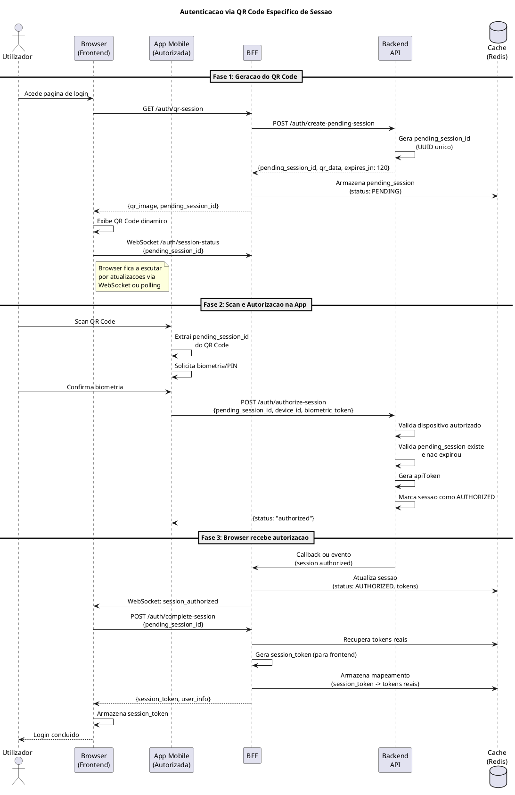
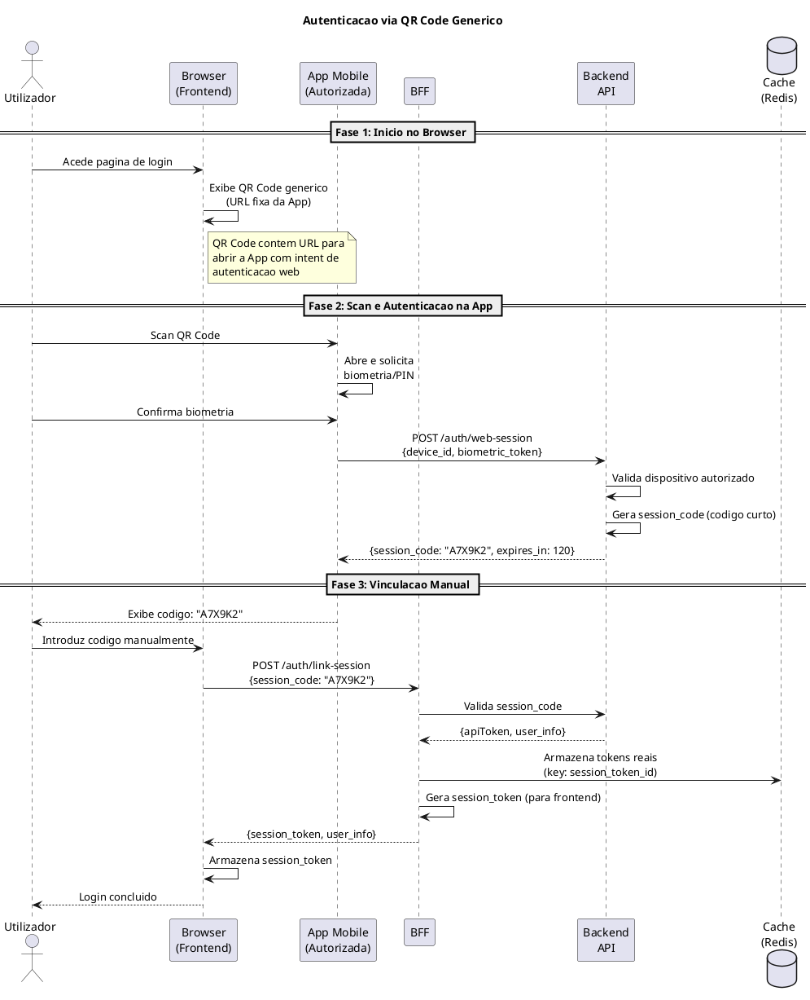
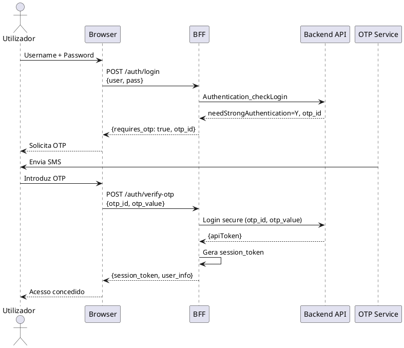
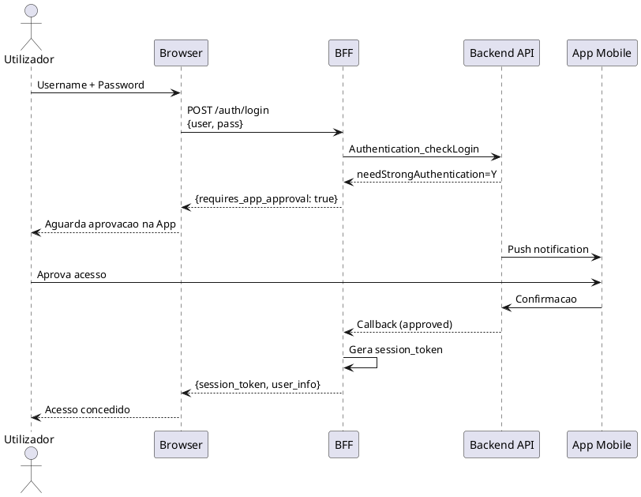
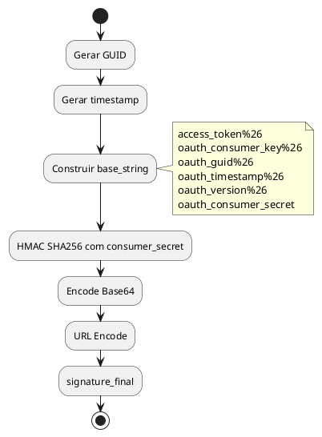

# DEF-05: Autenticacao e OAuth

> **Secao relacionada:** [SEC-07 - Autenticacao & Autorizacao](../sections/SEC-07-autenticacao-autorizacao.md)

## Contexto

Este documento define os fluxos de autenticacao, mecanismos OAuth, gestao de tokens e integracao com a App Mobile para autorizacao na plataforma de Homebanking do Novo Banco.

## Resumo dos Metodos de Autenticacao

A plataforma suporta **4 metodos de autenticacao**, ordenados por preferencia:

| Caso | Metodo | Descricao | Recomendacao |
|------|--------|-----------|--------------|
| 1 | QR Code Especifico de Sessao | QR dinamico por sessao, vinculacao automatica via App | **Principal** - Melhor UX e seguranca |
| 2 | QR Code Generico | QR fixo, utilizador recebe codigo para introduzir manualmente | Alternativo - Simplicidade |
| 3 | User + Pass + OTP SMS | Login tradicional com codigo OTP enviado por SMS | Fallback - Compatibilidade |
| 4 | User + Pass + Push App | Login tradicional com aprovacao via notificacao na App | Fallback - Sem SMS |

> **Nota:** Os casos 1 e 2 (QR Code) dispensam CAPTCHA por requererem dispositivo fisico autorizado com biometria.

---

## Decisoes Arquitecturais

### Resumo de Decisoes

| Topico | Decisao | Justificativa |
|--------|---------|---------------|
| Fluxos principais | QR Code (2 variantes) | Seguranca via dispositivo autorizado + biometria |
| Gestao de tokens | BFF como intermediario | Frontend nunca expoe tokens reais |
| Armazenamento de tokens | Cache (Redis) no BFF | Performance e seguranca |
| Anti-automacao | QR Code + dispositivo autorizado | Dispensa CAPTCHA, requer App vinculada |
| Rate Limiting | Gateway | Centralizado, configuravel |
| Sessoes multiplas | Permitidas | Browser + App podem coexistir |

---

## Fluxos de Autenticacao

### Visao Geral dos Cenarios

| Cenario | Descricao | Uso Recomendado |
|---------|-----------|-----------------|
| QR Code Generico | Utilizador scan QR fixo, recebe codigo para introduzir | Fallback, simplicidade |
| QR Code Especifico | QR dinamico por sessao, vinculacao automatica | **Principal**, melhor UX |
| User + Pass + OTP SMS | Login tradicional com OTP via SMS | Fallback legacy |
| User + Pass + Push App | Login tradicional com aprovacao na App | Fallback |

### Cenario Principal: QR Code Especifico de Sessao

Este e o fluxo recomendado para a maioria dos utilizadores.



### Cenario Alternativo: QR Code Generico

Utilizado quando o QR dinamico nao esta disponivel ou como opcao simplificada.



### Cenario Fallback: User + Pass + OTP

Mantido para compatibilidade e casos onde o utilizador nao tem a App.



### Cenario Fallback: User + Pass + Push App



---

## Estrategia de Tokens

### Arquitectura BFF como Intermediario

O BFF actua como intermediario de seguranca, garantindo que o token real (apiToken) nunca e exposto ao Frontend.


### Tipos de Tokens

| Token | Localizacao | Proposito | Visibilidade |
|-------|-------------|-----------|--------------|
| session_token | Frontend (cookie/storage) | Identificar sessao no BFF | Frontend |
| apiToken | Cache do BFF | Autenticacao com Backend | Apenas BFF |

### Ciclo de Vida dos Tokens

| Evento | Accao | Responsavel |
|--------|-------|-------------|
| Login bem-sucedido | Criar session_token, armazenar tokens reais | BFF |
| Requisicao | Traduzir session_token para tokens reais | BFF |
| Proximidade de expiracao | Renovar apiToken automaticamente | BFF |
| Logout | Eliminar session_token e tokens do cache | BFF |
| Inatividade (15 min) | Invalidar sessao | BFF |

---

## Protocolo OAuth 1.1

### Tokens Anonimos (Pre-Login)

Utilizados para operacoes antes do login (ex: obter configuracoes).

| Token | Proposito | Armazenamento |
|-------|-----------|---------------|
| access_token_anonimo | Autenticacao inicial | Codigo da App/BFF |
| consumer_key | Identificacao do cliente | Codigo da App/BFF |
| secret_key | Assinatura de requests | Codigo da App/BFF |

### Estrutura do Header OAuth

```
Authorization: OAuth access_token={{access_token}},
                      oauth_consumer_key={{consumer_key}},
                      oauth_timestamp={{timestamp}},
                      oauth_version=1.1,
                      oauth_signature={{signature}},
                      oauth_guid={{GUID}}
```

### Geracao de Assinatura



---

## API Authentication_checkLogin (AUT_004)

### Request

```json
{
    "user": "5.9.85.7.4.0.5.82",
    "pass": "",
    "token": "98.110.54.101.115.111",
    "encrypt": "Y",
    "device_id": "Device Id 3",
    "app_version": "1.0",
    "so_id": "2"
}
```

| Campo | Descricao |
|-------|-----------|
| user | Username encriptado |
| pass | Password encriptada (vazio se biometria) |
| token | Token biometrico (se aplicavel) |
| encrypt | Flag de encriptacao (Y/N) |
| device_id | Identificador do dispositivo |
| app_version | Versao da aplicacao |
| so_id | ID do sistema operativo |

### Response

```json
{
    "returnCode": "0",
    "returnMsg": "Sucesso",
    "outputData": {
        "apiToken": "914e55d8ea3b4e19b1aa63c9efbad2ba",
        "mustChangePassword": "N",
        "needStrongAuthentication": "N",
        "firstLogin": "N",
        "otp_id": null,
    }
}
```

### Flags de Resposta

| Flag | Valor | Accao |
|------|-------|-------|
| mustChangePassword | Y | Forcar alteracao de password |
| needStrongAuthentication | Y | Solicitar OTP, usar otp_id |
| firstLogin | Y | Mostrar wizard de preferencias |

---

## Autenticacao Forte (SCA) - PSD2

### Factores de Autenticacao

| Factor | Tipo | Exemplos |
|--------|------|----------|
| Conhecimento | Algo que sabe | Password, PIN |
| Posse | Algo que tem | Telemovel, App autorizada |
| Inerencia | Algo que e | Biometria (fingerprint, face) |

### Operacoes que Requerem SCA

| Operacao | SCA Obrigatoria | Factores |
|----------|-----------------|----------|
| Login | Sim | 2 factores (QR Code + Biometria) |
| Transferencias | Sim | Confirmacao na App |
| Pagamentos | Sim | Confirmacao na App |
| Alteracao de dados sensiveis | Sim | Confirmacao na App |
| Consultas | Nao | Apos login valido |

---

## Gestao de Sessoes

### Ciclo de Vida


### Timeouts

| Evento | Tempo | Accao |
|--------|-------|-------|
| QR Code expiracao | 120 seg | Gerar novo QR |
| Inatividade warning | 10 min | Notificar utilizador |
| Inatividade logout | 15 min | Terminar sessao |
| Token expiration | Configuravel | BFF renova automaticamente |

### Sessoes Multiplas

- **Permitido:** Um utilizador pode ter multiplas sessoes simultaneas
- **Justificativa:** Browser e App coexistem naturalmente (App necessaria para autorizar Browser)
- **Rastreabilidade:** Cada sessao tem session_token unico, permitindo auditoria

---

## Anti-Automacao e Seguranca

### Mecanismos Implementados

| Mecanismo | Descricao | Responsavel |
|-----------|-----------|-------------|
| QR Code + Dispositivo autorizado | Requer App previamente vinculada | Backend |
| Biometria | Confirma identidade do utilizador | App Mobile |
| Rate Limiting | Limita tentativas por IP/utilizador | **Gateway** |
| Device fingerprint | Identifica dispositivos suspeitos | Backend |

### Dispensa de CAPTCHA

O fluxo via QR Code dispensa CAPTCHA porque:
1. Requer dispositivo fisico (App instalada)
2. Requer dispositivo previamente autorizado pelo cliente
3. Requer autenticacao biometrica na App
4. QR Code expira em 120 segundos

---

## Dependencias

| Componente | Responsabilidade | Status |
|------------|------------------|--------|
| App Mobile | Scan QR, biometria, autorizacao | Existente |
| Backend API | Gestao de tokens, validacao | Existente |
| BFF | Intermediario de tokens, session_token | A implementar |
| Cache (Redis) | Armazenamento de sessoes/tokens | A implementar |
| Gateway | Rate Limiting, WAF | **Dependencia externa** |
| WebSocket Server | Notificacao de sessao autorizada | A implementar |

---

## Questoes Pendentes de Confirmacao

### Q-07-001: Momento de Retorno do apiToken

> **Status:** Aguarda confirmacao do analista
> **Origem:** Conflito entre DEF-GEN-other-auth-flow.md e fluxos existentes

**Contexto:**
Existe divergencia entre documentos sobre quando o `apiToken` e retornado:

| Interpretacao | Descricao |
|---------------|-----------|
| A | apiToken retornado **antes** do OTP, OTP valida via API "secure" separada |
| B | apiToken retornado **apos** validacao do OTP |

**Evidencia do novo documento (DEF-GEN-other-auth-flow.md):**
```
BFF-->ApiBBest: Authentication_checkLogin
BFF<--ApiBBest: "apiToken":"914e55d8ea3b4e19b1aa63c9efbad2ba", ...
BFF-->SPA: Pede OTP
SPA-->BFF: Envia OTP
BFF-->ApiBBest: Chamar API de secure
```

**Questao para o analista:**
- O `apiToken` e retornado imediatamente no `Authentication_checkLogin`, mesmo quando `needStrongAuthentication=Y`?
- Ou o `apiToken` so e disponibilizado apos a validacao do OTP na API "secure"?

---

## Responsabilidades Geridas pelo Siebel

As seguintes funcionalidades são geridas inteiramente pelo Siebel (backend), não sendo responsabilidade do novo WebSite:

| Funcionalidade | Responsavel | Notas |
|----------------|-------------|-------|
| Recuperação de acesso (password esquecida) | Siebel | Fluxo igual à APP Mobile |
| RBAC (Autorização por perfil) | Siebel | Perfis e permissões definidos no backend |
| Políticas de Password (complexidade, expiração) | Siebel | Regras centralizadas no backend |

---

## Itens Pendentes

| Topico | Estado | Prioridade |
|--------|--------|------------|
| **Q-07-001: Momento do apiToken** | Aguarda confirmacao | **Alta** |
| Procedimento de revogacao de tokens | A definir | Media |

---

## Decisoes Relacionadas

- [DEC-001-estrategia-autenticacao-web.md](../decisions/DEC-001-estrategia-autenticacao-web.md) - Estrategia de autenticacao
- [DEC-002-gestao-sessoes-tokens.md](../decisions/DEC-002-gestao-sessoes-tokens.md) - Gestao de sessoes e tokens

## Referencias

- [SEC-07-autenticacao-autorizacao.md](../sections/SEC-07-autenticacao-autorizacao.md)
- [DEF-09-fluxo-transferencia.md](DEF-09-fluxo-transferencia.md)
- [DEF-02-restricoes.md](DEF-02-restricoes.md) - RST-CMP-001 (Autenticacao vinculada)
- PSD2 RTS on Strong Customer Authentication
