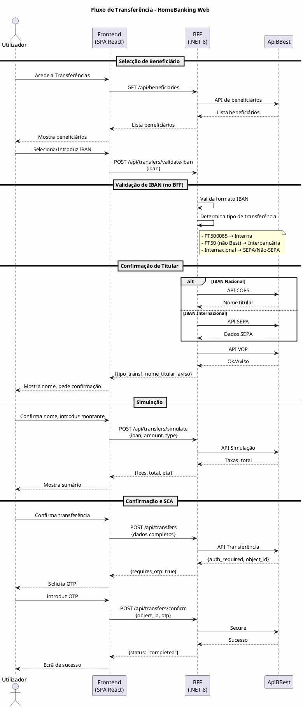

# DEF-05: Fluxo de Transferência

> **Secção relacionada:** [5 - Arquitetura Backend & Serviços](../sections/SEC-05-arquitetura-backend-servicos.md)
> **Fonte:** Diagramas de sequência do cliente (`customer_sequences/`)

## Contexto

Documentar o fluxo completo de transferência bancária para o HomeBanking Web. O fluxo foi extraído do diagrama da app mobile e adaptado para a arquitectura web com BFF.

## Visão Geral

O fluxo de transferência envolve várias etapas e validações:



## Fases do Fluxo

### Fase 1: Selecção de Método e Beneficiário

| Passo | Descrição | Responsável |
|-------|-----------|-------------|
| 1 | Utilizador selecciona tipo: IBAN, SPIN, MBway | Frontend |
| 2 | Frontend obtém lista de beneficiários | BFF → ApiBBest |
| 3 | Utilizador selecciona beneficiário ou introduz IBAN novo | Frontend |

### Fase 2: Validação de IBAN

| Passo | Descrição | Responsável |
|-------|-----------|-------------|
| 1 | Validação de formato IBAN | BFF (biblioteca) |
| 2 | Identificação de tipo de transferência | BFF |
| 3 | Obtenção de logo/bandeira | BFF |

### Fase 3: Confirmação de Titular (COPS/VOP)

| Passo | Descrição | Responsável |
|-------|-----------|-------------|
| 1 | Consulta COPS (se IBAN nacional) | BFF → ApiBBest |
| 2 | Utilizador confirma nome | Frontend |
| 3 | Verificação VOP | BFF → ApiBBest |

### Fase 4: Dados da Transferência

| Passo | Descrição | Responsável |
|-------|-----------|-------------|
| 1 | Introdução de montante | Frontend |
| 2 | Introdução de descrição (opcional) | Frontend |
| 3 | Introdução de dados adicionais | Frontend |

### Fase 5: Simulação

| Passo | Descrição | Responsável |
|-------|-----------|-------------|
| 1 | Envio de dados completos | Frontend → BFF |
| 2 | Cálculo de taxas e valores | BFF → ApiBBest |
| 3 | Apresentação de sumário | Frontend |

### Fase 6: Confirmação e SCA

| Passo | Descrição | Responsável |
|-------|-----------|-------------|
| 1 | Utilizador confirma operação | Frontend |
| 2 | Execução da transferência | BFF → ApiBBest |
| 3 | Solicitação de OTP (SCA) | ApiBBest → BFF → Frontend |
| 4 | Introdução de OTP | Frontend |
| 5 | Validação de OTP | BFF → ApiBBest |
| 6 | Conclusão da operação | ApiBBest → BFF → Frontend |

## Dados da Operação

### Request da Transferência

```json
{
    "home_account_number": "0065123456789",
    "destination_iban": "PT50000200001234567890123",
    "destination_name": "João Silva",
    "amount": 100.00,
    "description": "Transferência teste",
    "destination_email": "joao@email.com",
    "destination_phone": "+351912345678",
    "transfer_type": "interbancaria",
    "beneficiary_id": null
}
```

### Response da API de Transferência

```json
{
    "authentication": "1,2,3",
    "auth_seq": "136",
    "object_id": "1-4EEJB0"
}
```

### Confirmação SCA (OTP)

```json
{
    "object_id": "1-4EEJB0",
    "auth_type": "3",
    "auth_value": "478946"
}
```

## Decisões Arquitecturais

| Decisão | Descrição |
|---------|-----------|
| Validação de IBAN no BFF | Não no frontend |
| BFF inicialmente monolítico | Preparado para evolução a microserviços |
| Frontend não acede APIs directamente | Sempre via BFF |
| OTP obrigatório | Para todas as transferências (PSD2) |

## Tratamento de Erros

| Erro | Acção |
|------|-------|
| IBAN inválido | Mensagem de erro no frontend |
| Titular não confirmado (VOP) | Aviso ao utilizador, pode prosseguir |
| Saldo insuficiente | Mensagem de erro, bloqueia operação |
| OTP inválido | Permite nova tentativa (limite de 3) |
| Timeout | Mensagem de erro, permite retry |

## Referências

- [DEF-03-regras-transferencias.md](DEF-03-regras-transferencias.md) - Regras de negócio
- [DEF-07-autenticacao-autorizacao.md](DEF-07-autenticacao-autorizacao.md) - SCA/OTP
- [DEF-08-seguranca-conformidade.md](DEF-08-seguranca-conformidade.md) - PSD2
- Diagramas de sequência: `customer_sequences/`
