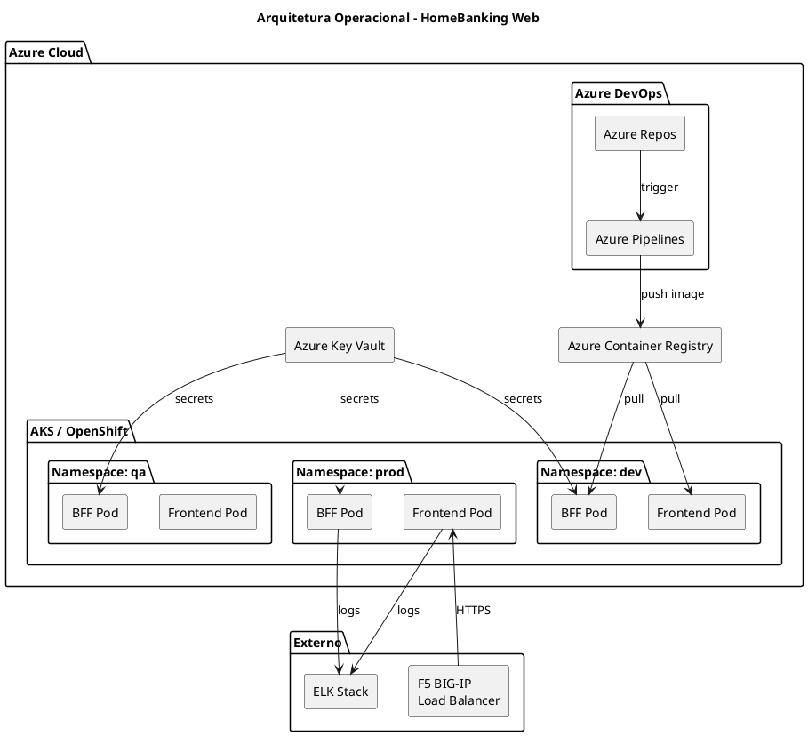
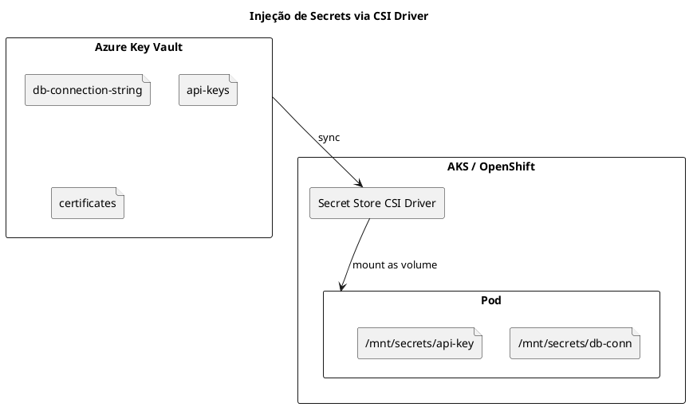
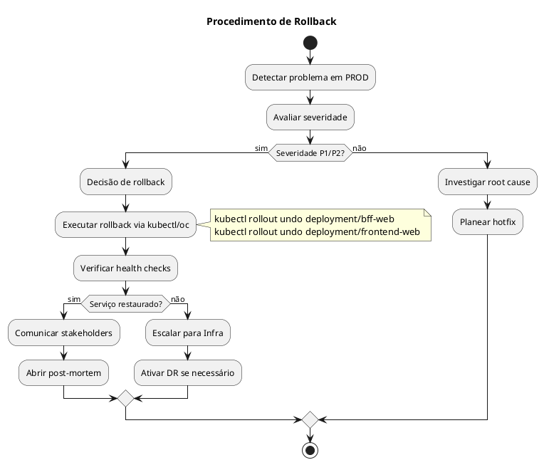

# DEF-10: Arquitetura Operacional

> **Secção relacionada:** [SEC-10 - Arquitetura Operacional](../sections/SEC-10-arquitetura-operacional.md)

## Contexto

Definir a arquitetura operacional do HomeBanking Web, incluindo infraestrutura, ambientes, pipelines CI/CD, estratégia de deploy, gestão de secrets e disaster recovery. O canal web será deployado em OpenShift (DEC-006), reutilizando a infraestrutura existente.

---

## Visão Geral da Infraestrutura



---

## Infraestrutura

### Plataforma de Containers

| Aspecto | Especificação |
|---------|---------------|
| Plataforma atual | Azure Kubernetes Service (AKS) |
| Plataforma futura | Red Hat OpenShift (em homologação) |
| Abordagem | Imagens OpenShift-compliant desde o início |
| Load Balancer | F5 BIG-IP (externo) |
| Ingress Controller | NGINX Ingress / OpenShift Routes |

> **Nota:** OpenShift em homologação. Desenvolvimento inicia em AKS com imagens compliant para facilitar migração futura.

### Requisitos de Imagens Container

Para garantir compatibilidade OpenShift, as imagens devem:

| Requisito | Descrição |
|-----------|-----------|
| Utilizador não-root | Container executa como utilizador arbitrário (UID > 1000) |
| Filesystem read-only | Volumes temporários montados explicitamente |
| Portas > 1024 | Não utilizar portas privilegiadas |
| Base image | Red Hat UBI (Universal Base Image) recomendado |
| Health checks | Liveness e Readiness probes obrigatórios |

---

## Ambientes

### Topologia de Ambientes

| Ambiente | Propósito | Namespace | Promoção |
|----------|-----------|-----------|----------|
| **dev** | Desenvolvimento e integração | `homebanking-dev` | Automática (CI) |
| **qa** | Testes integrados e UAT | `homebanking-qa` | Automática (após dev OK) |
| **prod** | Produção | `homebanking-prod` | Manual (aprovação) |

> **Nota:** Não há ambiente de DR dedicado. Disaster recovery via réplica do cluster.

### Fluxo de Promoção


### Segregação de Ambientes

| Tipo | Mecanismo |
|------|-----------|
| Lógica | Namespaces Kubernetes separados |
| Rede | Network Policies por namespace |
| Secrets | Key Vault com políticas por ambiente |
| RBAC | Service accounts distintos por ambiente |

---

## CI/CD Pipeline

### Stack de Ferramentas

| Função | Ferramenta |
|--------|------------|
| Repositório | Azure Repos (Git) |
| CI/CD | Azure Pipelines |
| Container Registry | Azure Container Registry (ACR) |
| Secrets | Azure Key Vault |
| IaC | Helm Charts + Terraform |

### Estratégia de Branching (GitFlow)


| Branch | Propósito | Deploy Automático |
|--------|-----------|-------------------|
| `feature/*` | Desenvolvimento de features | Não |
| `develop` | Integração contínua | DEV |
| `release/*` | Preparação de release | QA |
| `main` | Produção | PROD (c/ aprovação) |
| `hotfix/*` | Correções urgentes | PROD (c/ aprovação) |

### Quality Gates

| Gate | Ferramenta | Threshold |
|------|------------|-----------|
| Unit Tests | Vitest / xUnit | 100% pass |
| Code Coverage | Istanbul / Coverlet | >= 80% |
| SAST | SonarQube / Checkmarx | 0 Critical, 0 High |
| Lint | ESLint / .NET Analyzers | 0 errors |
| Build | Azure Pipelines | Success |

---

## Estratégia de Deploy

### Rolling Update (Zero Downtime)

| Parâmetro | Valor | Descrição |
|-----------|-------|-----------|
| `maxSurge` | 25% | Pods adicionais durante update |
| `maxUnavailable` | 0 | Nenhum pod indisponível |
| Réplicas mínimas | 2 | Garantir disponibilidade |


### Health Checks

```yaml
# Exemplo de configuração
livenessProbe:
  httpGet:
    path: /health/live
    port: 8080
  initialDelaySeconds: 10
  periodSeconds: 10
  failureThreshold: 3

readinessProbe:
  httpGet:
    path: /health/ready
    port: 8080
  initialDelaySeconds: 5
  periodSeconds: 5
  failureThreshold: 3
```

### Aprovações por Ambiente

| Ambiente | Aprovação | Aprovadores |
|----------|-----------|-------------|
| DEV | Automática | - |
| QA | Automática | - |
| PROD | Manual | Tech Lead + PO |

---

## Gestão de Secrets

### Azure Key Vault + CSI Driver



| Aspecto | Configuração |
|---------|--------------|
| Ferramenta | Azure Key Vault |
| Injeção | Secret Store CSI Driver |
| Acesso | Managed Identity por namespace |
| Rotação | Suportada (CSI driver faz refresh) |

### Política de Rotação

| Tipo de Secret | Frequência | Responsável |
|----------------|------------|-------------|
| API Keys | 90 dias | Automático |
| Certificados TLS | Anual | Infra |
| DB Credentials | 180 dias | DBA |

---

## Container Registry

| Aspecto | Configuração |
|---------|--------------|
| Registry | Azure Container Registry (ACR) |
| Autenticação | Managed Identity |
| Scanning | Microsoft Defender for Containers |
| Retenção | 90 dias para tags não-latest |
| Naming | `acr.azurecr.io/homebanking/{component}:{version}` |

### Tagging Strategy

| Tag | Uso |
|-----|-----|
| `{semver}` | Versão semântica (ex: `1.2.3`) |
| `{branch}-{sha}` | Feature branches (ex: `develop-abc1234`) |
| `latest` | Última versão de produção |

---

## Disaster Recovery

### Estratégia

| Aspecto | Configuração |
|---------|--------------|
| Tipo | Cluster réplica (standby passivo) |
| RTO | 30 minutos (DEF-02) |
| RPO | 5 minutos (DEF-02) |
| Failover | Manual (decisão de negócio) |

> **Nota:** Canal web é stateless. Dados estão no backend existente com DR próprio. DR do canal web foca na disponibilidade da aplicação.

### Componentes com Backup

| Componente | Backup | Frequência | Retenção |
|------------|--------|------------|----------|
| Configurações (IaC) | Git | Cada commit | Infinito |
| Secrets | Key Vault | Automático | 90 dias |
| Imagens Container | ACR | Cada build | 90 dias |
| Dados de aplicação | N/A | N/A | Backend existente |

---

## Runbooks

### Runbooks Essenciais

| Runbook | Trigger | Responsável |
|---------|---------|-------------|
| Deploy para Produção | Release aprovada | DevOps |
| Rollback de Emergência | Incidente P1 | DevOps |
| Escalação de Pods | Alerta de carga | DevOps / Auto |
| Rotação de Secrets | Schedule / Incidente | SecOps |
| Failover DR | Indisponibilidade > RTO | Infra |

### Procedimento de Rollback



---

## Questões Pendentes de Confirmação

| ID | Questão | Responsável | Prioridade |
|----|---------|-------------|------------|
| Q-10-001 | Versão específica do OpenShift | Infra | Média |
| Q-10-002 | Topologia de rede detalhada (DMZ) | Infra | Média |
| Q-10-003 | Política de rotação de secrets | SecOps | Média |
| Q-10-004 | Localização do site de DR | Infra | Baixa |
| Q-10-005 | Limites de recursos (CPU/Mem) | DevOps | Alta |

---

## Decisões

### Plataforma de Infraestrutura
- **Decisão:** AKS com imagens OpenShift-compliant
- **Justificação:** AKS disponível, OpenShift em homologação. Imagens compliant facilitam migração.
- **Alternativas consideradas:** VMs tradicionais (descartado), Kubernetes vanilla (descartado)

### Estratégia CI/CD
- **Decisão:** Azure DevOps com GitFlow
- **Justificação:** Ferramentas já em uso no banco, integração nativa com Azure
- **Alternativas consideradas:** GitLab CI, Jenkins

### Estratégia de Deploy
- **Decisão:** Rolling Update com zero downtime
- **Justificação:** Mínimo impacto em utilizadores, rollback rápido
- **Alternativas consideradas:** Blue-Green (mais complexo), Canary (overkill para MVP)

### Gestão de Secrets
- **Decisão:** Azure Key Vault com CSI Driver
- **Justificação:** Integração nativa, rotação automática, auditoria
- **Alternativas consideradas:** Kubernetes Secrets (menos seguro), HashiCorp Vault (complexidade)

---

## Decisões Relacionadas

- [DEC-006-estrategia-containers-openshift.md](../decisions/DEC-006-estrategia-containers-openshift.md) - Estratégia de containers
- [DEC-008-stack-observabilidade-elk.md](../decisions/DEC-008-stack-observabilidade-elk.md) - Stack de observabilidade
- [DEC-010-stack-tecnologica-backend.md](../decisions/DEC-010-stack-tecnologica-backend.md) - Stack tecnológica backend

## Referências

- [DEF-02-requisitos-nao-funcionais.md](DEF-02-requisitos-nao-funcionais.md) - RTO/RPO
- [DEF-03-principios-arquitetura.md](DEF-03-principios-arquitetura.md) - Princípios de arquitetura
- OpenShift Documentation
- 12-Factor App Methodology
- Azure DevOps Documentation
