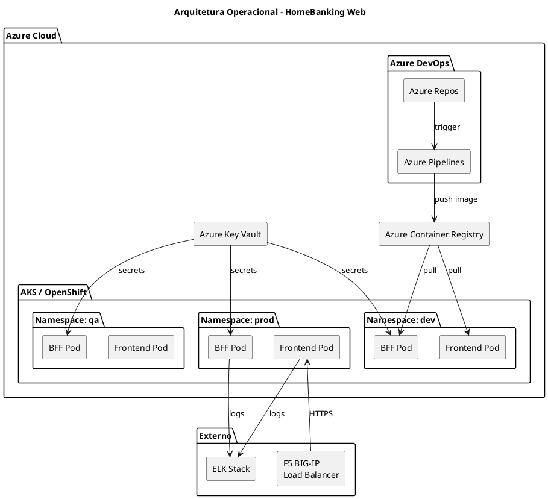
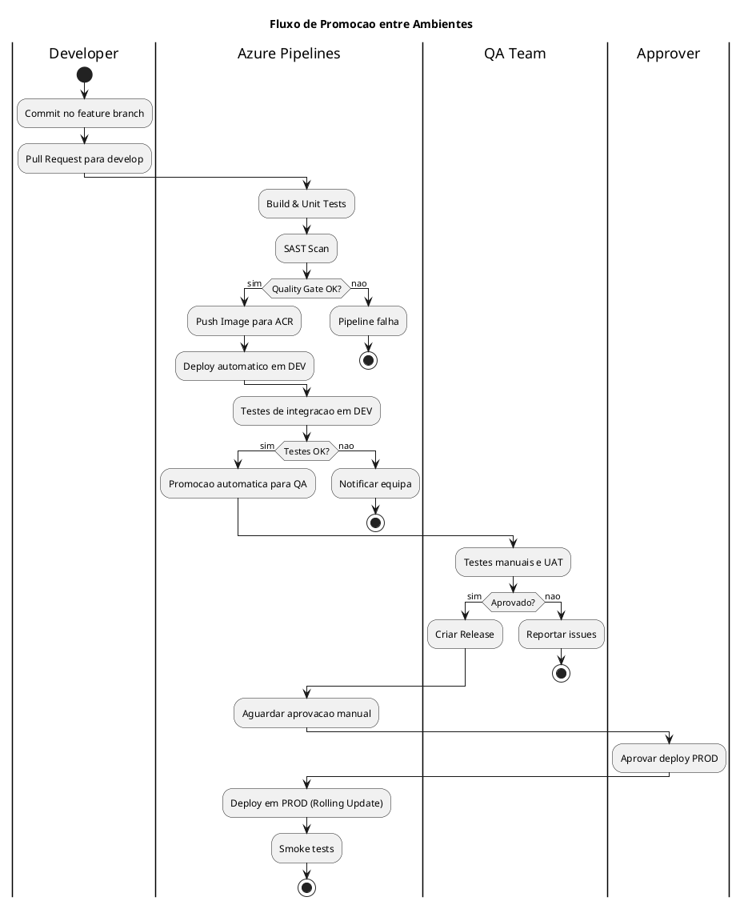
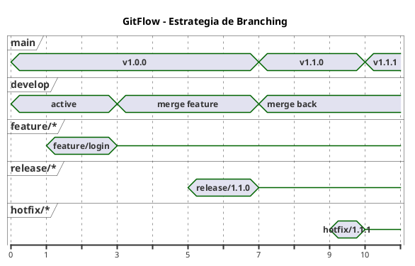
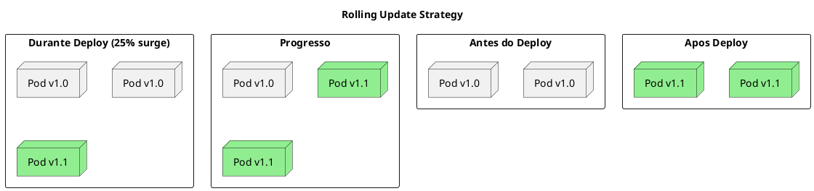
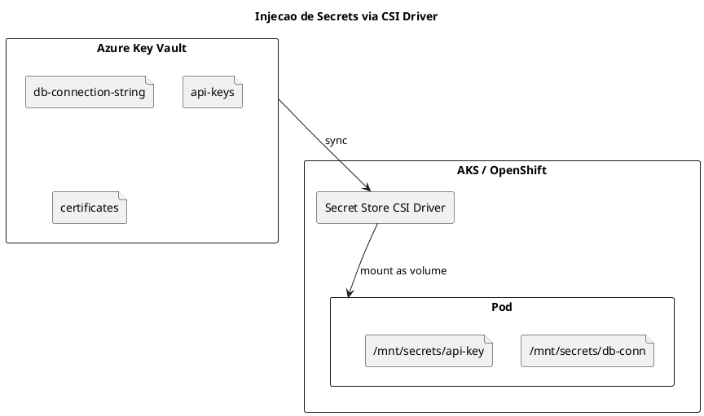

# DEF-10: Arquitetura Operacional

> **Secao relacionada:** [SEC-10 - Arquitetura Operacional](../sections/SEC-10-arquitetura-operacional.md)

## Contexto

Definir a arquitetura operacional do HomeBanking Web, incluindo infraestrutura, ambientes, pipelines CI/CD, estrategia de deploy, gestao de secrets e disaster recovery. O canal web sera deployado em OpenShift (DEC-006), reutilizando a infraestrutura existente.

---

## Visao Geral da Infraestrutura



---

## Infraestrutura

### Plataforma de Containers

| Aspecto | Especificacao |
|---------|---------------|
| Plataforma atual | Azure Kubernetes Service (AKS) |
| Plataforma futura | Red Hat OpenShift (em homologacao) |
| Abordagem | Imagens OpenShift-compliant desde o inicio |
| Load Balancer | F5 BIG-IP (externo) |
| Ingress Controller | NGINX Ingress / OpenShift Routes |

> **Nota:** OpenShift em homologacao. Desenvolvimento inicia em AKS com imagens compliant para facilitar migracao futura.

### Requisitos de Imagens Container

Para garantir compatibilidade OpenShift, as imagens devem:

| Requisito | Descricao |
|-----------|-----------|
| Usuario nao-root | Container executa como usuario arbitrario (UID > 1000) |
| Filesystem read-only | Volumes temporarios montados explicitamente |
| Portas > 1024 | Nao utilizar portas privilegiadas |
| Base image | Red Hat UBI (Universal Base Image) recomendado |
| Health checks | Liveness e Readiness probes obrigatorios |

---

## Ambientes

### Topologia de Ambientes

| Ambiente | Proposito | Namespace | Promocao |
|----------|-----------|-----------|----------|
| **dev** | Desenvolvimento e integracao | `homebanking-dev` | Automatica (CI) |
| **qa** | Testes integrados e UAT | `homebanking-qa` | Automatica (apos dev OK) |
| **prod** | Producao | `homebanking-prod` | Manual (aprovacao) |

> **Nota:** Nao ha ambiente de DR dedicado. Disaster recovery via replica do cluster.

### Fluxo de Promocao



### Segregacao de Ambientes

| Tipo | Mecanismo |
|------|-----------|
| Logica | Namespaces Kubernetes separados |
| Rede | Network Policies por namespace |
| Secrets | Key Vault com politicas por ambiente |
| RBAC | Service accounts distintos por ambiente |

---

## CI/CD Pipeline

### Stack de Ferramentas

| Funcao | Ferramenta |
|--------|------------|
| Repositorio | Azure Repos (Git) |
| CI/CD | Azure Pipelines |
| Container Registry | Azure Container Registry (ACR) |
| Secrets | Azure Key Vault |
| IaC | Helm Charts + Terraform |

### Estrategia de Branching (GitFlow)



| Branch | Proposito | Deploy Automatico |
|--------|-----------|-------------------|
| `feature/*` | Desenvolvimento de features | Nao |
| `develop` | Integracao continua | DEV |
| `release/*` | Preparacao de release | QA |
| `main` | Producao | PROD (c/ aprovacao) |
| `hotfix/*` | Correcoes urgentes | PROD (c/ aprovacao) |

### Quality Gates

| Gate | Ferramenta | Threshold |
|------|------------|-----------|
| Unit Tests | Vitest / xUnit | 100% pass |
| Code Coverage | Istanbul / Coverlet | >= 80% |
| SAST | SonarQube / Checkmarx | 0 Critical, 0 High |
| Lint | ESLint / .NET Analyzers | 0 errors |
| Build | Azure Pipelines | Success |

---

## Estrategia de Deploy

### Rolling Update (Zero Downtime)

| Parametro | Valor | Descricao |
|-----------|-------|-----------|
| `maxSurge` | 25% | Pods adicionais durante update |
| `maxUnavailable` | 0 | Nenhum pod indisponivel |
| Replicas minimas | 2 | Garantir disponibilidade |



### Health Checks

```yaml
# Exemplo de configuracao
livenessProbe:
  httpGet:
    path: /health/live
    port: 8080
  initialDelaySeconds: 10
  periodSeconds: 10
  failureThreshold: 3

readinessProbe:
  httpGet:
    path: /health/ready
    port: 8080
  initialDelaySeconds: 5
  periodSeconds: 5
  failureThreshold: 3
```

### Aprovacoes por Ambiente

| Ambiente | Aprovacao | Aprovadores |
|----------|-----------|-------------|
| DEV | Automatica | - |
| QA | Automatica | - |
| PROD | Manual | Tech Lead + PO |

---

## Gestao de Secrets

### Azure Key Vault + CSI Driver



| Aspecto | Configuracao |
|---------|--------------|
| Ferramenta | Azure Key Vault |
| Injecao | Secret Store CSI Driver |
| Acesso | Managed Identity por namespace |
| Rotacao | Suportada (CSI driver faz refresh) |

### Politica de Rotacao

| Tipo de Secret | Frequencia | Responsavel |
|----------------|------------|-------------|
| API Keys | 90 dias | Automatico |
| Certificados TLS | Anual | Infra |
| DB Credentials | 180 dias | DBA |

---

## Container Registry

| Aspecto | Configuracao |
|---------|--------------|
| Registry | Azure Container Registry (ACR) |
| Autenticacao | Managed Identity |
| Scanning | Microsoft Defender for Containers |
| Retencao | 90 dias para tags nao-latest |
| Naming | `acr.azurecr.io/homebanking/{component}:{version}` |

### Tagging Strategy

| Tag | Uso |
|-----|-----|
| `{semver}` | Versao semantica (ex: `1.2.3`) |
| `{branch}-{sha}` | Feature branches (ex: `develop-abc1234`) |
| `latest` | Ultima versao de producao |

---

## Disaster Recovery

### Estrategia

| Aspecto | Configuracao |
|---------|--------------|
| Tipo | Cluster replica (standby passivo) |
| RTO | 30 minutos (DEF-02) |
| RPO | 5 minutos (DEF-02) |
| Failover | Manual (decisao de negocio) |

> **Nota:** Canal web e stateless. Dados estao no backend existente com DR proprio. DR do canal web foca na disponibilidade da aplicacao.

### Componentes com Backup

| Componente | Backup | Frequencia | Retencao |
|------------|--------|------------|----------|
| Configuracoes (IaC) | Git | Cada commit | Infinito |
| Secrets | Key Vault | Automatico | 90 dias |
| Imagens Container | ACR | Cada build | 90 dias |
| Dados de aplicacao | N/A | N/A | Backend existente |

---

## Runbooks

### Runbooks Essenciais

| Runbook | Trigger | Responsavel |
|---------|---------|-------------|
| Deploy para Producao | Release aprovada | DevOps |
| Rollback de Emergencia | Incidente P1 | DevOps |
| Escalacao de Pods | Alerta de carga | DevOps / Auto |
| Rotacao de Secrets | Schedule / Incidente | SecOps |
| Failover DR | Indisponibilidade > RTO | Infra |

### Procedimento de Rollback


---

## Questoes Pendentes de Confirmacao

| ID | Questao | Responsavel | Prioridade |
|----|---------|-------------|------------|
| Q-10-001 | Versao especifica do OpenShift | Infra | Media |
| Q-10-002 | Topologia de rede detalhada (DMZ) | Infra | Media |
| Q-10-003 | Politica de rotacao de secrets | SecOps | Media |
| Q-10-004 | Localizacao do site de DR | Infra | Baixa |
| Q-10-005 | Limites de recursos (CPU/Mem) | DevOps | Alta |

---

## Decisoes

### Plataforma de Infraestrutura
- **Decisao:** AKS com imagens OpenShift-compliant
- **Justificacao:** AKS disponivel, OpenShift em homologacao. Imagens compliant facilitam migracao.
- **Alternativas consideradas:** VMs tradicionais (descartado), Kubernetes vanilla (descartado)

### Estrategia CI/CD
- **Decisao:** Azure DevOps com GitFlow
- **Justificacao:** Ferramentas ja em uso no banco, integracao nativa com Azure
- **Alternativas consideradas:** GitLab CI, Jenkins

### Estrategia de Deploy
- **Decisao:** Rolling Update com zero downtime
- **Justificacao:** Minimo impacto em utilizadores, rollback rapido
- **Alternativas consideradas:** Blue-Green (mais complexo), Canary (overkill para MVP)

### Gestao de Secrets
- **Decisao:** Azure Key Vault com CSI Driver
- **Justificacao:** Integracao nativa, rotacao automatica, auditoria
- **Alternativas consideradas:** Kubernetes Secrets (menos seguro), HashiCorp Vault (complexidade)

---

## Decisoes Relacionadas

- [DEC-006-estrategia-containers-openshift.md](../decisions/DEC-006-estrategia-containers-openshift.md) - Estrategia de containers
- [DEC-008-stack-observabilidade-elk.md](../decisions/DEC-008-stack-observabilidade-elk.md) - Stack de observabilidade
- [DEC-010-stack-tecnologica-backend.md](../decisions/DEC-010-stack-tecnologica-backend.md) - Stack tecnologica backend

## Referencias

- [DEF-02-requisitos-nao-funcionais.md](DEF-02-requisitos-nao-funcionais.md) - RTO/RPO
- [DEF-03-principios-arquitetura.md](DEF-03-principios-arquitetura.md) - Principios de arquitetura
- OpenShift Documentation
- 12-Factor App Methodology
- Azure DevOps Documentation
