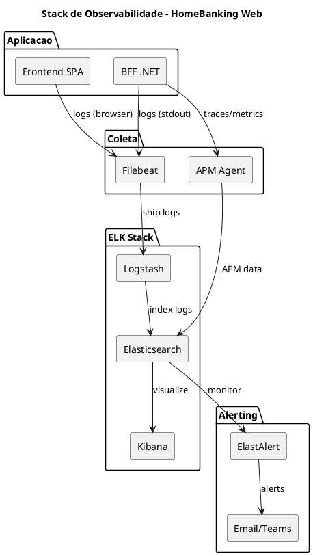
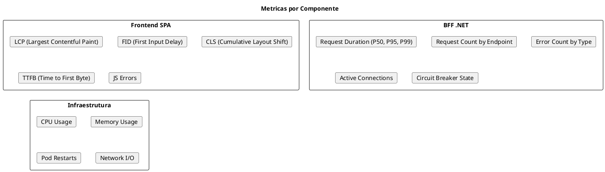
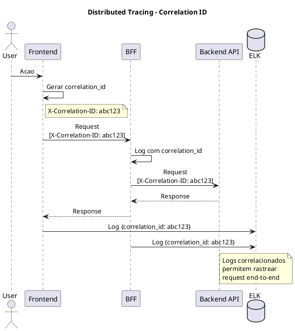

# DEF-11: Observabilidade & Operacoes

> **Secao relacionada:** [SEC-11 - Observabilidade & Operacoes](../sections/SEC-11-observabilidade-operacoes.md)

## Contexto

Definir a estrategia de observabilidade do HomeBanking Web, incluindo logging centralizado, metricas, tracing distribuido, alertas e dashboards operacionais. A stack ELK ja foi definida como base (DEC-008).

---

## Visao Geral da Stack de Observabilidade



---

## Pilares da Observabilidade

### Os Tres Pilares

| Pilar | Proposito | Ferramenta |
|-------|-----------|------------|
| **Logs** | Eventos e debugging | ELK (Elasticsearch, Logstash, Kibana) |
| **Metricas** | Performance e saude | Prometheus + Grafana (complemento) |
| **Traces** | Fluxo de requests | Elastic APM |

---

## Logging Centralizado

### Estrutura de Log (JSON)

Todos os logs devem seguir formato JSON estruturado:

```json
{
  "timestamp": "2026-01-14T10:30:00.000Z",
  "level": "INFO",
  "service": "bff-web",
  "correlation_id": "abc123-def456",
  "user_id": "***masked***",
  "message": "Transfer initiated",
  "context": {
    "operation": "transfer",
    "amount": "***masked***",
    "destination_bank": "BPIPTP"
  },
  "duration_ms": 245,
  "environment": "prod"
}
```

### Campos Obrigatorios

| Campo | Tipo | Descricao |
|-------|------|-----------|
| `timestamp` | ISO8601 | Data/hora UTC do evento |
| `level` | string | DEBUG, INFO, WARN, ERROR, FATAL |
| `service` | string | Nome do componente (frontend-web, bff-web) |
| `correlation_id` | UUID | ID para correlacao entre servicos |
| `message` | string | Descricao do evento |
| `environment` | string | dev, qa, prod |

### Campos Opcionais (Contextuais)

| Campo | Tipo | Uso |
|-------|------|-----|
| `user_id` | string | Identificador do utilizador (masked) |
| `session_id` | string | ID da sessao |
| `operation` | string | Tipo de operacao |
| `duration_ms` | number | Duracao da operacao |
| `error_code` | string | Codigo de erro |
| `stack_trace` | string | Stack trace (apenas em ERROR) |

### Mascaramento de Dados Sensiveis

| Tipo de Dado | Tratamento | Exemplo |
|--------------|------------|---------|
| NIB/IBAN | Mascarar | `PT50****1234` |
| User ID | Hash ou mascarar | `***masked***` |
| Montantes | Mascarar | `***` |
| Email | Mascarar | `j***@email.com` |
| NIF | Mascarar | `***` |
| Tokens | Nunca logar | - |

### Niveis de Log por Ambiente

| Ambiente | Nivel Minimo | Retencao Hot | Retencao Cold |
|----------|--------------|--------------|---------------|
| dev | DEBUG | 7 dias | - |
| qa | DEBUG | 14 dias | - |
| prod | INFO | 30 dias | 1 ano |

### Retencao para Auditoria

| Tipo de Log | Retencao | Requisito |
|-------------|----------|-----------|
| Logs de autenticacao | 7 anos | Compliance bancario |
| Logs de transacoes | 7 anos | Compliance bancario |
| Logs de erro | 1 ano | Operacional |
| Logs gerais | 90 dias | Operacional |

---

## Metricas

### Golden Signals

| Signal | Metrica | Target | Alerta |
|--------|---------|--------|--------|
| **Latency** | P95 response time | < 3s | > 5s |
| **Traffic** | Requests per second | Baseline | > 2x baseline |
| **Errors** | Error rate (5xx) | < 0.1% | > 1% |
| **Saturation** | CPU/Memory usage | < 70% | > 85% |

### Metricas de Aplicacao



### Metricas de Negocio

| Metrica | Descricao | Dashboard |
|---------|-----------|-----------|
| Logins/hora | Taxa de autenticacoes | Business |
| Transacoes/tipo | Transferencias, pagamentos | Business |
| Taxa abandono login | % que nao completa login | Business |
| Erros auth | Falhas de autenticacao | Security |
| Sessoes ativas | Utilizadores online | Operations |

---

## Tracing Distribuido

### Estrategia de Correlation



### Propagacao de Headers

| Header | Proposito | Gerado por |
|--------|-----------|------------|
| `X-Correlation-ID` | Correlacao de logs | Frontend (UUID) |
| `X-Request-ID` | ID unico do request | BFF |
| `traceparent` | W3C Trace Context | APM Agent |

### Elastic APM

| Componente | Instrumentacao |
|------------|----------------|
| Frontend | RUM (Real User Monitoring) JS Agent |
| BFF .NET | Elastic APM .NET Agent |

---

## SLIs, SLOs e SLAs

### Definicoes

| Termo | Definicao | Responsavel |
|-------|-----------|-------------|
| **SLI** | Service Level Indicator - metrica medida | Engenharia |
| **SLO** | Service Level Objective - target interno | Engenharia |
| **SLA** | Service Level Agreement - compromisso externo | Negocio |

### SLOs do Canal Web

| SLI | SLO Target | Janela | Calculo |
|-----|------------|--------|---------|
| Disponibilidade | 99.9% | Mensal | Uptime / Tempo total |
| Latencia P95 | < 3s | Mensal | Percentil 95 dos requests |
| Taxa de Erro | < 0.1% | Mensal | Erros 5xx / Total requests |
| TTFB | < 800ms | Mensal | Time to First Byte P95 |

### Error Budget

```
Error Budget = 100% - SLO

Exemplo (99.9% disponibilidade):
- Error Budget = 0.1%
- Em 30 dias = 43.2 minutos de downtime permitido
```

| SLO | Error Budget Mensal |
|-----|---------------------|
| 99.9% | 43.2 minutos |
| 99.95% | 21.6 minutos |
| 99.99% | 4.3 minutos |

---

## Alertas

### Estrategia de Alerting

```plantuml
@startuml
skinparam backgroundColor white

title Fluxo de Alertas

start
:Metrica/Log anomalo;
:ElastAlert detecta;

if (Severidade?) then (P1 - Critico)
    :Alerta imediato;
    :PagerDuty/On-call;
    :Notificacao Teams;
else (P2 - Alto)
    :Alerta em 5 min;
    :Email equipa;
    :Canal Teams;
else (P3 - Medio)
    :Alerta em 15 min;
    :Ticket automatico;
else (P4 - Baixo)
    :Dashboard apenas;
endif

stop

@enduml
```

### Classificacao de Alertas

| Severidade | Criterio | Tempo Resposta | Notificacao |
|------------|----------|----------------|-------------|
| **P1 - Critico** | Servico indisponivel, impacto total | < 15 min | On-call + SMS |
| **P2 - Alto** | Degradacao significativa | < 30 min | Email + Teams |
| **P3 - Medio** | Degradacao parcial | < 4 horas | Email |
| **P4 - Baixo** | Anomalia sem impacto | Proximo dia util | Ticket |

### Alertas Configurados

| Alerta | Condicao | Severidade |
|--------|----------|------------|
| Servico DOWN | Health check falha > 2 min | P1 |
| Error Rate Alto | > 5% erros 5xx | P1 |
| Latencia Degradada | P95 > 5s por 5 min | P2 |
| CPU Saturado | > 90% por 10 min | P2 |
| Memory Alto | > 85% por 10 min | P2 |
| Auth Failures Spike | > 10x baseline | P2 |
| Circuit Breaker Open | Estado OPEN | P3 |
| Error Rate Elevado | > 1% erros | P3 |
| Disk Space | > 80% | P4 |

---

## Dashboards

### Dashboards Operacionais

| Dashboard | Audiencia | Conteudo |
|-----------|-----------|----------|
| **Health Overview** | NOC / On-call | Status geral, alertas ativos, SLO status |
| **Performance** | Engenharia | Latencia, throughput, errors por endpoint |
| **Business** | Produto | Logins, transacoes, conversion rates |
| **Security** | SecOps | Auth failures, suspicious activity |
| **Infrastructure** | DevOps | CPU, memory, pods, network |

### Health Overview Dashboard

```
+--------------------------------------------------+
|  HomeBanking Web - Health Overview               |
+--------------------------------------------------+
|                                                  |
|  [SLO Status]        [Active Alerts]             |
|  Availability: 99.92%   P1: 0  P2: 1  P3: 2     |
|  Latency P95: 2.1s                               |
|  Error Rate: 0.05%                               |
|                                                  |
+--------------------------------------------------+
|  [Request Rate]      [Error Rate]                |
|  [=====Graph=====]   [=====Graph=====]          |
|                                                  |
+--------------------------------------------------+
|  [Component Health]                              |
|  Frontend:  [OK]     BFF:  [OK]                 |
|  Redis:     [OK]     Backend: [OK]              |
|                                                  |
+--------------------------------------------------+
```

---

## Questoes Pendentes de Confirmacao

| ID | Questao | Responsavel | Prioridade |
|----|---------|-------------|------------|
| Q-11-001 | Stack ELK existente ou nova instancia? | Infra | Alta |
| Q-11-002 | Complemento Prometheus/Grafana? | Arquitetura | Media |
| Q-11-003 | Ferramenta de alerting (ElastAlert vs alternativa) | Infra | Media |
| Q-11-004 | Integracao com ferramentas de on-call existentes | Operacoes | Media |
| Q-11-005 | Retencao de logs de auditoria (confirmar 7 anos) | Compliance | Alta |

---

## Decisoes

### Stack de Observabilidade
- **Decisao:** ELK Stack como base (DEC-008 aceite)
- **Justificacao:** Reutilizacao de infraestrutura existente, centralizacao de logs
- **Alternativas consideradas:** Prometheus/Grafana (complemento), Datadog (custo), Jaeger+Loki

### Tracing Distribuido
- **Decisao:** Elastic APM com correlation_id em headers
- **Justificacao:** Integracao nativa com ELK, suporte a .NET e JS
- **Alternativas consideradas:** Jaeger (complexidade adicional), OpenTelemetry (mais generico)

### Alerting
- **Decisao:** ElastAlert integrado com ELK
- **Justificacao:** Alertas baseados em logs e metricas, integracao nativa
- **Alternativas consideradas:** Prometheus Alertmanager, PagerDuty rules

### SLOs
- **Decisao:** Disponibilidade 99.9%, Latencia P95 < 3s, Error Rate < 0.1%
- **Justificacao:** Alinhamento com DEF-02-requisitos-nao-funcionais
- **Alternativas consideradas:** SLOs mais agressivos (custo vs beneficio)

---

## Decisoes Relacionadas

- [DEC-008-stack-observabilidade-elk.md](../decisions/DEC-008-stack-observabilidade-elk.md) - Stack de observabilidade

## Referencias

- [DEF-02-requisitos-nao-funcionais.md](DEF-02-requisitos-nao-funcionais.md) - SLAs de negocio
- [DEF-10-arquitetura-operacional.md](DEF-10-arquitetura-operacional.md) - Infraestrutura
- Google SRE Book - SLIs/SLOs/SLAs
- Elastic APM Documentation
- OpenTelemetry Specification
