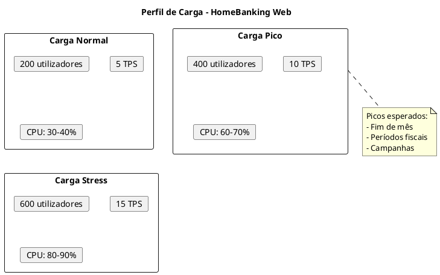
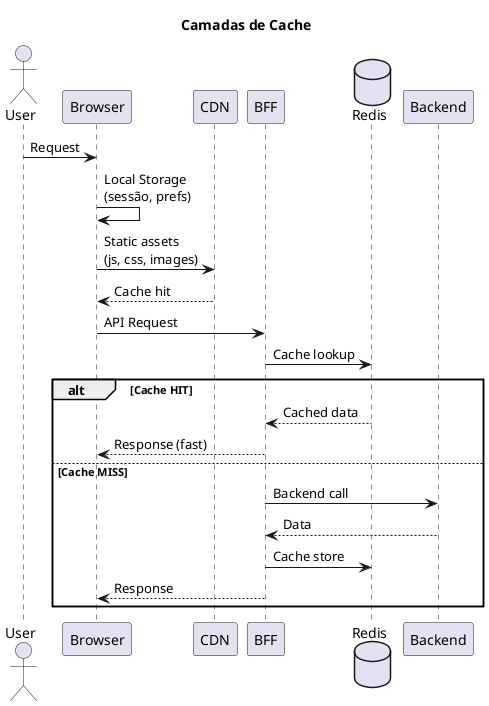
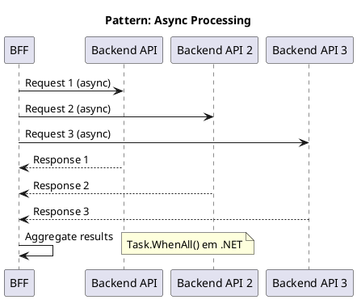
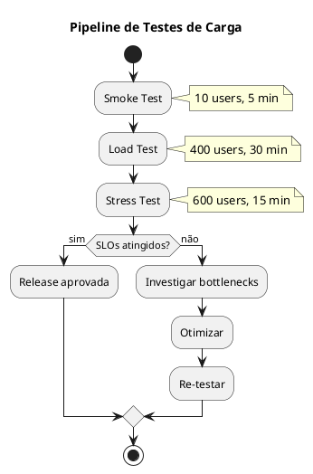

# DEF-12: Desempenho & Fiabilidade

> **Secção relacionada:** [SEC-12 - Desempenho & Fiabilidade](../sections/SEC-12-desempenho-fiabilidade.md)

## Contexto

Definir os requisitos e estratégias de desempenho e fiabilidade do HomeBanking Web, incluindo objetivos de carga, estratégias de caching, otimizações frontend e backend, auto-scaling, capacity planning e testes de carga.

---

## Objetivos de Performance

### Requisitos Base (DEF-02)

| Métrica | Target | Fonte |
|---------|--------|-------|
| Utilizadores concorrentes | 400 | DEF-02 |
| Throughput | 10 TPS | DEF-02 |
| Tempo resposta operações | < 3s | DEF-02 |
| Carregamento página inicial | < 10s | DEF-02 |
| Disponibilidade | 99.9% | DEF-02 |

### Core Web Vitals Targets

| Métrica | Target | Classificação |
|---------|--------|---------------|
| **LCP** (Largest Contentful Paint) | < 2.5s | Good |
| **FID** (First Input Delay) | < 100ms | Good |
| **CLS** (Cumulative Layout Shift) | < 0.1 | Good |
| **TTFB** (Time to First Byte) | < 800ms | Good |
| **FCP** (First Contentful Paint) | < 1.8s | Good |

### Perfil de Carga



---

## Estratégia de Caching

### Camadas de Cache



### Tipos de Cache por Componente

| Componente | Tipo | TTL | Estratégia |
|------------|------|-----|------------|
| Browser | Local Storage | Sessão | Dados de sessão, preferências |
| Browser | Service Worker | 1h | Assets estáticos (PWA) |
| CDN | Edge Cache | 24h | JS, CSS, imagens, fontes |
| BFF | Redis | Variável | Dados de API (ver tabela abaixo) |

### TTL por Tipo de Dado (Redis)

| Dado | TTL | Justificação |
|------|-----|--------------|
| Sessão do utilizador | 10 min | Inatividade timeout |
| Tokens OAuth | Variável | Alinhado com expiração |
| Configurações do sistema | 5 min | Baixa frequência de mudança |
| Dados de referência (países, bancos) | 1 hora | Dados estáticos |
| Cotações/Taxas | 1 min | Dados voláteis |

### Cache Invalidation

| Evento | Ação |
|--------|------|
| Logout | Invalidar sessão no Redis |
| Transação executada | Invalidar cache de saldos (se aplicável) |
| Deploy | Versionar assets (cache busting) |
| Configuração alterada | Invalidar cache de config |

---

## Otimização Frontend

### Bundle Optimization

| Técnica | Implementação | Impacto |
|---------|---------------|---------|
| Code Splitting | React.lazy() + Suspense | Reduz initial bundle |
| Tree Shaking | Webpack/Vite config | Remove código não utilizado |
| Lazy Loading | Componentes e rotas | Carrega sob demanda |
| Minification | Terser (JS), CSSNano | Reduz tamanho |
| Compression | gzip/Brotli | 70-90% redução |

### Budget de Bundle

| Métrica | Limite | Ação se exceder |
|---------|--------|-----------------|
| Initial JS | < 200KB (gzipped) | Code split |
| Initial CSS | < 50KB (gzipped) | Purge CSS |
| Largest chunk | < 100KB | Split ou lazy load |
| Total assets | < 1MB | Review dependencies |

### Otimização de Assets

| Asset | Estratégia |
|-------|------------|
| Imagens | WebP format, lazy loading, srcset |
| Fontes | WOFF2, font-display: swap, subset |
| Icons | SVG sprite ou icon font |
| CSS | Critical CSS inline, defer restante |

### Service Worker (PWA)

```javascript
// Estratégia de cache
const CACHE_STRATEGIES = {
  // Assets estáticos - Cache First
  static: 'CacheFirst',

  // API calls - Network First
  api: 'NetworkFirst',

  // Imagens - Stale While Revalidate
  images: 'StaleWhileRevalidate'
};
```

---

## Otimização Backend (BFF)

### Connection Pooling

| Conexão | Pool Size | Timeout |
|---------|-----------|---------|
| Redis | 10-20 | 5s |
| HTTP Client (Backend) | 100 | 30s |

### Compressão

| Tipo | Configuração |
|------|--------------|
| Response | gzip (nível 6) |
| Threshold | > 1KB |
| Content-Types | application/json, text/html |

### Async/Non-blocking



---

## Auto-Scaling

### Horizontal Pod Autoscaler (HPA)

```yaml
# Configuração HPA
apiVersion: autoscaling/v2
kind: HorizontalPodAutoscaler
metadata:
  name: bff-web-hpa
spec:
  scaleTargetRef:
    apiVersion: apps/v1
    kind: Deployment
    name: bff-web
  minReplicas: 2
  maxReplicas: 10
  metrics:
  - type: Resource
    resource:
      name: cpu
      target:
        type: Utilization
        averageUtilization: 70
  - type: Resource
    resource:
      name: memory
      target:
        type: Utilization
        averageUtilization: 80
  behavior:
    scaleUp:
      stabilizationWindowSeconds: 60
      policies:
      - type: Percent
        value: 100
        periodSeconds: 60
    scaleDown:
      stabilizationWindowSeconds: 300
      policies:
      - type: Percent
        value: 50
        periodSeconds: 120
```

### Configuração por Componente

| Componente | Min Replicas | Max Replicas | CPU Target | Memory Target |
|------------|--------------|--------------|------------|---------------|
| Frontend | 2 | 6 | 70% | 80% |
| BFF | 2 | 10 | 70% | 80% |

### Scale-up vs Scale-down

| Evento | Tempo | Ação |
|--------|-------|------|
| Scale-up | 60s estabilização | Duplicar réplicas |
| Scale-down | 300s estabilização | Reduzir 50% |

> **Nota:** Scale-down mais conservador para evitar oscilações.

---

## Capacity Planning

### Resource Requests/Limits

| Componente | CPU Request | CPU Limit | Memory Request | Memory Limit |
|------------|-------------|-----------|----------------|--------------|
| Frontend | 100m | 500m | 128Mi | 256Mi |
| BFF | 250m | 1000m | 256Mi | 512Mi |

### Estimativa de Recursos (400 users)

```
Frontend:
- 2 pods x 500m CPU = 1 vCPU
- 2 pods x 256Mi = 512Mi

BFF:
- 4 pods x 1000m CPU = 4 vCPU
- 4 pods x 512Mi = 2Gi

Total estimado: 5 vCPU, 2.5Gi RAM
```

---

## Resiliência

### Pod Disruption Budget

```yaml
apiVersion: policy/v1
kind: PodDisruptionBudget
metadata:
  name: bff-web-pdb
spec:
  minAvailable: 50%
  selector:
    matchLabels:
      app: bff-web
```

### Padrões de Resiliência

| Padrão | Implementação | Referência |
|--------|---------------|------------|
| Circuit Breaker | Polly (.NET) | DEF-05-padroes-resiliencia |
| Retry with Backoff | Polly | DEF-05-padroes-resiliencia |
| Timeout | HttpClient timeout | DEF-05-padroes-resiliencia |
| Bulkhead | Limite de conexões | DEF-05-padroes-resiliencia |

### Configuração Circuit Breaker

```csharp
// Polly Circuit Breaker
services.AddHttpClient("BackendAPI")
    .AddPolicyHandler(Policy
        .Handle<HttpRequestException>()
        .CircuitBreakerAsync(
            handledEventsAllowedBeforeBreaking: 5,
            durationOfBreak: TimeSpan.FromSeconds(30),
            onBreak: (ex, duration) => { /* log */ },
            onReset: () => { /* log */ }
        ));
```

---

## Testes de Carga

### Estratégia de Load Testing



### Cenários de Teste

| Cenário | Users | Duração | Objetivo |
|---------|-------|---------|----------|
| Smoke | 10 | 5 min | Validar ambiente |
| Load | 400 | 30 min | Validar capacidade nominal |
| Stress | 600 | 15 min | Identificar limites |
| Soak | 200 | 4 horas | Identificar memory leaks |

### Métricas a Capturar

| Métrica | Target | Fail Criteria |
|---------|--------|---------------|
| Response Time P95 | < 3s | > 5s |
| Error Rate | < 0.1% | > 1% |
| Throughput | 10 TPS | < 8 TPS |
| CPU (peak) | < 80% | > 90% |
| Memory (peak) | < 80% | > 90% |

### Ferramenta Recomendada

| Ferramenta | Uso | Justificação |
|------------|-----|--------------|
| **k6** | Load testing | Scripting em JS, integração CI/CD |
| Artillery | Alternativa | Simples, YAML-based |
| JMeter | Legado | Mais complexo, UI-based |

---

## Questões Pendentes de Confirmação

| ID | Questão | Responsável | Prioridade |
|----|---------|-------------|------------|
| Q-12-001 | Picos de utilização específicos (datas) | Produto | Média |
| Q-12-002 | Limites de recursos definitivos | DevOps | Alta |
| Q-12-003 | Ferramenta de load testing aprovada | QA | Média |
| Q-12-004 | Budget de bundle size | Frontend Lead | Média |

---

## Decisões

### Targets de Performance
- **Decisão:** Core Web Vitals como baseline (LCP < 2.5s, FID < 100ms, CLS < 0.1)
- **Justificação:** Standard da indústria, impacto em SEO e UX
- **Alternativas consideradas:** Métricas customizadas apenas

### Estratégia de Cache
- **Decisão:** Cache multi-camada (Browser + CDN + Redis)
- **Justificação:** Maximizar performance em todos os níveis
- **Alternativas consideradas:** Cache apenas no BFF

### Auto-scaling
- **Decisão:** HPA com CPU 70% e Memory 80%, min 2 réplicas
- **Justificação:** Balanço entre responsividade e custo
- **Alternativas consideradas:** Scaling manual, KEDA

### Testes de Carga
- **Decisão:** k6 para load testing, executar antes de cada release major
- **Justificação:** Integração CI/CD, scripting flexível
- **Alternativas consideradas:** JMeter, Artillery

---

## Decisões Relacionadas

- [DEC-006-estrategia-containers-openshift.md](../decisions/DEC-006-estrategia-containers-openshift.md) - Containers e auto-scaling
- [DEC-007-padrao-bff.md](../decisions/DEC-007-padrao-bff.md) - BFF (cache, resiliência)
- [DEC-009-stack-tecnologica-frontend.md](../decisions/DEC-009-stack-tecnologica-frontend.md) - Stack frontend
- [DEC-010-stack-tecnologica-backend.md](../decisions/DEC-010-stack-tecnologica-backend.md) - Stack backend

## Referências

- [DEF-02-requisitos-nao-funcionais.md](DEF-02-requisitos-nao-funcionais.md) - NFRs de performance
- [DEF-05-padroes-resiliencia.md](DEF-05-padroes-resiliencia.md) - Padrões de resiliência
- [DEF-06-arquitetura-dados.md](DEF-06-arquitetura-dados.md) - Cache Redis
- [DEF-10-arquitetura-operacional.md](DEF-10-arquitetura-operacional.md) - Infraestrutura
- Google Core Web Vitals
- Kubernetes HPA Documentation
- k6 Documentation
