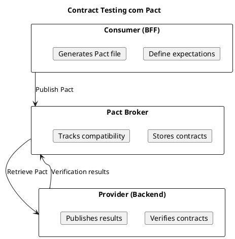
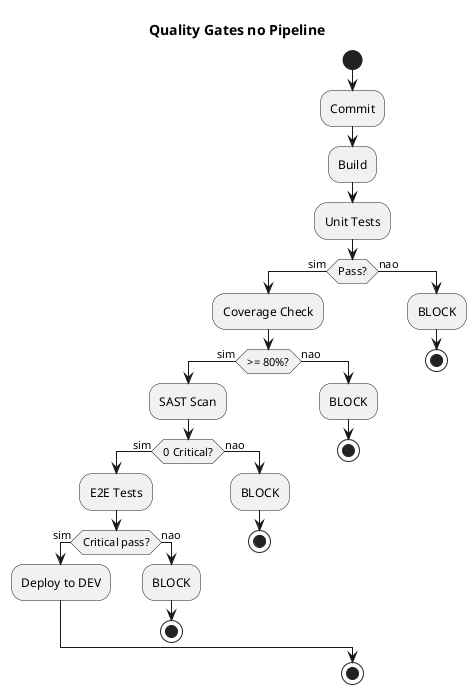

# DEF-13: Estrategia de Testes

> **Secao relacionada:** [SEC-13 - Estrategia de Testes](../sections/SEC-13-estrategia-testes.md)

## Contexto

Definir a estrategia de testes do HomeBanking Web, incluindo testes unitarios, integracao, contrato, E2E, performance, seguranca, acessibilidade, test data management e matriz de responsabilidades.

---

## Piramide de Testes


---

## Testes Unitarios

### Frontend (React + TypeScript)

| Aspecto | Especificacao |
|---------|---------------|
| Framework | Vitest |
| Assertions | Vitest expect |
| Component Testing | React Testing Library |
| Mocking | Vitest mocks |
| Coverage | Istanbul |

### Cobertura Minima

| Tipo de Codigo | Cobertura Target |
|----------------|------------------|
| Componentes criticos | >= 90% |
| Hooks customizados | >= 90% |
| Utils/helpers | >= 80% |
| Servicos | >= 80% |
| Codigo geral | >= 80% |

### Exemplo de Teste Unitario (Frontend)

```typescript
// LoginForm.test.tsx
import { render, screen, fireEvent } from '@testing-library/react';
import { LoginForm } from './LoginForm';

describe('LoginForm', () => {
  it('should display validation error for empty username', async () => {
    render(<LoginForm onSubmit={jest.fn()} />);

    fireEvent.click(screen.getByRole('button', { name: /login/i }));

    expect(await screen.findByText(/username is required/i)).toBeInTheDocument();
  });

  it('should call onSubmit with credentials', async () => {
    const onSubmit = jest.fn();
    render(<LoginForm onSubmit={onSubmit} />);

    fireEvent.change(screen.getByLabelText(/username/i), {
      target: { value: 'testuser' }
    });
    fireEvent.change(screen.getByLabelText(/password/i), {
      target: { value: 'password123' }
    });
    fireEvent.click(screen.getByRole('button', { name: /login/i }));

    expect(onSubmit).toHaveBeenCalledWith({
      username: 'testuser',
      password: 'password123'
    });
  });
});
```

### BFF (.NET 8)

| Aspecto | Especificacao |
|---------|---------------|
| Framework | xUnit |
| Assertions | FluentAssertions |
| Mocking | Moq / NSubstitute |
| Coverage | Coverlet |

### Exemplo de Teste Unitario (BFF)

```csharp
// TransferServiceTests.cs
public class TransferServiceTests
{
    private readonly Mock<IBackendClient> _backendClient;
    private readonly TransferService _sut;

    public TransferServiceTests()
    {
        _backendClient = new Mock<IBackendClient>();
        _sut = new TransferService(_backendClient.Object);
    }

    [Fact]
    public async Task ExecuteTransfer_ValidAmount_ShouldCallBackend()
    {
        // Arrange
        var request = new TransferRequest
        {
            Amount = 100,
            DestinationIban = "PT50000000000000000001"
        };

        _backendClient
            .Setup(x => x.PostAsync<TransferResponse>(It.IsAny<string>(), It.IsAny<object>()))
            .ReturnsAsync(new TransferResponse { Success = true });

        // Act
        var result = await _sut.ExecuteTransferAsync(request);

        // Assert
        result.Should().NotBeNull();
        result.Success.Should().BeTrue();
        _backendClient.Verify(x => x.PostAsync<TransferResponse>(
            "/transfers",
            It.Is<object>(o => o.Equals(request))
        ), Times.Once);
    }
}
```

---

## Testes de Integracao

### Estrategia


### Ferramentas

| Ferramenta | Uso |
|------------|-----|
| WireMock | Mock do Backend API |
| TestContainers | Redis container para testes |
| WebApplicationFactory | In-memory BFF para testes |

### Exemplo de Teste de Integracao

```csharp
// AccountsControllerIntegrationTests.cs
public class AccountsControllerIntegrationTests : IClassFixture<WebApplicationFactory<Program>>
{
    private readonly HttpClient _client;
    private readonly WireMockServer _mockServer;

    public AccountsControllerIntegrationTests(WebApplicationFactory<Program> factory)
    {
        _mockServer = WireMockServer.Start();

        _client = factory.WithWebHostBuilder(builder =>
        {
            builder.ConfigureServices(services =>
            {
                services.Configure<BackendOptions>(opt =>
                    opt.BaseUrl = _mockServer.Url);
            });
        }).CreateClient();
    }

    [Fact]
    public async Task GetAccounts_ValidSession_ReturnsAccountList()
    {
        // Arrange
        _mockServer.Given(Request.Create()
            .WithPath("/accounts")
            .UsingGet())
            .RespondWith(Response.Create()
                .WithStatusCode(200)
                .WithBody(@"[{""iban"":""PT50..."",""balance"":1000}]"));

        // Act
        var response = await _client.GetAsync("/api/accounts");

        // Assert
        response.StatusCode.Should().Be(HttpStatusCode.OK);
        var accounts = await response.Content.ReadFromJsonAsync<List<Account>>();
        accounts.Should().HaveCount(1);
    }
}
```

---

## Testes de Contrato

### Consumer-Driven Contract Testing



### Quando Usar

| Cenario | Usar Pact? |
|---------|------------|
| BFF <-> Backend API | Sim (recomendado) |
| Frontend <-> BFF | Opcional (E2E cobre) |
| Servicos internos | Sim |

---

## Testes End-to-End (E2E)

### Framework: Playwright

| Aspecto | Especificacao |
|---------|---------------|
| Framework | Playwright |
| Browsers | Chromium, Firefox, WebKit |
| Execution | CI/CD (headless) |
| Reports | HTML + Screenshots |

### Cenarios Criticos (Cobertura Minima)

| Fluxo | Prioridade | Criticidade |
|-------|------------|-------------|
| Login via QR Code | Alta | Critico |
| Login tradicional (fallback) | Alta | Critico |
| Consulta de saldos | Alta | Critico |
| Transferencia nacional | Alta | Critico |
| Pagamento de servicos | Alta | Critico |
| Logout | Media | Alto |
| Alteracao de dados | Media | Alto |

### Exemplo de Teste E2E

```typescript
// login.spec.ts
import { test, expect } from '@playwright/test';

test.describe('Login Flow', () => {
  test('should login successfully with valid credentials', async ({ page }) => {
    await page.goto('/login');

    // Simular scan de QR Code (ambiente de teste)
    await page.click('[data-testid="qr-login-button"]');

    // Aguardar redirect apos autenticacao simulada
    await page.waitForURL('/dashboard');

    // Verificar elementos da pagina inicial
    await expect(page.locator('[data-testid="welcome-message"]')).toBeVisible();
    await expect(page.locator('[data-testid="account-summary"]')).toBeVisible();
  });

  test('should display error for invalid session', async ({ page }) => {
    await page.goto('/login');

    // Forcar erro de sessao
    await page.evaluate(() => localStorage.clear());
    await page.goto('/dashboard');

    // Deve redirecionar para login
    await expect(page).toHaveURL('/login');
    await expect(page.locator('[data-testid="session-expired-message"]')).toBeVisible();
  });
});
```

### Configuracao CI/CD

```yaml
# azure-pipelines.yml (E2E stage)
- stage: E2E
  jobs:
  - job: PlaywrightTests
    pool:
      vmImage: 'ubuntu-latest'
    steps:
    - task: NodeTool@0
      inputs:
        versionSpec: '20.x'

    - script: npm ci
    - script: npx playwright install --with-deps

    - script: npx playwright test
      env:
        BASE_URL: $(E2E_BASE_URL)

    - task: PublishTestResults@2
      inputs:
        testResultsFormat: 'JUnit'
        testResultsFiles: 'test-results/*.xml'

    - publish: playwright-report
      artifact: playwright-report
```

---

## Testes de Seguranca

### Tipos de Testes

| Tipo | Ferramenta | Quando |
|------|------------|--------|
| SAST | SonarQube / Checkmarx | Cada commit |
| DAST | OWASP ZAP | Pre-release |
| Dependency Scan | Snyk / Dependabot | Diario |
| Penetration Test | Manual (externo) | Antes go-live |

### OWASP Top 10 Coverage

| Vulnerabilidade | Teste |
|-----------------|-------|
| A01 Broken Access Control | DAST + Manual |
| A02 Cryptographic Failures | SAST + Code Review |
| A03 Injection | SAST + DAST |
| A04 Insecure Design | Code Review + Threat Model |
| A05 Security Misconfiguration | DAST + Infra Scan |
| A06 Vulnerable Components | Dependency Scan |
| A07 Auth Failures | DAST + Pentest |
| A08 Integrity Failures | SAST + DAST |
| A09 Logging Failures | Code Review |
| A10 SSRF | DAST |

---

## Testes de Acessibilidade

### Framework: axe-core

| Aspecto | Especificacao |
|---------|---------------|
| Standard | WCAG 2.1 AA |
| Tool | axe-core |
| Integration | Playwright + axe |
| Reports | HTML |

### Exemplo de Teste

```typescript
// accessibility.spec.ts
import { test, expect } from '@playwright/test';
import AxeBuilder from '@axe-core/playwright';

test.describe('Accessibility', () => {
  test('login page should not have accessibility violations', async ({ page }) => {
    await page.goto('/login');

    const results = await new AxeBuilder({ page })
      .withTags(['wcag2a', 'wcag2aa'])
      .analyze();

    expect(results.violations).toEqual([]);
  });

  test('dashboard should be keyboard navigable', async ({ page }) => {
    await page.goto('/dashboard');

    // Tab through main elements
    await page.keyboard.press('Tab');
    await expect(page.locator(':focus')).toHaveAttribute('data-testid', 'main-menu');

    await page.keyboard.press('Tab');
    await expect(page.locator(':focus')).toHaveAttribute('data-testid', 'account-summary');
  });
});
```

---

## Test Data Management

### Estrategia

| Ambiente | Dados |
|----------|-------|
| dev | Dados sinteticos (fixtures) |
| qa | Dados anonimizados de producao |
| prod | N/A (nao testar em prod) |

### Fixtures

```typescript
// fixtures/users.ts
export const testUsers = {
  standard: {
    username: 'test_user_001',
    accounts: ['PT50000000000000000001'],
    balance: 10000
  },
  premium: {
    username: 'test_user_premium',
    accounts: ['PT50000000000000000002', 'PT50000000000000000003'],
    balance: 50000
  }
};
```

---

## Matriz de Responsabilidades

| Tipo de Teste | Quem Escreve | Quem Executa | Quando |
|---------------|--------------|--------------|--------|
| Unit Tests | Developers | CI Pipeline | Cada commit |
| Integration | Developers | CI Pipeline | Cada commit |
| Contract | Developers | CI Pipeline | Cada commit |
| E2E | QA + Developers | CI Pipeline | Cada PR |
| Performance | QA | Manual + CI | Pre-release |
| Security (SAST) | Automated | CI Pipeline | Cada commit |
| Security (DAST) | SecOps | Manual | Pre-release |
| Accessibility | QA | CI Pipeline | Cada PR |
| UAT | QA + PO | Manual | Pre-release |

---

## Quality Gates

### Pipeline Blocking

| Gate | Threshold | Bloqueante? |
|------|-----------|-------------|
| Unit Tests | 100% pass | Sim |
| Coverage | >= 80% | Sim |
| SAST | 0 Critical, 0 High | Sim |
| E2E Critical | 100% pass | Sim |
| E2E Non-critical | >= 95% pass | Nao |
| Accessibility | 0 Critical | Sim |



---

## Questoes Pendentes de Confirmacao

| ID | Questao | Responsavel | Prioridade |
|----|---------|-------------|------------|
| Q-13-001 | Cobertura minima aprovada (80%) | Tech Lead | Alta |
| Q-13-002 | Ferramenta de contract testing (Pact) | Arquitetura | Media |
| Q-13-003 | Dados de teste anonimizados disponiveis | DBA / QA | Media |
| Q-13-004 | Fornecedor de pentest | SecOps | Alta |

---

## Decisoes

### Unit Testing Framework
- **Decisao:** Vitest (Frontend), xUnit (BFF)
- **Justificacao:** Alinhamento com stack definida (DEC-009, DEC-010)
- **Alternativas consideradas:** Jest (frontend), NUnit (backend)

### E2E Testing Framework
- **Decisao:** Playwright
- **Justificacao:** Multi-browser, moderno, boa integracao CI/CD
- **Alternativas consideradas:** Cypress, Selenium

### Contract Testing
- **Decisao:** Pact (se necessario para BFF<->Backend)
- **Justificacao:** Consumer-driven, ampla adocao
- **Alternativas consideradas:** Spring Cloud Contract

### Security Testing
- **Decisao:** SAST no pipeline + DAST pre-release + Pentest antes go-live
- **Justificacao:** Cobertura completa do SDLC
- **Alternativas consideradas:** Apenas SAST

---

## Decisoes Relacionadas

- [DEC-009-stack-tecnologica-frontend.md](../decisions/DEC-009-stack-tecnologica-frontend.md) - Stack frontend (framework de testes)
- [DEC-010-stack-tecnologica-backend.md](../decisions/DEC-010-stack-tecnologica-backend.md) - Stack backend (framework de testes)

## Referencias

- [DEF-10-arquitetura-operacional.md](DEF-10-arquitetura-operacional.md) - CI/CD e Quality Gates
- [DEF-08-seguranca-conformidade.md](DEF-08-seguranca-conformidade.md) - Requisitos de seguranca
- [DEF-04-design-system.md](DEF-04-design-system.md) - WCAG requirements
- Testing Trophy (Kent C. Dodds)
- OWASP Testing Guide
- WCAG 2.1 Guidelines
- Playwright Documentation
