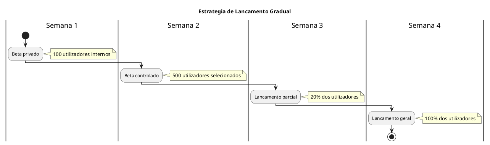
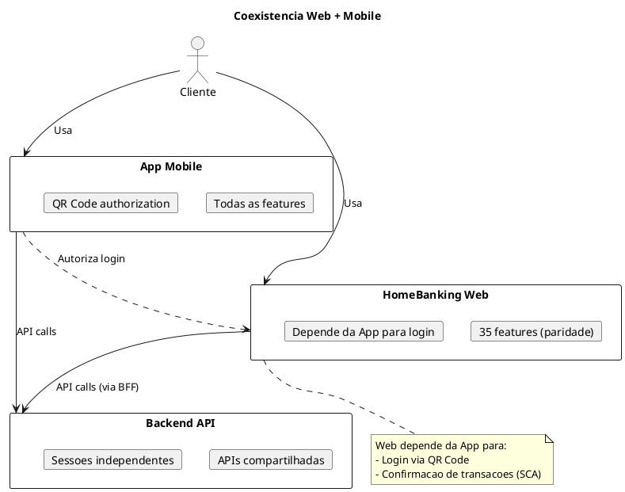
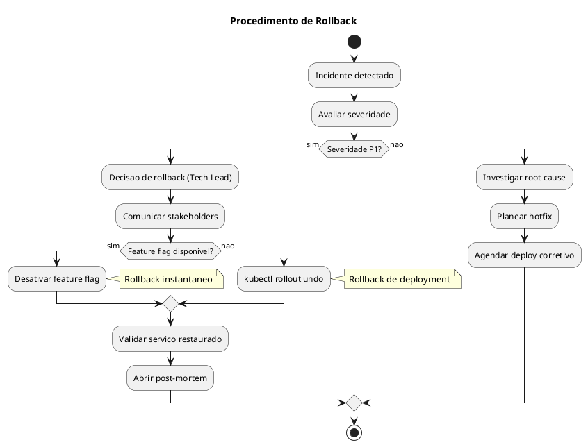

# DEF-14: Plano de Migracao & Implementacao

> **Secao relacionada:** [SEC-14 - Plano de Migracao & Implementacao](../sections/SEC-14-plano-migracao-implementacao.md)

## Contexto

Definir o plano de migracao e implementacao do HomeBanking Web, incluindo roadmap, estrategia de cutover, coexistencia com sistemas legados, migracao de dados, criterios go/no-go, procedimentos de rollback, plano de comunicacao, formacao e periodo de hypercare.

---

## Roadmap de Implementacao

### Fases do Projeto

```plantuml
@startuml
skinparam backgroundColor white

title Roadmap de Implementacao - HomeBanking Web

project starts 2026-02-01

[Fase 0: Setup] as setup lasts 4 weeks
[Fase 1: MVP Core] as mvp lasts 12 weeks
[Fase 2: Features Completas] as features lasts 8 weeks
[Fase 3: Beta/UAT] as beta lasts 4 weeks
[Fase 4: Go-Live] as golive lasts 2 weeks
[Fase 5: Hypercare] as hypercare lasts 4 weeks

setup -> mvp
mvp -> features
features -> beta
beta -> golive
golive -> hypercare

@enduml
```

### Detalhamento das Fases

| Fase | Duracao | Entregas |
|------|---------|----------|
| **0: Setup** | 4 semanas | Infraestrutura, pipelines CI/CD, ambientes, design system base |
| **1: MVP Core** | 12 semanas | Login (4 fluxos), Dashboard, Contas, Saldos, Transferencias |
| **2: Features** | 8 semanas | Restantes 35 funcionalidades (paridade mobile) |
| **3: Beta/UAT** | 4 semanas | Testes UAT, correcoes, pentest |
| **4: Go-Live** | 2 semanas | Cutover, lancamento controlado |
| **5: Hypercare** | 4 semanas | Suporte intensivo, monitorizacao, ajustes |

### MVP - Funcionalidades Core

| Funcionalidade | Prioridade | Complexidade |
|----------------|------------|--------------|
| Login QR Code (principal) | P1 | Alta |
| Login tradicional (fallback) | P1 | Media |
| Dashboard / Home | P1 | Media |
| Consulta de contas | P1 | Baixa |
| Consulta de saldos | P1 | Baixa |
| Transferencias nacionais | P1 | Alta |
| Pagamentos de servicos | P1 | Alta |
| Logout | P1 | Baixa |

---

## Estrategia de Cutover

### Abordagem: Lancamento Gradual (Phased Rollout)



### Criterios de Progressao

| Etapa | Condicao para Avancar |
|-------|----------------------|
| Beta -> Lancamento Parcial | 0 bugs criticos, taxa de erro < 1% |
| Parcial -> Geral | SLOs cumpridos, feedback positivo, 0 P1 abertos |

### Feature Flags para Rollout

| Flag | Descricao | Default |
|------|-----------|---------|
| `enable_web_banking` | Habilita acesso ao canal web | false |
| `enable_qr_login` | Habilita login via QR Code | true |
| `enable_transfers` | Habilita transferencias | true |
| `maintenance_mode` | Modo manutencao (bloqueia acessos) | false |

---

## Coexistencia com App Mobile

### Modelo de Coexistencia



### Sessoes

| Aspecto | Comportamento |
|---------|---------------|
| Sessoes simultaneas | Permitidas (Web + Mobile) |
| Logout | Independente por canal |
| Tokens | Separados (App vs Web BFF) |

---

## Migracao de Dados

### Avaliacao

| Tipo de Dado | Migracao Necessaria? | Notas |
|--------------|---------------------|-------|
| Dados de utilizadores | Nao | Backend existente |
| Contas e saldos | Nao | Backend existente |
| Historico de transacoes | Nao | Backend existente |
| Preferencias de utilizador | Nao | Geridas no backend |
| Configuracoes do sistema | Nao | Novas configs para Web |

> **Conclusao:** O canal web e **stateless** e nao requer migracao de dados. Todos os dados de negocio estao no backend existente que ja serve a App Mobile.

---

## Criterios Go/No-Go

### Checklist Pre-Go-Live

| Categoria | Criterio | Status |
|-----------|----------|--------|
| **Funcional** | 100% dos testes E2E criticos passam | [ ] |
| **Funcional** | UAT aprovado pelo PO | [ ] |
| **Performance** | Load test 400 users OK | [ ] |
| **Performance** | SLOs validados (99.9%, < 3s) | [ ] |
| **Seguranca** | Pentest concluido | [ ] |
| **Seguranca** | 0 vulnerabilidades criticas/altas | [ ] |
| **Seguranca** | SAST/DAST sem findings criticos | [ ] |
| **Operacional** | Runbooks documentados | [ ] |
| **Operacional** | Alertas configurados | [ ] |
| **Operacional** | Dashboards operacionais prontos | [ ] |
| **Operacional** | Equipa de suporte treinada | [ ] |
| **Legal** | Aprovacao compliance | [ ] |

### Comite de Aprovacao

| Papel | Responsabilidade |
|-------|------------------|
| Tech Lead | Validacao tecnica |
| PO / Product Manager | Validacao funcional |
| Security Officer | Validacao de seguranca |
| Operations Lead | Validacao operacional |
| Sponsor | Aprovacao final |

---

## Procedimentos de Rollback

### Estrategia de Rollback



### Tipos de Rollback

| Tipo | Tempo | Quando Usar |
|------|-------|-------------|
| Feature Flag | Instantaneo | Problema em feature especifica |
| Deployment | 2-5 min | Problema geral na versao |
| Full Rollback | 15-30 min | Problema sistemico |

### Comandos de Rollback

```bash
# Rollback via kubectl
kubectl rollout undo deployment/bff-web -n homebanking-prod
kubectl rollout undo deployment/frontend-web -n homebanking-prod

# Verificar status
kubectl rollout status deployment/bff-web -n homebanking-prod
```

---

## Beta Testing

### Programa Beta

| Fase | Duracao | Participantes | Objetivo |
|------|---------|---------------|----------|
| Alpha | 1 semana | Equipa interna (50) | Smoke testing |
| Beta fechado | 2 semanas | Colaboradores selecionados (500) | Funcional completo |
| Beta aberto | 1 semana | Early adopters (2000) | Stress real |

### Criterios de Selecao Beta

| Criterio | Justificacao |
|----------|--------------|
| Utilizadores ativos da App | Familiarizados com fluxos |
| Diferentes perfis | Standard, Premium, Empresas |
| Diferentes regioes | Testar latencia |
| Tech-savvy | Feedback qualitativo |

### Feedback Collection

| Canal | Tipo de Feedback |
|-------|------------------|
| In-app widget | Bugs e sugestoes |
| Formulario dedicado | Feedback estruturado |
| Analytics | Comportamento (heatmaps, funnels) |
| Entrevistas | Qualitativo (amostra) |

---

## Periodo de Hypercare

### Duracao e Cobertura

| Aspecto | Especificacao |
|---------|---------------|
| Duracao | 4 semanas apos go-live |
| Cobertura | 24/7 na primeira semana, 8-20h restantes |
| Equipa | Dev + Ops + Suporte dedicados |

### Actividades Hypercare

| Semana | Foco |
|--------|------|
| 1 | Monitorizacao intensiva, resolucao imediata de bugs |
| 2 | Estabilizacao, ajustes de performance |
| 3 | Optimizacao, resolucao de feedback |
| 4 | Transicao para operacao normal |

### Criterios de Saida do Hypercare

| Criterio | Threshold |
|----------|-----------|
| Bugs P1/P2 abertos | 0 |
| SLOs cumpridos | 3 dias consecutivos |
| Taxa de erro | < 0.1% |
| Feedback negativo | < 5% |

---

## Comunicacao e Formacao

### Plano de Comunicacao

| Audiencia | Canal | Mensagem | Timing |
|-----------|-------|----------|--------|
| Utilizadores | Email + App | Lancamento do novo canal | 2 semanas antes |
| Utilizadores | Landing page | Features e beneficios | Go-live |
| Suporte | Training | Novos fluxos e FAQs | 1 semana antes |
| Internos | Intranet | Anuncio de lancamento | Go-live |

### Formacao

| Grupo | Conteudo | Formato |
|-------|----------|---------|
| Equipa de Suporte | Fluxos, troubleshooting, FAQs | Workshop presencial |
| Gestores de Conta | Demo, beneficios | Video + Demo |
| Equipa Tecnica | Arquitetura, runbooks | Documentacao + Sessao |

---

## Questoes Pendentes de Confirmacao

| ID | Questao | Responsavel | Prioridade |
|----|---------|-------------|------------|
| Q-14-001 | Data prevista para go-live | PO / Sponsor | Alta |
| Q-14-002 | Percentagem inicial de rollout | Produto | Alta |
| Q-14-003 | Sistema HomeBanking web legado a substituir? | Produto | Media |
| Q-14-004 | Aprovadores do go-live | Sponsor | Alta |
| Q-14-005 | Budget para beta testing incentives | Marketing | Baixa |

---

## Decisoes

### Cutover Strategy
- **Decisao:** Lancamento gradual (phased rollout) com feature flags
- **Justificacao:** Menor risco, permite correcoes antes de exposicao total
- **Alternativas consideradas:** Big bang (risco alto), Parallel run (complexidade)

### Rollback Strategy
- **Decisao:** Feature flags para rollback instantaneo + deployment rollback como backup
- **Justificacao:** Tempo de recuperacao minimo, flexibilidade
- **Alternativas consideradas:** Apenas deployment rollback

### Beta Testing
- **Decisao:** Beta fechado (500 users) + Beta aberto (2000 users)
- **Justificacao:** Validacao em ambiente real antes de lancamento geral
- **Alternativas consideradas:** Sem beta (risco alto)

### Hypercare
- **Decisao:** 4 semanas com cobertura 24/7 na primeira semana
- **Justificacao:** Suporte intensivo durante periodo critico
- **Alternativas consideradas:** 2 semanas (insuficiente)

---

## Decisoes Relacionadas

- [DEC-006-estrategia-containers-openshift.md](../decisions/DEC-006-estrategia-containers-openshift.md) - Deploy strategy

## Referencias

- [DEF-02-requisitos-nao-funcionais.md](DEF-02-requisitos-nao-funcionais.md) - SLAs
- [DEF-10-arquitetura-operacional.md](DEF-10-arquitetura-operacional.md) - CI/CD e Deploy
- [DEF-01-objetivos-documento.md](DEF-01-objetivos-documento.md) - Scope e funcionalidades
- [CONTEXT.md](../CONTEXT.md) - Contexto do projeto
