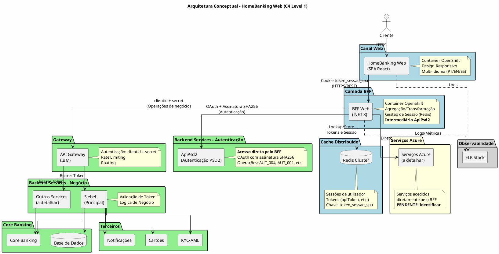
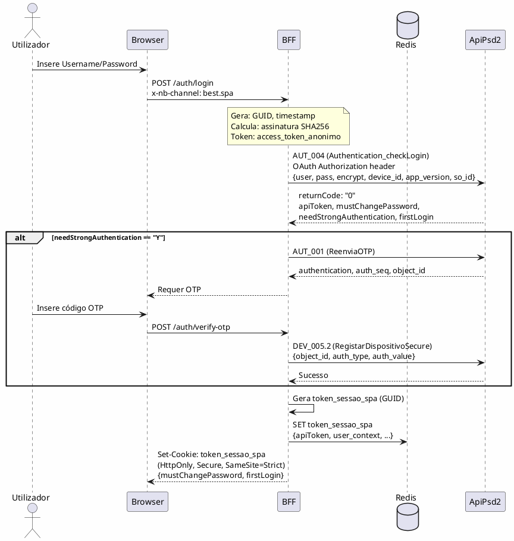

# ARCHITECT_ADD_1: Integração do Fluxo de Autenticação Web com ApiPsd2

**Data:** 2026-01-21
**Origem:** Análise do diagrama de sequência do cliente (`customer_sequences/FLUXO_LOGIN_WEB_SEM_AUTH.txt`)
**Tipo:** Adenda arquitetural - Instruções para atualização da documentação HLD

---

## 1. Contexto

### 1.1 Situação Atual

O cliente forneceu um diagrama de sequência (`FLUXO_LOGIN_WEB_SEM_AUTH.txt`) que representa o **fluxo de autenticação atual da aplicação mobile**. Este diagrama mostra como a app mobile comunica com a **ApiPsd2** (backend de autenticação PSD2).

### 1.2 Estratégia para o Canal Web

Para o canal web, estamos a implementar um **fluxo diferenciado** onde:

1. **O BFF assume o papel do app mobile** - Tudo o que a app faz entre si e o backend será agora feito entre o BFF e o backend
2. **ApiPsd2 torna-se dependência do BFF** - O BFF acede diretamente à ApiPsd2, funcionando como intermediário (padrão microservice)
3. **Tokens nunca são expostos ao frontend** - O BFF armazena todos os tokens (apiToken, etc.) no Redis
4. **Frontend recebe apenas token de sessão** - Um identificador que serve como chave no Redis para aceder aos dados da sessão do utilizador

### 1.3 Fluxos de Autenticação

| Fluxo | Canal | Descrição |
|-------|-------|-----------|
| **QR Code + Biometria** | Web (Primário) | Mantém-se conforme documentado em SEC-07 |
| **Username/Password + OTP** | Web (Fallback) | Baseado no diagrama do cliente, adaptado para web |
| **SCA Condicional** | Web | Alguns acessos podem não requerer SCA (flag `needStrongAuthentication`) |

---

## 2. Objetivo

Este documento instrui o agente a atualizar a documentação HLD para:

1. **Adicionar ApiPsd2 ao diagrama de arquitetura** (SEC-03, secção 3.2)
2. **Documentar o mecanismo de autenticação BFF↔ApiPsd2** (DEF-05-autenticacao-oauth ou novo ficheiro)
3. **Atualizar fluxos de autenticação** (SEC-07) para incluir detalhes técnicos do fallback
4. **Documentar a estratégia de sessão com Redis** (DEC-002, DEF-05-arquitetura-bff)
5. **Adicionar novas pendências** ao PENDENCIAS.md
6. **Criar mapeamento de operações da API** (novo ficheiro ou em SEC-09)

---

## 3. Alterações Requeridas por Ficheiro

### 3.1 SEC-03-visao-geral-solucao.md

**Secção a alterar:** 3.2 Diagrama Conceptual

**Ação:** Atualizar o diagrama PlantUML para:

1. Adicionar **ApiPsd2** como componente do Backend Services
2. Mostrar que o **BFF acede diretamente à ApiPsd2** (não passa pelo API Gateway para este serviço)
3. Manter o API Gateway IBM para outros serviços backend

**Diagrama atualizado a inserir:**



**Tabela de Fluxo de Autenticação a atualizar:**

| Origem | Destino | Mecanismo |
|--------|---------|-----------|
| Frontend Web | BFF | Cookie de Sessão (token_sessao_spa, HttpOnly, Secure, SameSite=Strict) |
| BFF | Redis | Lookup por token_sessao_spa → tokens do utilizador |
| BFF | ApiPsd2 | OAuth + Assinatura SHA256 (consumer_key, GUID, timestamp, version, secret_key) |
| BFF | API Gateway | ClientID + ClientSecret (operações de negócio) |
| API Gateway | Backend Services | Bearer Token (propagado) |

**Nova nota a adicionar após a tabela:**

> **Nota sobre ApiPsd2:** A ApiPsd2 é acedida diretamente pelo BFF (sem passar pelo API Gateway IBM) para operações de autenticação. O BFF atua como intermediário, isolando completamente o frontend dos detalhes de autenticação OAuth com o backend.

---

### 3.2 DEF-05-arquitetura-bff.md

**Secções a alterar:** Várias

**Ação 1:** Adicionar nova secção sobre dependência da ApiPsd2

Inserir após a secção "Autenticação BFF-Backend":

```markdown
### ApiPsd2 como Dependência

O BFF atua como intermediário para todas as chamadas à ApiPsd2:

| Aspeto | Decisão |
|--------|---------|
| **Acesso** | Direto (sem API Gateway) |
| **Protocolo** | REST com OAuth |
| **Autenticação** | Assinatura SHA256 |
| **Responsabilidade** | BFF encapsula toda a complexidade |

**Componentes da Assinatura OAuth:**

| Componente | Descrição | Armazenamento |
|------------|-----------|---------------|
| `consumer_key` | Identificador do cliente OAuth | Secrets/Config |
| `secret_key` | Chave secreta para assinatura | Secrets |
| `access_token_anonimo` | Token para operações pré-login | Secrets/Config |
| `GUID` | Identificador único por request | Gerado em runtime |
| `timestamp` | Timestamp do request | Gerado em runtime |
| `version` | Versão do protocolo (1.1) | Config |

**Cálculo da Assinatura:**
```
assinatura = SHA256(consumer_key & GUID & timestamp & version & secret_key)
```

**Header de Identificação de Canal:**
```
x-nb-channel: best.spa
```
```

**Ação 2:** Atualizar secção sobre estratégia de cache

Substituir/expandir a secção de cache:

```markdown
### Estratégia de Cache e Sessão

O BFF utiliza Redis Cluster para gestão de sessões distribuídas:

| Aspeto | Decisão |
|--------|---------|
| **Tecnologia** | Redis Cluster |
| **Chave** | `token_sessao_spa` (cookie enviado pelo browser) |
| **Dados armazenados** | apiToken, refresh info, dados de sessão |
| **TTL** | Alinhado com timeout de sessão (30 min absoluto) |

**Dados Armazenados por Sessão:**

| Dado | Descrição | Origem |
|------|-----------|--------|
| `apiToken` | Token de acesso à ApiPsd2 | Resposta AUT_004 |
| `mustChangePassword` | Flag de alteração obrigatória | Resposta AUT_004 |
| `needStrongAuthentication` | Flag SCA necessário | Resposta AUT_004 |
| `firstLogin` | Flag primeiro acesso | Resposta AUT_004 |
| `user_context` | Dados do utilizador (não sensíveis) | Resposta login |

**Importante:** O `sasToken` retornado pela ApiPsd2 **não é utilizado** no canal web. Este token é específico para a app mobile e contém chaves que, no contexto web, ficam armazenadas no BFF.
```

---

### 3.3 SEC-07-autenticacao-autorizacao.md

**Secções a alterar:** 7.2 e 7.3

**Ação 1:** Atualizar secção 7.2.2 (Fluxo Fallback) com detalhes técnicos

Adicionar após o diagrama existente do fluxo fallback:

```markdown
#### 7.2.2.1 Detalhes Técnicos do Fluxo Fallback (BFF ↔ ApiPsd2)

O fluxo fallback utiliza a ApiPsd2 para autenticação. O BFF encapsula toda a complexidade:



**Códigos de Operação ApiPsd2:**

| Código | Operação | Descrição |
|--------|----------|-----------|
| AUT_004 | Authentication_checkLogin | Validação de credenciais |
| AUT_001 | ReenviaOTP | Solicita envio de OTP |
| DEV_005.2 | RegistarDispositivoSecure | Valida OTP e regista dispositivo |
| CLI_005 | ConsultaCliente | Consulta dados do cliente (pós-login) |

**Parâmetros do Login (AUT_004):**

| Parâmetro | Descrição | Valor Web |
|-----------|-----------|-----------|
| `user` | Identificador do utilizador | Input do utilizador |
| `pass` | Password (pode ser cifrada) | Input do utilizador |
| `encrypt` | Indica se password está cifrada | "Y" ou "N" |
| `device_id` | Identificador do dispositivo | User-Agent ou GUID gerado |
| `app_version` | Versão da aplicação | Versão do SPA |
| `so_id` | Sistema operativo | "2" (Web) |
```

**Ação 2:** Atualizar secção 7.3 (MFA/SCA)

Adicionar nota sobre SCA condicional:

```markdown
### 7.3.1 SCA Condicional

A ApiPsd2 retorna a flag `needStrongAuthentication` que indica se SCA é requerido:

| Valor | Significado | Ação |
|-------|-------------|------|
| "Y" | SCA obrigatório | Prosseguir com OTP |
| "N" | SCA não requerido | Login completo |

> **Pendência:** Clarificar com o cliente em que cenários `needStrongAuthentication` retorna "N". Ver PENDENCIAS.md item P1.
```

---

### 3.4 DEC-002-gestao-sessoes-tokens.md

**Ação:** Adicionar detalhes sobre Redis e token_sessao_spa

Atualizar a secção "Decision" para incluir:

```markdown
**Configuração de Sessão Web:**
- Cookie: `token_sessao_spa`
- Atributos: HttpOnly, Secure, SameSite=Strict
- Geração: GUID no BFF após autenticação bem-sucedida
- Função: Chave de lookup no Redis

**Armazenamento Redis:**
- Chave: `session:{token_sessao_spa}`
- Valor: JSON com apiToken, contexto de utilizador, flags
- TTL: 30 minutos (timeout absoluto de sessão)
- Tipo: Redis Cluster para alta disponibilidade
```

---

### 3.5 SEC-09-integracao-interfaces-externas.md

**Ação:** Adicionar secção sobre ApiPsd2

Criar nova secção (ou adicionar a existente):

```markdown
### 9.X ApiPsd2 - Interface de Autenticação PSD2

A ApiPsd2 é o serviço de autenticação PSD2 do backend existente, acedido diretamente pelo BFF.

#### 9.X.1 Características

| Aspeto | Valor |
|--------|-------|
| **Protocolo** | REST |
| **Autenticação** | OAuth 1.0 com assinatura SHA256 |
| **Acesso** | Direto pelo BFF (sem API Gateway) |
| **Documentação** | _A fornecer pelo NovoBanco_ |

#### 9.X.2 Operações Identificadas

| Código | Nome | Descrição | Contexto |
|--------|------|-----------|----------|
| AUT_004 | Authentication_checkLogin | Autenticação inicial | Login |
| AUT_001 | ReenviaOTP | Solicita envio de OTP | MFA |
| DEV_005.2 | RegistarDispositivoSecure | Valida OTP | MFA |
| CLI_005 | ConsultaCliente | Dados do cliente | Pós-login |

#### 9.X.3 Estrutura do Header de Autorização

```
Authorization: OAuth access_token={{access_token}},
                    oauth_consumer_key={{client_token}},
                    oauth_timestamp={{timestamp}},
                    oauth_version={{version}},
                    oauth_signature={{assinatura}},
                    oauth_guid={{GUID}}
```

#### 9.X.4 Pendências

| Item | Descrição |
|------|-----------|
| Documentação completa | Obter documentação oficial da ApiPsd2 |
| Lista completa de operações | Identificar todas as operações necessárias |
| Tratamento de erros | Documentar códigos de erro e ações |
```

---

### 3.6 PENDENCIAS.md

**Ação:** Adicionar nova secção com pendências da análise do diagrama

Inserir nova secção após a secção 7 existente:

```markdown
---

## 8. Pendências da Análise do Fluxo ApiPsd2

> **Origem:** Análise do diagrama `customer_sequences/FLUXO_LOGIN_WEB_SEM_AUTH.txt`
> **Data:** 2026-01-21

### 8.1 Autenticação e SCA

| # | Questão | Contexto | Prioridade | Status |
|---|---------|----------|------------|--------|
| P1 | Em que cenários `needStrongAuthentication` retorna "N"? | Diagrama mostra resposta com "N" - contradiz SCA obrigatório? | **Alta** | [ ] |
| P2 | O parâmetro `encrypt` indica que a password deve ser cifrada antes de enviar? Qual algoritmo? | AUT_004 tem `encrypt: "Y"` | Alta | [ ] |
| P3 | O `device_id` para web deve ser o User-Agent, um GUID persistente, ou outro valor? | Diagrama questiona isto | Média | [ ] |
| P4 | O `so_id` para web é "2"? Qual o mapeamento completo? | Diagrama usa "2" | Baixa | [ ] |

### 8.2 ApiPsd2 e Integração

| # | Questão | Contexto | Prioridade | Status |
|---|---------|----------|------------|--------|
| P5 | O BFF acede à ApiPsd2 diretamente ou através do API Gateway IBM? | Diagrama sugere acesso direto | **Alta** | [ ] |
| P6 | Existe documentação oficial da ApiPsd2? Podemos obter? | Necessário para implementação | **Alta** | [ ] |
| P7 | Lista completa de operações (AUT_*, DEV_*, CLI_*) necessárias para o canal web? | Diagrama mostra algumas | Alta | [ ] |
| P8 | Como funciona a renovação/refresh do apiToken? | Não documentado no diagrama | Alta | [ ] |

### 8.3 Segurança e Sessão

| # | Questão | Contexto | Prioridade | Status |
|---|---------|----------|------------|--------|
| P9 | O `sasToken` pode ser completamente ignorado no canal web? | Cliente nota que não faz sentido para web | Média | [ ] |
| P10 | A assinatura SHA256 usa exatamente a fórmula `SHA256(consumer_key&GUID&timestamp&version&secret_key)`? | Confirmar algoritmo | Alta | [ ] |
| P11 | Existe identificador único para o PC/browser que possa ser usado para segurança adicional? | Nota no diagrama questiona isto | Média | [ ] |

### 8.4 Cookies e Headers

| # | Questão | Contexto | Prioridade | Status |
|---|---------|----------|------------|--------|
| P12 | O cookie de sessão deve ter `SameSite=Strict`? (diagrama não menciona) | Best practice vs compatibilidade | Média | [ ] |
| P13 | Há outros headers além de `x-nb-channel` que devem ser enviados? | Identificação do canal | Baixa | [ ] |

---

**Contexto Adicional:**

O diagrama do cliente (`FLUXO_LOGIN_WEB_SEM_AUTH.txt`) representa o fluxo **atual da app mobile**. Para o canal web:
- O BFF assumirá o papel que a app faz
- ApiPsd2 será uma dependência direta do BFF
- Tokens serão armazenados no Redis, não expostos ao frontend
- O frontend receberá apenas um `token_sessao_spa` como identificador de sessão
```

---

## 4. Ficheiros a Criar (Opcional)

### 4.1 DEF-05-autenticacao-oauth.md (se não existir ou estiver incompleto)

Verificar se existe. Se não existir ou estiver incompleto, criar com:

```markdown
---
id: DEF-05-autenticacao-oauth
aliases:
  - Autenticação OAuth ApiPsd2
tags:
  - nextreality-novobanco-website-definitions
  - definitions
  - oauth
  - authentication
  - apipsd2
approved: false
created: 2026-01-21
status: draft
---

# DEF-05: Autenticação OAuth com ApiPsd2

> **Secção relacionada:** [7 - Autenticação & Autorização](../sections/SEC-07-autenticacao-autorizacao.md)

## Contexto

Documentar o mecanismo de autenticação OAuth utilizado pelo BFF para comunicar com a ApiPsd2.

## Mecanismo de Autenticação

### Componentes

| Componente | Descrição | Origem |
|------------|-----------|--------|
| `consumer_key` | Identificador do cliente OAuth | Configuração/Secrets |
| `secret_key` | Chave secreta para assinatura | Secrets |
| `access_token_anonimo` | Token para operações pré-login | Configuração/Secrets |
| `access_token` | Token do utilizador autenticado | Resposta AUT_004 (apiToken) |
| `GUID` | Identificador único por request | Gerado pelo BFF |
| `timestamp` | Unix timestamp | Gerado pelo BFF |
| `version` | Versão do protocolo | "1.1" |

### Cálculo da Assinatura

```
assinatura = SHA256(consumer_key & GUID & timestamp & version & secret_key)
```

> **Pendência P10:** Confirmar se esta é a fórmula exata.

### Header de Autorização

```http
Authorization: OAuth access_token={{access_token}},
                    oauth_consumer_key={{consumer_key}},
                    oauth_timestamp={{timestamp}},
                    oauth_version={{version}},
                    oauth_signature={{assinatura}},
                    oauth_guid={{GUID}}
```

### Header de Identificação de Canal

```http
x-nb-channel: best.spa
```

## Operações

| Código | Operação | Token Usado |
|--------|----------|-------------|
| AUT_004 | Login | access_token_anonimo |
| AUT_001 | Reenvio OTP | apiToken |
| DEV_005.2 | Validação OTP | apiToken |
| CLI_005+ | Operações de negócio | apiToken |

## Referências

- [Diagrama de sequência do cliente](../customer_sequences/FLUXO_LOGIN_WEB_SEM_AUTH.txt)
- Documentação ApiPsd2 (a fornecer)
```

---

## 5. Validações Finais

Após aplicar todas as alterações, o agente deve verificar:

| Verificação | Ficheiro | Check |
|-------------|----------|-------|
| Diagrama 3.2 inclui ApiPsd2 | SEC-03-visao-geral-solucao.md | [ ] |
| Diagrama 3.2 inclui Redis | SEC-03-visao-geral-solucao.md | [ ] |
| Fluxo BFF→ApiPsd2 documentado | SEC-07-autenticacao-autorizacao.md | [ ] |
| Detalhes OAuth documentados | DEF-05-arquitetura-bff.md ou DEF-05-autenticacao-oauth.md | [ ] |
| Sessão Redis documentada | DEC-002-gestao-sessoes-tokens.md | [ ] |
| ApiPsd2 em integrações | SEC-09-integracao-interfaces-externas.md | [ ] |
| Pendências adicionadas | PENDENCIAS.md | [ ] |
| SCA condicional mencionado | SEC-07-autenticacao-autorizacao.md | [ ] |

---

## 6. Resumo das Alterações

| Ficheiro | Tipo de Alteração | Prioridade |
|----------|-------------------|------------|
| SEC-03-visao-geral-solucao.md | Atualizar diagrama 3.2 | **Alta** |
| DEF-05-arquitetura-bff.md | Adicionar secções ApiPsd2 e Redis | **Alta** |
| SEC-07-autenticacao-autorizacao.md | Adicionar detalhes técnicos do fallback | **Alta** |
| DEC-002-gestao-sessoes-tokens.md | Adicionar detalhes Redis | Média |
| SEC-09-integracao-interfaces-externas.md | Adicionar secção ApiPsd2 | Média |
| PENDENCIAS.md | Adicionar secção 8 | **Alta** |
| DEF-05-autenticacao-oauth.md | Criar se necessário | Média |

---

## 7. Notas Importantes

1. **Não remover informação existente** - Apenas adicionar e complementar
2. **Manter consistência de formato** - Seguir o estilo dos documentos existentes
3. **Frontmatter** - Atualizar `status` para `in-progress` se estava `completed`
4. **Português Europeu** - Manter acentuação correta
5. **PlantUML** - Manter sintaxe válida nos diagramas
6. **Referências cruzadas** - Atualizar links entre documentos se necessário

---

## 8. Histórico

| Data | Ação | Autor |
|------|------|-------|
| 2026-01-21 | Criação do documento | Análise do diagrama do cliente |

