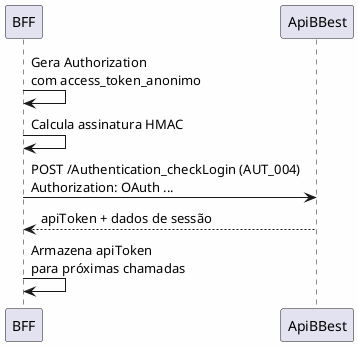
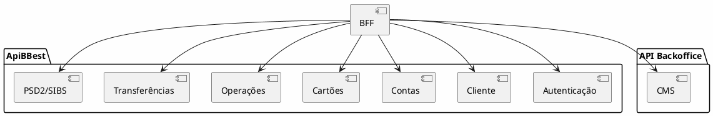
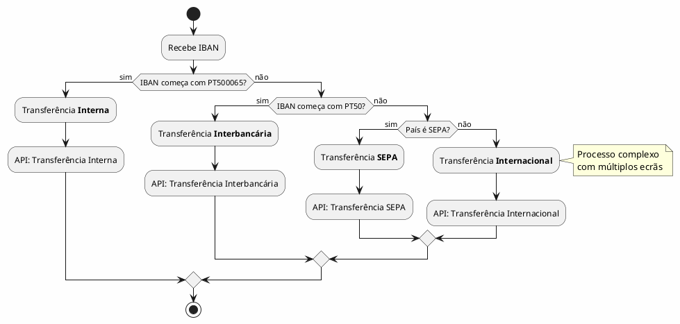
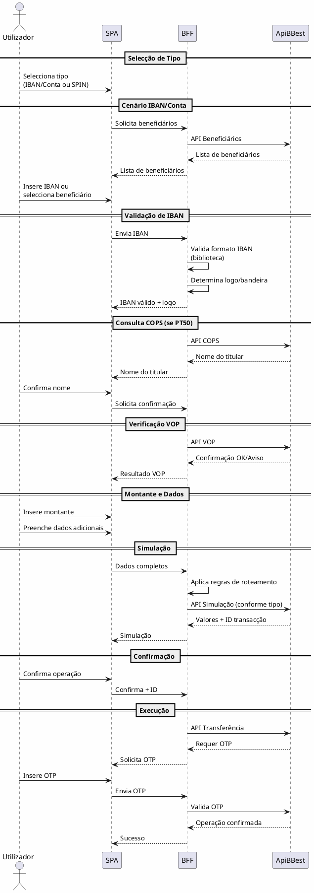
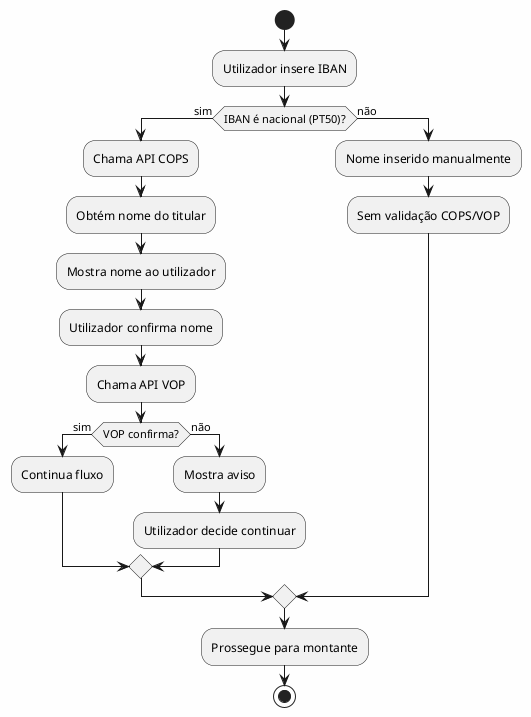
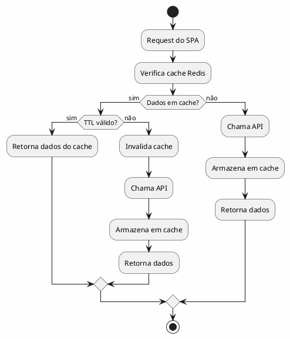

# LOGIN_TRANSF_DIFF - Guia de Alterações ao HLD

> **Data:** 2026-01-21
> **Propósito:** Instruções detalhadas para aplicar alterações ao HLD baseadas no diagrama de sequência do cliente (`LOGIN_TRANSFERENCIA_WEB.txt`)
> **Destinatário:** Agente de execução de alterações

---

## 1. Contexto

### 1.1 Origem das Alterações

O cliente forneceu um diagrama de sequência (`customer_sequences/LOGIN_TRANSFERENCIA_WEB.txt`) que detalha os fluxos de Login e Transferência Web. Após análise comparativa com o HLD actual, foram identificadas:

1. **Divergências arquitecturais** - que foram clarificadas com o cliente
2. **Informação complementar** - detalhes técnicos que enriquecem o HLD

### 1.2 Decisões Tomadas (Validadas com Cliente)

| # | Aspecto | Decisão |
|---|---------|---------|
| 1 | Método de autenticação primário Web | **QR Code + Biometria** é o método primário (diagrama mostra apenas fallback) |
| 2 | Versão OAuth | **OAuth 1.1** com assinaturas HMAC |
| 3 | Comunicação BFF → Backend | **Directa** (sem API Gateway IBM entre BFF e ApiBBest) |
| 4 | Catálogo de APIs | **Adicionar** no DEF-09 e SEC-09 |
| 5 | Regras de roteamento transferências | **Criar nova definição** e adicionar à secção relevante |
| 6 | Cache de dados | **Redis** para dados transitórios |

### 1.3 Objectivo

Incorporar no HLD:
- Detalhes técnicos do protocolo OAuth 1.1
- Catálogo de APIs do cliente
- Regras de roteamento de transferências
- Fluxo COPS/VOP para validação de titular
- Estratégia de cache de dados
- Actualizar arquitectura (comunicação directa BFF → ApiBBest)

---

## 2. Alterações Requeridas por Ficheiro

### 2.1 SEC-03-visao-geral-solucao.md

**Localização:** `sections/SEC-03-visao-geral-solucao.md`

**Acção:** Actualizar o diagrama conceptual (secção 3.2) para reflectir comunicação directa BFF → Backend (sem API Gateway IBM).

**Alteração no diagrama PlantUML:**

Substituir:
```
BFF --> APIGW : clientid + secret
APIGW --> SIEBEL : Bearer Token
APIGW --> OUTROS : Bearer Token
```

Por:
```
BFF --> SIEBEL : OAuth 1.1\n(assinatura HMAC)
BFF --> OUTROS : OAuth 1.1
```

Remover ou comentar o package "Gateway":
```plantuml
' package "Gateway" #LightGreen {
'     [API Gateway\n(IBM)] as APIGW
'     note right of APIGW
'       Autenticação: clientid + secret
'       Rate Limiting
'       Routing
'     end note
' }
```

**Actualizar tabela "Fluxo de Autenticação":**

| Origem | Destino | Mecanismo |
|--------|---------|-----------|
| Frontend Web | BFF | Cookie de Sessão (HttpOnly, Secure) |
| BFF | Backend Services (ApiBBest) | OAuth 1.1 (assinatura HMAC-SHA256) |
| Backend Services | - | Validação interna |

**Nota importante:** Renomear "Siebel" para "ApiBBest" ou adicionar nota de que ApiBBest é o nome do serviço backend (confirmar nomenclatura preferida).

---

### 2.2 SEC-07-autenticacao-autorizacao.md

**Localização:** `sections/SEC-07-autenticacao-autorizacao.md`

**Acção 1:** Adicionar nova subsecção após 7.2.3 sobre o protocolo OAuth 1.1

**Conteúdo a adicionar (nova secção 7.2.4):**

```markdown
#### 7.2.4 Protocolo OAuth 1.1 - Comunicação BFF → Backend

##### Chaves e Credenciais Necessárias

| Chave | Propósito | Armazenamento |
|-------|-----------|---------------|
| `access_token_anonimo` | Token para primeira chamada (pré-autenticação) | BFF Config |
| `consumer_key` | Identificação do cliente OAuth | BFF Config |
| `secret_key` | Chave secreta para assinatura | BFF Secrets (seguro) |
| `Token_Endpoint` | URL do endpoint de tokens | BFF Config |
| `clientid` | ID do cliente (Backoffice) | BFF Config |
| `client_secret` | Secret do cliente (Backoffice) | BFF Secrets (seguro) |
| `ClientScopes` | Scopes autorizados | BFF Config |
| `authorizationpoint` | Endpoint de autorização | BFF Config |

##### Formato do Header Authorization

O BFF deve gerar o header Authorization no seguinte formato:

```
Authorization: OAuth access_token={{access_token}},
                      oauth_consumer_key={{consumer_key}},
                      oauth_timestamp={{timestamp}},
                      oauth_version=1.1,
                      oauth_signature={{signature}},
                      oauth_guid={{GUID}}
```

##### Geração da Assinatura

| Passo | Descrição |
|-------|-----------|
| 1 | Construir `base_string`: `access_token%26oauth_consumer_key%26oauth_guid%26oauth_timestamp%3D%26oauth_version%26oauth_consumer_secret` |
| 2 | Calcular `signature_final1`: HMAC-SHA256(base_string, consumer_secret) em Base64 |
| 3 | Calcular `signature_final2`: URL encode de signature_final1 |

##### Fluxo de Autenticação com Token Anónimo

Para a primeira chamada (login), o BFF utiliza um token anónimo:



##### Payload do Login (AUT_004)

```json
{
    "user": "5.9.85.7.4.0.5.82",
    "pass": "2.25.265.25",
    "token": "",
    "encrypt": "N",
    "device_id": " ",
    "app_version": "SPA_version",
    "so_id": "SPA"
}
```

> **Nota:** Os valores de `user` e `pass` parecem estar codificados. Verificar formato de encoding com equipa de backend.

##### Resposta do Login

```json
{
    "returnCode": "0",
    "returnMsg": "Sucesso",
    "outputData": {
        "apiToken": "914e55d8ea3b4e19b1aa63c9efbad2ba",
        "mustChangePassword": "N",
        "needStrongAuthentication": "N",
        "firstLogin": "N",
        "otp_id": null,
        "sasToken": ""
    }
}
```

| Campo | Descrição | Uso no SPA |
|-------|-----------|------------|
| `apiToken` | Token para próximas chamadas | Armazenado no BFF |
| `mustChangePassword` | Flag de mudança de password | Redireccionamento |
| `needStrongAuthentication` | Flag de SCA necessário | Fluxo OTP |
| `firstLogin` | Primeiro login | Fluxo onboarding |
| `otp_id` | ID do OTP enviado | Validação OTP |
| `sasToken` | Token SAS | **Não necessário para SPA** |
```

**Acção 2:** Actualizar referência na secção 7.5 (Estratégia de Tokens)

Adicionar nota sobre OAuth 1.1:

```markdown
> **Nota:** A comunicação BFF → Backend utiliza OAuth 1.1 com assinaturas HMAC-SHA256. Ver secção 7.2.4 para detalhes do protocolo.
```

---

### 2.3 DEF-09-integracao-interfaces.md

**Localização:** `definitions/DEF-09-integracao-interfaces.md`

**Acção:** Adicionar nova secção com catálogo de APIs

**Conteúdo a adicionar (após secção "Catálogo de Dependências Externas"):**

```markdown
## Catálogo de APIs - ApiBBest

> **Fonte:** Diagrama de sequência do cliente (LOGIN_TRANSFERENCIA_WEB.txt)

### APIs de Autenticação

| API | Código | Descrição | Criticidade |
|-----|--------|-----------|-------------|
| Authentication_checkLogin | AUT_004 | Validação de credenciais e início de sessão | Alta |
| API Secure | - | Validação de OTP | Alta |

### APIs de Dados do Cliente (Home)

| API | Descrição | Dados Retornados |
|-----|-----------|------------------|
| Client_getClientInformation | Informação do cliente | Nome, dados pessoais |
| Client_getClientContact | Contactos do cliente | Email, telefone, morada |
| Devices_getDevices | Dispositivos registados | Lista de dispositivos |
| MIFID_getInvestorProfile | Perfil de investidor | Perfil MIFID |
| Message_getInboxMessage | Mensagens | Inbox do utilizador |

### APIs de Contas e Movimentos

| API | Descrição | Dados Retornados |
|-----|-----------|------------------|
| Account_getAccounts | Lista de contas | Contas do cliente |
| Account_getMovements | Movimentos | Extracto de movimentos |
| Statement_getUserStatement | Património | Posição patrimonial |

### APIs de Cartões

| API | Descrição | Dados Retornados |
|-----|-----------|------------------|
| CCards_getCreditCards | Cartões de crédito | Lista e detalhes |
| DCards_getDebitCards | Cartões de débito | Lista e detalhes |

### APIs de Operações

| API | Descrição | Dados Retornados |
|-----|-----------|------------------|
| Operation_getOperationConfirmation | Confirmação de operações | Estado de operações |
| Schedule_getSchedules | Agendamentos | Operações agendadas |
| Permanent_getPermanentOrders | Ordens permanentes | Lista de ordens |
| CorpAction_getOngoingClosedCA | Operações corporativas | Corporate actions |

### APIs PSD2/SIBS

| API | Descrição | Dados Retornados |
|-----|-----------|------------------|
| SIBS_getConsentStatus | Estado de consentimento PSD2 | Status |
| SIBS_getConsentAccount | Contas com consentimento | Lista de contas |

### APIs de Objectivos

| API | Descrição | Dados Retornados |
|-----|-----------|------------------|
| Objective_getClientObjectives | Objectivos do cliente | Avisos e metas |

### APIs de Transferências

| API | Descrição | Uso |
|-----|-----------|-----|
| API Beneficiários | Lista de beneficiários | Selecção de destinatário |
| API COPS | Consulta de titular (IBAN nacional) | Validação PT50 |
| API VOP | Verificação de nome | Confirmação de titular |
| API Simulação | Simulação de transferência | Pré-cálculo de custos |
| API Transferência | Execução de transferência | Operação efectiva |

### APIs de Backoffice (CMS)

| API | Descrição | Dados Retornados |
|-----|-----------|------------------|
| Notícias | Conteúdo noticioso | Lista de notícias |
| Novidades | Novidades do banco | Lista de novidades |
| Alertas | Alertas ao utilizador | Lista de alertas |
| Publicidades | Cards promocionais | Estrutura de publicidade |

> **Nota:** Este catálogo foi extraído do diagrama de sequência. Solicitar documentação detalhada (contratos OpenAPI/Swagger) à equipa de backend.

### Autenticação com API Backoffice

A comunicação com a API Backoffice utiliza OAuth 2.0 Client Credentials:

| Parâmetro | Descrição |
|-----------|-----------|
| Grant Type | Client Credentials |
| Access Token URL | Configurável |
| Client ID | Configurável |
| Client Secret | Seguro |
| Scope | Configurável |
```

---

### 2.4 SEC-09-integracao-interfaces-externas.md

**Localização:** `sections/SEC-09-integracao-interfaces-externas.md`

**Acção:** Adicionar referência ao catálogo de APIs e resumo

**Conteúdo a adicionar:**

```markdown
### 9.X Catálogo de APIs ApiBBest

> **Definição detalhada:** [DEF-09-integracao-interfaces.md](../definitions/DEF-09-integracao-interfaces.md#catálogo-de-apis---apibest)

#### Visão Geral

O BFF comunica com dois backends principais:

| Backend | Protocolo | Propósito |
|---------|-----------|-----------|
| **ApiBBest** | OAuth 1.1 (HMAC) | APIs bancárias principais |
| **API Backoffice** | OAuth 2.0 (Client Credentials) | CMS e conteúdos |

#### Categorias de APIs



#### APIs Críticas

| API | Criticidade | SLA Requerido |
|-----|-------------|---------------|
| Authentication_checkLogin | Alta | 99.9% |
| API Transferência | Alta | 99.9% |
| Account_getAccounts | Alta | 99.9% |
| API COPS/VOP | Alta | 99.9% |
```

---

### 2.5 NOVA DEFINIÇÃO: DEF-03-regras-transferencias.md

**Localização:** `definitions/DEF-03-regras-transferencias.md`

**Acção:** Criar novo ficheiro com regras de roteamento de transferências

**Conteúdo completo do novo ficheiro:**

```markdown
---
id: DEF-03-regras-transferencias
aliases:
  - Regras de Transferências
tags:
  - nextreality-novobanco-website-definitions
  - definitions
  - transfers
  - business-rules
approved: false
created: 2026-01-21
hubs:
  - "[[nextreality]]"
para-code: R
reviewed: false
status: draft
---

# DEF-03: Regras de Transferências

> **Secção relacionada:** [3 - Visão Geral da Solução](../sections/SEC-03-visao-geral-solucao.md)
> **Fonte:** Diagrama de sequência do cliente (LOGIN_TRANSFERENCIA_WEB.txt)

## Contexto

Definir as regras de negócio para roteamento e processamento de transferências no HomeBanking Web. O BFF é responsável por aplicar estas regras para determinar qual API utilizar.

## Tipos de Transferência

### Classificação por IBAN



### Tabela de Roteamento

| Condição IBAN | Tipo | API | Complexidade |
|---------------|------|-----|--------------|
| PT500065* | Interna (mesmo banco) | API Transferência Interna | Baixa |
| PT50* (não 0065) | Interbancária Nacional | API Transferência Interbancária | Média |
| País SEPA (não PT) | SEPA | API Transferência SEPA | Média |
| País não-SEPA | Internacional | API Transferência Internacional | **Alta** |

> **Nota:** PT500065 é o BIC/código do Banco Best. Transferências para este BIC são internas.

## Fluxo de Transferência

### Fluxo Geral



### Dados do Pedido de Transferência

| Campo | Descrição | Obrigatório |
|-------|-----------|-------------|
| home_account_number | Conta de origem | Sim |
| destination_iban | IBAN de destino | Sim |
| destination_name | Nome do beneficiário | Sim |
| amount | Montante | Sim |
| description | Descrição/motivo | Não |
| destination_email | Email do beneficiário | Não |
| destination_phone | Telefone do beneficiário | Não |
| transfer_type | Tipo de transferência | Sim (calculado) |
| beneficiary_id | ID do beneficiário (se existente) | Não |

## Validação de IBAN

### Biblioteca de Validação

O BFF deve utilizar uma biblioteca para:
1. Validar formato do IBAN
2. Validar dígitos de controlo
3. Identificar país de origem

> **Pendência:** Definir biblioteca a utilizar (sugestões: iban.js, IbanNet para .NET)

### Logo/Bandeira por País

O BFF mantém mapeamento entre código de país do IBAN e recursos visuais:

| Código País | País | Moeda | Logo/Bandeira |
|-------------|------|-------|---------------|
| PT | Portugal | EUR | Logo do banco (se nacional) |
| ES | Espanha | EUR | flag_es |
| FR | França | EUR | flag_fr |
| DE | Alemanha | EUR | flag_de |
| AD | Andorra | EUR | flag_ad |
| ... | ... | ... | ... |

**Regra:**
- Se IBAN nacional (PT): mostrar logo do banco destino
- Se IBAN internacional: mostrar bandeira do país

## APIs COPS e VOP

### COPS (Confirmation of Payee Service)

| Aspecto | Descrição |
|---------|-----------|
| **Propósito** | Obter nome do titular de conta nacional |
| **Aplicável a** | IBANs PT50 (nacionais) |
| **Retorno** | Nome do titular |

### VOP (Verification of Payee)

| Aspecto | Descrição |
|---------|-----------|
| **Propósito** | Confirmar se nome inserido corresponde ao titular |
| **Input** | IBAN + Nome |
| **Retorno** | OK ou Aviso de discrepância |

### Fluxo COPS/VOP



## Transferências Internacionais Não-SEPA

> **Nota:** O processo para transferências internacionais não-SEPA é significativamente mais complexo.

| Aspecto | Descrição |
|---------|-----------|
| **Complexidade** | Alta - múltiplos ecrãs e validações |
| **Dados adicionais** | Código SWIFT, taxas, câmbio |
| **Tempo** | Mais demorado |

> **Pendência:** Solicitar ao cliente diagrama de sequência específico para transferências não-SEPA.

## Decisões

### Biblioteca de Validação IBAN
- **Decisão:** _A definir_
- **Alternativas:** iban.js, IbanNet (.NET), implementação própria

### Cache de Beneficiários
- **Decisão:** Cache em Redis
- **TTL:** _A definir_

### Cache de Mapeamento País/Bandeira
- **Decisão:** Estático no BFF (não volátil)

## Restrições

- COPS/VOP apenas para IBANs nacionais
- Transferências não-SEPA requerem fluxo específico
- OTP obrigatório para todas as transferências

## Referências

- Diagrama de sequência: `customer_sequences/LOGIN_TRANSFERENCIA_WEB.txt`
- [DEF-09-integracao-interfaces.md](DEF-09-integracao-interfaces.md) - APIs de transferência
```

---

### 2.6 SEC-05-arquitetura-backend-servicos.md ou SEC-03 (Casos de Uso)

**Localização:** `sections/SEC-03-visao-geral-solucao.md` (secção 3.4) ou criar subsecção em SEC-05

**Acção:** Adicionar referência às regras de transferência

**Conteúdo a adicionar:**

```markdown
#### 3.4.X Regras de Negócio - Transferências

> **Definição detalhada:** [DEF-03-regras-transferencias.md](../definitions/DEF-03-regras-transferencias.md)

O fluxo de transferências segue regras específicas de roteamento baseadas no IBAN de destino:

| Tipo | Condição | Validações |
|------|----------|------------|
| Interna | IBAN PT500065* | Básica |
| Interbancária | IBAN PT50* | COPS + VOP |
| SEPA | País SEPA | Formato IBAN |
| Internacional | País não-SEPA | Complexa |

Para transferências nacionais, são utilizadas as APIs COPS e VOP para validação do nome do titular, conforme regulamentação.
```

---

### 2.7 DEF-05-arquitetura-bff.md

**Localização:** `definitions/DEF-05-arquitetura-bff.md`

**Acção:** Adicionar secção sobre cache de dados

**Conteúdo a adicionar (na secção "Estratégia de Cache"):**

```markdown
### Cache de Dados Transitórios

#### Tecnologia
- **Decisão:** Redis
- **Justificação:** Alta performance, suporte a TTL, estruturas de dados flexíveis

#### Modelo "Cache or API"

O BFF implementa o padrão "Cache or API" para dados frequentemente acedidos:



#### Dados Cacheáveis

| Dados | TTL Sugerido | Invalidação |
|-------|--------------|-------------|
| Dados do cliente (nome, contactos) | 30 min | Login, alteração de dados |
| Lista de contas | 5 min | Operação de conta |
| Lista de beneficiários | 15 min | Adição/remoção |
| Saldos | 1 min | Qualquer operação |
| Movimentos | 2 min | Operação de conta |
| Dados de home (agregados) | 5 min | Login |

#### Configuração Redis

| Parâmetro | Valor |
|-----------|-------|
| Tipo | Redis Cluster (HA) |
| Serialização | JSON |
| Compressão | Opcional para payloads grandes |
| Política de evicção | LRU |

> **Nota:** TTLs são sugestões e devem ser ajustados conforme requisitos de negócio e carga.
```

---

### 2.8 DEF-05-autenticacao-oauth.md

**Localização:** `definitions/DEF-05-autenticacao-oauth.md`

**Acção:** Actualizar ou criar com detalhes OAuth 1.1

**Verificar se existe.** Se não existir, criar. Se existir, actualizar com:

```markdown
## OAuth 1.1 - Comunicação BFF → ApiBBest

### Visão Geral

A comunicação entre o BFF e o backend ApiBBest utiliza OAuth 1.1 com assinaturas HMAC-SHA256.

### Diferenças OAuth 1.1 vs OAuth 2.0

| Aspecto | OAuth 1.1 (ApiBBest) | OAuth 2.0 (Backoffice) |
|---------|---------------------|------------------------|
| Assinatura | HMAC-SHA256 obrigatória | Não requerida |
| Complexidade | Alta | Baixa |
| Parâmetros | timestamp, nonce, signature | Bearer token |
| Segurança | Assinatura por request | TLS |

### Implementação no BFF

O BFF deve implementar:

1. **Geração de timestamp** - Unix timestamp actual
2. **Geração de GUID** - Identificador único por request
3. **Cálculo de assinatura** - HMAC-SHA256 do base_string
4. **Construção do header** - Formato OAuth 1.1

### Bibliotecas Recomendadas (.NET)

| Biblioteca | Propósito |
|------------|-----------|
| `System.Security.Cryptography` | HMAC-SHA256 |
| `System.Web` | URL encoding |

### Exemplo de Implementação

```csharp
public string GenerateOAuthHeader(string accessToken, string consumerKey, string consumerSecret)
{
    var timestamp = DateTimeOffset.UtcNow.ToUnixTimeSeconds().ToString();
    var guid = Guid.NewGuid().ToString();

    var baseString = $"access_token%26oauth_consumer_key%26oauth_guid%26oauth_timestamp%3D%26oauth_version%26oauth_consumer_secret";

    using var hmac = new HMACSHA256(Encoding.UTF8.GetBytes(consumerSecret));
    var signatureBytes = hmac.ComputeHash(Encoding.UTF8.GetBytes(baseString));
    var signature = Convert.ToBase64String(signatureBytes);
    var encodedSignature = Uri.EscapeDataString(signature);

    return $"OAuth access_token={accessToken}," +
           $"oauth_consumer_key={consumerKey}," +
           $"oauth_timestamp={timestamp}," +
           $"oauth_version=1.1," +
           $"oauth_signature={encodedSignature}," +
           $"oauth_guid={guid}";
}
```

> **Nota:** Este é um exemplo simplificado. A implementação real deve seguir exactamente a especificação do backend.
```

---

## 3. Ficheiros a Criar

| Ficheiro | Acção |
|----------|-------|
| `definitions/DEF-03-regras-transferencias.md` | **Criar novo** |
| `definitions/DEF-05-autenticacao-oauth.md` | Criar se não existir, ou actualizar |

---

## 4. Ficheiros a Actualizar

| Ficheiro | Secções Afectadas |
|----------|-------------------|
| `sections/SEC-03-visao-geral-solucao.md` | 3.2 (diagrama), 3.4 (casos de uso) |
| `sections/SEC-07-autenticacao-autorizacao.md` | Nova 7.2.4 (OAuth 1.1) |
| `sections/SEC-09-integracao-interfaces-externas.md` | Nova secção (catálogo APIs) |
| `definitions/DEF-05-arquitetura-bff.md` | Secção de cache |
| `definitions/DEF-09-integracao-interfaces.md` | Catálogo de APIs |

---

## 5. Ordem de Execução Recomendada

1. **Criar** `DEF-03-regras-transferencias.md`
2. **Criar/Actualizar** `DEF-05-autenticacao-oauth.md`
3. **Actualizar** `DEF-09-integracao-interfaces.md` (catálogo de APIs)
4. **Actualizar** `DEF-05-arquitetura-bff.md` (cache Redis)
5. **Actualizar** `SEC-03-visao-geral-solucao.md` (diagrama e referência)
6. **Actualizar** `SEC-07-autenticacao-autorizacao.md` (OAuth 1.1)
7. **Actualizar** `SEC-09-integracao-interfaces-externas.md` (referência ao catálogo)

---

## 6. Validações Pós-Alteração

Após aplicar as alterações, verificar:

- [ ] Diagrama 3.2 não menciona API Gateway IBM entre BFF e Backend
- [ ] OAuth 1.1 documentado com formato de header
- [ ] Catálogo de APIs presente em DEF-09
- [ ] Regras de transferências em nova definição
- [ ] Cache Redis documentado
- [ ] Referências cruzadas entre documentos correctas

---

## 7. Notas Adicionais

### 7.1 Nomenclatura

- **ApiBBest** = Backend principal (APIs bancárias)
- **API Backoffice** = CMS e conteúdos
- Manter consistência de nomes em todo o HLD

### 7.2 Pendências para Cliente

Após estas alterações, solicitar ao cliente:
- Documentação OpenAPI/Swagger das APIs
- Diagrama de sequência para transferências não-SEPA
- Confirmação de TTLs de cache
- Biblioteca de validação de IBAN preferida

### 7.3 Fonte Original

Todas as informações técnicas foram extraídas de:
`customer_sequences/LOGIN_TRANSFERENCIA_WEB.txt`

Este ficheiro deve ser mantido como referência.
