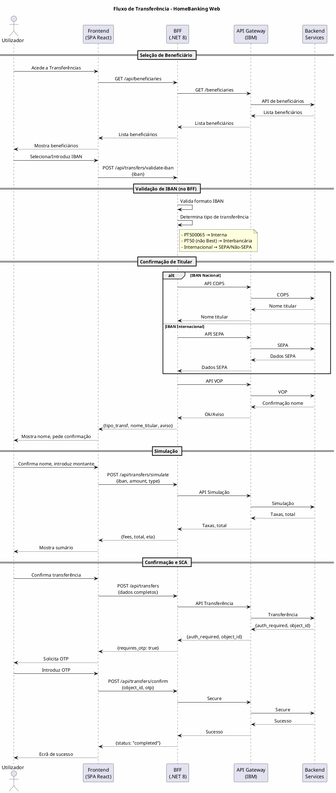

# TRANSFERENCIA_DIFF_TASK

## Resumo da Tarefa

Este documento descreve as alterações necessárias na documentação HLD do HomeBanking Web, resultantes da análise comparativa entre o diagrama de sequência enviado pelo cliente (`customer_sequences/TRANSFERENCIA.txt`) e a documentação existente.

---

## 1. Contexto

### 1.1 Origem

O cliente enviou um diagrama de sequência (`TRANSFERENCIA.txt`) que descreve o fluxo nativo da aplicação mobile para:
1. Login com biometria e OAuth 1.1
2. Transferência bancária completa

### 1.2 Análise Realizada

Foi feita uma análise comparativa que identificou:
- **Autenticação**: Bem coberta pelo HLD atual
- **Fluxo de Transferência**: Não documentado em detalhe
- **APIs de Operações**: Não catalogadas
- **Regras de Negócio**: Não documentadas

### 1.3 Decisões do Cliente

| Questão | Decisão |
|---------|---------|
| sasToken e "cofre" | Não aplicável ao canal web |
| Validação de IBAN | Será feita no BFF (inicialmente monolítico, futuramente microserviços) |
| Outros fluxos operacionais | Não existem diagramas adicionais no momento |
| API Backoffice de gestão | O BFF irá interagir com ela |

---

## 2. Tarefas a Executar

### 2.1 Tarefa 1: Criar Definição do Fluxo de Transferência

**Ficheiro a criar:** `definitions/DEF-05-fluxo-transferencia.md`

**Objetivo:** Documentar o fluxo completo de transferência bancária, baseado no diagrama do cliente.

**Conteúdo obrigatório:**

1. **Contexto** - Explicar que o fluxo foi extraído do diagrama da app mobile e será adaptado para o canal web

2. **Tipos de Transferência** - Documentar os 4 tipos:
   - Transferência Interna (IBAN PT500065 - Best)
   - Transferência Interbancária (IBAN PT50, não Best)
   - Transferência SEPA (IBAN internacional, zona SEPA)
   - Transferência Internacional não-SEPA (processo mais complexo)

3. **Diagrama de Sequência** - Criar diagrama PlantUML adaptado para arquitetura web:
   ```
   Utilizador → Frontend → BFF → API Gateway → Backend Services
   ```

4. **Fases do Fluxo:**
   - Seleção de método (IBAN, SPIN, MBway)
   - Seleção/criação de beneficiário
   - Validação de IBAN (no BFF)
   - Confirmação de titular (APIs COPS/VOP)
   - Introdução de montante
   - Simulação (taxas, total)
   - Sumário e confirmação
   - SCA (OTP)
   - Resultado

5. **Dados da Operação** - Documentar campos:
   ```
   home_account_number (conta origem)
   destination_iban
   destination_name
   amount
   description
   destination_email (opcional)
   destination_phone (opcional)
   transfer_type
   beneficiary_id (se existente)
   ```

6. **Resposta da API de Transferência:**
   ```json
   {
     "authentication": "1,2,3",
     "auth_seq": "136",
     "object_id": "1-4EEJB0"
   }
   ```

7. **Confirmação SCA:**
   ```json
   {
     "object_id": "1-4EEJB0",
     "auth_type": "3",
     "auth_value": "478946"
   }
   ```

8. **Decisões Arquiteturais:**
   - Validação de IBAN no BFF (não no frontend)
   - BFF inicialmente monolítico, preparado para evolução a microserviços
   - Frontend não acede diretamente a APIs de backend

**Referências a incluir:**
- SEC-03-visao-geral-solucao.md (diagrama de arquitetura)
- DEF-07-autenticacao-autorizacao.md (SCA/OTP)
- DEF-08-seguranca-conformidade.md (PSD2)
- customer_sequences/TRANSFERENCIA.txt (fonte original)

---

### 2.2 Tarefa 2: Criar Catálogo de APIs de Operações

**Ficheiro a criar:** `definitions/DEF-09-catalogo-apis-operacoes.md`

**Objetivo:** Catalogar as APIs identificadas no diagrama do cliente que serão consumidas pelo BFF.

**Conteúdo obrigatório:**

1. **Estrutura do Catálogo** - Para cada API:
   - Nome/Identificador
   - Endpoint (se conhecido)
   - Método HTTP
   - Descrição funcional
   - Request (estrutura)
   - Response (estrutura)
   - Observações

2. **APIs de Autenticação** (referência - já documentadas em DEF-05-autenticacao-oauth):
   | API | Função | Status |
   |-----|--------|--------|
   | Authentication_checkLogin (AUT_004) | Login inicial | Documentada |
   | Login secure | Validação OTP | Documentada |

3. **APIs de Consulta** (identificadas no diagrama):
   | API | Função |
   |-----|--------|
   | Client_getClientInformation | Dados do cliente |
   | Client_getClientContact | Contactos do cliente |
   | SIBS_getConsentStatus | Status consentimento PSD2 |
   | SIBS_getConsentAccount | Contas com consentimento PSD2 |
   | Objective_getClientObjectives | Avisos de objetivos |
   | Devices_getDevices | Dispositivos registados |
   | MIFID_getInvestorProfile | Perfil do investidor |
   | Schedule_getSchedules | Agendamentos |
   | Permanent_getPermanentOrders | Ordens permanentes |
   | CorpAction_getOngoingClosedCA | Operações corporativas |
   | Operation_getOperationConfirmation | Confirmação de operações |
   | Account_getMovements | Movimentos de contas |
   | Account_getAccounts | Lista de contas |
   | CCards_getCreditCards | Cartões de crédito |
   | DCards_getDebitCards | Cartões de débito |
   | Statement_getUserStatement | Património |
   | Message_getInboxMessage | Mensagens |

4. **APIs de Transferência** (identificadas no diagrama):
   | API | Função | Detalhes |
   |-----|--------|----------|
   | API de beneficiários | Lista beneficiários guardados | Request/Response a detalhar |
   | API COPS | Nome titular (IBAN Nacional) | Confirmation of Payee Service |
   | API SEPA | Validação IBAN internacional | Para zona SEPA |
   | API VOP | Confirma correspondência nome/IBAN | Verification of Payee |
   | API Simulação | Calcula taxas e valores | Request: montante, tipo; Response: taxas, total |
   | API Transferência | Executa a transferência | Ver DEF-05-fluxo-transferencia |
   | Secure (confirmação) | Confirma operação com OTP | object_id + auth_type + auth_value |

5. **Notas:**
   - Todas as APIs são acedidas via API Gateway
   - BFF é o único ponto de acesso do frontend
   - Detalhes de request/response devem ser obtidos da documentação técnica do cliente

**Referências:**
- DEF-09-integracao-interfaces.md (integrações existentes)
- DEF-05-autenticacao-oauth.md (APIs de autenticação)
- customer_sequences/TRANSFERENCIA.txt (fonte)

---

### 2.3 Tarefa 3: Criar Documento de Regras de Negócio

**Ficheiro a criar:** `definitions/DEF-02-regras-negocio-transferencias.md`

**Objetivo:** Documentar as regras de negócio identificadas para o fluxo de transferência.

**Conteúdo obrigatório:**

1. **Regras de Validação de IBAN:**

   | ID | Regra | Descrição | Implementação |
   |----|-------|-----------|---------------|
   | RN-IBAN-001 | Validação sintática | IBAN deve ser válido conforme ISO 13616 | BFF (biblioteca de validação) |
   | RN-IBAN-002 | IBAN Interno Best | Se IBAN começa por PT500065 → Transferência Interna | BFF |
   | RN-IBAN-003 | IBAN Nacional não-Best | Se IBAN começa por PT50 e não é Best → Transferência Interbancária | BFF |
   | RN-IBAN-004 | IBAN Internacional SEPA | Se IBAN não é PT e país está na zona SEPA → Transferência SEPA | BFF |
   | RN-IBAN-005 | IBAN Internacional não-SEPA | Se IBAN internacional fora da zona SEPA → Processo especial | BFF |

2. **Regras de Confirmação de Titular:**

   | ID | Regra | Descrição |
   |----|-------|-----------|
   | RN-TIT-001 | Verificação COPS | Para IBAN Nacional, obter nome do titular via API COPS |
   | RN-TIT-002 | Confirmação VOP | Utilizador deve confirmar se o nome corresponde ao esperado |
   | RN-TIT-003 | Aviso de divergência | Se VOP retorna divergência, apresentar aviso ao utilizador |

3. **Regras de Operação:**

   | ID | Regra | Descrição |
   |----|-------|-----------|
   | RN-OP-001 | Simulação obrigatória | Antes de confirmar, deve ser apresentada simulação com taxas |
   | RN-OP-002 | SCA obrigatório | Todas as transferências requerem OTP (PSD2) |
   | RN-OP-003 | Dynamic Linking | OTP está vinculado ao valor e beneficiário (PSD2) |

4. **Regras de UI/UX:**

   | ID | Regra | Descrição |
   |----|-------|-----------|
   | RN-UX-001 | Logo do banco | Exibir logo do banco destino baseado no IBAN |
   | RN-UX-002 | Bandeira país | Para IBAN internacional, exibir bandeira do país |

5. **Nota sobre Implementação:**
   - A validação de IBAN será implementada no BFF
   - O BFF é inicialmente monolítico mas a lógica deve estar isolada para futura extração como microserviço
   - O frontend não deve implementar lógica de negócio, apenas apresentação

**Referências:**
- DEF-05-fluxo-transferencia.md
- DEF-08-seguranca-conformidade.md (PSD2)
- ISO 13616 (IBAN standard)
- Lista de países SEPA

---

### 2.4 Tarefa 4: Atualizar Documentos Existentes

#### 2.4.1 Atualizar DEF-09-integracao-interfaces.md

**Objetivo:** Adicionar referência ao novo catálogo de APIs.

**Alteração:** Na secção de referências, adicionar:
```markdown
- [DEF-09-catalogo-apis-operacoes.md](DEF-09-catalogo-apis-operacoes.md) - Catálogo de APIs de operações
```

#### 2.4.2 Atualizar DEF-03-casos-uso-principais.md

**Objetivo:** Adicionar referência ao fluxo de transferência.

**Alteração:** Na secção de Casos de Uso Críticos, adicionar:
```markdown
> **Detalhes:** Ver [DEF-05-fluxo-transferencia.md](DEF-05-fluxo-transferencia.md) para fluxo completo de transferência.
```

#### 2.4.3 Atualizar SEC-03-visao-geral-solucao.md

**Objetivo:** Adicionar referência ao fluxo de transferência na secção 3.4.3.

**Alteração:** Na tabela de Casos de Uso Críticos (linha 253-258), adicionar coluna ou nota:
```markdown
| **Transferências** | Alta | SCA obrigatório, operação financeira core | [DEF-05-fluxo-transferencia](../definitions/DEF-05-fluxo-transferencia.md) |
```

---

## 3. Estrutura dos Novos Ficheiros

### 3.1 Frontmatter Padrão

Todos os novos ficheiros devem seguir o padrão de frontmatter existente:

```yaml
---
id: DEF-XX-nome-do-ficheiro
aliases:
  - Nome Legível
tags:
  - nextreality-novobanco-website-definitions
  - definitions
  - [tags específicas]
approved: false
created: 2026-01-21
hubs:
  - "[[nextreality]]"
para-code: R
reviewed: false
status: draft
---
```

### 3.2 Estrutura de Secções

Seguir a estrutura padrão dos documentos existentes:
1. Título (# DEF-XX: Nome)
2. Referência à secção relacionada
3. Contexto
4. Conteúdo principal
5. Decisões (se aplicável)
6. Restrições Conhecidas
7. Referências

---

## 4. Diagramas PlantUML

### 4.1 Diagrama Principal do Fluxo de Transferência

Usar este diagrama como base para DEF-05-fluxo-transferencia.md:



---

## 5. Validação

Após completar as tarefas, verificar:

1. [ ] DEF-05-fluxo-transferencia.md criado e completo
2. [ ] DEF-09-catalogo-apis-operacoes.md criado e completo
3. [ ] DEF-02-regras-negocio-transferencias.md criado e completo
4. [ ] DEF-09-integracao-interfaces.md atualizado com referência
5. [ ] DEF-03-casos-uso-principais.md atualizado com referência
6. [ ] SEC-03-visao-geral-solucao.md atualizado com referência
7. [ ] Todos os diagramas PlantUML válidos
8. [ ] Frontmatter correto em todos os ficheiros
9. [ ] Referências cruzadas funcionais

---

## 6. Ficheiro Fonte

O diagrama original do cliente está em: `customer_sequences/TRANSFERENCIA.txt`

Este ficheiro contém a notação de diagrama de sequência que foi analisada para extrair os fluxos e APIs documentados nesta tarefa.

---

## 7. Notas Finais

- Este documento pode ser eliminado após a conclusão das tarefas
- As decisões documentadas foram validadas com o cliente em 2026-01-21
- O BFF será inicialmente monolítico mas a arquitetura deve permitir evolução para microserviços
- O sasToken e conceito de "cofre" da app mobile não se aplicam ao canal web
