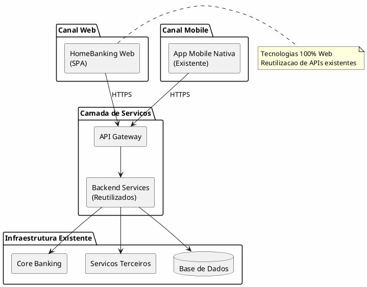

---
aliases:
  - Sumario Executivo
tags:
  - nextreality-novobanco-website-sections
  - sections
  - executive-summary
approved: true
created: 2026-01-01
hubs:
  - "[[nextreality]]"
para-code: R
reviewed: true
status: in-progress
---

# 1. Sumario Executivo

> **Definicoes requeridas:**
> - [DEF-01-objetivos-documento.md](../definitions/DEF-01-objetivos-documento.md) - Status: completed
>
> **Decisoes relacionadas:**
> - Nenhuma decisao arquitetural nesta secao (decisoes de documento/escopo)

## Proposito

Este documento constitui o workbook de arquitetura High Level Design (HLD) para o projeto HomeBanking Web do Novo Banco, definindo as componentes criticas da aplicacao e sua implementacao em tecnologias 100% Web.

## Conteudo

### 1.1 Objetivos do Documento

Este documento de arquitetura tem como objetivo:

1. **Definir o cerne do projeto** - Estabelecer as bases tecnologicas, arquitetura de infraestrutura e de software
2. **Documentar processos** - Seguranca, desenvolvimento e operacoes
3. **Servir como baseline** - Referencia para auditoria e compliance regulatorio
4. **Orientar decisoes** - Suportar decisoes de Seguranca, Casos de Uso e Compliance

O nivel de detalhe adotado e **HLD (High Level Design)**, evitando solucoes dubias enquanto permite flexibilidade para detalhamento posterior atraves de documentos LLD (Low Level Design).

### 1.2 Publico-Alvo

| Perfil | Responsabilidade |
|--------|------------------|
| Arquitetos de Software | Definicao e validacao da arquitetura tecnica |
| Desenvolvedores | Implementacao seguindo as diretrizes definidas |
| Gerentes de Projeto | Gestao e acompanhamento do projeto |

### 1.3 Escopo

#### 1.3.1 In-Scope

O HomeBanking Web incluira **35 funcionalidades** da aplicacao mobile, organizadas nas seguintes categorias:

| Categoria | Funcionalidades |
|-----------|-----------------|
| **Autenticacao** | Registo, Login, Recuperacao de Acessos |
| **Areas Principais** | Home, Area Pessoal, Dashboard |
| **Patrimonio** | Patrimonio, Carteiras, Saldos e Movimentos |
| **Operacoes** | Ordens Pendentes, Historico de Operacoes, Confirmacao de Operacoes |
| **Documentos** | Comprovativos e Extratos |
| **Investimentos** | Warrants, Acoes, ETF, Fundos, Obrigacoes, Indices, Temas Investimento, Deposito a Prazo, Leiloes, Ofertas Publicas, Unit Linked, Robot Advisor, BTP |
| **Pagamentos** | Transferencias, Pagamentos, Carregamentos, MBWay (componentes nao-SDK) |
| **Outros** | Outros Bancos, Eventos Corporativos, Seguros de Protecao, Area do Viajante, Bea, Wishlist, Noticias Externas |

#### 1.3.2 Out-of-Scope

| Funcionalidade | Justificacao |
|----------------|--------------|
| MBWay SDK | Componentes nativos do SDK sao especificos para aplicacoes mobile nativas e nao compativeis com ambiente web |

### 1.4 Visao Geral da Arquitetura

**Principios Fundamentais:**
- Reutilizacao da infraestrutura e servicos da aplicacao mobile nativa existente
- Tecnologias 100% Web (sem dependencias de componentes nativos)
- Conformidade com regulamentacoes bancarias portuguesas

### 1.5 Principios Orientadores

| Principio | Descricao |
|-----------|-----------|
| **Reutilizacao** | Maximizar uso de APIs e servicos existentes da app mobile |
| **Seguranca** | Conformidade com regulamentacoes bancarias e PSD2 |
| **Paridade Funcional** | Experiencia consistente entre canais web e mobile |
| **Auditabilidade** | Suporte a requisitos de compliance e auditoria |
| **Escalabilidade** | Arquitetura preparada para crescimento |

## Diagramas

Ver diagrama conceptual na seccao 1.4.

## Entregaveis

- [x] Declaracao clara dos objetivos do documento
- [x] Identificacao do publico-alvo
- [x] Definicao do escopo (in-scope e out-of-scope)
- [x] Diagrama conceptual de alto nivel
- [x] Lista de principios arquiteturais

## Definicoes Utilizadas

- [x] [DEF-01-objetivos-documento.md](../definitions/DEF-01-objetivos-documento.md) - Status: completed

## Decisoes Referenciadas

_Nenhuma decisao arquitetural nesta secao. As decisoes documentadas em DEF-01 sao decisoes de documento (objetivo, publico-alvo, nivel de detalhe) e escopo, nao decisoes arquiteturais que requeiram ADRs._

## Perguntas para o Usuario

_Todas as perguntas desta secao foram respondidas._
