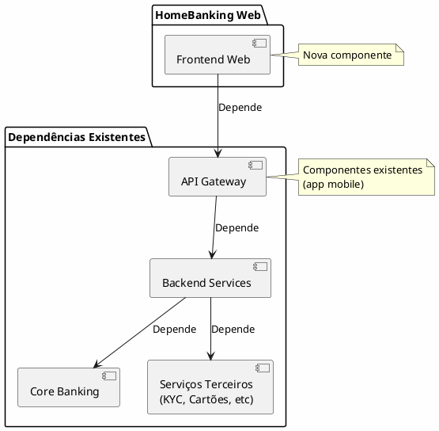

---
aliases:
  - Contexto de Negócio e Requisitos
tags:
  - nextreality-novobanco-website-sections
  - sections
  - business-context
  - requirements
approved: true
created: 2026-01-01
hubs:
  - "[[nextreality]]"
para-code: R
reviewed: true
status: in-progress
---

# 2. Contexto de Negócio & Requisitos

> **Definições requeridas:**
> - [DEF-02-stakeholders.md](../definitions/DEF-02-stakeholders.md) - Status: completed
> - [DEF-02-requisitos-funcionais.md](../definitions/DEF-02-requisitos-funcionais.md) - Status: completed
> - [DEF-02-requisitos-nao-funcionais.md](../definitions/DEF-02-requisitos-nao-funcionais.md) - Status: completed
>
> **Decisões relacionadas:**
> - Nenhuma decisão arquitetural nesta secção (requisitos e contexto de negócio)

## Propósito

Descrever o contexto da solução HomeBanking Web, suas partes interessadas, requisitos funcionais e não funcionais, restrições e dependências.

## Conteúdo

### 2.1 Contexto de Negócio

O projeto HomeBanking Web visa disponibilizar aos clientes do Novo Banco uma plataforma web com funcionalidades equivalentes à aplicação mobile nativa existente. A solução reutilizará a infraestrutura e serviços já criados para a app mobile.

**Drivers de Negócio:**
- Oferecer canal alternativo ao mobile para clientes que preferem acesso via browser
- Paridade funcional entre canais para experiência consistente
- Reutilização de investimentos já realizados na infraestrutura mobile

### 2.2 Partes Interessadas (Stakeholders)

| Papel | Responsabilidade | Contacto/Status |
|-------|------------------|-----------------|
| Sponsor | Patrocinador executivo do projeto | Fórum designado pelo Banco Best |
| Product Owner | Definição de requisitos e priorização | A definir no início do projeto |
| Arquiteto NovoBanco | Validação técnica e integração com sistemas existentes | A definir no início do projeto |
| Equipa Segurança | Validação de conformidade e segurança | A definir no início do projeto |
| Equipa Infraestrutura | Suporte Azure e ambientes | A definir no início do projeto |
| Equipa Core Banking | Integração com APIs do Core | A definir no início do projeto |
| Equipa Mobile | Coordenação com app nativa existente | A definir no início do projeto |
| DPO (Data Protection Officer) | Conformidade RGPD | A definir no início do projeto |
| Utilizadores Finais | Clientes do Novo Banco | N/A |

**Notas:**
- O sponsor é o fórum designado pelo Banco Best, podendo ser alterado conforme necessidade
- As equipas técnicas serão definidas no início da execução do projeto
- O projeto não envolve diretamente entidades externas (reguladores, parceiros, fornecedores). As integrações com terceiros são as já existentes na app mobile

### 2.3 Requisitos Funcionais

#### 2.3.1 Funcionalidades por Categoria

| Categoria | Funcionalidades | Quantidade |
|-----------|-----------------|------------|
| **Autenticação** | Registo, Login, Recuperação de Acessos | 3 |
| **Áreas Principais** | Home, Área Pessoal, Dashboard | 3 |
| **Património** | Património, Carteiras, Saldos e Movimentos | 3 |
| **Operações** | Ordens Pendentes, Histórico de Operações, Confirmação de Operações | 3 |
| **Documentos** | Comprovativos e Extratos | 2 |
| **Investimentos** | Warrants, Ações, ETF, Fundos, Obrigações, Índices, Temas Investimento, Depósito a Prazo, Leilões, Ofertas Públicas, Unit Linked, Robot Advisor, BTP | 13 |
| **Pagamentos** | Transferências, Pagamentos, Carregamentos, MBWay (não-SDK) | 4 |
| **Outros** | Outros Bancos, Eventos Corporativos, Seguros de Proteção, Área do Viajante, Bea, Wishlist, Notícias Externas | 7 |
| **TOTAL** | | **35** |

#### 2.3.2 Estratégia de Priorização

- **Critério:** Priorização por dependência entre funcionalidades
- **MVP:** Todas as 35 funcionalidades fazem parte do MVP
- **Funcionalidades Exclusivas Web:** Nenhuma (paridade com mobile)

#### 2.3.3 Suporte Multi-idioma

| Idioma | Prioridade |
|--------|------------|
| Português | Principal |
| Inglês | Secundário |
| Espanhol | Secundário |

#### 2.3.4 Acessibilidade

- **Status:** _A definir_ - Requer aprofundamento
- **Referência:** WCAG 2.1 AA (a considerar)

### 2.4 Requisitos Não Funcionais

#### 2.4.1 Performance

| Métrica | Valor | Observação |
|---------|-------|------------|
| Tempo resposta operações críticas | max 3 segundos | Transações, consultas |
| Throughput | 10 TPS | Transações por segundo |
| Tempo carregamento página inicial | max 10 segundos | First Contentful Paint |

#### 2.4.2 Disponibilidade

| Métrica | Valor | Observação |
|---------|-------|------------|
| SLA Disponibilidade | 99.9% | ~8.76 horas downtime/ano |
| RTO | 30 minutos | Recovery Time Objective |
| RPO | 5 minutos | Recovery Point Objective |
| Janelas Manutenção | Sim | Programadas |

#### 2.4.3 Escalabilidade

| Métrica | Valor | Observação |
|---------|-------|------------|
| Utilizadores concorrentes | 400 | Baseline |
| Crescimento anual | 5% | Projeção 3 anos |
| Picos de utilização | Sim | Fim de mês, períodos fiscais |

#### 2.4.4 Segurança

| Requisito | Status | Observação |
|-----------|--------|------------|
| Certificações | _A definir_ | ISO 27001, PCI-DSS a considerar |
| Encriptação | _A definir_ | TLS 1.3, AES-256 a considerar |
| Retenção de logs | _A definir_ | 7 anos (típico bancário) a validar |

#### 2.4.5 Compatibilidade

| Requisito | Especificação |
|-----------|---------------|
| Browsers | Chrome, Edge, Safari (versões atuais + 2 anteriores) |
| Responsividade | Design responsivo obrigatório |
| Dispositivos móveis | Suporte via design responsivo |

### 2.5 Restrições

| Tipo | Restrição | Impacto |
|------|-----------|---------|
| **Técnica** | Reutilização de APIs e serviços da app mobile | Define integração com backend existente |
| **Técnica** | Tecnologias 100% Web (sem componentes nativos) | MBWay SDK out-of-scope |
| **Regulatória** | Conformidade PSD2 | Autenticação forte (SCA) obrigatória |
| **Regulatória** | Regulamentações Banco de Portugal | Requisitos de segurança e auditoria |

### 2.6 Pressupostos

| ID | Pressuposto | Validado |
|----|-------------|----------|
| P1 | APIs da app mobile estão disponíveis e documentadas | A validar |
| P2 | Infraestrutura existente suporta canal web adicional | A validar |
| P3 | Requisitos de segurança são os mesmos da app mobile | A validar |
| P4 | Não há necessidade de novas integrações com terceiros | Sim |

### 2.7 Dependências

| Dependência | Tipo | Crítica |
|-------------|------|---------|
| API Gateway | Infraestrutura existente | Sim |
| Backend Services | Serviços existentes | Sim |
| Core Banking | Sistema legado | Sim |
| Serviços Terceiros | Integrações existentes | Sim |

## Entregáveis

- [x] Descrição do contexto de negócio
- [x] Matriz de stakeholders com papéis e responsabilidades (contactos a definir no início do projeto)
- [x] Lista priorizada de requisitos funcionais
- [x] Lista de requisitos não funcionais com métricas
- [x] Documentação de restrições técnicas e de negócio
- [x] Lista de pressupostos validados
- [x] Mapa de dependências

## Definições Utilizadas

- [x] [DEF-02-stakeholders.md](../definitions/DEF-02-stakeholders.md) - Status: completed (contactos a definir no início do projeto)
- [x] [DEF-02-requisitos-funcionais.md](../definitions/DEF-02-requisitos-funcionais.md) - Status: completed
- [x] [DEF-02-requisitos-nao-funcionais.md](../definitions/DEF-02-requisitos-nao-funcionais.md) - Status: completed

## Decisões Referenciadas

_Nenhuma decisão arquitetural nesta secção. Esta secção documenta contexto de negócio, requisitos funcionais e não funcionais, que são inputs para decisões arquiteturais nas secções seguintes._

## Itens Pendentes

Os seguintes itens requerem informação adicional:

| Item | Documento | Responsável |
|------|-----------|-------------|
| Contactos dos stakeholders | DEF-02-stakeholders | A definir no início do projeto |
| Requisitos de Acessibilidade WCAG | DEF-04-design-system | Equipa UX |
| Certificações de Segurança | DEF-02-requisitos-nao-funcionais | Área de Segurança |
| Requisitos de Encriptação | DEF-02-requisitos-nao-funcionais | Área de Segurança |
| Política de Retenção de Logs | DEF-02-requisitos-nao-funcionais | Compliance |
