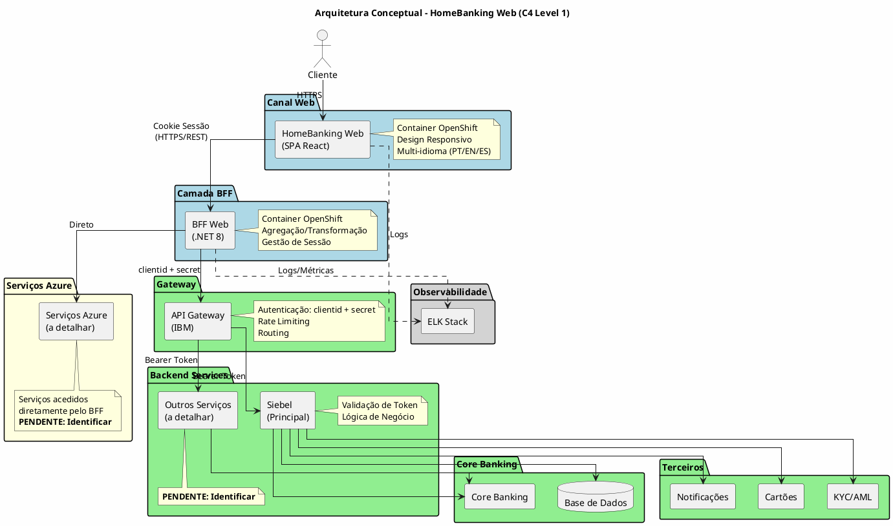
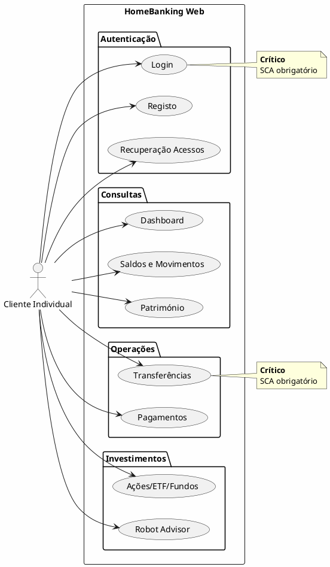

---
aliases:
  - Visão Geral da Solução
tags:
  - nextreality-novobanco-website-sections
  - sections
  - solution-overview
  - architecture
approved: true
created: 2026-01-01
hubs:
  - "[[nextreality]]"
para-code: R
reviewed: true
status: in-progress
---

# 3. Visão Geral da Solução

## Definições e Decisões

> **Definições requeridas:**
> - [DEF-03-principios-arquitetura.md](../definitions/DEF-03-principios-arquitetura.md) - Status: completed
> - [DEF-03-casos-uso-principais.md](../definitions/DEF-03-casos-uso-principais.md) - Status: completed
>
> **Decisões relacionadas:**
> - [DEC-006-estrategia-containers-openshift.md](../decisions/DEC-006-estrategia-containers-openshift.md) - Status: accepted
> - [DEC-007-padrao-bff.md](../decisions/DEC-007-padrao-bff.md) - Status: accepted
> - [DEC-008-stack-observabilidade-elk.md](../decisions/DEC-008-stack-observabilidade-elk.md) - Status: accepted
> - [DEC-011-diagrama-arquitetura-unico.md](../decisions/DEC-011-diagrama-arquitetura-unico.md) - Status: accepted

## Propósito

Apresentar os princípios de arquitetura, diagrama conceptual e casos de uso principais da solução HomeBanking Web.

## Conteúdo

### 3.1 Princípios de Arquitetura

| Princípio | Decisão | Descrição |
|-----------|---------|-----------|
| **Cloud Strategy** | Containers OpenShift | Arquitetura orientada a containers, assente em OpenShift |
| **API Strategy** | BFF (Backend for Frontend) | Camada de agregação específica para o canal web, isolando sistemas legados |
| **Build vs Buy** | Preferência Build | Avaliação caso a caso, construir quando soluções de mercado forem caras ou inadequadas |
| **Acoplamento Legados** | Via BFF apenas | Frontend isolado de complexidades dos sistemas legados |
| **Observabilidade** | Stack ELK | Logs de aplicação e métricas centralizados |
| **Segurança** | _A definir_ | Avaliar Zero Trust e Defense in Depth |
| **Resiliência** | _A definir_ | Necessita aprofundamento |
| **Portabilidade** | _A definir_ | Necessita aprofundamento |

### 3.2 Diagrama Conceptual

> **Nota:** Este é o diagrama de referência principal da arquitetura. Todas as outras secções devem referenciar este diagrama em vez de duplicá-lo (ver [DEC-011](../decisions/DEC-011-diagrama-arquitetura-unico.md)).

#### Legenda

| Cor | Significado |
|-----|-------------|
| Azul | Componentes novos (a desenvolver) |
| Verde | Componentes existentes (reutilizar) |
| Amarelo | Componentes a detalhar (pendente) |
| Cinza | Infraestrutura transversal |

#### Fluxo de Autenticação

| Origem | Destino | Mecanismo |
|--------|---------|-----------|
| Frontend Web | BFF | Cookie de Sessão (HttpOnly, Secure) |
| BFF | API Gateway | ClientID + ClientSecret |
| API Gateway | Backend Services | Bearer Token (propagado) |
| Siebel | - | **Validação do Token** |

#### Pendências de Detalhe

| Item | Descrição | Responsável |
|------|-----------|-------------|
| Serviços Azure | Identificar quais serviços Azure são acedidos diretamente pelo BFF | NovoBanco |
| Outros Backend Services | Identificar serviços além do Siebel | NovoBanco |

### 3.3 Componentes Principais

| Componente | Tipo | Responsabilidade | Tecnologia |
|------------|------|------------------|------------|
| **HomeBanking Web** | Frontend SPA | Interface do utilizador, experiência web responsiva | _A definir (SEC-04)_ |
| **BFF Web** | Backend | Agregação, transformação, orquestração para canal web | _A definir (SEC-05)_ |
| **API Gateway** | Infraestrutura | Roteamento, rate limiting, autenticação | Existente |
| **Backend Services** | Serviços | Lógica de negócio, integrações | Existente |
| **ELK Stack** | Observabilidade | Logs centralizados, métricas, dashboards | Existente |

### 3.4 Casos de Uso Principais

#### 3.4.1 Atores

| Ator                | Descrição                        | Prioridade |
| ------------------- | -------------------------------- | ---------- |
| Cliente Individual  | Cliente particular do Novo Banco | Principal  |
| Cliente Empresarial | _Futuro_                         | Secundário |

#### 3.4.2 Casos de Uso por Categoria

#### 3.4.3 Casos de Uso Críticos

| Caso de Uso | Criticidade | Requisitos Especiais |
|-------------|-------------|----------------------|
| **Login** | Alta | SCA obrigatório, ponto de entrada |
| **Transferências** | Alta | SCA obrigatório, operação financeira core |

#### 3.4.4 Requisitos de Autenticação

- **SCA (Strong Customer Authentication):** Obrigatório para todo o acesso à aplicação
- **Conformidade:** PSD2

### 3.5 Integração com Infraestrutura Existente

> **Diagrama:** Ver secção 3.2 (Diagrama Conceptual) para a visão completa da arquitetura.

A integração segue o modelo definido no diagrama de referência (secção 3.2), com clara separação entre componentes novos e existentes:

| Componente | Origem | Ação | Observação |
|------------|--------|------|------------|
| Frontend Web (SPA React) | Novo | Desenvolver | Container OpenShift |
| BFF Web (.NET 8) | Novo | Desenvolver | Container OpenShift |
| API Gateway (IBM) | Existente | Reutilizar | Autenticação clientid+secret |
| Siebel | Existente | Reutilizar | Backend principal, valida token |
| Outros Backend Services | Existente | Reutilizar | A identificar |
| Core Banking | Existente | Reutilizar | Via Siebel |
| Serviços Azure | Existente | Reutilizar | Acesso direto pelo BFF |
| Integrações Terceiros | Existente | Reutilizar | KYC/AML, Cartões, Notificações |
| Base de Dados | Existente | Reutilizar | Via Backend Services |
| ELK Stack | Existente | Reutilizar | Logs e métricas |

## Entregáveis

- [x] Lista de princípios arquiteturais documentados
- [x] Diagrama conceptual de alto nível (C4 Level 1)
- [x] Descrição dos componentes principais
- [x] Diagrama de casos de uso
- [x] Mapeamento de integração com sistemas existentes

## Definições Utilizadas

- [x] [DEF-03-principios-arquitetura.md](../definitions/DEF-03-principios-arquitetura.md) - Status: completed
- [x] [DEF-03-casos-uso-principais.md](../definitions/DEF-03-casos-uso-principais.md) - Status: completed

## Decisões Referenciadas

- [x] [DEC-006-estrategia-containers-openshift.md](../decisions/DEC-006-estrategia-containers-openshift.md) - Status: accepted
- [x] [DEC-007-padrao-bff.md](../decisions/DEC-007-padrao-bff.md) - Status: accepted
- [x] [DEC-008-stack-observabilidade-elk.md](../decisions/DEC-008-stack-observabilidade-elk.md) - Status: accepted

## Itens Pendentes

| Item | Documento | Responsável |
|------|-----------|-------------|
| Princípios de Segurança (Zero Trust, Defense in Depth) | DEF-03-principios-arquitetura | Área de Segurança |
| Estratégia de Resiliência | DEF-03-principios-arquitetura | Arquitetura |
| Requisitos de Portabilidade | DEF-03-principios-arquitetura | Arquitetura |
| Casos de Uso com Terceiros | DEF-03-casos-uso-principais | Integração |
| Requisitos Offline | DEF-03-casos-uso-principais | Arquitetura |
