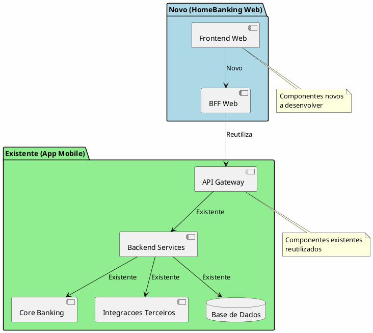

---
aliases:
  - Visao Geral da Solucao
tags:
  - nextreality-novobanco-website-sections
  - sections
  - solution-overview
  - architecture
approved: true
created: 2026-01-01
hubs:
  - "[[nextreality]]"
para-code: R
reviewed: true
status: in-progress
---

# 3. Visao Geral da Solucao

> **Definicoes requeridas:**
> - [DEF-03-principios-arquitetura.md](../definitions/DEF-03-principios-arquitetura.md) - Status: completed
> - [DEF-03-casos-uso-principais.md](../definitions/DEF-03-casos-uso-principais.md) - Status: completed
>
> **Decisoes relacionadas:**
> - [DEC-006-estrategia-containers-openshift.md](../decisions/DEC-006-estrategia-containers-openshift.md) - Status: accepted
> - [DEC-007-padrao-bff.md](../decisions/DEC-007-padrao-bff.md) - Status: accepted
> - [DEC-008-stack-observabilidade-elk.md](../decisions/DEC-008-stack-observabilidade-elk.md) - Status: accepted

## Proposito

Apresentar os principios de arquitetura, diagrama conceptual e casos de uso principais da solucao HomeBanking Web.

## Conteudo

### 3.1 Principios de Arquitetura

| Principio | Decisao | Descricao |
|-----------|---------|-----------|
| **Cloud Strategy** | Containers OpenShift | Arquitetura orientada a containers, compliant com OpenShift |
| **API Strategy** | BFF (Backend for Frontend) | Camada de agregacao especifica para o canal web, isolando sistemas legados |
| **Build vs Buy** | Preferencia Build | Avaliacao caso a caso, construir quando solucoes de mercado forem caras ou inadequadas |
| **Acoplamento Legados** | Via BFF apenas | Frontend isolado de complexidades dos sistemas legados |
| **Observabilidade** | Stack ELK | Logs de aplicacao e metricas centralizados |
| **Seguranca** | _A definir_ | Avaliar Zero Trust e Defense in Depth |
| **Resiliencia** | _A definir_ | Necessita aprofundamento |
| **Portabilidade** | _A definir_ | Necessita aprofundamento |

### 3.2 Diagrama Conceptual

### 3.3 Componentes Principais

| Componente | Tipo | Responsabilidade | Tecnologia |
|------------|------|------------------|------------|
| **HomeBanking Web** | Frontend SPA | Interface do utilizador, experiencia web responsiva | _A definir (SEC-04)_ |
| **BFF Web** | Backend | Agregacao, transformacao, orquestracao para canal web | _A definir (SEC-05)_ |
| **API Gateway** | Infraestrutura | Roteamento, rate limiting, autenticacao | Existente |
| **Backend Services** | Servicos | Logica de negocio, integracoes | Existente |
| **ELK Stack** | Observabilidade | Logs centralizados, metricas, dashboards | Existente |

### 3.4 Casos de Uso Principais

#### 3.4.1 Atores

| Ator                | Descricao                        | Prioridade |
| ------------------- | -------------------------------- | ---------- |
| Cliente Individual  | Cliente particular do Novo Banco | Principal  |
| Cliente Empresarial | _Futuro_                         | Secundario |

#### 3.4.2 Casos de Uso por Categoria

#### 3.4.3 Casos de Uso Criticos

| Caso de Uso | Criticidade | Requisitos Especiais |
|-------------|-------------|----------------------|
| **Login** | Alta | SCA obrigatorio, ponto de entrada |
| **Transferencias** | Alta | SCA obrigatorio, operacao financeira core |

#### 3.4.4 Requisitos de Autenticacao

- **SCA (Strong Customer Authentication):** Obrigatorio para todo o acesso a aplicacao
- **Conformidade:** PSD2

### 3.5 Integracao com Infraestrutura Existente

| Componente | Origem | Acao |
|------------|--------|------|
| Frontend Web | Novo | Desenvolver |
| BFF Web | Novo | Desenvolver |
| API Gateway | Existente | Reutilizar |
| Backend Services | Existente | Reutilizar |
| Core Banking | Existente | Reutilizar |
| Integracoes Terceiros | Existente | Reutilizar |
| Base de Dados | Existente | Reutilizar |

## Entregaveis

- [x] Lista de principios arquiteturais documentados
- [x] Diagrama conceptual de alto nivel (C4 Level 1)
- [x] Descricao dos componentes principais
- [x] Diagrama de casos de uso
- [x] Mapeamento de integracao com sistemas existentes

## Definicoes Utilizadas

- [x] [DEF-03-principios-arquitetura.md](../definitions/DEF-03-principios-arquitetura.md) - Status: completed
- [x] [DEF-03-casos-uso-principais.md](../definitions/DEF-03-casos-uso-principais.md) - Status: completed

## Decisoes Referenciadas

- [x] [DEC-006-estrategia-containers-openshift.md](../decisions/DEC-006-estrategia-containers-openshift.md) - Status: accepted
- [x] [DEC-007-padrao-bff.md](../decisions/DEC-007-padrao-bff.md) - Status: accepted
- [x] [DEC-008-stack-observabilidade-elk.md](../decisions/DEC-008-stack-observabilidade-elk.md) - Status: accepted

## Itens Pendentes

| Item | Documento | Responsavel |
|------|-----------|-------------|
| Principios de Seguranca (Zero Trust, Defense in Depth) | DEF-03-principios-arquitetura | Area de Seguranca |
| Estrategia de Resiliencia | DEF-03-principios-arquitetura | Arquitetura |
| Requisitos de Portabilidade | DEF-03-principios-arquitetura | Arquitetura |
| Casos de Uso com Terceiros | DEF-03-casos-uso-principais | Integracao |
| Requisitos Offline | DEF-03-casos-uso-principais | Arquitetura |
