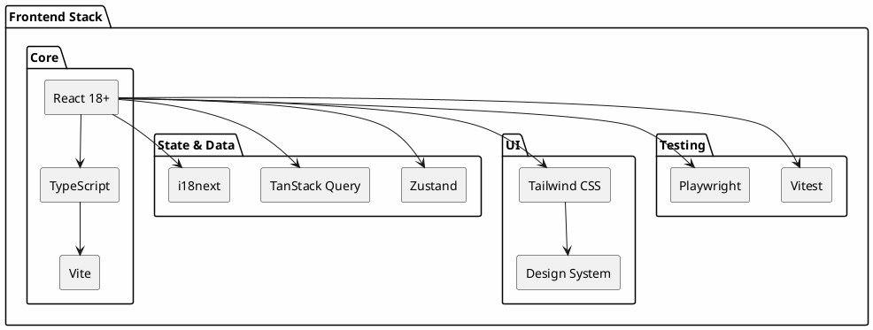
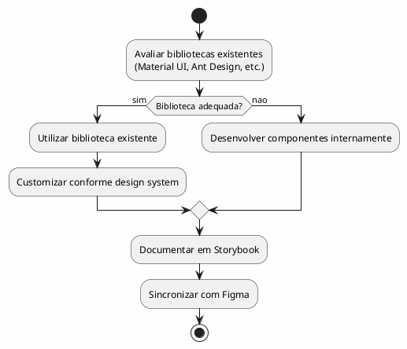

---
aliases:
  - Experiencia do Utilizador e Arquitetura Frontend
tags:
  - nextreality-novobanco-website-sections
  - sections
  - frontend
  - ux
  - ui
approved: true
created: 2026-01-03
hubs:
  - "[[nextreality]]"
para-code: R
reviewed: true
status: in-progress
---

# 4. Experiencia do Utilizador & Arquitetura Frontend

> **Definicoes requeridas:**
> - [DEF-04-stack-frontend.md](../definitions/DEF-04-stack-frontend.md) - Status: completed
> - [DEF-04-design-system.md](../definitions/DEF-04-design-system.md) - Status: completed
> - [DEF-04-ux-guidelines.md](../definitions/DEF-04-ux-guidelines.md) - Status: completed
>
> **Decisoes relacionadas:**
> - [DEC-009-stack-tecnologica-frontend.md](../decisions/DEC-009-stack-tecnologica-frontend.md) - Status: accepted

## Proposito

Definir a arquitetura de informacao, diretrizes UI/UX, stack tecnologica frontend, design system, responsividade, seguranca e performance do canal web HomeBanking.

## Conteudo

### 4.1 Arquitetura de Informacao

#### 4.1.1 Estrutura de Navegacao

| Elemento | Decisao | Justificacao |
|----------|---------|--------------|
| Navegacao Principal | SideBar | Padrao para aplicacoes web complexas |
| Navegacao Secundaria | Breadcrumbs | Localizacao rapida, navegacao contextual |
| Navegacao Contextual | Dependente da origem | Fluxos podem variar conforme ponto de entrada |

### 4.2 Diretrizes UI/UX

#### 4.2.1 Principios de Design

| Principio | Descricao |
|-----------|-----------|
| **Paridade Mobile** | Fluxos da app mobile replicados na web |
| **Responsividade** | Design responsivo para todos os dispositivos |
| **Feedback Imediato** | Skeleton screens para percepcao de responsividade 100% |
| **Clareza** | Separacao clara entre informacao e acao requerida |

#### 4.2.2 Padroes de Feedback

| Tipo | Uso | Exemplo |
|------|-----|---------|
| **Toasts** | Avisos nao bloqueantes | "Transferencia realizada com sucesso" |
| **Modais** | Avisos que requerem resposta | "Confirmar operacao?" |
| **Skeleton Screens** | Loading states | Carregamento de listas, dashboards |

### 4.3 Jornadas do Utilizador

#### 4.3.1 Atores

| Ator | Prioridade | Observacao |
|------|------------|------------|
| Cliente Individual | Principal | Foco inicial |
| Cliente Empresarial | Futuro | Fase posterior |

#### 4.3.2 Jornadas Prioritarias

As jornadas serao baseadas nos 35 requisitos funcionais definidos, com foco em:

| Categoria | Jornadas | Criticidade |
|-----------|----------|-------------|
| **Autenticacao** | Login, Registo, Recuperacao | Alta (SCA obrigatorio) |
| **Operacoes Financeiras** | Transferencias, Pagamentos | Alta |
| **Consultas** | Dashboard, Saldos, Patrimonio | Media |
| **Investimentos** | Acoes, ETF, Fundos, Robot Advisor | Media |

### 4.4 Multi-idioma

| Idioma | Prioridade | Cobertura |
|--------|------------|-----------|
| Portugues | Principal | 100% |
| Ingles | Secundario | 100% |
| Espanhol | Secundario | 100% |

**Implementacao:**
- Biblioteca: **i18next** com react-i18next
- Namespaces para lazy loading de traducoes
- Detecao automatica de idioma do browser
- Persistencia de preferencia do utilizador

### 4.5 PWA & Offline

| Requisito | Status | Observacao |
|-----------|--------|------------|
| PWA Instalavel | _A definir_ | Necessita aprofundamento |
| Funcionamento Offline | _A definir_ | Necessita aprofundamento |
| Service Workers | _A definir_ | Para cache de assets |

### 4.6 Stack Frontend

#### 4.6.1 Stack Tecnologica

| Camada | Tecnologia | Versao |
|--------|------------|--------|
| **Framework** | React | 18+ (mais atual) |
| **Linguagem** | TypeScript | Latest |
| **Build Tool** | Vite | Latest |
| **State Management** | Zustand | Latest |
| **Data Fetching** | TanStack Query | Latest |
| **Styling** | Tailwind CSS | Latest |
| **i18n** | i18next | Latest |
| **Testes Unitarios** | Vitest | Latest |
| **Testes E2E** | Playwright | Latest |

#### 4.6.2 Rendering Strategy

| Estrategia | Uso | Exemplo |
|------------|-----|---------|
| **SSG** | Paginas estaticas | Landing, FAQ |
| **SSR** | Dados dinamicos | Dashboard, Saldos |
| **ISR** | Conteudo semi-estatico | Noticias, Indices |

**Justificacao:** Protecao de client_secret no fluxo de login, performance otimizada.

#### 4.6.3 Code Splitting

- **Estrategia:** Code splitting por rotas usando React.Lazy
- **Beneficio:** Bundle size otimizado, carregamento sob demanda

### 4.7 Design System

#### 4.7.1 Visao Geral

| Aspecto | Decisao |
|---------|---------|
| **Base** | Criado de raiz para o projeto |
| **Componentes** | Avaliacao de bibliotecas existentes, fallback para desenvolvimento interno |
| **Documentacao** | Figma (design) + Storybook (desenvolvimento) |
| **Temas** | Suporte a modo escuro |

#### 4.7.2 Tokens de Design

| Token | Status | Observacao |
|-------|--------|------------|
| Cores | A definir | Inicio do desenvolvimento |
| Tipografia | A definir | Inicio do desenvolvimento |
| Espacamentos | A definir | Inicio do desenvolvimento |
| Sombras | A definir | Inicio do desenvolvimento |

#### 4.7.3 Biblioteca de Componentes

### 4.8 Responsividade

| Requisito | Especificacao |
|-----------|---------------|
| **Design** | Mobile-first responsive |
| **Breakpoints** | sm, md, lg, xl (Tailwind defaults) |
| **Browsers** | Chrome, Edge, Safari (atuais + 2 anteriores) |
| **Dispositivos** | Desktop, Tablet, Mobile |

### 4.9 Seguranca Frontend

| Controlo | Implementacao |
|----------|---------------|
| **XSS Prevention** | React escaping automatico, CSP headers |
| **CSRF** | Tokens CSRF via BFF |
| **Sensitive Data** | Nao armazenar em localStorage/sessionStorage |
| **Auth Tokens** | HttpOnly cookies (geridos pelo BFF) |
| **SCA** | Obrigatorio para todo o acesso |

#### 4.9.1 Seguranca UX

| Aspecto | Decisao |
|---------|---------|
| Comunicacao de seguranca ao utilizador | _A definir_ |
| Timeout de sessao por inatividade | 10 minutos |
| Aviso previo de expiracao | Popup com temporizador antes de expirar |

### 4.10 Performance Frontend

#### 4.10.1 Metricas Alvo

| Metrica | Target | Observacao |
|---------|--------|------------|
| **LCP** (Largest Contentful Paint) | < 2.5s | Core Web Vital |
| **FID** (First Input Delay) | < 100ms | Core Web Vital |
| **CLS** (Cumulative Layout Shift) | < 0.1 | Core Web Vital |
| **Pagina Inicial** | < 10s | Requisito NFR |

#### 4.10.2 Estrategias de Otimizacao

| Estrategia | Implementacao |
|------------|---------------|
| **Code Splitting** | React.Lazy por rotas |
| **Lazy Loading** | Imagens, componentes pesados |
| **Pre-fetching** | Vite + TanStack Query |
| **Caching** | Service Workers (se PWA), HTTP cache |
| **Bundle Size** | Tree shaking, Tailwind purge |

#### 4.10.3 Bundle Size

| Aspecto | Status |
|---------|--------|
| Limites de bundle | _A definir_ - Necessita consulta ao cliente |

## Diagramas

### Arquitetura Frontend Completa

## Entregaveis

- [x] Arquitetura de informacao documentada
- [x] Diretrizes UI/UX definidas
- [x] Jornadas do utilizador mapeadas (alto nivel)
- [x] Estrategia multi-idioma
- [ ] Definicao PWA/Offline (pendente)
- [x] Stack frontend definida
- [x] Design system especificado
- [x] Estrategia de responsividade
- [x] Controlos de seguranca frontend
- [x] Metricas de performance frontend

## Definicoes Utilizadas

- [x] [DEF-04-stack-frontend.md](../definitions/DEF-04-stack-frontend.md) - Status: completed
- [x] [DEF-04-design-system.md](../definitions/DEF-04-design-system.md) - Status: completed
- [x] [DEF-04-ux-guidelines.md](../definitions/DEF-04-ux-guidelines.md) - Status: completed

## Decisoes Referenciadas

- [x] [DEC-009-stack-tecnologica-frontend.md](../decisions/DEC-009-stack-tecnologica-frontend.md) - Status: accepted

## Itens Pendentes

| Item | Documento | Responsavel |
|------|-----------|-------------|
| PWA/Offline requirements | DEF-04-ux-guidelines | Arquitetura |
| Comunicacao de seguranca ao utilizador | DEF-04-ux-guidelines | UX + Seguranca |
| WCAG level | DEF-04-design-system | UX |
| Bundle size limits | DEF-04-stack-frontend | Performance |
| Pontos de dor app mobile | DEF-04-ux-guidelines | UX |
