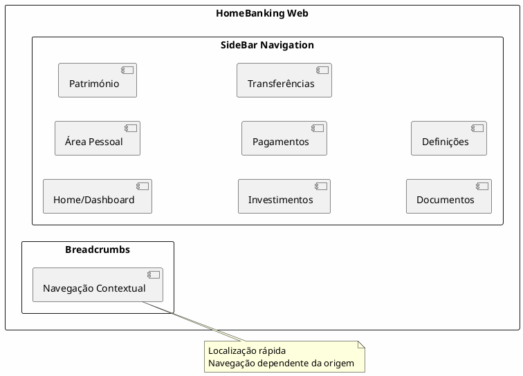
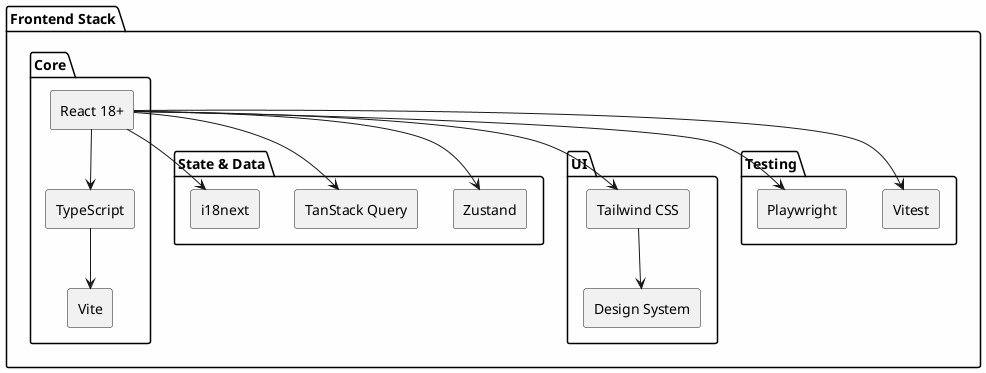
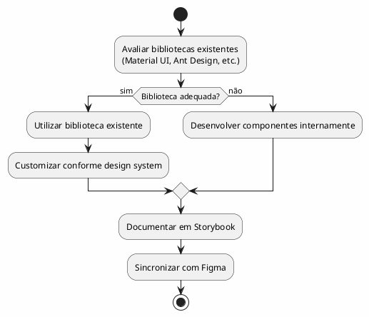
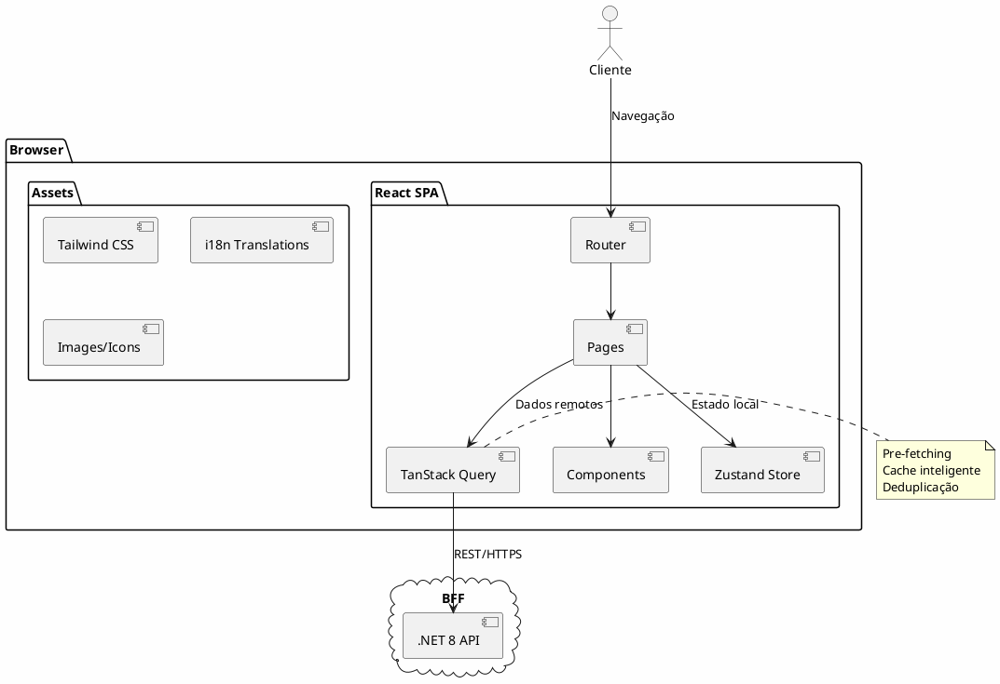

---
aliases:
  - Experiência do Utilizador e Arquitetura Frontend
tags:
  - nextreality-novobanco-website-sections
  - sections
  - frontend
  - ux
  - ui
approved: true
created: 2026-01-03
hubs:
  - "[[nextreality]]"
para-code: R
reviewed: true
status: in-progress
---

# 4. Experiência do Utilizador & Arquitetura Frontend

## Definições e Decisões

> **Definições requeridas:**
> - [DEF-04-stack-frontend.md](../definitions/DEF-04-stack-frontend.md) - Status: completed
> - [DEF-04-design-system.md](../definitions/DEF-04-design-system.md) - Status: completed
> - [DEF-04-ux-guidelines.md](../definitions/DEF-04-ux-guidelines.md) - Status: completed
>
> **Decisões relacionadas:**
> - [DEC-009-stack-tecnologica-frontend.md](../decisions/DEC-009-stack-tecnologica-frontend.md) - Status: accepted

## Propósito

Definir a arquitetura de informação, diretrizes UI/UX, stack tecnológica frontend, design system, responsividade, segurança e performance do canal web HomeBanking.

## Conteúdo

### 4.1 Arquitetura de Informação

#### 4.1.1 Estrutura de Navegação

| Elemento | Decisão | Justificação |
|----------|---------|--------------|
| Navegação Principal | SideBar | Padrão para aplicações web complexas |
| Navegação Secundária | Breadcrumbs | Localização rápida, navegação contextual |
| Navegação Contextual | Dependente da origem | Fluxos podem variar conforme ponto de entrada |

### 4.2 Diretrizes UI/UX

#### 4.2.1 Princípios de Design

| Princípio | Descrição |
|-----------|-----------|
| **Paridade Mobile** | Fluxos da app mobile replicados na web |
| **Responsividade** | Design responsivo para todos os dispositivos |
| **Feedback Imediato** | Skeleton screens para perceção de responsividade 100% |
| **Clareza** | Separação clara entre informação e ação requerida |

#### 4.2.2 Padrões de Feedback

| Tipo | Uso | Exemplo |
|------|-----|---------|
| **Toasts** | Avisos não bloqueantes | "Transferência realizada com sucesso" |
| **Modais** | Avisos que requerem resposta | "Confirmar operação?" |
| **Skeleton Screens** | Loading states | Carregamento de listas, dashboards |

### 4.3 Jornadas do Utilizador

#### 4.3.1 Atores

| Ator | Prioridade | Observação |
|------|------------|------------|
| Cliente Individual | Principal | Foco inicial |
| Cliente Empresarial | Futuro | Fase posterior |

#### 4.3.2 Jornadas Prioritárias

As jornadas serão baseadas nos 35 requisitos funcionais definidos, com foco em:

| Categoria | Jornadas | Criticidade |
|-----------|----------|-------------|
| **Autenticação** | Login, Registo, Recuperação | Alta (SCA obrigatório) |
| **Operações Financeiras** | Transferências, Pagamentos | Alta |
| **Consultas** | Dashboard, Saldos, Património | Média |
| **Investimentos** | Ações, ETF, Fundos, Robot Advisor | Média |

### 4.4 Multi-idioma

| Idioma | Prioridade | Cobertura |
|--------|------------|-----------|
| Português | Principal | 100% |
| Inglês | Secundário | 100% |
| Espanhol | Secundário | 100% |

**Implementação:**
- Biblioteca: **i18next** com react-i18next
- Namespaces para lazy loading de traduções
- Deteção automática de idioma do browser
- Persistência de preferência do utilizador

### 4.5 PWA & Offline

| Requisito | Status | Observação |
|-----------|--------|------------|
| PWA Instalável | **Não** | Cliente confirmou que não será PWA |
| Funcionamento Offline | **Não** | Sem requisitos de funcionamento offline |
| Service Workers | **N/A** | Não aplicável |

**Decisão:** A aplicação será uma aplicação web tradicional, sem funcionalidades PWA ou offline. Esta decisão foi confirmada pelo cliente.

### 4.6 Stack Frontend

#### 4.6.1 Stack Tecnológica

| Camada | Tecnologia | Versão |
|--------|------------|--------|
| **Framework** | React | 18+ (mais atual) |
| **Linguagem** | TypeScript | Latest |
| **Build Tool** | Vite | Latest |
| **State Management** | Zustand | Latest |
| **Data Fetching** | TanStack Query | Latest |
| **Styling** | Tailwind CSS | Latest |
| **i18n** | i18next | Latest |
| **Testes Unitários** | Vitest | Latest |
| **Testes E2E** | Playwright | Latest |

#### 4.6.2 Rendering Strategy

| Estratégia | Uso | Exemplo |
|------------|-----|---------|
| **SSG** | Páginas estáticas | Landing, FAQ |
| **SSR** | Dados dinâmicos | Dashboard, Saldos |
| **ISR** | Conteúdo semi-estático | Notícias, Índices |

**Justificação:** Proteção de client_secret no fluxo de login, performance otimizada.

#### 4.6.3 Code Splitting

- **Estratégia:** Code splitting por rotas usando React.Lazy
- **Benefício:** Bundle size otimizado, carregamento sob demanda

### 4.7 Design System

#### 4.7.1 Visão Geral

| Aspeto | Decisão |
|---------|---------|
| **Base** | Criado de raiz para o projeto |
| **Componentes** | Avaliação de bibliotecas existentes, fallback para desenvolvimento interno |
| **Documentação** | Figma (design) + Storybook (desenvolvimento) |
| **Temas** | Suporte a modo escuro |

#### 4.7.2 Tokens de Design

| Token | Status | Observação |
|-------|--------|------------|
| Cores | A definir | Início do desenvolvimento |
| Tipografia | A definir | Início do desenvolvimento |
| Espaçamentos | A definir | Início do desenvolvimento |
| Sombras | A definir | Início do desenvolvimento |

#### 4.7.3 Biblioteca de Componentes

### 4.8 Responsividade

| Requisito | Especificação |
|-----------|---------------|
| **Design** | Mobile-first responsive |
| **Breakpoints** | sm, md, lg, xl (Tailwind defaults) |
| **Browsers** | Chrome, Edge, Safari (atuais + 2 anteriores) |
| **Dispositivos** | Desktop, Tablet, Mobile |

### 4.9 Segurança Frontend

| Controlo | Implementação |
|----------|---------------|
| **XSS Prevention** | React escaping automático, CSP headers |
| **CSRF** | Tokens CSRF via BFF |
| **Sensitive Data** | Não armazenar em localStorage/sessionStorage |
| **Auth Tokens** | HttpOnly cookies (geridos pelo BFF) |
| **SCA** | Obrigatório para todo o acesso |

#### 4.9.1 Segurança UX

| Aspeto | Decisão |
|---------|---------|
| Comunicação de segurança ao utilizador | _A definir_ |
| Timeout de sessão por inatividade | 10 minutos |
| Aviso prévio de expiração | Popup com temporizador antes de expirar |

### 4.10 Performance Frontend

#### 4.10.1 Métricas Alvo

| Métrica | Target | Observação |
|---------|--------|------------|
| **LCP** (Largest Contentful Paint) | < 2.5s | Core Web Vital |
| **FID** (First Input Delay) | < 100ms | Core Web Vital |
| **CLS** (Cumulative Layout Shift) | < 0.1 | Core Web Vital |
| **Página Inicial** | < 10s | Requisito NFR |

#### 4.10.2 Estratégias de Otimização

| Estratégia | Implementação |
|------------|---------------|
| **Code Splitting** | React.Lazy por rotas |
| **Lazy Loading** | Imagens, componentes pesados |
| **Pre-fetching** | Vite + TanStack Query |
| **Caching** | Service Workers (se PWA), HTTP cache |
| **Bundle Size** | Tree shaking, Tailwind purge |

#### 4.10.3 Bundle Size

| Aspeto | Status |
|---------|--------|
| Limites de bundle | _A definir_ - Necessita consulta ao cliente |

## Diagramas

### Arquitetura Frontend Completa

## Entregáveis

- [x] Arquitetura de informação documentada
- [x] Diretrizes UI/UX definidas
- [x] Jornadas do utilizador mapeadas (alto nível)
- [x] Estratégia multi-idioma
- [ ] Definição PWA/Offline (pendente)
- [x] Stack frontend definida
- [x] Design system especificado
- [x] Estratégia de responsividade
- [x] Controlos de segurança frontend
- [x] Métricas de performance frontend

## Definições Utilizadas

- [x] [DEF-04-stack-frontend.md](../definitions/DEF-04-stack-frontend.md) - Status: completed
- [x] [DEF-04-design-system.md](../definitions/DEF-04-design-system.md) - Status: completed
- [x] [DEF-04-ux-guidelines.md](../definitions/DEF-04-ux-guidelines.md) - Status: completed

## Decisões Referenciadas

- [x] [DEC-009-stack-tecnologica-frontend.md](../decisions/DEC-009-stack-tecnologica-frontend.md) - Status: accepted

## Itens Pendentes

| Item | Documento | Responsável |
|------|-----------|-------------|
| ~~PWA/Offline requirements~~ | ~~DEF-04-ux-guidelines~~ | ~~Arquitetura~~ | **Decidido: Não será PWA** |
| Comunicação de segurança ao utilizador | DEF-04-ux-guidelines | UX + Segurança |
| ~~WCAG level~~ | ~~DEF-04-design-system~~ | ~~UX~~ | **Decidido: WCAG 2.1 AA** |
| Bundle size limits | DEF-04-stack-frontend | Performance |
| Pontos de dor app mobile | DEF-04-ux-guidelines | UX |
| Comportamento em conectividade intermitente | DEF-04-ux-guidelines | UX |
