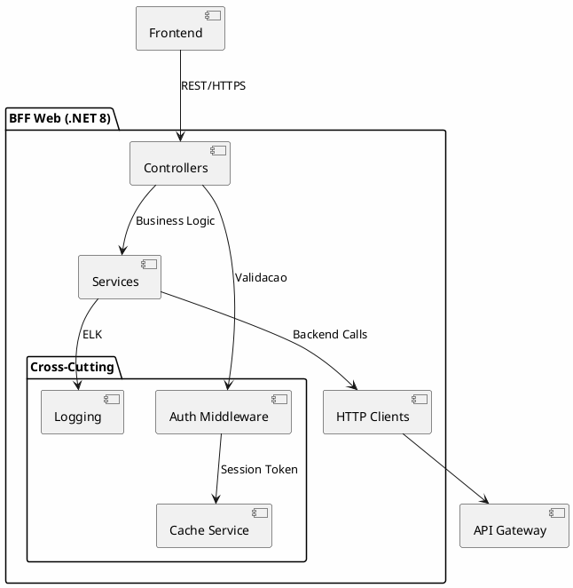
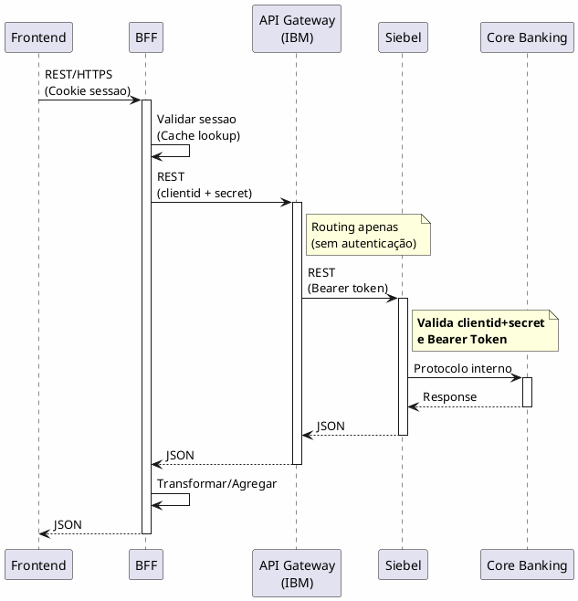
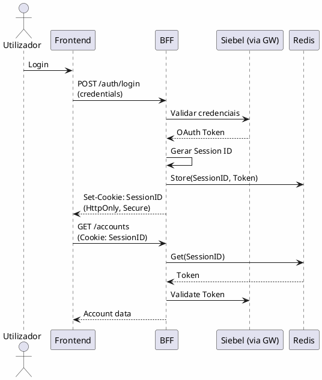

---
aliases:
  - Arquitetura Backend e Servicos
tags:
  - nextreality-novobanco-website-sections
  - sections
  - backend
  - api
  - services
approved: true
created: 2026-01-03
hubs:
  - "[[nextreality]]"
para-code: R
reviewed: true
status: in-progress
---

# 5. Arquitetura Backend & Servicos

## Proposito

Definir a decomposicao de servicos, arquitetura de API, comunicacao, modelo de dominio, rate limiting, resiliencia, versionamento e especificacao de APIs para o HomeBanking Web.

## Conteudo

### 5.1 Decomposicao de Servicos

> **Diagrama de Arquitetura:** Ver [Secção 3.2 - Diagrama Conceptual](SEC-03-visao-geral-solucao.md#32-diagrama-conceptual) para a visão geral da arquitetura.

A decomposição de serviços segue a arquitectura de referência definida na secção 3.2:

| Componente | Tipo | Acao | Tecnologia |
|------------|------|------|------------|
| Frontend Web | Novo | Desenvolver | React + TypeScript |
| BFF Web | Novo | Desenvolver | C# .NET 8 |
| API Gateway | Existente | Reutilizar | IBM |
| Siebel (Backend Principal) | Existente | Reutilizar | Valida tokens |
| Outros Backend Services | Existente | Reutilizar | A identificar |
| Serviços Azure | Existente | Reutilizar | Acesso direto pelo BFF |
| Core Banking | Existente | Reutilizar | Via Siebel |

#### Notas de Integração

| Fluxo | Autenticação | Observação |
|-------|--------------|------------|
| Frontend → BFF | Cookie de sessão | HttpOnly, Secure |
| BFF → API Gateway (IBM) | ClientID + ClientSecret | Para serviços via Siebel |
| BFF → Serviços Azure | Direto | Serviços a identificar |
| API Gateway → Siebel | Bearer Token | **Siebel valida o token** |

> **Nota - Serviço de Autenticação:** Não está previsto um AuthService autónomo separado. A autenticação é gerida pelos Backend Services existentes (Siebel). O BFF apenas gere a sessão web (cookies, cache de tokens) e propaga credenciais/tokens para o Siebel, que realiza toda a validação.

### 5.2 Arquitetura BFF

#### 5.2.1 Visao Geral



#### 5.2.2 Stack Tecnologica

| Componente | Tecnologia |
|------------|------------|
| **Runtime** | .NET 8 |
| **Linguagem** | C# |
| **Container** | Assente em OpenShift |
| **Observabilidade** | ELK Stack |

#### 5.2.3 Responsabilidades

| Responsabilidade | Implementado | Observacao |
|------------------|--------------|------------|
| Agregacao de chamadas | Sim | Combinar multiplas chamadas backend |
| Transformacao de dados | Sim | Adaptar formato para frontend |
| Cache | Sim | Sessao e tokens |
| Autenticacao/Autorizacao | Sim | OAuth 2.0, validacao de sessao |
| Rate Limiting | Nao | Responsabilidade do Gateway |

### 5.3 Arquitetura API

#### 5.3.1 Estilo e Formato

| Aspecto | Decisao |
|---------|---------|
| **Estilo** | REST |
| **Formato** | JSON |
| **Compressao** | gzip |
| **Especificacao** | OpenAPI 3.1 |

#### 5.3.2 Versionamento

| Aspecto | Decisao | Exemplo |
|---------|---------|---------|
| **Estrategia** | URL path | `/api/v1/accounts` |
| **Deprecacao** | _A definir_ | - |

#### 5.3.3 Estrutura de Endpoints

```
/api/v1/
├── auth/
│   ├── login
│   ├── logout
│   ├── refresh
│   └── validate
├── accounts/
│   ├── {id}
│   ├── {id}/balance
│   └── {id}/movements
├── payments/
│   ├── transfers
│   └── bills
├── investments/
│   ├── portfolio
│   ├── orders
│   └── products
└── documents/
    ├── statements
    └── receipts
```

### 5.4 Comunicacao entre Servicos



| Comunicacao | Protocolo | Autenticacao | Observação |
|-------------|-----------|--------------|------------|
| Frontend → BFF | REST/HTTPS | Cookie de sessao (HttpOnly, Secure) | - |
| BFF → API Gateway (IBM) | REST | ClientID + ClientSecret | Gateway faz routing apenas |
| API Gateway → Siebel | REST | Bearer Token (propagado) | **Siebel valida o token** |
| Siebel → Core Banking | Protocolo interno | - | - |

> **Nota:** O BFF não tem API Gateway à frente. O API Gateway (IBM) é utilizado apenas para acesso aos Backend Services (Siebel e outros).

> **Nota Importante - Validação de Token:** O API Gateway (IBM) faz **apenas routing**, sem realizar autenticação. Toda a autenticação (validação de clientid+secret do BFF e validação do Bearer Token do utilizador) é realizada pelo **Siebel**. Serviços backend que não suportem Bearer Token diretamente são acedidos exclusivamente através do Siebel, que actua como camada de mediação.

#### 5.4.1 Comunicacao Assincrona

| Aspecto | Status |
|---------|--------|
| Message Queues | _A definir_ - Necessita casos de uso concretos |

> **Nota:** Message Queues (Kafka/JMS) serão utilizadas apenas se houver casos de uso específicos que justifiquem comunicação assíncrona. A identificar durante a implementação.

### 5.5 Modelo de Dominio

O modelo de dominio segue as entidades ja existentes nos backend services da app mobile:

| Dominio | Entidades Principais |
|---------|---------------------|
| **Autenticacao** | User, Session, Credentials |
| **Contas** | Account, Balance, Movement |
| **Pagamentos** | Transfer, Payment, Beneficiary |
| **Investimentos** | Portfolio, Order, Product, Position |
| **Documentos** | Statement, Receipt |

### 5.6 Rate Limiting

| Aspecto | Decisao |
|---------|---------|
| **Responsabilidade** | API Gateway IBM (para chamadas aos Backend Services) |
| **No BFF** | Não implementado (BFF não tem APIGW à frente) |
| **Limites** | _A definir_ |
| **Resubmissões** | _A definir_ - Estratégia para pedidos duplicados |
| **Comunicacao** | Mensagem de erro informando necessidade de aguardar |

> **Nota:** O BFF não tem API Gateway à frente, pelo que o rate limiting é aplicado apenas nas chamadas do BFF para os Backend Services através do API Gateway IBM.

### 5.7 Resiliencia

| Padrao | Status | Observacao |
|--------|--------|------------|
| **Retry** | Implementado | Exponential backoff (configuravel) |
| **Timeout** | Implementado | Configuravel por endpoint |
| **Fallback** | Parcial | Apenas autenticacao |
| **Health Checks** | Implementado | Liveness + Readiness probes |
| **Circuit Breaker** | A definir | Proposta: Polly |
| **Bulkhead** | A avaliar | Depende da organização de serviços |

> **Nota - Organização de Serviços:** A necessidade de Bulkhead depende de quantos serviços forem implementados. Opções a avaliar: um único "BEST" ou segregação por domínio (ex: serviço de negócio + serviços especializados para funcionalidades não cobertas pelo Siebel).

### 5.8 Versionamento API

| Aspecto | Decisao |
|---------|---------|
| **Estrategia** | URL path versioning |
| **Formato** | `/api/v{major}/resource` |
| **Politica Deprecacao** | _A definir_ |

### 5.9 Especificacao API

| Aspecto | Decisao |
|---------|---------|
| **Formato** | OpenAPI 3.1 |
| **Geracao** | Automatizada via Pipeline |
| **Publicacao** | Swagger UI / ReDoc |

**Nota:** Especificacoes OpenAPI completas serao documentadas separadamente.

### 5.10 Dependencias Criticas

| Dependencia | Tipo | Impacto se Indisponivel |
|-------------|------|------------------------|
| **API Gateway** | Externa | Servico inoperante |
| **Backend Services** | Externa | Servico inoperante |
| **Cache Store** | Externa | Sessoes invalidas |
| **ELK Stack** | Externa | Degradacao graceful (sem logs) |

> **Pendência:** Validar com negócio se degradação graceful sem logs é aceitável ou se é necessário fallback alternativo.

### 5.11 Autenticacao e Sessao

#### Fluxo de Autenticacao



#### Gestao de Sessao

| Aspecto | Decisao |
|---------|---------|
| **Identificador** | Cookie de sessao (HttpOnly, Secure) |
| **Token Storage** | Cache distribuido (chave = Session ID) |
| **Validacao** | App ou OTP (SCA) |
| **Propagacao** | Bearer token para backend services |

## Itens Pendentes

| Item | Responsavel | Prioridade |
|------|-------------|------------|
| Circuit Breaker (biblioteca) | Arquitetura | Media |
| Comunicacao assincrona (se necessario) | Arquitetura | Media |
| Politica deprecacao API | Arquitetura | Baixa |

## Decisoes Referenciadas

- [DEC-007-padrao-bff.md](../decisions/DEC-007-padrao-bff.md) - BFF Pattern
- [DEC-010-stack-tecnologica-backend.md](../decisions/DEC-010-stack-tecnologica-backend.md) - Stack Backend
- [DEC-011-diagrama-arquitetura-unico.md](../decisions/DEC-011-diagrama-arquitetura-unico.md) - Diagrama de referência único
