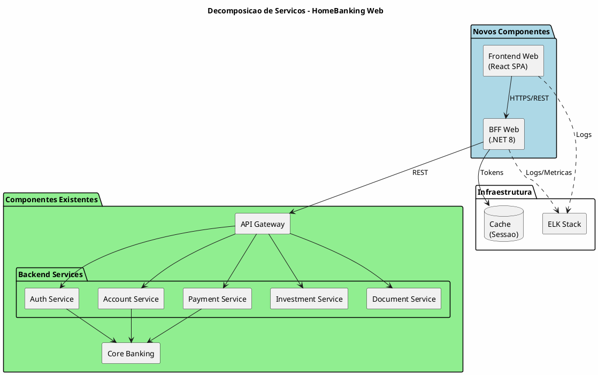
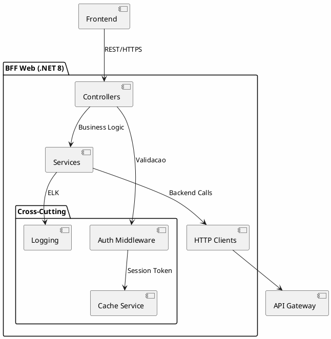
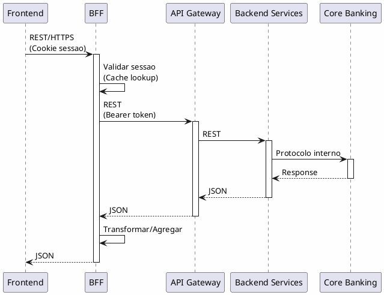
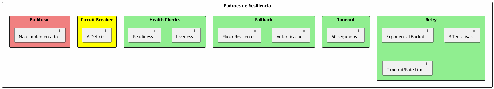
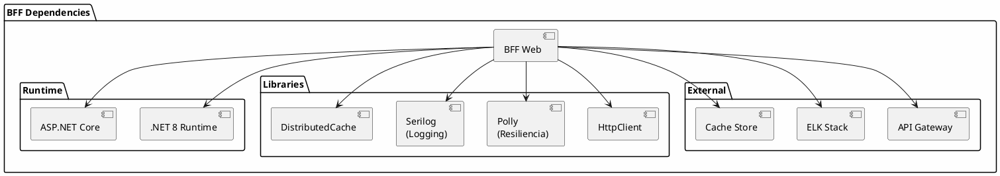
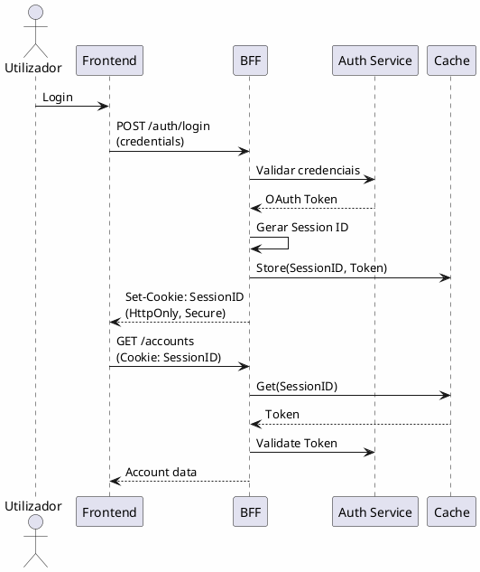

---
aliases:
  - Arquitetura Backend e Servicos
tags:
  - nextreality-novobanco-website-sections
  - sections
  - backend
  - api
  - services
approved: true
created: 2026-01-03
hubs:
  - "[[nextreality]]"
para-code: R
reviewed: true
status: in-progress
---

# 5. Arquitetura Backend & Servicos

> **Definicoes requeridas:**
> - [DEF-05-arquitetura-bff.md](../definitions/DEF-05-arquitetura-bff.md) - Status: completed
> - [DEF-05-api-design.md](../definitions/DEF-05-api-design.md) - Status: completed
> - [DEF-05-padroes-resiliencia.md](../definitions/DEF-05-padroes-resiliencia.md) - Status: completed
>
> **Decisoes relacionadas:**
> - [DEC-007-padrao-bff.md](../decisions/DEC-007-padrao-bff.md) - Status: accepted

## Proposito

Definir a decomposicao de servicos, arquitetura de API, comunicacao, modelo de dominio, rate limiting, resiliencia, versionamento e especificacao de APIs para o HomeBanking Web.

## Conteudo

### 5.1 Decomposicao de Servicos



| Componente | Tipo | Acao | Tecnologia |
|------------|------|------|------------|
| Frontend Web | Novo | Desenvolver | React + TypeScript |
| BFF Web | Novo | Desenvolver | C# .NET 8 |
| API Gateway | Existente | Reutilizar | - |
| Backend Services | Existente | Reutilizar | - |
| Core Banking | Existente | Reutilizar | - |

### 5.2 Arquitetura BFF

#### 5.2.1 Visao Geral



#### 5.2.2 Stack Tecnologica

| Componente | Tecnologia |
|------------|------------|
| **Runtime** | .NET 8 |
| **Linguagem** | C# |
| **Container** | OpenShift compliant |
| **Observabilidade** | ELK Stack |

#### 5.2.3 Responsabilidades

| Responsabilidade | Implementado | Observacao |
|------------------|--------------|------------|
| Agregacao de chamadas | Sim | Combinar multiplas chamadas backend |
| Transformacao de dados | Sim | Adaptar formato para frontend |
| Cache | Sim | Sessao e tokens |
| Autenticacao/Autorizacao | Sim | OAuth 2.0, validacao de sessao |
| Rate Limiting | Nao | Responsabilidade do Gateway |

### 5.3 Arquitetura API

#### 5.3.1 Estilo e Formato

| Aspecto | Decisao |
|---------|---------|
| **Estilo** | REST |
| **Formato** | JSON |
| **Compressao** | gzip |
| **Especificacao** | OpenAPI 3.0 |

#### 5.3.2 Versionamento

| Aspecto | Decisao | Exemplo |
|---------|---------|---------|
| **Estrategia** | URL path | `/api/v1/accounts` |
| **Deprecacao** | _A definir_ | - |

#### 5.3.3 Estrutura de Endpoints

```
/api/v1/
├── auth/
│   ├── login
│   ├── logout
│   ├── refresh
│   └── validate
├── accounts/
│   ├── {id}
│   ├── {id}/balance
│   └── {id}/movements
├── payments/
│   ├── transfers
│   └── bills
├── investments/
│   ├── portfolio
│   ├── orders
│   └── products
└── documents/
    ├── statements
    └── receipts
```

### 5.4 Comunicacao entre Servicos



| Comunicacao | Protocolo | Autenticacao |
|-------------|-----------|--------------|
| Frontend -> BFF | REST/HTTPS | Cookie de sessao |
| BFF -> Gateway | REST | Bearer token (OAuth) |
| Gateway -> Services | REST | Token propagado |

#### 5.4.1 Comunicacao Assincrona

| Aspecto | Status |
|---------|--------|
| Message Queues | _A definir_ - Necessita aprofundamento |

### 5.5 Modelo de Dominio

O modelo de dominio segue as entidades ja existentes nos backend services da app mobile:

| Dominio | Entidades Principais |
|---------|---------------------|
| **Autenticacao** | User, Session, Credentials |
| **Contas** | Account, Balance, Movement |
| **Pagamentos** | Transfer, Payment, Beneficiary |
| **Investimentos** | Portfolio, Order, Product, Position |
| **Documentos** | Statement, Receipt |

### 5.6 Rate Limiting

| Aspecto | Decisao |
|---------|---------|
| **Responsabilidade** | API Gateway (nao BFF) |
| **Limites** | _A definir_ |
| **Comunicacao** | Mensagem de erro informando necessidade de aguardar |

### 5.7 Resiliencia

#### 5.7.1 Padroes Implementados



#### 5.7.2 Retry Policy

| Parametro | Valor |
|-----------|-------|
| **Estrategia** | Exponential backoff |
| **Tentativas** | 3 |
| **Erros elegiveis** | Timeout, Rate limit |

#### 5.7.3 Timeout

| Parametro | Valor |
|-----------|-------|
| **Timeout padrao** | 60 segundos |
| **Diferenciacao** | Nao (uniforme) |

#### 5.7.4 Fallback

| Operacao | Comportamento |
|----------|---------------|
| **Autenticacao** | Fluxo mais resiliente |
| **Outras** | Nao implementado |

#### 5.7.5 Health Checks

| Tipo | Implementado | Frequencia |
|------|--------------|------------|
| **Liveness** | Sim | _A definir_ |
| **Readiness** | Sim | _A definir_ |

### 5.8 Versionamento API

| Aspecto | Decisao |
|---------|---------|
| **Estrategia** | URL path versioning |
| **Formato** | `/api/v{major}/resource` |
| **Politica Deprecacao** | _A definir_ |

### 5.9 Especificacao API

| Aspecto | Decisao |
|---------|---------|
| **Formato** | OpenAPI 3.0 |
| **Geracao** | Automatizada via Pipeline |
| **Publicacao** | Swagger UI / ReDoc |

#### 5.9.1 Exemplo de Especificacao

```yaml
openapi: 3.0.0
info:
  title: HomeBanking Web BFF API
  version: 1.0.0
paths:
  /api/v1/accounts/{id}/balance:
    get:
      summary: Get account balance
      parameters:
        - name: id
          in: path
          required: true
          schema:
            type: string
      responses:
        '200':
          description: Success
          content:
            application/json:
              schema:
                $ref: '#/components/schemas/Balance'
        '401':
          description: Unauthorized
        '404':
          description: Account not found
```

### 5.10 Dependencias



| Dependencia | Tipo | Critica |
|-------------|------|---------|
| API Gateway | Externa | Sim |
| Backend Services | Externa | Sim |
| Cache Store | Externa | Sim |
| ELK Stack | Externa | Nao (degradacao graceful) |

### 5.11 Padroes de Design

| Padrao | Aplicacao |
|--------|-----------|
| **BFF Pattern** | Camada dedicada para frontend web |
| **API Gateway** | Roteamento, rate limiting (existente) |
| **Repository** | Abstracacao de acesso a dados (se aplicavel) |
| **Circuit Breaker** | Protecao contra falhas em cascata (_a definir_) |
| **Retry with Backoff** | Recuperacao de falhas transitorias |

### 5.12 Autenticacao e Sessao

#### 5.12.1 Fluxo de Autenticacao



#### 5.12.2 Gestao de Sessao

| Aspecto | Decisao |
|---------|---------|
| **Identificador** | Cookie de sessao (HttpOnly, Secure) |
| **Token Storage** | Cache distribuido (chave = Session ID) |
| **Validacao** | App ou OTP (SCA) |
| **Propagacao** | Bearer token para backend services |

## Entregaveis

- [x] Diagrama de decomposicao de servicos
- [x] Arquitetura BFF documentada
- [ ] Especificacao de APIs completa (OpenAPI) - Em progresso
- [x] Padroes de comunicacao definidos
- [x] Modelo de dominio documentado (alto nivel)
- [x] Politicas de rate limiting (responsabilidade Gateway)
- [x] Padroes de resiliencia implementados
- [x] Estrategia de versionamento API
- [x] Mapa de dependencias

## Definicoes Utilizadas

- [x] [DEF-05-arquitetura-bff.md](../definitions/DEF-05-arquitetura-bff.md) - Status: completed
- [x] [DEF-05-api-design.md](../definitions/DEF-05-api-design.md) - Status: completed
- [x] [DEF-05-padroes-resiliencia.md](../definitions/DEF-05-padroes-resiliencia.md) - Status: completed

## Decisoes Referenciadas

- [x] [DEC-007-padrao-bff.md](../decisions/DEC-007-padrao-bff.md) - Status: accepted

## Itens Pendentes

| Item | Documento | Responsavel |
|------|-----------|-------------|
| Circuit Breaker (biblioteca, thresholds) | DEF-05-padroes-resiliencia | Arquitetura |
| Rate limiting values | DEF-05-padroes-resiliencia | Arquitetura |
| Health check frequency | DEF-05-padroes-resiliencia | Operacoes |
| Comunicacao assincrona | DEF-05-arquitetura-bff | Arquitetura |
| Escalabilidade BFF | DEF-05-arquitetura-bff | Arquitetura |
| Politica deprecacao API | DEF-05-api-design | Arquitetura |
| Tratamento de erros (estrutura) | DEF-05-api-design | Desenvolvimento |
| Cache headers HTTP | DEF-05-api-design | Desenvolvimento |
