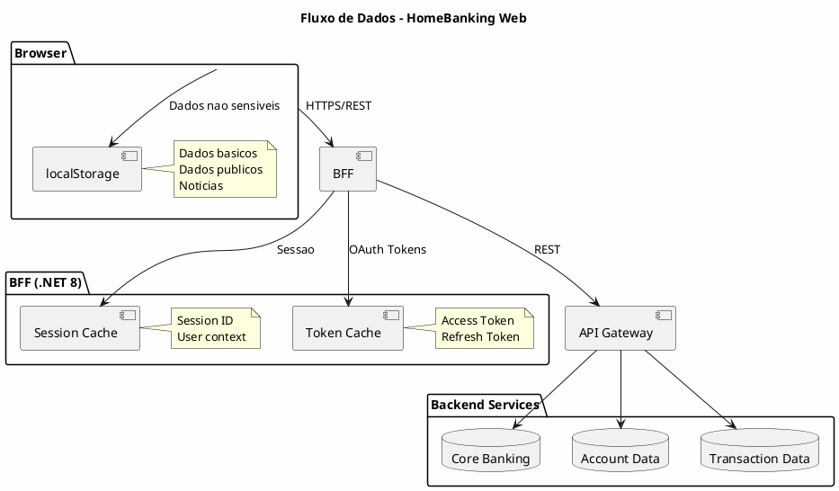
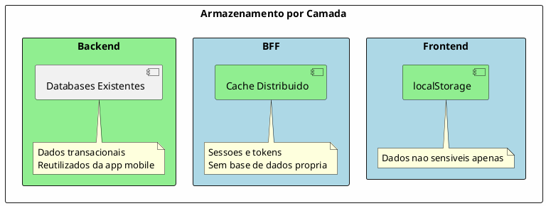

---
aliases:
  - Arquitetura de Dados
tags:
  - nextreality-novobanco-website-sections
  - sections
  - data
  - storage
  - gdpr
approved: true
created: 2026-01-03
hubs:
  - "[[nextreality]]"
para-code: R
reviewed: true
status: in-progress
---

# 6. Arquitetura de Dados

> **Definicoes requeridas:**
> - [DEF-06-arquitetura-dados.md](../definitions/DEF-06-arquitetura-dados.md) - Status: completed
>
> **Decisoes relacionadas:**
> - [DEC-005-armazenamento-dados-canal-web.md](../decisions/DEC-005-armazenamento-dados-canal-web.md) - Status: accepted

## Proposito

Definir a arquitetura de dados do HomeBanking Web, incluindo modelo de dados, armazenamento, encriptacao, retencao, conformidade RGPD e estrategias de cache. O canal web reutiliza os servicos backend existentes, logo a maioria dos dados transacionais reside nos sistemas existentes.

## Conteudo

### 6.1 Visao Geral de Dados

| Camada | Armazenamento | Dados |
|--------|---------------|-------|
| Frontend | localStorage | Dados basicos utilizador, dados publicos, noticias |
| BFF | Cache (Redis) | Sessao, tokens OAuth |
| Backend | Existente | Dados transacionais, contas, movimentos |

### 6.2 Modelo de Dados

#### 6.2.1 Dados no Frontend

| Tipo | Armazenamento | Exemplo |
|------|---------------|---------|
| Dados basicos utilizador | localStorage | Nome, preferencias UI |
| Dados publicos | localStorage | Taxas de cambio, indices |
| Noticias | localStorage | Comunicacoes, alertas |
| **Dados sensiveis** | **PROIBIDO** | Saldos, transacoes, tokens |

#### 6.2.2 Dados no BFF

| Tipo | Armazenamento | TTL |
|------|---------------|-----|
| Session ID | Cache | 30 min (max absoluto) |
| Access Token | Cache | 15 min |
| Refresh Token | Cache | 7 dias |
| Dados SSR/SSG | Cache | _A definir_ |

#### 6.2.3 Dados Especificos do Canal Web

- **Nao ha dados especificos** do canal web que nao existam na app mobile
- Canal web consome os mesmos backend services e modelo de dominio

### 6.3 Armazenamento

| Decisao | Valor |
|---------|-------|
| **Frontend - Persistencia** | localStorage |
| **BFF - Base de dados** | Nao (apenas cache) |
| **BFF - Tecnologia cache** | _A definir_ (Redis recomendado) |
| **Backend** | Reutiliza infraestrutura existente |

### 6.4 Encriptacao

| Aspecto | Decisao |
|---------|---------|
| **Em transito** | TLS (versao a definir) |
| **Em repouso (BFF/cache)** | Sem requisitos especificos |
| **Gestao de chaves** | SSL apenas (no momento) |

### 6.5 Retencao de Dados

| Tipo | Politica | Status |
|------|----------|--------|
| Logs de acesso web | _A definir_ | Pendente |
| Dados de sessao | _A definir_ | Pendente |
| Requisitos de auditoria | _A definir_ | Pendente |

### 6.6 Backup & Restore

| Aspecto | Status |
|---------|--------|
| Componentes que requerem backup | _A definir_ |
| Frequencia de backup | _A definir_ |
| RTO/RPO para restauro | _A definir_ |

**Nota:** A maioria dos dados reside nos backend services existentes, que ja possuem politicas de backup definidas.

### 6.7 RGPD - Data Subject Rights

| Requisito | Status |
|-----------|--------|
| Subject Access Requests (SAR) | _A definir_ |
| Direito ao esquecimento | _A definir_ |
| Dados web nas exportacoes | _A definir_ |

**Nota:** Processos RGPD existentes da app mobile devem ser estendidos ao canal web.

### 6.8 Classificacao de Dados

| Aspecto | Status |
|---------|--------|
| Esquema de classificacao | _A definir_ |
| Dados sensiveis/PII | _A definir_ |

### 6.9 Estrategia de Cache

| Aspecto | Status |
|---------|--------|
| Dados cacheados no BFF | Sessao, tokens; mais se SSR completo |
| TTL por tipo | _A definir_ |
| Invalidacao de cache | _A definir_ |

## Entregaveis

- [x] Diagrama de fluxo de dados
- [x] Modelo de dados documentado (alto nivel)
- [ ] Politica de encriptacao - Parcial
- [ ] Politica de retencao - Pendente
- [ ] Procedimentos RGPD - Pendente
- [ ] Classificacao de dados - Pendente
- [ ] Estrategia de cache detalhada - Pendente

## Definicoes Utilizadas

- [x] [DEF-06-arquitetura-dados.md](../definitions/DEF-06-arquitetura-dados.md) - Status: completed

## Decisoes Referenciadas

- [x] [DEC-005-armazenamento-dados-canal-web.md](../decisions/DEC-005-armazenamento-dados-canal-web.md) - Status: accepted

## Itens Pendentes

| Item | Documento | Responsavel |
|------|-----------|-------------|
| Politica de retencao logs | DEF-06-arquitetura-dados | Operacoes |
| Politica de retencao sessao | DEF-06-arquitetura-dados | Arquitetura |
| Requisitos de auditoria | DEF-06-arquitetura-dados | Compliance |
| Procedimentos RGPD | DEF-06-arquitetura-dados | DPO |
| Classificacao de dados | DEF-06-arquitetura-dados | Seguranca |
| TTL e invalidacao cache | DEF-06-arquitetura-dados | Arquitetura |
| Componentes para backup | DEF-06-arquitetura-dados | Operacoes |
| Versao TLS | DEF-06-arquitetura-dados | Seguranca |
