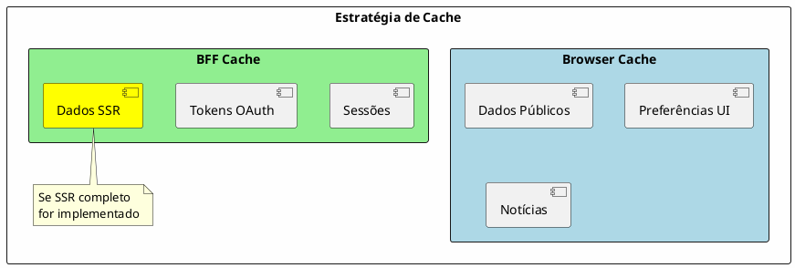

---
aliases:
  - Arquitetura de Dados
tags:
  - nextreality-novobanco-website-sections
  - sections
  - data
  - storage
  - gdpr
approved: true
created: 2026-01-03
hubs:
  - "[[nextreality]]"
para-code: R
reviewed: true
status: in-progress
---

# 6. Arquitetura de Dados

## Definições e Decisões

> **Definições requeridas:**
> - [DEF-06-arquitetura-dados.md](../definitions/DEF-06-arquitetura-dados.md) - Status: completed
>
> **Decisões relacionadas:**
> - [DEC-005-armazenamento-dados-canal-web.md](../decisions/DEC-005-armazenamento-dados-canal-web.md) - Status: accepted

## Propósito

Definir a arquitetura de dados do HomeBanking Web, incluindo modelo de dados, armazenamento, encriptação, retenção, conformidade RGPD e estratégias de cache. O canal web reutiliza os serviços backend existentes, logo a maioria dos dados transacionais reside nos sistemas existentes.

## Conteúdo

### 6.1 Visão Geral de Dados

| Camada | Armazenamento | Dados |
|--------|---------------|-------|
| Frontend | localStorage | Dados básicos utilizador, dados públicos, notícias |
| BFF | Cache (Redis) | Sessão, tokens OAuth |
| Backend | Existente | Dados transacionais, contas, movimentos |

### 6.2 Modelo de Dados

#### 6.2.1 Dados no Frontend

| Tipo | Armazenamento | Exemplo |
|------|---------------|---------|
| Dados básicos utilizador | localStorage | Nome, preferências UI |
| Dados públicos | localStorage | Taxas de câmbio, índices |
| Notícias | localStorage | Comunicações, alertas |
| **Dados sensíveis** | **PROIBIDO** | Saldos, transações, tokens |

#### 6.2.2 Dados no BFF

| Tipo | Armazenamento | TTL |
|------|---------------|-----|
| Session ID | Cache | 30 min (max absoluto) |
| Access Token | Cache | 15 min |
| Refresh Token | Cache | 7 dias |
| Dados SSR/SSG | Cache | _A definir_ |

#### 6.2.3 Dados Específicos do Canal Web

- **Não há dados específicos** do canal web que não existam na app mobile
- Canal web consome os mesmos backend services e modelo de domínio

### 6.3 Armazenamento

| Decisão | Valor |
|---------|-------|
| **Frontend - Persistência** | localStorage |
| **BFF - Base de dados** | Não (apenas cache) |
| **BFF - Tecnologia cache** | _A definir_ (Redis recomendado) |
| **Backend** | Reutiliza infraestrutura existente |

### 6.4 Encriptação

| Aspeto | Decisão |
|---------|---------|
| **Em trânsito** | TLS (versão a definir) |
| **Em repouso (BFF/cache)** | Sem requisitos específicos |
| **Gestão de chaves** | SSL apenas (no momento) |

### 6.5 Retenção de Dados

| Tipo | Política | Status |
|------|----------|--------|
| Logs de acesso web | _A definir_ | Pendente |
| Dados de sessão | _A definir_ | Pendente |
| Requisitos de auditoria | _A definir_ | Pendente |

### 6.6 Backup & Restore

| Aspeto | Status |
|---------|--------|
| Componentes que requerem backup | _A definir_ |
| Frequência de backup | _A definir_ |
| RTO/RPO para restauro | _A definir_ |

**Nota:** A maioria dos dados reside nos backend services existentes, que já possuem políticas de backup definidas.

### 6.7 RGPD - Data Subject Rights

| Requisito | Status |
|-----------|--------|
| Subject Access Requests (SAR) | _A definir_ |
| Direito ao esquecimento | _A definir_ |
| Dados web nas exportações | _A definir_ |

**Nota:** Processos RGPD existentes da app mobile devem ser estendidos ao canal web.

### 6.8 Classificação de Dados

| Aspeto | Status |
|---------|--------|
| Esquema de classificação | _A definir_ |
| Dados sensíveis/PII | _A definir_ |

### 6.9 Estratégia de Cache

| Aspeto | Status |
|---------|--------|
| Dados cacheados no BFF | Sessão, tokens; mais se SSR completo |
| TTL por tipo | _A definir_ |
| Invalidação de cache | _A definir_ |

## Entregáveis

- [x] Diagrama de fluxo de dados
- [x] Modelo de dados documentado (alto nível)
- [ ] Política de encriptação - Parcial
- [ ] Política de retenção - Pendente
- [ ] Procedimentos RGPD - Pendente
- [ ] Classificação de dados - Pendente
- [ ] Estratégia de cache detalhada - Pendente

## Definições Utilizadas

- [x] [DEF-06-arquitetura-dados.md](../definitions/DEF-06-arquitetura-dados.md) - Status: completed

## Decisões Referenciadas

- [x] [DEC-005-armazenamento-dados-canal-web.md](../decisions/DEC-005-armazenamento-dados-canal-web.md) - Status: accepted

## Itens Pendentes

| Item | Documento | Responsável |
|------|-----------|-------------|
| Política de retenção logs | DEF-06-arquitetura-dados | Operações |
| Política de retenção sessão | DEF-06-arquitetura-dados | Arquitetura |
| Requisitos de auditoria | DEF-06-arquitetura-dados | Compliance |
| Procedimentos RGPD | DEF-06-arquitetura-dados | DPO |
| Classificação de dados | DEF-06-arquitetura-dados | Segurança |
| TTL e invalidação cache | DEF-06-arquitetura-dados | Arquitetura |
| Componentes para backup | DEF-06-arquitetura-dados | Operações |
| Versão TLS | DEF-06-arquitetura-dados | Segurança |
