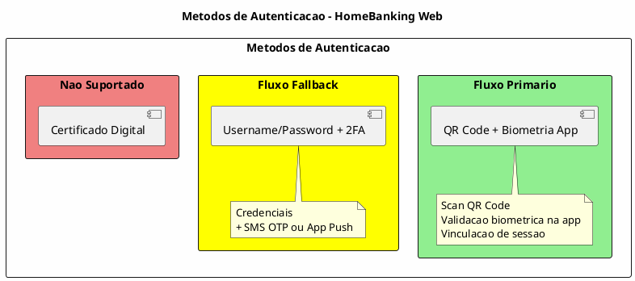
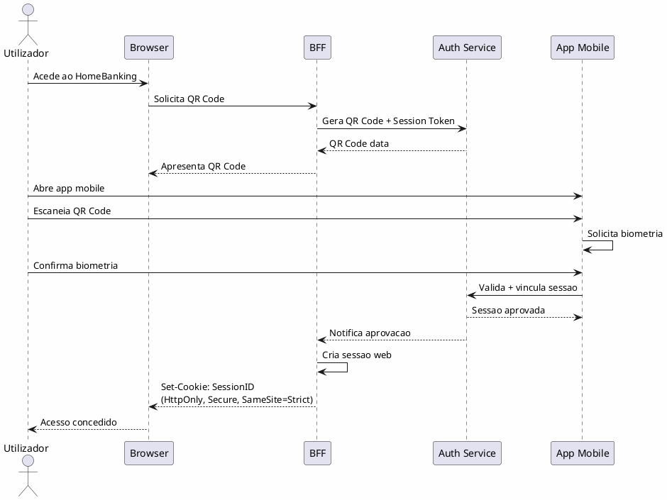
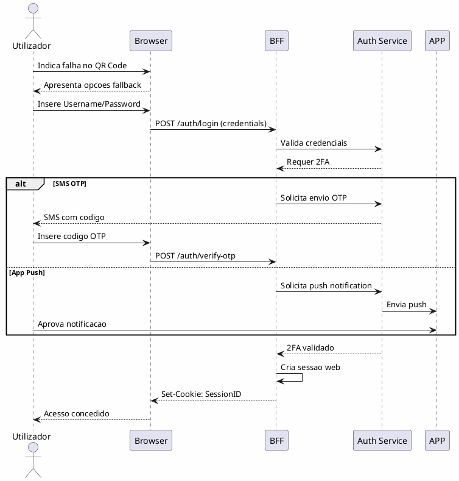
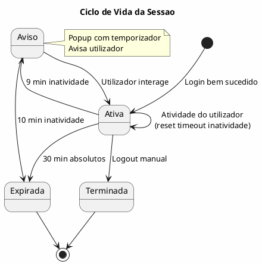

---
aliases:
  - Autenticacao e Autorizacao
tags:
  - nextreality-novobanco-website-sections
  - sections
  - authentication
  - authorization
  - security
approved: true
created: 2026-01-03
hubs:
  - "[[nextreality]]"
para-code: R
reviewed: true
status: in-progress
---

# 7. Autenticacao & Autorizacao

> **Definicoes requeridas:**
> - [DEF-07-autenticacao-autorizacao.md](../definitions/DEF-07-autenticacao-autorizacao.md) - Status: completed
> - [DEF-05-arquitetura-bff.md](../definitions/DEF-05-arquitetura-bff.md) - Status: completed
>
> **Decisoes relacionadas:**
> - [DEC-001-estrategia-autenticacao-web.md](../decisions/DEC-001-estrategia-autenticacao-web.md) - Status: accepted
> - [DEC-002-gestao-sessoes-tokens.md](../decisions/DEC-002-gestao-sessoes-tokens.md) - Status: accepted
> - [DEC-003-modelo-autorizacao-abac.md](../decisions/DEC-003-modelo-autorizacao-abac.md) - Status: accepted

## Proposito

Definir a estrategia completa de autenticacao e autorizacao do HomeBanking Web, incluindo fluxos de autenticacao, MFA/SCA, gestao de sessoes, tokens e politicas de seguranca.

## Conteudo

### 7.1 Visao Geral de Autenticacao

| Metodo | Suporte | Observacao |
|--------|---------|------------|
| QR Code + Biometria | Primario | Validacao via app mobile |
| Username/Password | Fallback | Apenas quando QR Code falha |
| SMS OTP | Fallback | Segundo fator no fallback |
| App Push | Fallback | Segundo fator no fallback |
| Certificado Digital | Nao | Nao suportado |

**Login unificado:** Sim, mesmas credenciais da app mobile.

### 7.2 Fluxos de Autenticacao

#### 7.2.1 Fluxo Primario - QR Code

#### 7.2.2 Fluxo Fallback - Username/Password + 2FA

### 7.3 MFA/SCA (Strong Customer Authentication)

| Aspecto | Decisao |
|---------|---------|
| **SCA Obrigatorio** | Sim, para todos os acessos a areas restritas |
| **Segundo fator primario** | Biometria via app (validacao QR Code) |
| **Segundo fator fallback** | SMS OTP ou App Push |
| **Isencoes SCA** | Nenhuma |

**Fluxo de fallback:** Apos o utilizador informar falha na leitura do QR Code, a aplicacao permite login com SMS OTP ou App Push, dependendo das opcoes habilitadas para o utilizador.

### 7.4 Gestao de Sessoes

| Parametro | Valor |
|-----------|-------|
| **Timeout por inatividade** | 10 minutos |
| **Timeout absoluto** | 30 minutos |
| **Sessao exclusiva** | Desejavel (pendente aprovacao cliente) |
| **Aviso de expiracao** | Popup com temporizador |

### 7.5 Estrategia de Tokens

| Token | Localizacao | TTL | Uso |
|-------|-------------|-----|-----|
| **Session Cookie** | Browser (cookie) | 30 min | Browser -> BFF |
| **Access Token** | BFF Cache | 15 min | BFF -> Backend |
| **Refresh Token** | BFF Cache | 7 dias | Renovacao silenciosa |

**Renovacao:** Refresh silencioso conforme atividade do utilizador. BFF renova tokens automaticamente antes de expiracao.

### 7.6 Autorizacao

| Aspecto | Decisao |
|---------|---------|
| **Modelo** | ABAC hibrido com RBAC |
| **Role** | Atributo do sujeito (quando necessario) |
| **Atributos** | Sujeito, Recurso, Acao, Ambiente |
| **Permissoes por operacao** | Sim (consulta vs transacao) |

**Atributos considerados:**

| Categoria | Atributos |
|-----------|-----------|
| **Sujeito** | Utilizador, role, tipo de cliente, segmento |
| **Recurso** | Tipo de conta, produto, limite |
| **Acao** | Consulta, transacao, configuracao |
| **Ambiente** | Canal (web), horario, localizacao, dispositivo |

**Nota:** Roles e perfis especificos serao definidos no assessment inicial do projeto.

### 7.7 Politicas de Password

| Aspecto | Decisao |
|---------|---------|
| Requisitos minimos | Seguira requisitos da app (a aprofundar) |
| Expiracao | _A definir_ |
| Recuperacao | _A definir_ |
| Bloqueio por tentativas | _A definir_ |

### 7.8 Anti-automation

| Aspecto | Status |
|---------|--------|
| CAPTCHA | _A definir_ |
| Rate limiting login | _A definir_ |
| Detecao de bots | _A definir_ |

### 7.9 Revogacao

| Aspecto | Status |
|---------|--------|
| Revogacao por comprometimento | _A definir_ |
| Logout de todos os dispositivos | _A definir_ |
| Revogacao ao mudar password | _A definir_ |

## Entregaveis

- [x] Diagramas de fluxo de autenticacao
- [x] Especificacao de MFA/SCA
- [x] Politica de gestao de sessoes
- [x] Estrategia de tokens documentada
- [x] Modelo de autorizacao
- [ ] Politicas de password - Parcial
- [ ] Controlos anti-automation - Pendente
- [ ] Procedimentos de revogacao - Pendente

## Definicoes Utilizadas

- [x] [DEF-07-autenticacao-autorizacao.md](../definitions/DEF-07-autenticacao-autorizacao.md) - Status: completed
- [x] [DEF-05-arquitetura-bff.md](../definitions/DEF-05-arquitetura-bff.md) - Status: completed

## Decisoes Referenciadas

- [x] [DEC-001-estrategia-autenticacao-web.md](../decisions/DEC-001-estrategia-autenticacao-web.md) - Status: accepted
- [x] [DEC-002-gestao-sessoes-tokens.md](../decisions/DEC-002-gestao-sessoes-tokens.md) - Status: accepted
- [x] [DEC-003-modelo-autorizacao-abac.md](../decisions/DEC-003-modelo-autorizacao-abac.md) - Status: accepted

## Itens Pendentes

| Item | Documento | Responsavel |
|------|-----------|-------------|
| Fluxo de primeiro acesso/registo web | DEF-07-autenticacao-autorizacao | Arquitetura |
| Validacao fluxos fallback (SMS/Push) | DEF-07-autenticacao-autorizacao | Produto |
| Sessao exclusiva (aprovacao cliente) | DEF-07-autenticacao-autorizacao | Produto |
| Requisitos de password | DEF-07-autenticacao-autorizacao | Seguranca |
| Politica de expiracao password | DEF-07-autenticacao-autorizacao | Seguranca |
| Fluxo de recuperacao password | DEF-07-autenticacao-autorizacao | UX |
| Bloqueio por tentativas | DEF-07-autenticacao-autorizacao | Seguranca |
| Estrategia CAPTCHA | DEF-07-autenticacao-autorizacao | Seguranca |
| Rate limiting login | DEF-07-autenticacao-autorizacao | Arquitetura |
| Detecao de bots | DEF-07-autenticacao-autorizacao | Seguranca |
| Procedimentos de revogacao | DEF-07-autenticacao-autorizacao | Seguranca |
