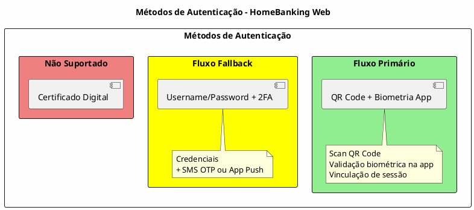
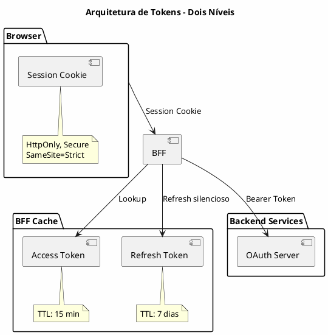

---
aliases:
  - Autenticação e Autorização
tags:
  - nextreality-novobanco-website-sections
  - sections
  - authentication
  - authorization
  - security
approved: true
created: 2026-01-03
hubs:
  - "[[nextreality]]"
para-code: R
reviewed: true
status: in-progress
---

# 7. Autenticação & Autorização

## Definições e Decisões

> **Definições requeridas:**
> - [DEF-07-autenticacao-autorizacao.md](../definitions/DEF-07-autenticacao-autorizacao.md) - Status: completed
> - [DEF-05-arquitetura-bff.md](../definitions/DEF-05-arquitetura-bff.md) - Status: completed
>
> **Decisões relacionadas:**
> - [DEC-001-estrategia-autenticacao-web.md](../decisions/DEC-001-estrategia-autenticacao-web.md) - Status: accepted
> - [DEC-002-gestao-sessoes-tokens.md](../decisions/DEC-002-gestao-sessoes-tokens.md) - Status: accepted
> - [DEC-003-modelo-autorizacao-abac.md](../decisions/DEC-003-modelo-autorizacao-abac.md) - Status: accepted

## Propósito

Definir a estratégia completa de autenticação e autorização do HomeBanking Web, incluindo fluxos de autenticação, MFA/SCA, gestão de sessões, tokens e políticas de segurança.

## Conteúdo

### 7.1 Visão Geral de Autenticação

| Método | Suporte | Observação |
|--------|---------|------------|
| QR Code + Biometria | Primário | Validação via app mobile |
| Username/Password | Fallback | Apenas quando QR Code falha |
| SMS OTP | Fallback | Segundo fator no fallback |
| App Push | Fallback | Segundo fator no fallback |
| Certificado Digital | Não | Não suportado |

**Login unificado:** Sim, mesmas credenciais da app mobile.

**Registo:** O utilizador pode registar-se pela Web ou pela APP. São processos semelhantes mas necessários em cada dispositivo (independentes). A validação de identidade no primeiro acesso utiliza a mesma API de Login.

### 7.2 Fluxos de Autenticação

#### 7.2.1 Fluxo Primário - QR Code

#### 7.2.2 Fluxo Fallback - Username/Password + 2FA

### 7.3 MFA/SCA (Strong Customer Authentication)

| Aspeto | Decisão |
|---------|---------|
| **SCA Obrigatório** | Sim, para todos os acessos a áreas restritas |
| **Segundo fator primário** | Biometria via app (validação QR Code) |
| **Segundo fator fallback** | SMS OTP ou App Push |
| **Isenções SCA** | Nenhuma |

**Fluxo de fallback:** Após o utilizador informar falha na leitura do QR Code, a aplicação permite login com SMS OTP ou App Push. A disponibilidade dos métodos é **uniforme** para todos os utilizadores (não configurável por utilizador) e **sem prioridade** entre os métodos.

### 7.4 Gestão de Sessões

| Parâmetro | Valor |
|-----------|-------|
| **Timeout por inatividade** | 10 minutos |
| **Timeout absoluto** | 30 minutos |
| **Sessão exclusiva** | Desejável (pendente aprovação cliente) |
| **Aviso de expiração** | Popup com temporizador |
| **Relação sessão web/mobile** | **Independentes** - Não há relação entre sessões |
| **Limite de sessões** | _A definir_ |

### 7.5 Estratégia de Tokens

| Token | Localização | TTL | Uso |
|-------|-------------|-----|-----|
| **Session Cookie** | Browser (cookie) | 30 min | Browser -> BFF |
| **Access Token** | BFF Cache | 15 min | BFF -> Backend |
| **Refresh Token** | BFF Cache | 7 dias | Renovação silenciosa |

**Renovação:** Refresh silencioso conforme atividade do utilizador. BFF renova tokens automaticamente antes de expiração.

### 7.6 Autorização

| Aspeto | Decisão |
|---------|---------|
| **Modelo** | ABAC híbrido com RBAC |
| **Role** | Atributo do sujeito (quando necessário) |
| **Atributos** | Sujeito, Recurso, Ação, Ambiente |
| **Permissões por operação** | Sim (consulta vs transação) |

**Atributos considerados:**

| Categoria | Atributos |
|-----------|-----------|
| **Sujeito** | Utilizador, role, tipo de cliente, segmento |
| **Recurso** | Tipo de conta, produto, limite |
| **Ação** | Consulta, transação, configuração |
| **Ambiente** | Canal (web), horário, localização, dispositivo |

**Nota:** Roles e perfis específicos serão definidos no assessment inicial do projeto.

### 7.7 Políticas de Password

> **Nota do Cliente:** Todo o processo de políticas de password é gerido pela API. O frontend apenas apresenta os formulários; a validação e lógica são responsabilidade do backend.

| Aspeto | Decisão |
|---------|---------|
| Requisitos mínimos | **Gerido pela API** |
| Expiração | **Gerido pela API** |
| Recuperação | **Gerido pela API** |
| Bloqueio por tentativas | **Gerido pela API** |

### 7.8 Anti-automation

| Aspeto | Status |
|---------|--------|
| CAPTCHA | _A definir_ |
| Rate limiting login | _A definir_ |
| Deteção de bots | _A definir_ |

### 7.9 Revogação

| Aspeto | Status |
|---------|--------|
| Revogação por comprometimento | _A definir_ |
| Logout de todos os dispositivos | _A definir_ |
| Revogação ao mudar password | _A definir_ |

## Entregáveis

- [x] Diagramas de fluxo de autenticação
- [x] Especificação de MFA/SCA
- [x] Política de gestão de sessões
- [x] Estratégia de tokens documentada
- [x] Modelo de autorização
- [ ] Políticas de password - Parcial
- [ ] Controlos anti-automation - Pendente
- [ ] Procedimentos de revogação - Pendente

## Definições Utilizadas

- [x] [DEF-07-autenticacao-autorizacao.md](../definitions/DEF-07-autenticacao-autorizacao.md) - Status: completed
- [x] [DEF-05-arquitetura-bff.md](../definitions/DEF-05-arquitetura-bff.md) - Status: completed

## Decisões Referenciadas

- [x] [DEC-001-estrategia-autenticacao-web.md](../decisions/DEC-001-estrategia-autenticacao-web.md) - Status: accepted
- [x] [DEC-002-gestao-sessoes-tokens.md](../decisions/DEC-002-gestao-sessoes-tokens.md) - Status: accepted
- [x] [DEC-003-modelo-autorizacao-abac.md](../decisions/DEC-003-modelo-autorizacao-abac.md) - Status: accepted

## Itens Pendentes

| Item | Documento | Responsável | Status |
|------|-----------|-------------|--------|
| ~~Fluxo de primeiro acesso/registo web~~ | ~~DEF-07~~ | ~~Arquitetura~~ | **Decidido: Web ou APP independentes** |
| ~~Validação fluxos fallback (SMS/Push)~~ | ~~DEF-07~~ | ~~Produto~~ | **Decidido: Uniforme, sem prioridade** |
| ~~Sessão web/mobile~~ | ~~DEF-07~~ | ~~Produto~~ | **Decidido: Independentes** |
| ~~Políticas de password~~ | ~~DEF-07~~ | ~~Segurança~~ | **Decidido: Gerido pela API** |
| Sessão exclusiva (aprovação cliente) | DEF-07-autenticacao-autorizacao | Produto | Pendente |
| Limite de sessões ativas | DEF-07-autenticacao-autorizacao | Segurança | Pendente |
| Logout automático outras sessões | DEF-07-autenticacao-autorizacao | Segurança | Pendente |
| Estratégia CAPTCHA | DEF-07-autenticacao-autorizacao | Segurança | Pendente |
| Rate limiting login | DEF-07-autenticacao-autorizacao | Arquitetura | Pendente |
| Deteção de bots | DEF-07-autenticacao-autorizacao | Segurança | Pendente |
| Logout de todos dispositivos | DEF-07-autenticacao-autorizacao | Segurança | Pendente |
| Revogação de tokens | DEF-07-autenticacao-autorizacao | Segurança | Pendente |
