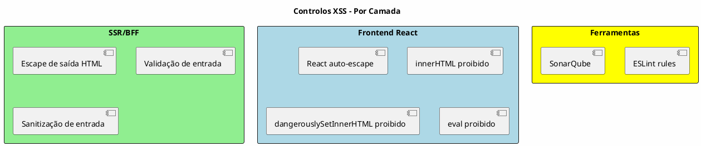
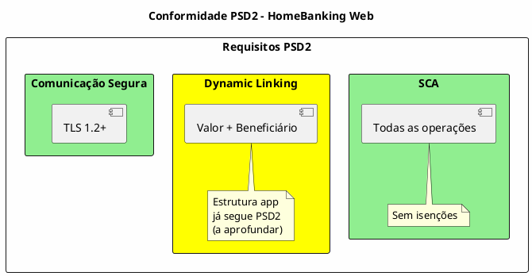

---
aliases:
  - Segurança e Conformidade
tags:
  - nextreality-novobanco-website-sections
  - sections
  - security
  - compliance
  - psd2
  - gdpr
approved: true
created: 2026-01-03
hubs:
  - "[[nextreality]]"
para-code: R
reviewed: true
status: in-progress
---

# 8. Segurança & Conformidade

## Definições e Decisões

> **Definições requeridas:**
> - [DEF-08-seguranca-conformidade.md](../definitions/DEF-08-seguranca-conformidade.md) - Status: completed
>
> **Decisões relacionadas:**
> - [DEC-004-controlos-seguranca-frontend.md](../decisions/DEC-004-controlos-seguranca-frontend.md) - Status: accepted

## Propósito

Definir os requisitos de segurança e conformidade regulatória do HomeBanking Web, incluindo modelo de ameaças, controlos de segurança, e conformidade com PSD2, RGPD, PCI-DSS e regulamentação do Banco de Portugal.

## Conteúdo

### 8.1 Visão Geral de Segurança

### 8.2 Modelo de Ameaças

| Aspeto | Status |
|---------|--------|
| **Threat modeling realizado** | Não (ação pendente) |
| **Principais ameaças identificadas** | _A definir_ |
| **Metodologia** | _A definir_ (STRIDE ou PASTA) |

### 8.3 Controlos de Segurança

#### 8.3.1 Security Headers HTTP

| Header | Valor | Justificação |
|--------|-------|--------------|
| **Content-Security-Policy** | `self` (inicial) | Prevenção XSS, expandir conforme necessário |
| **X-Frame-Options** | `SAMEORIGIN` | Prevenção Clickjacking |
| **X-Content-Type-Options** | `nosniff` | Prevenção MIME sniffing |
| **Strict-Transport-Security** | `max-age` a definir | Força HTTPS |

#### 8.3.2 Subresource Integrity (SRI)

| Aspeto | Decisão |
|---------|---------|
| **Estratégia** | Bibliotecas servidas localmente |
| **Atributos** | `integrity` e `crossorigin` em recursos externos |
| **CDN** | **Não usar** - Todos os recursos devem ser servidos localmente |

#### 8.3.3 Proteção XSS

| Camada | Controlo |
|--------|----------|
| **SSR/BFF** | Escape de saída HTML, validação e sanitização de entrada |
| **React** | Escape automático em JSX |
| **Lint/SAST** | `innerHTML`, `dangerouslySetInnerHTML` e `eval` proibidos via lint e SonarQube |

#### 8.3.4 Proteção CSRF

| Controlo | Implementação |
|----------|---------------|
| **Tokens CSRF** | Rotacionados por request |
| **Cookie de sessão** | `SameSite=Strict`, `Secure`, `HttpOnly` |
| **CORS** | Configurado restritivamente |
| **Métodos seguros** | GET somente idempotentes |

#### 8.3.5 Controlos Backend/BFF

| Aspeto | Status |
|---------|--------|
| Input validation | Detalhes no assessment inicial |
| WAF | _A definir_ com equipa de infraestrutura |

#### 8.3.6 Considerações de Segurança Web vs Mobile

> **Nota Importante:** O ambiente web é **menos protegido** que o ambiente mobile nativo. Esta secção documenta as diferenças e mitigações específicas.

##### Diferenças de Ambiente

| Aspeto | Mobile Nativo | Web Browser |
|--------|---------------|-------------|
| **Ambiente de execução** | Sandboxed, controlado pelo OS | Aberto, partilhado com outras tabs/extensões |
| **Armazenamento** | Keychain/Keystore seguro | LocalStorage/SessionStorage vulnerável a XSS |
| **Código fonte** | Compilado, ofuscado | JavaScript visível, inspecionável |
| **Comunicação** | Certificate pinning possível | Dependente de CA trust store do browser |
| **Biometria** | APIs nativas seguras | WebAuthn (limitado) |
| **Injeção de código** | Difícil (assinatura de apps) | Possível via extensões, XSS |

##### Vetores de Ataque Específicos do Web

| Vetor | Risco | Mitigação |
|-------|-------|-----------|
| **XSS (Cross-Site Scripting)** | Alto | CSP, escape de output, React auto-escape, proibição de innerHTML/eval/dangerouslySetInnerHTML |
| **CSRF (Cross-Site Request Forgery)** | Alto | Tokens CSRF, SameSite cookies, validação de Origin |
| **Clickjacking** | Médio | X-Frame-Options, CSP frame-ancestors |
| **Man-in-the-Browser** | Alto | Não armazenar tokens sensíveis em JS, usar HttpOnly cookies |
| **Session Hijacking** | Alto | Cookies Secure/HttpOnly/SameSite, renovação de sessão |
| **Extensões maliciosas** | Médio | Não expor dados sensíveis no DOM, CSP restritivo |
| **Keyloggers em browser** | Médio | Considerar teclado virtual para PIN (a avaliar) |
| **Inspeção de tráfego** | Médio | TLS 1.2+, HSTS, considerar certificate pinning (limitado em web) |

##### Dados Sensíveis - Tratamento Web

| Dado | Armazenamento Web | Mitigação |
|------|-------------------|-----------|
| **Tokens de sessão** | Cookie HttpOnly, Secure, SameSite=Strict | Nunca em localStorage/sessionStorage |
| **Access tokens** | **Apenas no BFF** (não no browser) | Arquitetura BFF isola tokens do frontend |
| **Credenciais** | Nunca armazenadas | Transmitidas apenas no momento do login |
| **Dados de negócio** | Memória apenas (não persistido) | Limpar ao sair/expirar sessão |

##### Pendências de Revisão de Segurança

| Item | Descrição | Responsável | Prioridade |
|------|-----------|-------------|------------|
| **Credenciais no login** | Revisar quais dados são retornados no login e avaliar risco de exposição em ambiente web | Segurança + Arquitetura | **Alta** |
| **PIN em claro** | Avaliar se PIN/password devem ser cifrados antes de transmissão (além de TLS) | Segurança | Alta |
| **Teclado virtual** | Avaliar necessidade de teclado virtual para entrada de PIN | Segurança + UX | Média |
| **Certificate pinning** | Avaliar viabilidade de certificate pinning em ambiente web | Arquitetura | Média |

> **Ação Requerida:** Antes do go-live, realizar revisão de segurança específica para o canal web, considerando que os controlos disponíveis são diferentes do ambiente mobile nativo.

### 8.4 OWASP Top 10

| Categoria | Status |
|-----------|--------|
| Controlos específicos | _A definir_ |
| SAST/DAST no pipeline | _A definir_ |
| Frequência de scans | _A definir_ |

### 8.5 Conformidade PSD2

| Requisito | Decisão |
|-----------|---------|
| **SCA obrigatório** | Sim, todas as operações |
| **Isenções SCA** | Nenhuma |
| **Dynamic Linking** | Estrutura app já segue PSD2 (a aprofundar) |
| **TLS** | 1.2+ (versão específica a definir) |

### 8.6 Conformidade RGPD

> **Nota do Cliente:** Todo o processo de conformidade RGPD é gerido pelas API. A responsabilidade não é do frontend.

| Aspeto | Status |
|---------|--------|
| Base legal para tratamento | **Gerido pela API** |
| Consentimento | **Gerido pela API** |
| DPO designado | **Gerido pela API** (questão organizacional) |
| ROPA | **Gerido pela API** |

**Decisão:** O frontend apenas consome dados já tratados. A conformidade RGPD é integralmente responsabilidade do backend.

### 8.7 PCI-DSS

> **Nota do Cliente:** Todo o processo de tokenização e processamento de cartões é gerido pelas API. O frontend não processa PAN diretamente.

| Aspeto | Status |
|---------|--------|
| Processamento de PAN | **Gerido pela API** - Frontend não processa |
| Nível de conformidade | **Gerido pela API** |
| Tokenização de cartões | **Gerido pela API** |

**Decisão:** O frontend não lida diretamente com dados de cartão. Toda a conformidade PCI-DSS é responsabilidade do backend.

### 8.8 Banco de Portugal

| Aspeto | Status |
|---------|--------|
| Requisitos regulatórios BdP | **Gerido pela API** |
| Requisitos de reporte | **Gerido pela API** |

### 8.9 Registo de Auditoria

> **Nota do Cliente:** O registo de auditoria é gerido pela API. O frontend pode enviar eventos para o backend registar.

| Aspeto | Status |
|---------|--------|
| Eventos a registar | **Gerido pela API** |
| Formato de logs | **Gerido pela API** |
| Período de retenção | **Gerido pela API** |
| Imutabilidade | **Gerido pela API** |

**Decisão:** O backend é responsável pelo registo de auditoria. O frontend envia eventos para o backend registar centralmente.

### 8.10 Resposta a Incidentes

| Aspeto | Status |
|---------|--------|
| Plano de resposta | _A definir_ |
| SLAs de resposta | _A definir_ |
| CSIRT | _A definir_ |

### 8.11 Gestão de Vulnerabilidades

| Aspeto | Status |
|---------|--------|
| Processo de gestão | _A definir_ |
| SLAs de correção | _A definir_ |
| Bug bounty | _A definir_ |

### 8.12 Segregação de Ambientes

| Aspeto | Status |
|---------|--------|
| Segregação (dev/staging/prod) | _A definir_ |
| Segregação de dados | _A definir_ |

## Entregáveis

- [ ] Modelo de ameaças documentado - Pendente
- [x] Matriz de controlos de segurança - Parcial
- [ ] Checklist OWASP Top 10 - Pendente
- [x] Matriz de conformidade PSD2 - Parcial
- [ ] Matriz de conformidade RGPD - Pendente
- [ ] Avaliação PCI-DSS - Pendente
- [ ] Requisitos Banco de Portugal - Pendente
- [ ] Especificação de audit logging - Pendente
- [ ] Plano de resposta a incidentes - Pendente
- [ ] Processo de gestão de vulnerabilidades - Pendente

## Definições Utilizadas

- [x] [DEF-08-seguranca-conformidade.md](../definitions/DEF-08-seguranca-conformidade.md) - Status: completed

## Decisões Referenciadas

- [x] [DEC-004-controlos-seguranca-frontend.md](../decisions/DEC-004-controlos-seguranca-frontend.md) - Status: accepted

## Itens Pendentes

| Item | Documento | Responsável | Status |
|------|-----------|-------------|--------|
| Threat modeling | DEF-08-seguranca-conformidade | Segurança | Pendente |
| Metodologia threat modeling | DEF-08-seguranca-conformidade | Segurança | Pendente |
| max-age HSTS | DEF-08-seguranca-conformidade | Segurança | Pendente |
| WAF (definição) | DEF-08-seguranca-conformidade | Infraestrutura | Pendente |
| Controlos OWASP Top 10 | DEF-08-seguranca-conformidade | Segurança | Pendente |
| SAST/DAST no pipeline | DEF-08-seguranca-conformidade | DevOps | Pendente |
| Frequência de scans | DEF-08-seguranca-conformidade | Segurança | Pendente |
| Dynamic Linking (aprofundar) | DEF-08-seguranca-conformidade | Arquitetura | Pendente |
| ~~Base legal RGPD~~ | ~~DEF-08~~ | ~~DPO~~ | **Decidido: Gerido pela API** |
| ~~Consentimento RGPD~~ | ~~DEF-08~~ | ~~DPO~~ | **Decidido: Gerido pela API** |
| ~~DPO designado~~ | ~~DEF-08~~ | ~~Legal~~ | **Decidido: Gerido pela API** |
| ~~PCI-DSS avaliação~~ | ~~DEF-08~~ | ~~Compliance~~ | **Decidido: Gerido pela API** |
| ~~Requisitos BdP~~ | ~~DEF-08~~ | ~~Compliance~~ | **Decidido: Gerido pela API** |
| ~~Audit logging~~ | ~~DEF-08~~ | ~~Arquitetura~~ | **Decidido: Gerido pela API** |
| Resposta a incidentes | DEF-08-seguranca-conformidade | Segurança | Pendente |
| Gestão de vulnerabilidades | DEF-08-seguranca-conformidade | Segurança | Pendente |
| Segregação de ambientes | DEF-08-seguranca-conformidade | Infraestrutura | Pendente |
