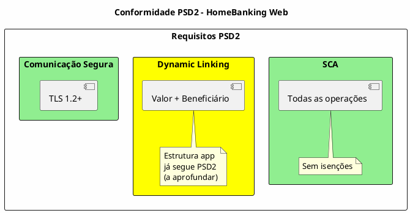

---
aliases:
  - Segurança e Conformidade
tags:
  - nextreality-novobanco-website-sections
  - sections
  - security
  - compliance
  - psd2
  - gdpr
approved: true
created: 2026-01-03
hubs:
  - "[[nextreality]]"
para-code: R
reviewed: true
status: in-progress
---

# 8. Segurança & Conformidade

> **Definições requeridas:**
> - [DEF-08-seguranca-conformidade.md](../definitions/DEF-08-seguranca-conformidade.md) - Status: completed
>
> **Decisões relacionadas:**
> - [DEC-004-controlos-seguranca-frontend.md](../decisions/DEC-004-controlos-seguranca-frontend.md) - Status: accepted

## Propósito

Definir os requisitos de segurança e conformidade regulatória do HomeBanking Web, incluindo modelo de ameaças, controlos de segurança, e conformidade com PSD2, RGPD, PCI-DSS e regulamentação do Banco de Portugal.

## Conteúdo

### 8.1 Visão Geral de Segurança

### 8.2 Modelo de Ameaças

| Aspeto | Status |
|---------|--------|
| **Threat modeling realizado** | Não (ação pendente) |
| **Principais ameaças identificadas** | _A definir_ |
| **Metodologia** | _A definir_ (STRIDE ou PASTA) |

### 8.3 Controlos de Segurança

#### 8.3.1 Security Headers HTTP

| Header | Valor | Justificação |
|--------|-------|--------------|
| **Content-Security-Policy** | `self` (inicial) | Prevenção XSS, expandir conforme necessário |
| **X-Frame-Options** | `SAMEORIGIN` | Prevenção Clickjacking |
| **X-Content-Type-Options** | `nosniff` | Prevenção MIME sniffing |
| **Strict-Transport-Security** | `max-age` a definir | Força HTTPS |

#### 8.3.2 Subresource Integrity (SRI)

| Aspeto | Decisão |
|---------|---------|
| **Estratégia** | Bibliotecas servidas localmente |
| **Atributos** | `integrity` e `crossorigin` em recursos externos |
| **CDN** | Evitar; se necessário, atenção a atualizações de terceiros |

#### 8.3.3 Proteção XSS

| Camada | Controlo |
|--------|----------|
| **SSR/BFF** | Escape de saída HTML, validação e sanitização de entrada |
| **React** | Escape automático em JSX |
| **Lint/SAST** | `innerHTML` e `eval` proibidos via lint e SonarQube |

#### 8.3.4 Proteção CSRF

| Controlo | Implementação |
|----------|---------------|
| **Tokens CSRF** | Rotacionados por request |
| **Cookie de sessão** | `SameSite=Strict`, `Secure`, `HttpOnly` |
| **CORS** | Configurado restritivamente |
| **Métodos seguros** | GET somente idempotentes |

#### 8.3.5 Controlos Backend/BFF

| Aspeto | Status |
|---------|--------|
| Input validation | Detalhes no assessment inicial |
| WAF | _A definir_ com equipa de infraestrutura |

### 8.4 OWASP Top 10

| Categoria | Status |
|-----------|--------|
| Controlos específicos | _A definir_ |
| SAST/DAST no pipeline | _A definir_ |
| Frequência de scans | _A definir_ |

### 8.5 Conformidade PSD2

| Requisito | Decisão |
|-----------|---------|
| **SCA obrigatório** | Sim, todas as operações |
| **Isenções SCA** | Nenhuma |
| **Dynamic Linking** | Estrutura app já segue PSD2 (a aprofundar) |
| **TLS** | 1.2+ (versão específica a definir) |

### 8.6 Conformidade RGPD

| Aspeto | Status |
|---------|--------|
| Base legal para tratamento | _A definir_ |
| Consentimento | _A definir_ |
| DPO designado | _A definir_ |
| ROPA | _A definir_ |

### 8.7 PCI-DSS

| Aspeto | Status |
|---------|--------|
| Processamento de PAN | _A definir_ |
| Nível de conformidade | _A definir_ |
| Tokenização de cartões | _A definir_ |

### 8.8 Banco de Portugal

| Aspeto | Status |
|---------|--------|
| Requisitos regulatórios BdP | _A definir_ |
| Requisitos de reporte | _A definir_ |

### 8.9 Registo de Auditoria

| Aspeto | Status |
|---------|--------|
| Eventos a registar | _A definir_ |
| Formato de logs | _A definir_ |
| Período de retenção | _A definir_ |
| Imutabilidade | _A definir_ |

### 8.10 Resposta a Incidentes

| Aspeto | Status |
|---------|--------|
| Plano de resposta | _A definir_ |
| SLAs de resposta | _A definir_ |
| CSIRT | _A definir_ |

### 8.11 Gestão de Vulnerabilidades

| Aspeto | Status |
|---------|--------|
| Processo de gestão | _A definir_ |
| SLAs de correção | _A definir_ |
| Bug bounty | _A definir_ |

### 8.12 Segregação de Ambientes

| Aspeto | Status |
|---------|--------|
| Segregação (dev/staging/prod) | _A definir_ |
| Segregação de dados | _A definir_ |

## Entregáveis

- [ ] Modelo de ameaças documentado - Pendente
- [x] Matriz de controlos de segurança - Parcial
- [ ] Checklist OWASP Top 10 - Pendente
- [x] Matriz de conformidade PSD2 - Parcial
- [ ] Matriz de conformidade RGPD - Pendente
- [ ] Avaliação PCI-DSS - Pendente
- [ ] Requisitos Banco de Portugal - Pendente
- [ ] Especificação de audit logging - Pendente
- [ ] Plano de resposta a incidentes - Pendente
- [ ] Processo de gestão de vulnerabilidades - Pendente

## Definições Utilizadas

- [x] [DEF-08-seguranca-conformidade.md](../definitions/DEF-08-seguranca-conformidade.md) - Status: completed

## Decisões Referenciadas

- [x] [DEC-004-controlos-seguranca-frontend.md](../decisions/DEC-004-controlos-seguranca-frontend.md) - Status: accepted

## Itens Pendentes

| Item | Documento | Responsável |
|------|-----------|-------------|
| Threat modeling | DEF-08-seguranca-conformidade | Segurança |
| Metodologia threat modeling | DEF-08-seguranca-conformidade | Segurança |
| max-age HSTS | DEF-08-seguranca-conformidade | Segurança |
| WAF (definição) | DEF-08-seguranca-conformidade | Infraestrutura |
| Controlos OWASP Top 10 | DEF-08-seguranca-conformidade | Segurança |
| SAST/DAST no pipeline | DEF-08-seguranca-conformidade | DevOps |
| Frequência de scans | DEF-08-seguranca-conformidade | Segurança |
| Dynamic Linking (aprofundar) | DEF-08-seguranca-conformidade | Arquitetura |
| Base legal RGPD | DEF-08-seguranca-conformidade | DPO |
| Consentimento RGPD | DEF-08-seguranca-conformidade | DPO |
| DPO designado | DEF-08-seguranca-conformidade | Legal |
| ROPA | DEF-08-seguranca-conformidade | DPO |
| PCI-DSS avaliação | DEF-08-seguranca-conformidade | Compliance |
| Requisitos BdP | DEF-08-seguranca-conformidade | Compliance |
| Audit logging | DEF-08-seguranca-conformidade | Arquitetura |
| Resposta a incidentes | DEF-08-seguranca-conformidade | Segurança |
| Gestão de vulnerabilidades | DEF-08-seguranca-conformidade | Segurança |
| Segregação de ambientes | DEF-08-seguranca-conformidade | Infraestrutura |
