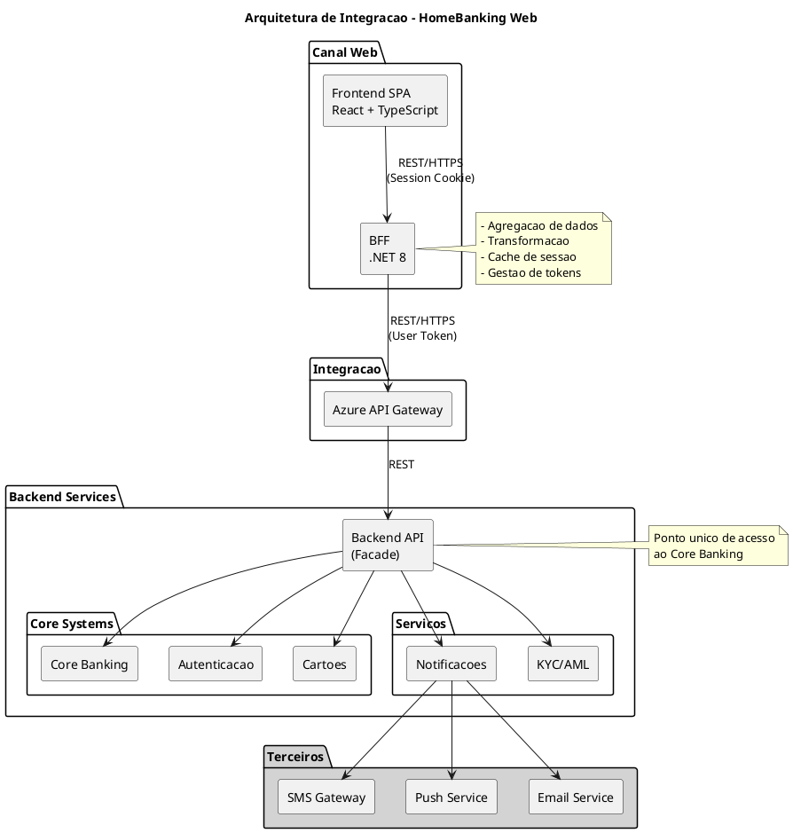
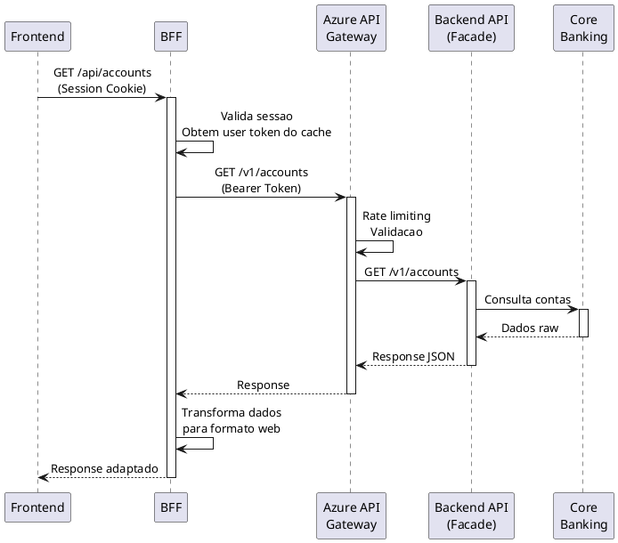
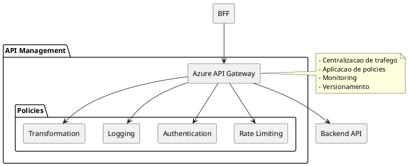

# 9. Integracao & Interfaces Externas

> **Required definitions:** [DEF-09-integracao-interfaces.md](../definitions/DEF-09-integracao-interfaces.md)
> **Related decisions:**
> - [DEC-007-padrao-bff.md](../decisions/DEC-007-padrao-bff.md) - Status: accepted
> - [DEC-010-stack-tecnologica-backend.md](../decisions/DEC-010-stack-tecnologica-backend.md) - Status: accepted

## Proposito

Definir a arquitetura de integracao do HomeBanking Web com sistemas externos, incluindo Core Banking, servicos de terceiros (KYC/AML, Notificacoes, Cartoes), Open Banking PSD2, e mecanismos de comunicacao assincrona. Esta secao estabelece os padroes, SLAs e catalogo de integracoes necessarios para o funcionamento do canal web.

## Conteudo

### 9.1 Visao Geral de Integracoes

O HomeBanking Web segue uma arquitetura de integracao em camadas, onde o **BFF (Backend for Frontend)** atua como ponto unico de integracao entre o frontend e todos os sistemas backend. Nao ha acesso direto do frontend a sistemas externos.



#### Principios de Integracao

| Principio | Descricao |
|-----------|-----------|
| **BFF como Gateway** | Todas as integracoes passam pelo BFF, nunca acesso direto do frontend |
| **Backend API (Facade)** | Ponto unico de acesso aos sistemas Core Banking |
| **Reutilizacao** | Mesmas APIs utilizadas pela app mobile |
| **Transformacao no BFF** | Adaptacao de dados para necessidades especificas do canal web |

### 9.2 Integracao Core Banking

#### Arquitetura de Acesso

O canal web **nao acede diretamente** ao Core Banking. A integracao e feita atraves de uma camada de Facade denominada **Backend API**, que encapsula a complexidade dos sistemas legados.



#### Servicos Consumidos

| Categoria | Servicos | Protocolo |
|-----------|----------|-----------|
| **Contas** | Saldos, Movimentos, Extratos | REST/JSON |
| **Transferencias** | Nacionais, SEPA, Internacionais | REST/JSON |
| **Pagamentos** | Servicos, Impostos, Outros | REST/JSON |
| **Cartoes** | Consulta, Bloqueio, Ativacao, Limites | REST/JSON |
| **Autenticacao** | Login, Sessao, MFA | REST/JSON |

#### Protocolo e Formato

| Aspecto | Especificacao |
|---------|---------------|
| **Protocolo** | REST sobre HTTPS |
| **Formato de dados** | JSON |
| **Versionamento** | Via URL path (ex: `/v1/accounts`) |
| **Autenticacao** | Bearer Token (OAuth 2.0) |
| **APIs** | Mesmas utilizadas pela app mobile |
| **Documentacao** | Nao disponivel (a fornecer) |

#### Transformacao de Dados

O BFF e responsavel por transformar os dados do Backend API para o formato otimizado para o canal web:

| Responsabilidade | Descricao |
|------------------|-----------|
| **Agregacao** | Combinar multiplas chamadas em uma unica resposta |
| **Filtragem** | Remover campos nao necessarios para o frontend |
| **Formatacao** | Adaptar formatos de data, moeda, etc. |
| **Enriquecimento** | Adicionar informacoes calculadas ou derivadas |
| **Cache** | Armazenar dados frequentemente acedidos |

### 9.3 Terceiros - KYC/AML

A integracao com servicos de KYC (Know Your Customer) e AML (Anti-Money Laundering) e **gerida inteiramente pelo Backend**, nao havendo requisitos especificos para o canal web.

| Aspecto | Status |
|---------|--------|
| Provider KYC/AML | Implementado no backend |
| Requisitos no canal web | Nenhum requisito especifico |
| Fluxos de onboarding | Necessita aprofundamento |
| Verificacoes AML em tempo real | Necessita aprofundamento |

### 9.4 Terceiros - Notificacoes

O canal web **gera e recebe** notificacoes, integrando com os servicos de notificacao existentes.

#### Capacidades

| Direcao | Descricao |
|---------|-----------|
| **Gera** | O canal web pode acionar envio de notificacoes (ex: confirmacao de transferencia) |
| **Recebe** | O canal web recebe notificacoes para exibir ao utilizador |

#### Canais de Notificacao

| Canal | Provider | Status |
|-------|----------|--------|
| **SMS** | A definir no assessment | Pendente |
| **Push Notifications** | A definir no assessment | Pendente |
| **Email Transacional** | A definir no assessment | Pendente |

#### Fluxo de Notificacoes


### 9.5 Terceiros - Cartoes

O canal web permite operacoes de gestao de cartoes atraves da integracao com o provider de cartoes.

#### Operacoes Suportadas

| Operacao | Disponivel | Notas |
|----------|------------|-------|
| Consulta de cartoes | Sim | Lista de cartoes do utilizador |
| Bloqueio temporario | Sim | Bloqueio/desbloqueio pelo utilizador |
| Ativacao de cartao | Sim | Ativacao de cartao novo |
| Alteracao de limites | Sim | Ajuste de limites de credito/debito |
| Consulta de movimentos | Sim | Historico de transacoes |
| PIN (alteracao) | Necessita aprofundamento | - |
| 3D Secure | Necessita aprofundamento | - |

#### Provider de Cartoes

| Aspecto | Status |
|---------|--------|
| Provider (emissao/processamento) | Necessita aprofundamento |
| Integracao 3D Secure | Necessita aprofundamento |

### 9.6 Open Banking PSD2

A conformidade PSD2 e tratada a nivel do Backend API. Os detalhes de implementacao para o canal web necessitam aprofundamento.

| Aspecto | Status |
|---------|--------|
| APIs expostas (AISP, PISP) | Necessita aprofundamento |
| APIs consumidas | Necessita aprofundamento |
| Gestao de consentimentos | Necessita aprofundamento |
| Modelo de autorizacao | Necessita aprofundamento |

### 9.7 Gestao de Consentimentos

_Necessita aprofundamento - dependente das decisoes de Open Banking PSD2_

### 9.8 Message Broker

A tecnologia de Message Broker e os eventos a serem publicados/consumidos pelo canal web serao definidos no assessment inicial do projeto.

| Aspecto | Status |
|---------|--------|
| Tecnologia (RabbitMQ, Kafka, Azure Service Bus) | Necessita aprofundamento |
| Eventos publicados | Necessita aprofundamento |
| Eventos consumidos | Necessita aprofundamento |
| Ordenacao/Exactly-once | Necessita aprofundamento |
| Dead-letter strategy | Necessita aprofundamento |

### 9.9 Tratamento de Erros

#### Estrategia de Retry

| Tipo de Erro | Estrategia | Tentativas | Delay |
|--------------|------------|------------|-------|
| **Erros transientes** | Exponential backoff | 3 | 1s, 2s, 4s |
| **Network Timeout** | Immediate retry | 1 | 0s |
| **Rate limiting (429)** | Fixed delay | Ate sucesso | Retry-After header |
| **Erros de negocio (4xx)** | Sem retry | 0 | - |
| **Erros de servidor (5xx)** | Exponential backoff | 3 | 1s, 2s, 4s |

#### Circuit Breaker

| Aspecto | Status |
|---------|--------|
| Implementacao | Nao implementado atualmente |
| Biblioteca | A decidir no assessment (Polly sugerido) |
| Thresholds | A definir |
| Tempo de recuperacao | A definir |

#### Fallback

| Aspecto | Status |
|---------|--------|
| Integracoes com fallback | Necessita aprofundamento |
| Comportamento degradado | Necessita aprofundamento |

#### Comunicacao de Erros ao Utilizador

| Erro | Mensagem | Acao |
|------|----------|------|
| Timeout/Indisponibilidade | "Servico temporariamente indisponivel. Por favor aguarde." | Registo de log |
| Rate limiting | "Muitas tentativas. Por favor aguarde alguns segundos." | Registo de log |
| Erro de negocio | Mensagem especifica da operacao | Orientacao ao utilizador |

### 9.10 SLAs de Integracao

_Os SLAs de integracao dependem de informacoes dos sistemas backend e fornecedores terceiros._

| Integracao | Disponibilidade | Latencia P95 | Timeout |
|------------|-----------------|--------------|---------|
| Backend API (Facade) | Necessita aprofundamento | Necessita aprofundamento | 60s |
| Core Banking | Necessita aprofundamento | Necessita aprofundamento | 60s |
| Notificacoes | Necessita aprofundamento | Necessita aprofundamento | 30s |
| Cartoes | Necessita aprofundamento | Necessita aprofundamento | 60s |
| KYC/AML | N/A (backend) | N/A | N/A |

**Nota:** Janelas de manutencao programadas que afetam integracoes necessitam aprofundamento.

### 9.11 Catalogo de Integracoes

_O catalogo detalhado de integracoes sera documentado no assessment inicial do projeto._

| Aspecto | Status |
|---------|--------|
| Catalogo documentado | Necessita aprofundamento |
| Ferramenta de documentacao | Necessita aprofundamento |
| Ambiente de sandbox | Necessita aprofundamento |

### 9.12 API Management

#### Azure API Gateway

O Azure API Gateway e utilizado como ponto central de gestao de APIs entre o BFF e o Backend API.



#### Funcionalidades

| Funcionalidade | Status |
|----------------|--------|
| **Gateway** | Azure API Gateway |
| **Rate limiting** | Necessita aprofundamento |
| **Throttling diferenciado** | Necessita aprofundamento |
| **Monitoring** | Necessita aprofundamento |

## Diagramas

### Diagrama de Contexto de Integracao

```plantuml
@startuml
!include https://raw.githubusercontent.com/plantuml-stdlib/C4-PlantUML/master/C4_Context.puml

LAYOUT_WITH_LEGEND()

title Diagrama de Contexto - Integracoes HomeBanking Web

Person(user, "Utilizador", "Cliente do banco")

System(web, "HomeBanking Web", "Canal web para homebanking")

System_Ext(mobile, "App Mobile", "Aplicacao mobile existente")
System_Ext(backend, "Backend API", "Facade para Core Banking")
System_Ext(core, "Core Banking", "Sistemas bancarios core")
System_Ext(notif, "Servicos Notificacao", "SMS, Push, Email")
System_Ext(cards, "Provider Cartoes", "Emissao e processamento")

Rel(user, web, "Utiliza", "HTTPS")
Rel(user, mobile, "Utiliza", "HTTPS")

Rel(web, backend, "Integra via BFF", "REST/HTTPS")
Rel(mobile, backend, "Integra", "REST/HTTPS")

Rel(backend, core, "Acede", "Interno")
Rel(backend, notif, "Aciona", "REST")
Rel(backend, cards, "Integra", "REST")

@enduml
```

## Entregaveis

- [x] Diagrama de integracao de alto nivel
- [ ] Catalogo de integracoes documentado
- [ ] Especificacao de contratos de API (OpenAPI)
- [ ] Definicao de SLAs por integracao
- [x] Mapeamento de erros e fallbacks
- [ ] Documentacao de fluxos assincronos
- [ ] Matriz de dependencias externas

## Definicoes Utilizadas

- [x] [DEF-09-integracao-interfaces.md](../definitions/DEF-09-integracao-interfaces.md) - Status: in-progress

## Decisoes Referenciadas

- [x] [DEC-007-padrao-bff.md](../decisions/DEC-007-padrao-bff.md) - Status: accepted
- [x] [DEC-010-stack-tecnologica-backend.md](../decisions/DEC-010-stack-tecnologica-backend.md) - Status: accepted

## Itens Pendentes

| Item | Responsavel | Prioridade |
|------|-------------|------------|
| Tecnologia de Message Broker | Arquitetura | Alta |
| SLAs de integracao com Backend API | Arquitetura + Cliente | Alta |
| Providers de notificacao (SMS, Push, Email) | Assessment | Media |
| Open Banking PSD2 - APIs expostas/consumidas | Assessment | Media |
| Circuit Breaker - biblioteca e configuracao | Assessment | Media |
| Catalogo de APIs documentado | Desenvolvimento | Baixa |
| Ambiente de sandbox | Infraestrutura | Baixa |
