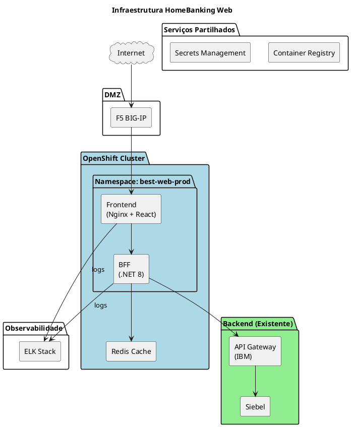

# 10. Arquitetura Operacional

## Definições e Decisões

> **Definição:** [DEF-10-arquitetura-operacional.md](../definitions/DEF-10-arquitetura-operacional.md)

## Propósito

Definir a arquitetura operacional do HomeBanking Web, incluindo infraestrutura de containers, ambientes, pipelines CI/CD, estratégia de deploy, gestão de secrets e disaster recovery.

## Conteúdo

### 10.1 Infraestrutura

A aplicação será deployada em ambiente containerizado **OpenShift**.

| Aspeto | Especificação |
|---------|---------------|
| **Plataforma** | OpenShift |
| **Load Balancer** | F5 BIG-IP |
| **Ingress** | OpenShift Routes |
| **Container Registry** | A validar com equipa de infra |
| **Secrets** | A validar com equipa de infra |

> **Nota:** Os detalhes específicos de infraestrutura (registry, secrets, networking) serão validados com a equipa de infraestrutura do NovoBanco, uma vez que reutilizam componentes existentes.

#### Requisitos de Imagens Container (OpenShift-Compliant)

| Requisito | Descrição |
|-----------|-----------|
| Utilizador não-root | Container executa como utilizador arbitrário (UID > 1000) |
| Filesystem read-only | Volumes temporários montados explicitamente |
| Portas > 1024 | Não utilizar portas privilegiadas |
| Base image | Red Hat UBI (Universal Base Image) recomendado |
| Health checks | Liveness e Readiness probes obrigatórios |

### 10.2 Ambientes

A aplicação utiliza três ambientes, segregados por **namespaces** no cluster OpenShift.

| Ambiente | Propósito | Namespace | Promoção |
|----------|-----------|-----------|----------|
| **dev** | Desenvolvimento e integração | `best-web-dev` | Automática (CI) |
| **qa** | Testes integrados e UAT | `best-web-qa` | Automática (após dev OK) |
| **prod** | Produção | `best-web-prod` | Manual (aprovação) |

> **Nota:** A nomenclatura dos namespaces segue o padrão do ecossistema BEST. A existência de F5 em cada ambiente será validada com a equipa de infraestrutura.

#### Segregação de Ambientes

| Tipo | Mecanismo |
|------|-----------|
| Lógica | Namespaces Kubernetes separados |
| Rede | Network Policies por namespace |
| Secrets | Key Vault com políticas por ambiente |
| RBAC | Service accounts distintos por ambiente |

### 10.3 CI/CD Pipeline

> **Nota:** O pipeline de CI/CD já se encontra implementado no NovoBanco e será **reutilizado** para este projeto. Os detalhes específicos serão validados com a equipa de infraestrutura.

#### Visão Geral

O projeto reutiliza a infraestrutura de CI/CD existente no NovoBanco:

| Aspeto | Abordagem |
|--------|-----------|
| **Pipeline** | Reutilização do pipeline existente |
| **Branching** | GitFlow (padrão NB) |
| **Quality Gates** | Conforme políticas existentes |
| **Deploy** | Integrado com OpenShift |

#### Quality Gates (Requisitos Mínimos)

| Gate | Requisito |
|------|-----------|
| Unit Tests | 100% pass |
| Code Coverage | >= 80% |
| SAST | 0 Critical, 0 High |
| Lint | 0 errors |

> **Pendência:** Agendar sessão com equipa de infraestrutura para validar integração com pipeline existente.

### 10.4 Estratégia de Deploy

| Aspeto | Especificação |
|---------|---------------|
| **Estratégia** | Rolling Update |
| **Zero downtime** | Sim |
| **maxSurge** | 25% |
| **maxUnavailable** | 0 |
| **Réplicas mínimas** | 2 |
| **Health checks** | Readiness + Liveness probes |
| **Rollback** | Automático via Kubernetes |

#### Aprovações por Ambiente

| Ambiente | Aprovação | Aprovadores |
|----------|-----------|-------------|
| DEV | Automática | - |
| QA | Automática | - |
| PROD | Manual | Tech Lead + PO |

### 10.5 Secrets Management

> **Nota:** A gestão de secrets reutiliza a infraestrutura existente no NovoBanco. Os detalhes serão validados com a equipa de infraestrutura.

| Aspeto | Especificação |
|---------|---------------|
| **Ferramenta** | A validar com equipa de infra |
| **Secrets geridos** | Connection strings, API keys, certificados |
| **Rotação** | Conforme políticas existentes |

### 10.6 Container Registry

> **Nota:** O container registry reutiliza a infraestrutura existente no NovoBanco.

| Aspeto | Configuração |
|---------|--------------|
| **Registry** | A validar com equipa de infra |
| **Scanning** | Conforme políticas existentes |

#### Tagging Strategy

| Tag | Uso |
|-----|-----|
| `{semver}` | Versão semântica (ex: `1.2.3`) |
| `{branch}-{sha}` | Feature branches (ex: `develop-abc1234`) |
| `latest` | Última versão de produção |

### 10.7 Disaster Recovery

| Aspeto | Configuração |
|---------|--------------|
| **Tipo** | Cluster réplica (standby passivo) |
| **RTO** | 30 minutos |
| **RPO** | 5 minutos |
| **Failover** | Manual (decisão de negócio) |

> **Nota:** Canal web é stateless. Dados estão no backend existente com DR próprio. DR do canal web foca na disponibilidade da aplicação.

### 10.8 Backup

O canal web **não requer backup dedicado**:

| Componente | Backup | Frequência | Retenção |
|------------|--------|------------|----------|
| **Código fonte** | Git | Cada commit | Infinito |
| **Container images** | ACR | Cada build | 90 dias |
| **Secrets** | Azure Key Vault (managed) | Automático | 90 dias |
| **Dados de negócio** | Backend existente | N/A | N/A |
| **Sessões** | Redis (transitório) | N/A | N/A |

### 10.9 Runbooks

| Runbook | Trigger | Responsável |
|---------|---------|-------------|
| Deploy para Produção | Release aprovada | DevOps |
| Rollback de Emergência | Incidente P1 | DevOps |
| Escalação de Pods | Alerta de carga | DevOps / Auto |
| Rotação de Secrets | Schedule / Incidente | SecOps |
| Failover DR | Indisponibilidade > RTO | Infra |

## Itens Pendentes - Validação com Equipa de Infraestrutura

> **Ação Requerida:** Agendar sessão com equipa de infraestrutura do NovoBanco para validar os seguintes pontos.

| Item | Descrição | Prioridade |
|------|-----------|------------|
| **Container Registry** | Qual registry será utilizado? Políticas de scanning? | Alta |
| **Secrets Management** | Qual ferramenta? Como injetar secrets nos pods? | Alta |
| **CI/CD Pipeline** | Integração com pipeline existente | Alta |
| **F5 por ambiente** | Existe F5 em todos os ambientes (dev/qa/prod)? | Média |
| **Nomenclatura namespaces** | Confirmar `best-web-*` como padrão | Média |
| **Networking** | Network policies, ingress configuration | Média |

## Decisões Referenciadas

- [DEC-006-estrategia-containers-openshift.md](../decisions/DEC-006-estrategia-containers-openshift.md) - Containers OpenShift-compliant
- [DEC-008-stack-observabilidade-elk.md](../decisions/DEC-008-stack-observabilidade-elk.md) - Stack de observabilidade
- [DEC-010-stack-tecnologica-backend.md](../decisions/DEC-010-stack-tecnologica-backend.md) - Stack Backend

## Definições Utilizadas

- [DEF-10-arquitetura-operacional.md](../definitions/DEF-10-arquitetura-operacional.md) - Detalhes completos
- [DEF-02-requisitos-nao-funcionais.md](../definitions/DEF-02-requisitos-nao-funcionais.md) - RTO/RPO
