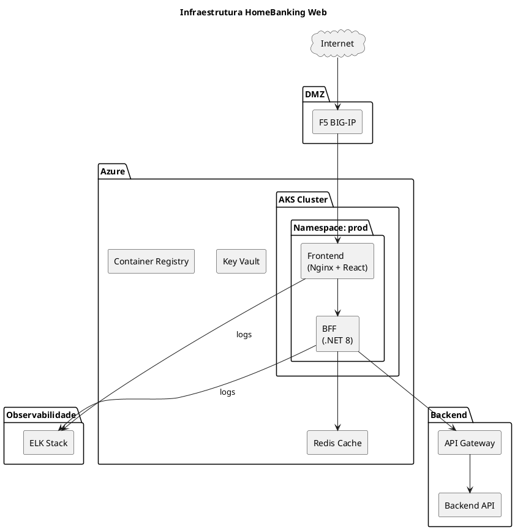
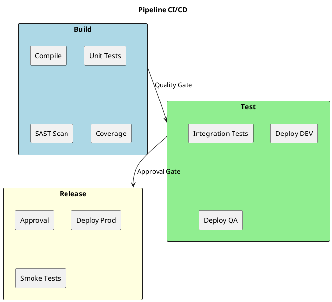

# 10. Arquitetura Operacional

> **Definição:** [DEF-10-arquitetura-operacional.md](../definitions/DEF-10-arquitetura-operacional.md)

## Propósito

Definir a arquitetura operacional do HomeBanking Web, incluindo infraestrutura de containers, ambientes, pipelines CI/CD, estratégia de deploy, gestão de secrets e disaster recovery.

## Conteúdo

### 10.1 Infraestrutura

A aplicação será deployada em ambiente containerizado, com imagens **compliant com OpenShift** para futura migração.

| Aspeto | Especificação |
|---------|---------------|
| **Plataforma atual** | Azure Kubernetes Service (AKS) |
| **Plataforma futura** | OpenShift (em homologação) |
| **Load Balancer** | F5 BIG-IP |
| **Ingress Controller** | NGINX Ingress / OpenShift Routes |
| **Container Registry** | Azure Container Registry (ACR) |

#### Requisitos de Imagens Container (OpenShift-Compliant)

| Requisito | Descrição |
|-----------|-----------|
| Utilizador não-root | Container executa como utilizador arbitrário (UID > 1000) |
| Filesystem read-only | Volumes temporários montados explicitamente |
| Portas > 1024 | Não utilizar portas privilegiadas |
| Base image | Red Hat UBI (Universal Base Image) recomendado |
| Health checks | Liveness e Readiness probes obrigatórios |

### 10.2 Ambientes

A aplicação utiliza três ambientes, segregados por **namespaces** no cluster AKS.

| Ambiente | Propósito | Namespace | Promoção |
|----------|-----------|-----------|----------|
| **dev** | Desenvolvimento e integração | `homebanking-dev` | Automática (CI) |
| **qa** | Testes integrados e UAT | `homebanking-qa` | Automática (após dev OK) |
| **prod** | Produção | `homebanking-prod` | Manual (aprovação) |

#### Segregação de Ambientes

| Tipo | Mecanismo |
|------|-----------|
| Lógica | Namespaces Kubernetes separados |
| Rede | Network Policies por namespace |
| Secrets | Key Vault com políticas por ambiente |
| RBAC | Service accounts distintos por ambiente |

### 10.3 CI/CD Pipeline

#### Stack de CI/CD

| Componente | Ferramenta |
|------------|------------|
| **Repositório** | Azure Repos (Git) |
| **CI/CD Platform** | Azure Pipelines |
| **Container Registry** | Azure Container Registry (ACR) |
| **Secrets** | Azure Key Vault |
| **IaC** | Helm Charts + Terraform |
| **Branching** | GitFlow |

#### Estratégia de Branching (GitFlow)

| Branch | Propósito | Deploy Automático |
|--------|-----------|-------------------|
| `feature/*` | Desenvolvimento de features | Não |
| `develop` | Integração contínua | DEV |
| `release/*` | Preparação de release | QA |
| `main` | Produção | PROD (c/ aprovação) |
| `hotfix/*` | Correções urgentes | PROD (c/ aprovação) |

#### Pipeline Overview

#### Quality Gates

| Gate | Ferramenta | Threshold | Bloqueante |
|------|------------|-----------|------------|
| Unit Tests | Vitest / xUnit | 100% pass | Sim |
| Code Coverage | Istanbul / Coverlet | >= 80% | Sim |
| SAST | SonarQube / Checkmarx | 0 Critical, 0 High | Sim |
| Lint | ESLint / .NET Analyzers | 0 errors | Sim |
| Build | Azure Pipelines | Success | Sim |

### 10.4 Estratégia de Deploy

| Aspeto | Especificação |
|---------|---------------|
| **Estratégia** | Rolling Update |
| **Zero downtime** | Sim |
| **maxSurge** | 25% |
| **maxUnavailable** | 0 |
| **Réplicas mínimas** | 2 |
| **Health checks** | Readiness + Liveness probes |
| **Rollback** | Automático via Kubernetes |

#### Aprovações por Ambiente

| Ambiente | Aprovação | Aprovadores |
|----------|-----------|-------------|
| DEV | Automática | - |
| QA | Automática | - |
| PROD | Manual | Tech Lead + PO |

### 10.5 Secrets Management

| Aspeto | Especificação |
|---------|---------------|
| **Ferramenta** | Azure Key Vault |
| **Injeção** | Secret Store CSI Driver |
| **Acesso** | Managed Identity por namespace |
| **Rotação** | Suportada (CSI driver faz refresh) |
| **Secrets geridos** | Connection strings, API keys, certificados |

#### Política de Rotação

| Tipo de Secret | Frequência | Responsável |
|----------------|------------|-------------|
| API Keys | 90 dias | Automático |
| Certificados TLS | Anual | Infra |
| DB Credentials | 180 dias | DBA |

### 10.6 Container Registry

| Aspeto | Configuração |
|---------|--------------|
| Registry | Azure Container Registry (ACR) |
| Autenticação | Managed Identity |
| Scanning | Microsoft Defender for Containers |
| Retenção | 90 dias para tags não-latest |
| Naming | `acr.azurecr.io/homebanking/{component}:{version}` |

#### Tagging Strategy

| Tag | Uso |
|-----|-----|
| `{semver}` | Versão semântica (ex: `1.2.3`) |
| `{branch}-{sha}` | Feature branches (ex: `develop-abc1234`) |
| `latest` | Última versão de produção |

### 10.7 Disaster Recovery

| Aspeto | Configuração |
|---------|--------------|
| **Tipo** | Cluster réplica (standby passivo) |
| **RTO** | 30 minutos |
| **RPO** | 5 minutos |
| **Failover** | Manual (decisão de negócio) |

> **Nota:** Canal web é stateless. Dados estão no backend existente com DR próprio. DR do canal web foca na disponibilidade da aplicação.

### 10.8 Backup

O canal web **não requer backup dedicado**:

| Componente | Backup | Frequência | Retenção |
|------------|--------|------------|----------|
| **Código fonte** | Git | Cada commit | Infinito |
| **Container images** | ACR | Cada build | 90 dias |
| **Secrets** | Azure Key Vault (managed) | Automático | 90 dias |
| **Dados de negócio** | Backend existente | N/A | N/A |
| **Sessões** | Redis (transitório) | N/A | N/A |

### 10.9 Runbooks

| Runbook | Trigger | Responsável |
|---------|---------|-------------|
| Deploy para Produção | Release aprovada | DevOps |
| Rollback de Emergência | Incidente P1 | DevOps |
| Escalação de Pods | Alerta de carga | DevOps / Auto |
| Rotação de Secrets | Schedule / Incidente | SecOps |
| Failover DR | Indisponibilidade > RTO | Infra |

## Decisões Referenciadas

- [DEC-006-estrategia-containers-openshift.md](../decisions/DEC-006-estrategia-containers-openshift.md) - Containers OpenShift-compliant
- [DEC-008-stack-observabilidade-elk.md](../decisions/DEC-008-stack-observabilidade-elk.md) - Stack de observabilidade
- [DEC-010-stack-tecnologica-backend.md](../decisions/DEC-010-stack-tecnologica-backend.md) - Stack Backend

## Definições Utilizadas

- [DEF-10-arquitetura-operacional.md](../definitions/DEF-10-arquitetura-operacional.md) - Detalhes completos
- [DEF-02-requisitos-nao-funcionais.md](../definitions/DEF-02-requisitos-nao-funcionais.md) - RTO/RPO
