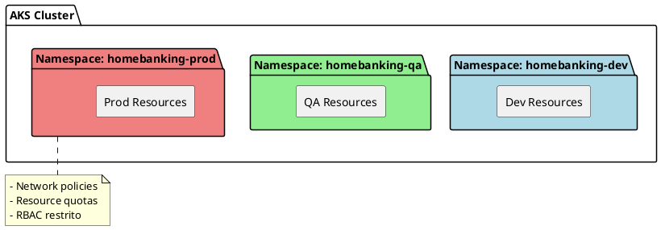
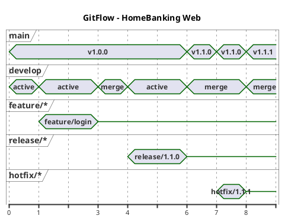
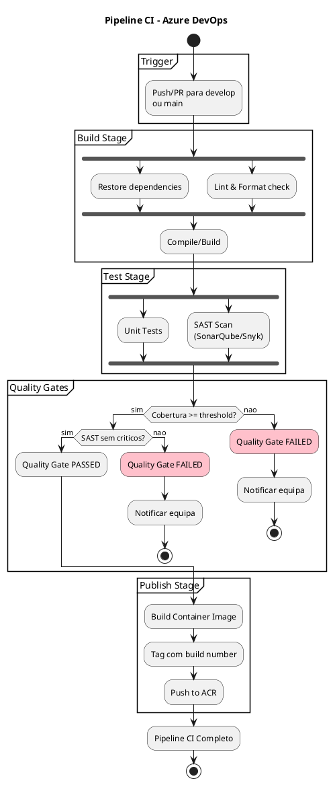
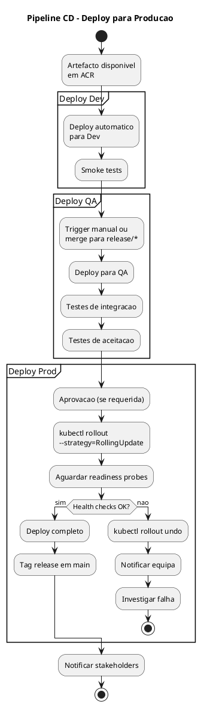
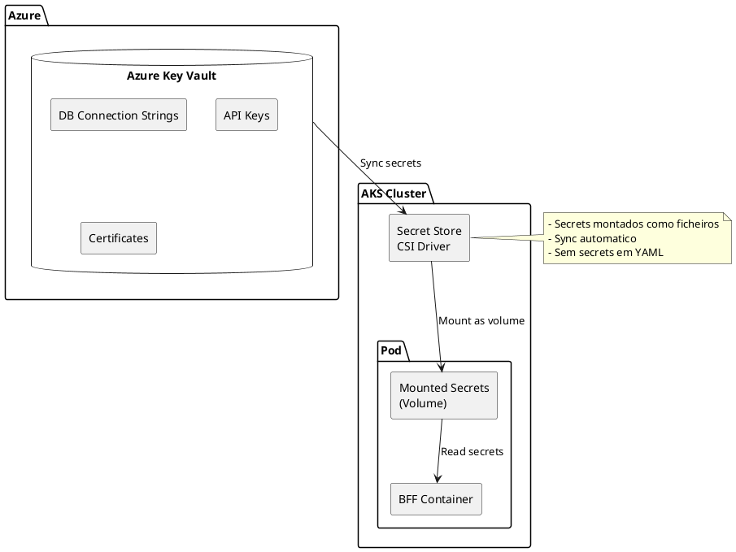

# 10. Arquitetura Operacional

> **Required definitions:** [DEF-10-arquitetura-operacional.md](../definitions/DEF-10-arquitetura-operacional.md)
> **Related decisions:**
> - [DEC-006-estrategia-containers-openshift.md](../decisions/DEC-006-estrategia-containers-openshift.md) - Status: accepted
> - [DEC-008-stack-observabilidade-elk.md](../decisions/DEC-008-stack-observabilidade-elk.md) - Status: accepted
> - [DEC-010-stack-tecnologica-backend.md](../decisions/DEC-010-stack-tecnologica-backend.md) - Status: accepted

## Proposito

Definir a arquitetura operacional do HomeBanking Web, incluindo infraestrutura de containers (AKS/OpenShift), ambientes, segregacao, pipelines CI/CD, estrategia de deploy, gestao de secrets, container registry e runbooks operacionais.

## Conteudo

### 10.1 Infraestrutura

A aplicacao sera deployada em ambiente containerizado, com imagens **compliant com OpenShift** para futura migracao.

#### Plataforma Base

| Aspecto | Especificacao |
|---------|---------------|
| **Plataforma atual** | Azure Kubernetes Service (AKS) |
| **Plataforma futura** | OpenShift (em homologacao) |
| **Requisito** | Imagens container compliant com OpenShift |
| **Load Balancer** | F5 BIG-IP |
| **Clusters** | Necessita aprofundamento |
| **Topologia de rede** | Necessita aprofundamento |

#### Diagrama de Infraestrutura

```plantuml
@startuml
skinparam componentStyle rectangle
skinparam backgroundColor white

title Infraestrutura HomeBanking Web

cloud "Internet" {
}

package "DMZ" {
  [F5 BIG-IP\nLoad Balancer] as LB
}

package "Azure" {
  package "AKS Cluster" {
    package "Namespace: homebanking-dev" {
      [Frontend Dev] as FE_DEV
      [BFF Dev] as BFF_DEV
    }
    package "Namespace: homebanking-qa" {
      [Frontend QA] as FE_QA
      [BFF QA] as BFF_QA
    }
    package "Namespace: homebanking-prod" {
      [Frontend Prod] as FE_PROD
      [BFF Prod] as BFF_PROD
    }
    [Ingress Controller] as IC
  }

  database "Azure Redis Cache" as REDIS
  database "Azure Key Vault" as KV
  database "Azure Container\nRegistry" as ACR
}

package "Backend Zone" {
  [Azure API Gateway] as GW
  [Backend API] as API
}

Internet --> LB
LB --> IC
IC --> FE_PROD
FE_PROD --> BFF_PROD
BFF_PROD --> REDIS
BFF_PROD --> GW
GW --> API

note right of AKS
  Segregacao por Namespaces
  - homebanking-dev
  - homebanking-qa
  - homebanking-prod
end note

@enduml
```

#### Componentes Containerizados

| Componente | Descricao | Base Image |
|------------|-----------|------------|
| **Frontend** | React SPA servido via Nginx | nginx:alpine |
| **BFF** | .NET 8 API | mcr.microsoft.com/dotnet/aspnet:8.0 |

### 10.2 Ambientes

A aplicacao utiliza tres ambientes, segregados por **namespaces** no cluster AKS.

| Ambiente | Namespace | Proposito |
|----------|-----------|-----------|
| **Development** | homebanking-dev | Desenvolvimento e testes iniciais |
| **QA** | homebanking-qa | Testes de integracao e aceitacao |
| **Production** | homebanking-prod | Ambiente de producao |

#### Caracteristicas por Ambiente

| Aspecto | Dev | QA | Prod |
|---------|-----|----|----|
| **Replicas Frontend** | 1 | 2 | 3+ |
| **Replicas BFF** | 1 | 2 | 3+ |
| **Resources (CPU/Mem)** | Minimos | Medios | Conforme carga |
| **Dados** | Mock/Dev | Sanitizados | Reais |
| **Acesso** | Developers | QA Team | Restrito |

#### Ambiente de DR

| Aspecto | Status |
|---------|--------|
| **Site de DR** | Nao disponivel atualmente |
| **Estrategia** | Necessita aprofundamento |

### 10.3 Segregacao

#### Estrategia de Segregacao

Os ambientes sao segregados atraves de **Kubernetes Namespaces** dentro do mesmo cluster AKS.



| Aspecto | Status |
|---------|--------|
| **Metodo** | Kubernetes Namespaces |
| **Segregacao de rede** | Necessita aprofundamento |
| **Controlos de acesso** | Necessita aprofundamento |

### 10.4 CI/CD Pipelines

#### Stack de CI/CD

| Componente | Ferramenta |
|------------|------------|
| **CI/CD Platform** | Azure DevOps |
| **Repositorio** | Azure Repos |
| **Branching Strategy** | GitFlow |
| **Container Registry** | Azure Container Registry (ACR) |
| **Artefactos** | Azure Artifacts |

#### Estrategia de Branching (GitFlow)



| Branch | Proposito | Deploy |
|--------|-----------|--------|
| **main** | Codigo em producao | Prod |
| **develop** | Integracao de features | Dev |
| **feature/*** | Desenvolvimento de features | - |
| **release/*** | Preparacao de release | QA |
| **hotfix/*** | Correcoes urgentes | Prod |

#### Pipeline de Build (CI)



#### Quality Gates

| Gate | Ferramenta | Threshold |
|------|------------|-----------|
| **Cobertura de testes** | Azure DevOps | A definir |
| **SAST** | SonarQube/Snyk | Sem vulnerabilidades criticas |
| **Code smells** | SonarQube | A definir |
| **DAST** | Nao implementado | - |

### 10.5 Estrategia de Deploy

#### Metodo de Deploy

| Aspecto | Especificacao |
|---------|---------------|
| **Estrategia** | Rolling Update |
| **Orquestrador** | Kubernetes (AKS) |
| **Zero downtime** | Sim (via rolling update) |
| **Janela de deploy** | Necessita aprofundamento |
| **Aprovacao** | Necessita aprofundamento |

#### Fluxo de Deploy



#### Rolling Update Configuration

```yaml
# Exemplo de configuracao Kubernetes
spec:
  strategy:
    type: RollingUpdate
    rollingUpdate:
      maxSurge: 1
      maxUnavailable: 0
  template:
    spec:
      containers:
      - name: bff
        readinessProbe:
          httpGet:
            path: /health/ready
            port: 8080
          initialDelaySeconds: 10
          periodSeconds: 5
        livenessProbe:
          httpGet:
            path: /health/live
            port: 8080
          initialDelaySeconds: 15
          periodSeconds: 10
```

### 10.6 Infraestrutura como Codigo (IaC)

| Aspecto | Status |
|---------|--------|
| **Ferramenta IaC** | Necessita aprofundamento |
| **Templates/Charts** | Necessita aprofundamento |
| **Versionamento** | Necessita aprofundamento |

### 10.7 Secrets Management

#### Solucao de Secrets

| Aspecto | Especificacao |
|---------|---------------|
| **Ferramenta** | Azure Key Vault |
| **Injeccao** | Secret Store CSI Driver |
| **Rotacao** | Necessita aprofundamento |

#### Arquitetura de Secrets



#### Secrets Geridos

| Secret | Tipo | Rotacao |
|--------|------|---------|
| Database connection strings | Connection String | A definir |
| Backend API credentials | API Key | A definir |
| Redis connection | Connection String | A definir |
| Certificates (TLS) | Certificate | A definir |

### 10.8 Container Registry

| Aspecto | Especificacao |
|---------|---------------|
| **Registry** | Azure Container Registry (ACR) |
| **Scanning de vulnerabilidades** | Necessita aprofundamento |
| **Retencao de imagens** | Necessita aprofundamento |

#### Politica de Tagging

| Tag | Exemplo | Uso |
|-----|---------|-----|
| **Build number** | `1.0.0-build.123` | Identificacao unica |
| **Latest** | `latest` | Ultima build de develop |
| **Release** | `v1.0.0` | Versao de producao |

### 10.9 Disaster Recovery

| Aspecto | Status |
|---------|--------|
| **Site de DR** | Nao disponivel |
| **RTO** | Necessita aprofundamento |
| **RPO** | Necessita aprofundamento |
| **Failover** | Necessita aprofundamento |
| **Testes de DR** | Necessita aprofundamento |

**Nota:** A estrategia de DR deve ser definida em conjunto com a equipa de infraestrutura do cliente.

### 10.10 Backup Strategy

O canal web **nao requer backup dedicado** pois:

| Aspecto | Justificacao |
|---------|--------------|
| **Dados de negocio** | Armazenados nos sistemas backend (ja possuem politicas de backup) |
| **Sessoes** | Transitorias, armazenadas em Redis (cache) |
| **Configuracoes** | Versionadas em Azure Repos |
| **Imagens** | Armazenadas em ACR com retencao |

#### Componentes e Backup

| Componente | Backup Necessario | Responsavel |
|------------|-------------------|-------------|
| Codigo fonte | Nao (versionado em Git) | Azure Repos |
| Container images | Nao (ACR com retencao) | ACR |
| Configuracoes K8s | Nao (IaC em Git) | Azure Repos |
| Secrets | Sim (Key Vault managed) | Azure Key Vault |
| Dados de sessao | Nao (transitorios) | - |
| Dados de negocio | Sim (sistemas backend) | Backend |

### 10.11 Runbooks

#### Runbooks Operacionais

| Runbook | Descricao | Status |
|---------|-----------|--------|
| Deploy para Producao | Procedimento de deploy | Necessita aprofundamento |
| Rollback | Reverter deploy falhado | Necessita aprofundamento |
| Scaling Manual | Escalar pods | Necessita aprofundamento |
| Restart Servicos | Reiniciar pods/deployments | Necessita aprofundamento |
| Rotacao de Secrets | Atualizar secrets | Necessita aprofundamento |

#### Runbooks de Incidentes

| Runbook | Descricao | Status |
|---------|-----------|--------|
| Alta Latencia | Diagnostico de performance | Necessita aprofundamento |
| Servico Indisponivel | Recuperacao de servico | Necessita aprofundamento |
| Incidente de Seguranca | Resposta a incidente | Necessita aprofundamento |
| Falha de Integracao | Diagnostico de integracao | Necessita aprofundamento |

## Diagramas

### Visao Geral da Arquitetura Operacional

```plantuml
@startuml
!include https://raw.githubusercontent.com/plantuml-stdlib/C4-PlantUML/master/C4_Container.puml

LAYOUT_WITH_LEGEND()

title Arquitetura Operacional - HomeBanking Web

Person(dev, "Developer", "Equipa de desenvolvimento")
Person(ops, "Operations", "Equipa de operacoes")

System_Boundary(devops, "Azure DevOps") {
  Container(repos, "Azure Repos", "Git", "Codigo fonte")
  Container(pipelines, "Pipelines", "CI/CD", "Build e Deploy")
}

System_Boundary(azure, "Azure Cloud") {
  Container(acr, "Container Registry", "ACR", "Imagens Docker")
  Container(kv, "Key Vault", "Secrets", "Gestao de secrets")

  System_Boundary(aks, "AKS Cluster") {
    Container(fe, "Frontend", "Nginx + React", "SPA")
    Container(bff, "BFF", ".NET 8", "Backend for Frontend")
  }
}

System_Ext(lb, "F5 BIG-IP", "Load Balancer")
System_Ext(backend, "Backend API", "Sistemas backend")

Rel(dev, repos, "Push code")
Rel(repos, pipelines, "Trigger")
Rel(pipelines, acr, "Push images")
Rel(pipelines, aks, "Deploy")
Rel(kv, bff, "Inject secrets")
Rel(lb, fe, "Route traffic")
Rel(bff, backend, "API calls")
Rel(ops, pipelines, "Monitor/Approve")

@enduml
```

## Entregaveis

- [x] Diagrama de infraestrutura
- [x] Documentacao de ambientes
- [x] Pipeline CI/CD documentado
- [ ] Helm charts / templates IaC
- [x] Configuracao de secrets management
- [ ] Plano de DR documentado
- [ ] Runbooks operacionais

## Definicoes Utilizadas

- [x] [DEF-10-arquitetura-operacional.md](../definitions/DEF-10-arquitetura-operacional.md) - Status: in-progress

## Decisoes Referenciadas

- [x] [DEC-006-estrategia-containers-openshift.md](../decisions/DEC-006-estrategia-containers-openshift.md) - Status: accepted
- [x] [DEC-008-stack-observabilidade-elk.md](../decisions/DEC-008-stack-observabilidade-elk.md) - Status: accepted
- [x] [DEC-010-stack-tecnologica-backend.md](../decisions/DEC-010-stack-tecnologica-backend.md) - Status: accepted

## Itens Pendentes

| Item | Responsavel | Prioridade |
|------|-------------|------------|
| Ferramenta de IaC (Helm/Terraform) | Arquitetura | Alta |
| Quality gates - thresholds | QA + Arquitetura | Alta |
| Janela de deploy e aprovacoes | Operacoes | Media |
| Estrategia de DR | Infraestrutura + Cliente | Media |
| Runbooks operacionais | Operacoes | Media |
| Scanning de imagens ACR | Seguranca | Media |
| Politica de retencao ACR | Operacoes | Baixa |
| Segregacao de rede entre namespaces | Infraestrutura | Baixa |
