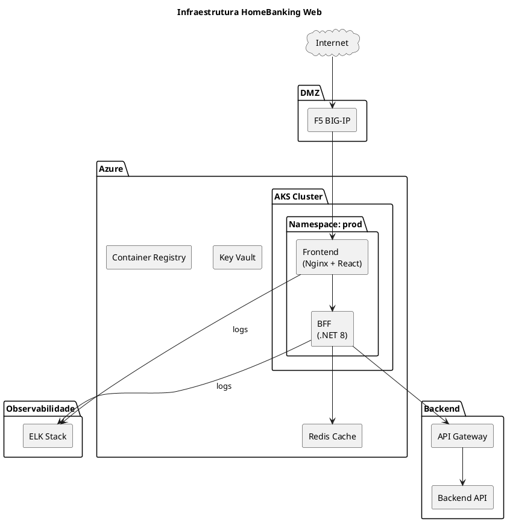
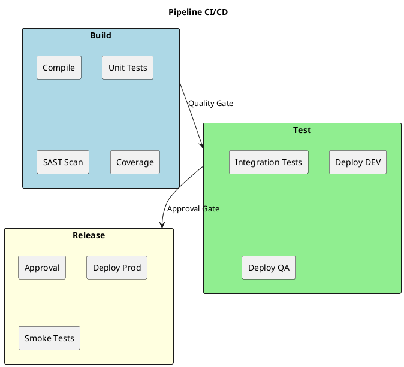
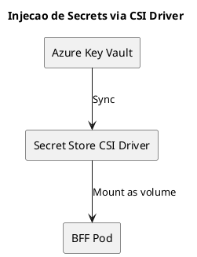

# 10. Arquitetura Operacional

> **Definicao:** [DEF-10-arquitetura-operacional.md](../definitions/DEF-10-arquitetura-operacional.md)

## Proposito

Definir a arquitetura operacional do HomeBanking Web, incluindo infraestrutura de containers, ambientes, pipelines CI/CD, estrategia de deploy, gestao de secrets e disaster recovery.

## Conteudo

### 10.1 Infraestrutura

A aplicacao sera deployada em ambiente containerizado, com imagens **compliant com OpenShift** para futura migracao.

| Aspecto | Especificacao |
|---------|---------------|
| **Plataforma atual** | Azure Kubernetes Service (AKS) |
| **Plataforma futura** | OpenShift (em homologacao) |
| **Load Balancer** | F5 BIG-IP |
| **Ingress Controller** | NGINX Ingress / OpenShift Routes |
| **Container Registry** | Azure Container Registry (ACR) |

#### Requisitos de Imagens Container (OpenShift-Compliant)

| Requisito | Descricao |
|-----------|-----------|
| Usuario nao-root | Container executa como usuario arbitrario (UID > 1000) |
| Filesystem read-only | Volumes temporarios montados explicitamente |
| Portas > 1024 | Nao utilizar portas privilegiadas |
| Base image | Red Hat UBI (Universal Base Image) recomendado |
| Health checks | Liveness e Readiness probes obrigatorios |

### 10.2 Ambientes

A aplicacao utiliza tres ambientes, segregados por **namespaces** no cluster AKS.

| Ambiente | Proposito | Namespace | Promocao |
|----------|-----------|-----------|----------|
| **dev** | Desenvolvimento e integracao | `homebanking-dev` | Automatica (CI) |
| **qa** | Testes integrados e UAT | `homebanking-qa` | Automatica (apos dev OK) |
| **prod** | Producao | `homebanking-prod` | Manual (aprovacao) |

#### Segregacao de Ambientes

| Tipo | Mecanismo |
|------|-----------|
| Logica | Namespaces Kubernetes separados |
| Rede | Network Policies por namespace |
| Secrets | Key Vault com politicas por ambiente |
| RBAC | Service accounts distintos por ambiente |

### 10.3 CI/CD Pipeline

#### Stack de CI/CD

| Componente | Ferramenta |
|------------|------------|
| **Repositorio** | Azure Repos (Git) |
| **CI/CD Platform** | Azure Pipelines |
| **Container Registry** | Azure Container Registry (ACR) |
| **Secrets** | Azure Key Vault |
| **IaC** | Helm Charts + Terraform |
| **Branching** | GitFlow |

#### Estrategia de Branching (GitFlow)

| Branch | Proposito | Deploy Automatico |
|--------|-----------|-------------------|
| `feature/*` | Desenvolvimento de features | Nao |
| `develop` | Integracao continua | DEV |
| `release/*` | Preparacao de release | QA |
| `main` | Producao | PROD (c/ aprovacao) |
| `hotfix/*` | Correcoes urgentes | PROD (c/ aprovacao) |

#### Pipeline Overview

#### Quality Gates

| Gate | Ferramenta | Threshold | Bloqueante |
|------|------------|-----------|------------|
| Unit Tests | Vitest / xUnit | 100% pass | Sim |
| Code Coverage | Istanbul / Coverlet | >= 80% | Sim |
| SAST | SonarQube / Checkmarx | 0 Critical, 0 High | Sim |
| Lint | ESLint / .NET Analyzers | 0 errors | Sim |
| Build | Azure Pipelines | Success | Sim |

### 10.4 Estrategia de Deploy

| Aspecto | Especificacao |
|---------|---------------|
| **Estrategia** | Rolling Update |
| **Zero downtime** | Sim |
| **maxSurge** | 25% |
| **maxUnavailable** | 0 |
| **Replicas minimas** | 2 |
| **Health checks** | Readiness + Liveness probes |
| **Rollback** | Automatico via Kubernetes |

#### Aprovacoes por Ambiente

| Ambiente | Aprovacao | Aprovadores |
|----------|-----------|-------------|
| DEV | Automatica | - |
| QA | Automatica | - |
| PROD | Manual | Tech Lead + PO |

### 10.5 Secrets Management

| Aspecto | Especificacao |
|---------|---------------|
| **Ferramenta** | Azure Key Vault |
| **Injecao** | Secret Store CSI Driver |
| **Acesso** | Managed Identity por namespace |
| **Rotacao** | Suportada (CSI driver faz refresh) |
| **Secrets geridos** | Connection strings, API keys, certificados |

#### Politica de Rotacao

| Tipo de Secret | Frequencia | Responsavel |
|----------------|------------|-------------|
| API Keys | 90 dias | Automatico |
| Certificados TLS | Anual | Infra |
| DB Credentials | 180 dias | DBA |

### 10.6 Container Registry

| Aspecto | Configuracao |
|---------|--------------|
| Registry | Azure Container Registry (ACR) |
| Autenticacao | Managed Identity |
| Scanning | Microsoft Defender for Containers |
| Retencao | 90 dias para tags nao-latest |
| Naming | `acr.azurecr.io/homebanking/{component}:{version}` |

#### Tagging Strategy

| Tag | Uso |
|-----|-----|
| `{semver}` | Versao semantica (ex: `1.2.3`) |
| `{branch}-{sha}` | Feature branches (ex: `develop-abc1234`) |
| `latest` | Ultima versao de producao |

### 10.7 Disaster Recovery

| Aspecto | Configuracao |
|---------|--------------|
| **Tipo** | Cluster replica (standby passivo) |
| **RTO** | 30 minutos |
| **RPO** | 5 minutos |
| **Failover** | Manual (decisao de negocio) |

> **Nota:** Canal web e stateless. Dados estao no backend existente com DR proprio. DR do canal web foca na disponibilidade da aplicacao.

### 10.8 Backup

O canal web **nao requer backup dedicado**:

| Componente | Backup | Frequencia | Retencao |
|------------|--------|------------|----------|
| **Codigo fonte** | Git | Cada commit | Infinito |
| **Container images** | ACR | Cada build | 90 dias |
| **Secrets** | Azure Key Vault (managed) | Automatico | 90 dias |
| **Dados de negocio** | Backend existente | N/A | N/A |
| **Sessoes** | Redis (transitorio) | N/A | N/A |

### 10.9 Runbooks

| Runbook | Trigger | Responsavel |
|---------|---------|-------------|
| Deploy para Producao | Release aprovada | DevOps |
| Rollback de Emergencia | Incidente P1 | DevOps |
| Escalacao de Pods | Alerta de carga | DevOps / Auto |
| Rotacao de Secrets | Schedule / Incidente | SecOps |
| Failover DR | Indisponibilidade > RTO | Infra |

## Decisoes Referenciadas

- [DEC-006-estrategia-containers-openshift.md](../decisions/DEC-006-estrategia-containers-openshift.md) - Containers OpenShift-compliant
- [DEC-008-stack-observabilidade-elk.md](../decisions/DEC-008-stack-observabilidade-elk.md) - Stack de observabilidade
- [DEC-010-stack-tecnologica-backend.md](../decisions/DEC-010-stack-tecnologica-backend.md) - Stack Backend

## Definicoes Utilizadas

- [DEF-10-arquitetura-operacional.md](../definitions/DEF-10-arquitetura-operacional.md) - Detalhes completos
- [DEF-02-requisitos-nao-funcionais.md](../definitions/DEF-02-requisitos-nao-funcionais.md) - RTO/RPO
