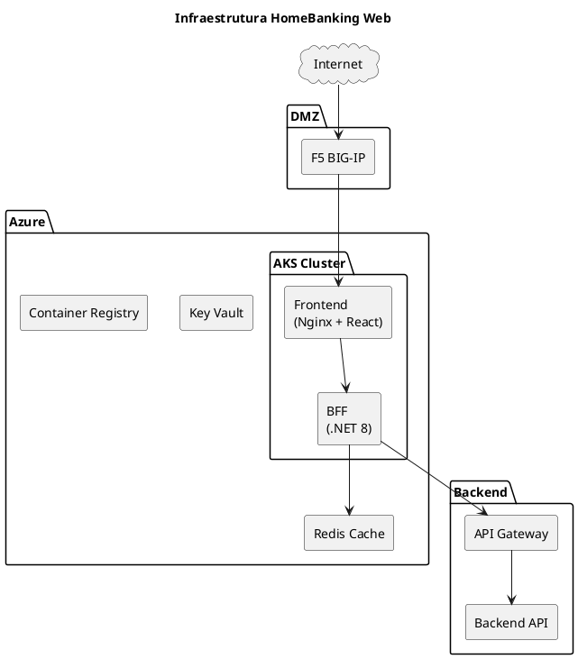
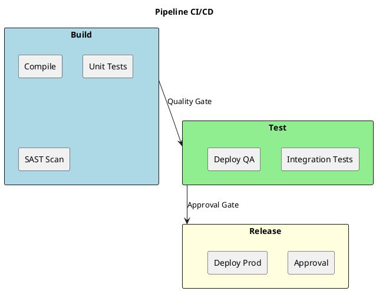
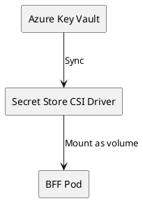

# 10. Arquitetura Operacional

## Proposito

Definir a arquitetura operacional do HomeBanking Web, incluindo infraestrutura de containers, ambientes, pipelines CI/CD, estrategia de deploy e gestao de secrets.

## Conteudo

### 10.1 Infraestrutura

A aplicacao sera deployada em ambiente containerizado, com imagens **compliant com OpenShift** para futura migracao.

| Aspecto | Especificacao |
|---------|---------------|
| **Plataforma atual** | Azure Kubernetes Service (AKS) |
| **Plataforma futura** | OpenShift (em homologacao) |
| **Load Balancer** | F5 BIG-IP |
| **Container Registry** | Azure Container Registry (ACR) |

### 10.2 Ambientes

A aplicacao utiliza tres ambientes, segregados por **namespaces** no cluster AKS.

| Ambiente | Proposito | Acesso |
|----------|-----------|--------|
| **Development** | Desenvolvimento e testes iniciais | Developers |
| **QA** | Testes de integracao e aceitacao | QA Team |
| **Production** | Ambiente de producao | Restrito |

### 10.3 CI/CD Pipeline

#### Stack de CI/CD

| Componente | Ferramenta |
|------------|------------|
| **CI/CD Platform** | Azure DevOps |
| **Repositorio** | Azure Repos |
| **Branching** | GitFlow |
| **Artefactos** | Azure Container Registry |

#### Pipeline Overview

| Stage | Actividades | Bloqueante |
|-------|-------------|------------|
| **Build** | Compile, Unit Tests, SAST | Sim |
| **Test** | Integration Tests, Deploy QA | Sim |
| **Release** | Aprovacao manual, Deploy Prod | Sim |

### 10.4 Estrategia de Deploy

| Aspecto | Especificacao |
|---------|---------------|
| **Estrategia** | Rolling Update |
| **Zero downtime** | Sim |
| **Health checks** | Readiness + Liveness probes |
| **Rollback** | Automatico via Kubernetes |

### 10.5 Secrets Management

| Aspecto | Especificacao |
|---------|---------------|
| **Ferramenta** | Azure Key Vault |
| **Injeccao** | Secret Store CSI Driver |
| **Secrets geridos** | Connection strings, API keys, certificados |

### 10.6 Disaster Recovery

| Aspecto | Status |
|---------|--------|
| **Site de DR** | Nao disponivel atualmente |
| **RTO/RPO** | A definir com cliente |
| **Estrategia** | A definir |

### 10.7 Backup

O canal web **nao requer backup dedicado**:

| Componente | Justificacao |
|------------|--------------|
| **Codigo fonte** | Versionado em Git |
| **Container images** | ACR com retencao |
| **Secrets** | Azure Key Vault (managed) |
| **Dados de negocio** | Sistemas backend (fora de escopo) |
| **Sessoes** | Transitorias em Redis |

## Itens Pendentes

| Item | Responsavel | Prioridade |
|------|-------------|------------|
| Definir ferramenta IaC (Helm/Terraform) | Arquitetura | Alta |
| Definir quality gate thresholds | QA / Arquitetura | Alta |
| Definir estrategia de DR | Infraestrutura / Cliente | Media |
| Definir janela de deploy | Operacoes | Media |

## Decisoes Referenciadas

- [DEC-006-estrategia-containers-openshift.md](../decisions/DEC-006-estrategia-containers-openshift.md) - Containers OpenShift-compliant
- [DEC-010-stack-tecnologica-backend.md](../decisions/DEC-010-stack-tecnologica-backend.md) - Stack Backend
