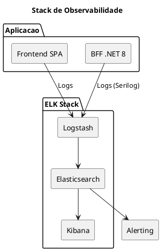

# 11. Observabilidade & Operacoes

## Proposito

Definir a estrategia de observabilidade do HomeBanking Web, incluindo stack tecnologica, metricas chave (golden signals), e abordagem de SLIs/SLOs.

## Conteudo

### 11.1 Stack de Observabilidade

A stack de observabilidade sera baseada no **ELK Stack** (Elasticsearch, Logstash, Kibana), reutilizando a infraestrutura existente.

| Componente | Funcao | Tecnologia |
|------------|--------|------------|
| **Logging** | Logs estruturados JSON | Serilog (.NET) |
| **Ingestao** | Coleta e transformacao | Logstash |
| **Armazenamento** | Indexacao e busca | Elasticsearch |
| **Visualizacao** | Dashboards | Kibana |
| **Alerting** | Notificacoes | ElastAlert / Watcher |

### 11.2 Golden Signals

Os quatro golden signals serao monitorizados conforme melhores praticas SRE:

| Signal | Descricao | O que Medir |
|--------|-----------|-------------|
| **Latency** | Tempo de resposta | P50, P95, P99 dos requests |
| **Traffic** | Volume de requests | Requests por segundo |
| **Errors** | Taxa de erros | % respostas 4xx/5xx |
| **Saturation** | Utilizacao de recursos | CPU, Memoria, Conexoes |

### 11.3 Logging

Todos os logs serao estruturados em formato JSON com campos padronizados:

| Campo | Obrigatorio | Descricao |
|-------|-------------|-----------|
| timestamp | Sim | Data/hora ISO 8601 |
| level | Sim | DEBUG, INFO, WARN, ERROR |
| correlation_id | Sim | ID para rastreio end-to-end |
| service | Sim | Nome do servico |
| message | Sim | Descricao do evento |

**Nota:** Dados PII devem ser mascarados nos logs (requisito de seguranca).

### 11.4 SLIs / SLOs / SLAs

| Conceito | Descricao |
|----------|-----------|
| **SLI** (Indicator) | Metrica que mede o nivel de servico (ex: latencia P95) |
| **SLO** (Objective) | Target interno para o SLI (ex: P95 < 3s em 99.9% do tempo) |
| **SLA** (Agreement) | Compromisso contratual com consequencias (ex: creditos) |

#### SLOs Propostos

| Metrica | SLO Target | Baseado em |
|---------|------------|------------|
| Disponibilidade | 99.9% | DEF-02 NFR |
| Latencia P95 | < 3 segundos | DEF-02 NFR |
| Taxa de erro | < 1% | Melhor pratica |

### 11.5 Alertas

| Severidade | Descricao | Tempo de Resposta |
|------------|-----------|-------------------|
| **P1 - Critical** | Servico indisponivel | Imediato |
| **P2 - High** | Degradacao significativa | < 15 min |
| **P3 - Medium** | Degradacao menor | < 1 hora |
| **P4 - Low** | Informativo | Proximo dia util |

### 11.6 Dashboards

| Dashboard | Audiencia | Conteudo |
|-----------|-----------|----------|
| **Operacional** | SRE / Ops | Golden signals, health checks |
| **Aplicacao** | Developers | Erros, latencia, traces |
| **Negocio** | Stakeholders | Transacoes, logins, KPIs |

## Itens Pendentes

| Item | Responsavel | Prioridade |
|------|-------------|------------|
| Confirmar reutilizacao ELK existente | Infraestrutura | Alta |
| Definir thresholds de alertas | Operacoes | Alta |
| Definir politica de retencao de logs | Compliance | Media |
| Definir metricas de negocio | Stakeholders | Media |

## Decisoes Referenciadas

- [DEC-008-stack-observabilidade-elk.md](../decisions/DEC-008-stack-observabilidade-elk.md) - ELK Stack
