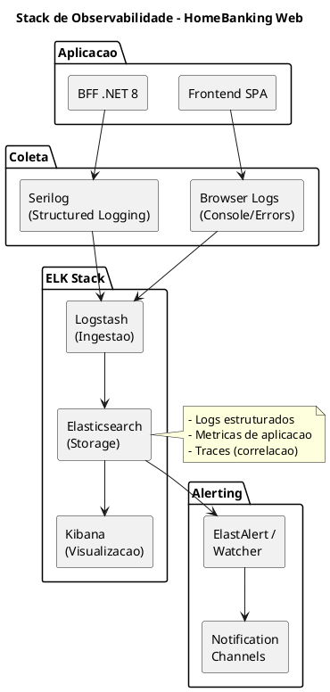
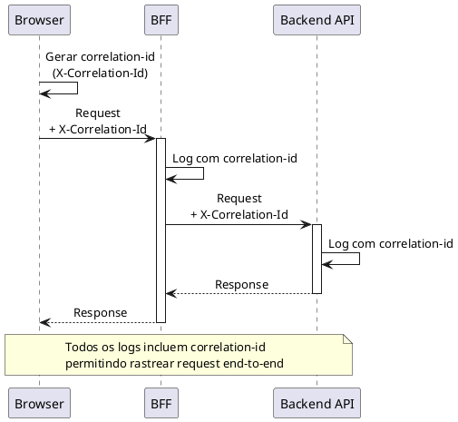

# 11. Observabilidade & Operacoes

> **Required definitions:** [DEF-11-observabilidade-operacoes.md](../definitions/DEF-11-observabilidade-operacoes.md)
> **Related decisions:**
> - [DEC-008-stack-observabilidade-elk.md](../decisions/DEC-008-stack-observabilidade-elk.md) - Status: accepted

## Proposito

Definir a estrategia de observabilidade do HomeBanking Web, incluindo stack de observabilidade (ELK), golden signals, metricas de aplicacao e negocio, distributed tracing, logging centralizado, SLIs/SLOs/SLAs, alertas e dashboards operacionais.

## Conteudo

### 11.1 Stack de Observabilidade

A stack de observabilidade do HomeBanking Web sera baseada no **ELK Stack** (Elasticsearch, Logstash, Kibana), conforme decisao DEC-008. Os detalhes de implementacao serao definidos no assessment inicial do projeto.



#### Componentes (Proposta)

| Componente | Funcao | Tecnologia |
|------------|--------|------------|
| **Logging (BFF)** | Logs estruturados | Serilog |
| **Logging (Frontend)** | Erros e eventos | Console + Error Handler |
| **Ingestao** | Coleta e transformacao | Logstash |
| **Armazenamento** | Indexacao e busca | Elasticsearch |
| **Visualizacao** | Dashboards e queries | Kibana |
| **Alerting** | Notificacoes | ElastAlert / Watcher |

#### Detalhes Pendentes

| Aspecto | Status |
|---------|--------|
| ELK existente vs dedicada | Necessita aprofundamento |
| Complemento Prometheus/Grafana | Necessita aprofundamento |
| Versao do ELK Stack | Necessita aprofundamento |

### 11.2 Golden Signals

Os quatro golden signals serao monitorizados conforme melhores praticas SRE. Os thresholds especificos serao definidos no assessment.

| Signal | Descricao | Metricas Propostas |
|--------|-----------|-------------------|
| **Latency** | Tempo de resposta | P50, P95, P99 |
| **Traffic** | Volume de requests | Requests/segundo |
| **Errors** | Taxa de erros | % erros 4xx/5xx |
| **Saturation** | Utilizacao de recursos | CPU, Memoria, Connections |

#### Thresholds (a definir)

| Signal | Warning | Critical |
|--------|---------|----------|
| Latency P95 | Necessita aprofundamento | Necessita aprofundamento |
| Error Rate | Necessita aprofundamento | Necessita aprofundamento |
| CPU Usage | Necessita aprofundamento | Necessita aprofundamento |
| Memory Usage | Necessita aprofundamento | Necessita aprofundamento |

### 11.3 Metricas de Aplicacao

As metricas de aplicacao a capturar serao definidas no assessment inicial. Abaixo as propostas baseadas em melhores praticas:

#### Frontend (Proposta)

| Metrica | Descricao |
|---------|-----------|
| Page Load Time | Tempo de carregamento |
| LCP | Largest Contentful Paint |
| FID | First Input Delay |
| CLS | Cumulative Layout Shift |
| JS Errors | Erros de JavaScript |
| API Call Duration | Tempo de chamadas API |

#### BFF (Proposta)

| Metrica | Descricao |
|---------|-----------|
| Request Duration | Tempo de resposta |
| Request Count | Numero de requests |
| Error Count | Numero de erros |
| Active Connections | Conexoes ativas |
| Cache Hit Rate | Taxa de acerto de cache (Redis) |
| Dependency Duration | Tempo de chamadas a Backend API |

### 11.4 Metricas de Negocio

_Todas as metricas de negocio necessitam aprofundamento com stakeholders._

| Metrica Proposta | Descricao | Status |
|------------------|-----------|--------|
| Logins/hora | Volume de logins | Necessita aprofundamento |
| Transacoes/tipo | Volume por tipo de operacao | Necessita aprofundamento |
| Erros de autenticacao | Falhas de login | Necessita aprofundamento |
| Sessoes ativas | Utilizadores ativos | Necessita aprofundamento |

### 11.5 Distributed Tracing

_A implementacao de distributed tracing necessita aprofundamento._

| Aspecto | Status |
|---------|--------|
| Implementacao | Necessita aprofundamento |
| Ferramenta (Jaeger/Zipkin/AppInsights) | Necessita aprofundamento |
| Correlacao Frontend-BFF | Necessita aprofundamento |

#### Proposta de Correlacao

Caso seja implementado tracing, a proposta e utilizar um `correlation-id` (header `X-Correlation-Id`) propagado desde o frontend:



### 11.6 Logging Centralizado

#### Formato de Logs (Proposta)

Os logs serao estruturados em formato JSON. Os campos obrigatorios propostos sao:

| Campo | Tipo | Obrigatorio | Descricao |
|-------|------|-------------|-----------|
| timestamp | ISO 8601 | Sim | Data/hora do evento |
| level | string | Sim | DEBUG, INFO, WARN, ERROR |
| message | string | Sim | Mensagem do log |
| correlation_id | string | Sim | ID de correlacao |
| service | string | Sim | Nome do servico |
| environment | string | Sim | dev, qa, prod |
| user_id | string | Nao | ID do utilizador (masked) |
| request_path | string | Nao | Path da requisicao |
| duration_ms | number | Nao | Duracao em ms |

#### Exemplo de Log Estruturado

```json
{
  "timestamp": "2026-01-08T10:30:00.000Z",
  "level": "INFO",
  "message": "Request completed",
  "correlation_id": "abc-123-def-456",
  "service": "homebanking-bff",
  "environment": "prod",
  "request_path": "/api/accounts",
  "duration_ms": 150,
  "status_code": 200
}
```

#### Politicas (a definir)

| Aspecto | Status |
|---------|--------|
| Retencao de logs | Necessita aprofundamento |
| Mascaramento PII | Obrigatorio (requisito de seguranca) |
| Nivel minimo (prod) | Necessita aprofundamento |

### 11.7 SLIs (Service Level Indicators)

_Os SLIs especificos necessitam aprofundamento._

| SLI Proposto | Descricao | Medicao |
|--------------|-----------|---------|
| **Availability** | % tempo disponivel | Uptime checks |
| **Latency** | Tempo de resposta | P95 requests |
| **Error Rate** | % requests com erro | 5xx / total |
| **Throughput** | Capacidade de processamento | Requests/segundo |

### 11.8 SLOs (Service Level Objectives)

_Os SLOs target necessitam aprofundamento._

| Metrica | SLO Target | Error Budget |
|---------|------------|--------------|
| Disponibilidade | Necessita aprofundamento | Necessita aprofundamento |
| Latencia P95 | Necessita aprofundamento | Necessita aprofundamento |
| Taxa de erro | Necessita aprofundamento | Necessita aprofundamento |

### 11.9 SLAs (Service Level Agreements)

| Aspecto | Status |
|---------|--------|
| SLAs contratuais | Necessita aprofundamento |
| Penalidades | Necessita aprofundamento |

### 11.10 Alertas

_A configuracao de alertas necessita aprofundamento._

#### Niveis de Severidade (Proposta)

| Nivel | Descricao | Resposta |
|-------|-----------|----------|
| **P1 - Critical** | Servico indisponivel | Imediata |
| **P2 - High** | Degradacao significativa | < 15 min |
| **P3 - Medium** | Degradacao menor | < 1 hora |
| **P4 - Low** | Informativo | Proximo dia util |

#### Alertas Propostos

| Alerta | Condicao | Severidade |
|--------|----------|------------|
| Servico Down | Health check falha > 3 min | P1 |
| Alta Latencia | P95 > threshold | P2 |
| Alta Taxa de Erros | Error rate > 5% | P2 |
| Alta Utilizacao CPU | CPU > 80% sustained | P3 |
| Alta Utilizacao Memoria | Memory > 85% | P3 |
| Certificado Expirando | < 30 dias | P3 |

#### Canais de Notificacao

| Aspecto | Status |
|---------|--------|
| Ferramenta de alerting | Necessita aprofundamento |
| Politica de escalacao | Necessita aprofundamento |
| Canais por severidade | Necessita aprofundamento |

### 11.11 Dashboards Operacionais

_Os dashboards especificos necessitam aprofundamento._

#### Dashboards Propostos

| Dashboard | Audiencia | Metricas |
|-----------|-----------|----------|
| **Overview** | Operacoes | Golden signals, health |
| **Application** | Developers | Errors, latency, traces |
| **Business** | Stakeholders | Transacoes, logins, KPIs |
| **Infrastructure** | SRE | Pods, resources, scaling |

#### Acesso aos Dashboards

| Aspecto | Status |
|---------|--------|
| Quem tem acesso | Necessita aprofundamento |
| Requisitos tempo real | Necessita aprofundamento |

### 11.12 Runbooks (Observabilidade)

_Os runbooks de observabilidade necessitam aprofundamento._

| Runbook | Descricao | Status |
|---------|-----------|--------|
| Investigar Alta Latencia | Passos para diagnostico | Necessita aprofundamento |
| Investigar Erros 5xx | Analise de erros de servidor | Necessita aprofundamento |
| Investigar Logs | Como pesquisar em Kibana | Necessita aprofundamento |
| Criar Alerta | Como configurar novo alerta | Necessita aprofundamento |

## Diagramas

### Fluxo de Observabilidade

```plantuml
@startuml
!include https://raw.githubusercontent.com/plantuml-stdlib/C4-PlantUML/master/C4_Container.puml

LAYOUT_WITH_LEGEND()

title Fluxo de Observabilidade - HomeBanking Web

System_Boundary(app, "Aplicacao") {
  Container(fe, "Frontend", "React", "SPA")
  Container(bff, "BFF", ".NET 8", "Backend for Frontend")
}

System_Boundary(elk, "ELK Stack") {
  ContainerDb(es, "Elasticsearch", "Search Engine", "Armazenamento de logs")
  Container(ls, "Logstash", "Pipeline", "Ingestao")
  Container(kb, "Kibana", "Visualization", "Dashboards")
}

System_Boundary(alert, "Alerting") {
  Container(ea, "ElastAlert", "Python", "Alertas")
}

System_Ext(notif, "Notification Channels", "Teams/Email/PagerDuty")

Rel(fe, ls, "Logs", "HTTP")
Rel(bff, ls, "Logs", "Serilog")
Rel(ls, es, "Index")
Rel(es, kb, "Query")
Rel(es, ea, "Query")
Rel(ea, notif, "Notify")

@enduml
```

## Entregaveis

- [ ] Configuracao de logging estruturado (Serilog)
- [ ] Dashboards Kibana
- [ ] Alertas configurados
- [ ] Documentacao de SLIs/SLOs
- [ ] Runbooks de observabilidade

## Definicoes Utilizadas

- [x] [DEF-11-observabilidade-operacoes.md](../definitions/DEF-11-observabilidade-operacoes.md) - Status: in-progress

## Decisoes Referenciadas

- [x] [DEC-008-stack-observabilidade-elk.md](../decisions/DEC-008-stack-observabilidade-elk.md) - Status: accepted

## Itens Pendentes

| Item | Responsavel | Prioridade |
|------|-------------|------------|
| Definir se ELK existente ou dedicada | Infraestrutura | Alta |
| Definir SLOs target | Arquitetura + Cliente | Alta |
| Definir politica de retencao de logs | Compliance | Alta |
| Ferramenta de alerting | Operacoes | Media |
| Dashboards de negocio | Stakeholders | Media |
| Distributed tracing (se aplicavel) | Arquitetura | Media |
| Thresholds de golden signals | Operacoes | Media |
| Runbooks de observabilidade | Operacoes | Baixa |
