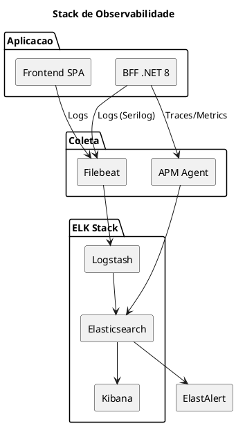

# 11. Observabilidade & Operacoes

> **Definicao:** [DEF-11-observabilidade-operacoes.md](../definitions/DEF-11-observabilidade-operacoes.md)

## Proposito

Definir a estrategia de observabilidade do HomeBanking Web, incluindo stack tecnologica, metricas chave (golden signals), tracing distribuido e abordagem de SLIs/SLOs.

## Conteudo

### 11.1 Os Tres Pilares

| Pilar | Proposito | Ferramenta |
|-------|-----------|------------|
| **Logs** | Eventos e debugging | ELK (Elasticsearch, Logstash, Kibana) |
| **Metricas** | Performance e saude | Prometheus + Grafana (complemento) |
| **Traces** | Fluxo de requests | Elastic APM |

### 11.2 Stack de Observabilidade

A stack de observabilidade sera baseada no **ELK Stack** (Elasticsearch, Logstash, Kibana), reutilizando a infraestrutura existente.

| Componente | Funcao | Tecnologia |
|------------|--------|------------|
| **Logging** | Logs estruturados JSON | Serilog (.NET), Filebeat |
| **Tracing** | Distributed tracing | Elastic APM |
| **Ingestao** | Coleta e transformacao | Logstash |
| **Armazenamento** | Indexacao e busca | Elasticsearch |
| **Visualizacao** | Dashboards | Kibana |
| **Alerting** | Notificacoes | ElastAlert |

### 11.3 Golden Signals

Os quatro golden signals serao monitorizados conforme melhores praticas SRE:

| Signal | Metrica | Target | Alerta |
|--------|---------|--------|--------|
| **Latency** | P95 response time | < 3s | > 5s |
| **Traffic** | Requests per second | Baseline | > 2x baseline |
| **Errors** | Error rate (5xx) | < 0.1% | > 1% |
| **Saturation** | CPU/Memory usage | < 70% | > 85% |

### 11.4 Logging

Todos os logs serao estruturados em formato JSON com campos padronizados:

#### Campos Obrigatorios

| Campo | Tipo | Descricao |
|-------|------|-----------|
| `timestamp` | ISO8601 | Data/hora UTC do evento |
| `level` | string | DEBUG, INFO, WARN, ERROR, FATAL |
| `service` | string | Nome do componente (frontend-web, bff-web) |
| `correlation_id` | UUID | ID para correlacao entre servicos |
| `message` | string | Descricao do evento |
| `environment` | string | dev, qa, prod |

#### Campos Opcionais

| Campo | Tipo | Uso |
|-------|------|-----|
| `user_id` | string | Identificador do utilizador (masked) |
| `session_id` | string | ID da sessao |
| `operation` | string | Tipo de operacao |
| `duration_ms` | number | Duracao da operacao |
| `error_code` | string | Codigo de erro |

#### Mascaramento de Dados Sensiveis

| Tipo de Dado | Tratamento |
|--------------|------------|
| NIB/IBAN | Mascarar (`PT50****1234`) |
| User ID | Hash ou mascarar |
| Montantes | Mascarar |
| Email | Mascarar (`j***@email.com`) |
| NIF | Mascarar |
| Tokens | Nunca logar |

#### Retencao de Logs

| Tipo de Log | Retencao | Requisito |
|-------------|----------|-----------|
| Logs de autenticacao | 7 anos | Compliance bancario |
| Logs de transacoes | 7 anos | Compliance bancario |
| Logs de erro | 1 ano | Operacional |
| Logs gerais | 90 dias | Operacional |

### 11.5 Tracing Distribuido

| Header | Proposito | Gerado por |
|--------|-----------|------------|
| `X-Correlation-ID` | Correlacao de logs | Frontend (UUID) |
| `X-Request-ID` | ID unico do request | BFF |
| `traceparent` | W3C Trace Context | APM Agent |

| Componente | Instrumentacao |
|------------|----------------|
| Frontend | RUM (Real User Monitoring) JS Agent |
| BFF .NET | Elastic APM .NET Agent |

### 11.6 SLIs / SLOs / SLAs

| Conceito | Definicao | Responsavel |
|----------|-----------|-------------|
| **SLI** (Indicator) | Metrica que mede o nivel de servico | Engenharia |
| **SLO** (Objective) | Target interno para o SLI | Engenharia |
| **SLA** (Agreement) | Compromisso contratual externo | Negocio |

#### SLOs do Canal Web

| SLI | SLO Target | Janela | Calculo |
|-----|------------|--------|---------|
| Disponibilidade | 99.9% | Mensal | Uptime / Tempo total |
| Latencia P95 | < 3s | Mensal | Percentil 95 dos requests |
| Taxa de Erro | < 0.1% | Mensal | Erros 5xx / Total requests |
| TTFB | < 800ms | Mensal | Time to First Byte P95 |

#### Error Budget

| SLO | Error Budget Mensal |
|-----|---------------------|
| 99.9% | 43.2 minutos |
| 99.95% | 21.6 minutos |
| 99.99% | 4.3 minutos |

### 11.7 Alertas

| Severidade | Criterio | Tempo Resposta | Notificacao |
|------------|----------|----------------|-------------|
| **P1 - Critical** | Servico indisponivel, impacto total | < 15 min | On-call + SMS |
| **P2 - High** | Degradacao significativa | < 30 min | Email + Teams |
| **P3 - Medium** | Degradacao parcial | < 4 horas | Email |
| **P4 - Low** | Anomalia sem impacto | Proximo dia util | Ticket |

#### Alertas Configurados

| Alerta | Condicao | Severidade |
|--------|----------|------------|
| Servico DOWN | Health check falha > 2 min | P1 |
| Error Rate Alto | > 5% erros 5xx | P1 |
| Latencia Degradada | P95 > 5s por 5 min | P2 |
| CPU Saturado | > 90% por 10 min | P2 |
| Memory Alto | > 85% por 10 min | P2 |
| Auth Failures Spike | > 10x baseline | P2 |
| Circuit Breaker Open | Estado OPEN | P3 |
| Error Rate Elevado | > 1% erros | P3 |

### 11.8 Dashboards

| Dashboard | Audiencia | Conteudo |
|-----------|-----------|----------|
| **Health Overview** | NOC / On-call | Status geral, alertas ativos, SLO status |
| **Performance** | Engenharia | Latencia, throughput, errors por endpoint |
| **Business** | Produto | Logins, transacoes, conversion rates |
| **Security** | SecOps | Auth failures, suspicious activity |
| **Infrastructure** | DevOps | CPU, memory, pods, network |

### 11.9 Metricas de Negocio

| Metrica | Descricao | Dashboard |
|---------|-----------|-----------|
| Logins/hora | Taxa de autenticacoes | Business |
| Transacoes/tipo | Transferencias, pagamentos | Business |
| Taxa abandono login | % que nao completa login | Business |
| Erros auth | Falhas de autenticacao | Security |
| Sessoes ativas | Utilizadores online | Operations |

## Decisoes Referenciadas

- [DEC-008-stack-observabilidade-elk.md](../decisions/DEC-008-stack-observabilidade-elk.md) - ELK Stack

## Definicoes Utilizadas

- [DEF-11-observabilidade-operacoes.md](../definitions/DEF-11-observabilidade-operacoes.md) - Detalhes completos
- [DEF-02-requisitos-nao-funcionais.md](../definitions/DEF-02-requisitos-nao-funcionais.md) - SLAs
