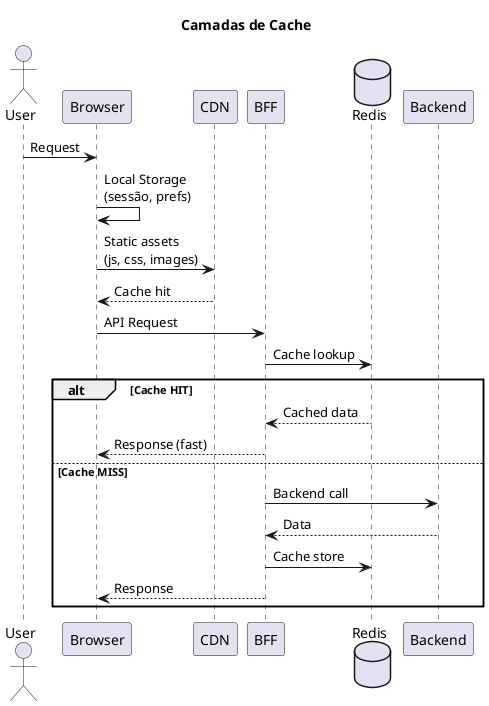
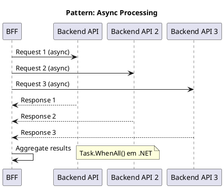

# 12. Desempenho & Fiabilidade

## Definições e Decisões

> **Definição:** [DEF-12-desempenho-fiabilidade.md](../definitions/DEF-12-desempenho-fiabilidade.md)

## Propósito

Definir os objetivos de desempenho e a estratégia de fiabilidade do HomeBanking Web, incluindo targets de performance, caching, auto-scaling e testes de carga.

## Conteúdo

### 12.1 Objetivos de Desempenho

Os targets são baseados nos requisitos não funcionais (DEF-02):

| Métrica | Target | Fonte |
|---------|--------|-------|
| **Utilizadores Concorrentes** | 400 | DEF-02 |
| **Throughput** | 10 TPS | DEF-02 |
| **Tempo de Resposta (P95)** | < 3 segundos | DEF-02 |
| **Tempo de Carregamento Inicial** | < 10 segundos | DEF-02 |
| **Disponibilidade** | 99.9% | DEF-02 |
| **Crescimento Anual** | 5% | DEF-02 |

### 12.2 Core Web Vitals

| Métrica | Target | Classificação |
|---------|--------|---------------|
| **LCP** (Largest Contentful Paint) | < 2.5s | Good |
| **FID** (First Input Delay) | < 100ms | Good |
| **CLS** (Cumulative Layout Shift) | < 0.1 | Good |
| **TTFB** (Time to First Byte) | < 800ms | Good |
| **FCP** (First Contentful Paint) | < 1.8s | Good |

### 12.3 Perfil de Carga

### 12.4 Estratégia de Cache

#### Níveis de Cache

| Nível | Dados | TTL |
|-------|-------|-----|
| **Browser** | Assets estáticos (JS, CSS, imagens) | Longo (com cache busting) |
| **Browser** | Local Storage (sessão, prefs) | Sessão |
| **CDN** | JS, CSS, imagens, fontes | 24 horas |
| **BFF (Redis)** | Sessões, tokens, dados partilhados | Variável |

#### TTL por Tipo de Dado (Redis)

| Dado | TTL | Justificação |
|------|-----|--------------|
| Sessão do utilizador | 10 min | Inatividade timeout |
| Tokens OAuth | Variável | Alinhado com expiração |
| Configurações do sistema | 5 min | Baixa frequência de mudança |
| Dados de referência (países, bancos) | 1 hora | Dados estáticos |
| Cotações/Taxas | 1 min | Dados voláteis |

**Princípio:** Dados sensíveis (contas, transações) NÃO são cacheados.

#### Cache Invalidation

| Evento | Ação |
|--------|------|
| Logout | Invalidar sessão no Redis |
| Transação executada | Invalidar cache de saldos (se aplicável) |
| Deploy | Versionar assets (cache busting) |
| Configuração alterada | Invalidar cache de config |

### 12.5 Otimização Frontend

#### Bundle Optimization

| Técnica | Implementação | Impacto |
|---------|---------------|---------|
| Code Splitting | React.lazy() + Suspense | Reduz initial bundle |
| Tree Shaking | Webpack/Vite config | Remove código não utilizado |
| Lazy Loading | Componentes e rotas | Carrega sob demanda |
| Minification | Terser (JS), CSSNano | Reduz tamanho |
| Compression | gzip/Brotli | 70-90% redução |

#### Budget de Bundle

| Métrica | Limite | Ação se exceder |
|---------|--------|-----------------|
| Initial JS | < 200KB (gzipped) | Code split |
| Initial CSS | < 50KB (gzipped) | Purge CSS |
| Largest chunk | < 100KB | Split ou lazy load |
| Total assets | < 1MB | Review dependencies |

#### Otimização de Assets

| Asset | Estratégia |
|-------|------------|
| Imagens | WebP format, lazy loading, srcset |
| Fontes | WOFF2, font-display: swap, subset |
| Icons | SVG sprite ou icon font |
| CSS | Critical CSS inline, defer restante |

### 12.6 Otimização Backend (BFF)

#### Connection Pooling

| Conexão | Pool Size | Timeout |
|---------|-----------|---------|
| Redis | 10-20 | 5s |
| HTTP Client (Backend) | 100 | 30s |

#### Compressão

| Tipo | Configuração |
|------|--------------|
| Response | gzip (nível 6) |
| Threshold | > 1KB |
| Content-Types | application/json, text/html |

#### Async/Non-blocking

### 12.7 Auto-Scaling

| Aspeto | Abordagem |
|---------|-----------|
| **Mecanismo** | Horizontal Pod Autoscaler (HPA) |
| **Métricas** | CPU, Memory |
| **CPU Target** | 70% |
| **Memory Target** | 80% |

#### Configuração por Componente

| Componente | Min Replicas | Max Replicas | CPU Target | Memory Target |
|------------|--------------|--------------|------------|---------------|
| Frontend | 2 | 6 | 70% | 80% |
| BFF | 2 | 10 | 70% | 80% |

#### Scale-up vs Scale-down

| Evento | Tempo | Ação |
|--------|-------|------|
| Scale-up | 60s estabilização | Duplicar réplicas |
| Scale-down | 300s estabilização | Reduzir 50% |

> **Nota:** Scale-down mais conservador para evitar oscilações.

### 12.8 Capacity Planning

#### Resource Requests/Limits

| Componente | CPU Request | CPU Limit | Memory Request | Memory Limit |
|------------|-------------|-----------|----------------|--------------|
| Frontend | 100m | 500m | 128Mi | 256Mi |
| BFF | 250m | 1000m | 256Mi | 512Mi |

#### Estimativa de Recursos (400 users)

| Componente | Pods | CPU Total | Memory Total |
|------------|------|-----------|--------------|
| Frontend | 2 | 1 vCPU | 512Mi |
| BFF | 4 | 4 vCPU | 2Gi |
| **Total** | 6 | **5 vCPU** | **2.5Gi** |

### 12.9 Resiliência

| Padrão | Implementação |
|--------|---------------|
| **Circuit Breaker** | Polly (.NET) |
| **Retry** | Exponential backoff (3 tentativas) |
| **Timeout** | Configurável por endpoint |
| **Bulkhead** | Limite de conexões |
| **Health Checks** | Liveness + Readiness probes |

#### Pod Disruption Budget

| Aspeto | Configuração |
|---------|--------------|
| minAvailable | 50% |
| Propósito | Garantir disponibilidade durante manutenção |

### 12.10 Load Testing

#### Ferramenta

| Ferramenta | Uso | Justificação |
|------------|-----|--------------|
| **k6** | Load testing principal | Scripting em JS, integração CI/CD |

#### Cenários de Teste

| Cenário | Users | Duração | Objetivo |
|---------|-------|---------|----------|
| Smoke | 10 | 5 min | Validar ambiente |
| Load | 400 | 30 min | Validar capacidade nominal |
| Stress | 600 | 15 min | Identificar limites |
| Soak | 200 | 4 horas | Identificar memory leaks |

#### Critérios de Aceitação

| Métrica | Critério | Fail |
|---------|----------|------|
| Response Time P95 | < 3s | > 5s |
| Error Rate | < 0.1% | > 1% |
| Throughput | >= 10 TPS | < 8 TPS |
| CPU (peak) | < 80% | > 90% |
| Memory (peak) | < 80% | > 90% |

## Decisões Referenciadas

- [DEC-006-estrategia-containers-openshift.md](../decisions/DEC-006-estrategia-containers-openshift.md) - Containers e auto-scaling
- [DEC-007-padrao-bff.md](../decisions/DEC-007-padrao-bff.md) - BFF (cache, resiliência)
- [DEC-009-stack-tecnologica-frontend.md](../decisions/DEC-009-stack-tecnologica-frontend.md) - Stack frontend
- [DEC-010-stack-tecnologica-backend.md](../decisions/DEC-010-stack-tecnologica-backend.md) - Stack backend

## Definições Utilizadas

- [DEF-12-desempenho-fiabilidade.md](../definitions/DEF-12-desempenho-fiabilidade.md) - Detalhes completos
- [DEF-02-requisitos-nao-funcionais.md](../definitions/DEF-02-requisitos-nao-funcionais.md) - NFRs de performance
- [DEF-05-padroes-resiliencia.md](../definitions/DEF-05-padroes-resiliencia.md) - Padrões de resiliência
