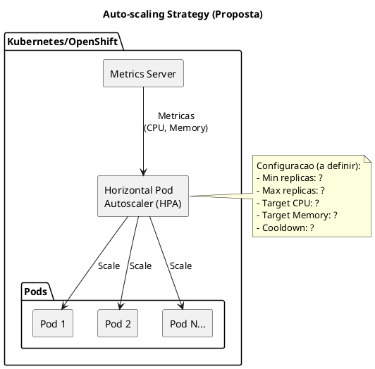

# 12. Desempenho & Fiabilidade

> **Required definitions:** [DEF-12-desempenho-fiabilidade.md](../definitions/DEF-12-desempenho-fiabilidade.md)
> **Related decisions:**
> - [DEC-006-estrategia-containers-openshift.md](../decisions/DEC-006-estrategia-containers-openshift.md) - Status: accepted
> - [DEC-007-arquitetura-bff.md](../decisions/DEC-007-arquitetura-bff.md) - Status: accepted
> - [DEC-009-stack-tecnologica-frontend.md](../decisions/DEC-009-stack-tecnologica-frontend.md) - Status: accepted
> - [DEC-010-stack-tecnologica-backend.md](../decisions/DEC-010-stack-tecnologica-backend.md) - Status: accepted

## Proposito

Definir a estrategia de desempenho e fiabilidade do HomeBanking Web, incluindo objetivos de carga, targets de performance, estrategias de caching, otimizacoes frontend e backend, auto-scaling, capacity planning e load testing.

## Conteudo

### 12.1 Objetivos de Carga

Os objetivos de carga foram definidos com base nos requisitos nao funcionais (DEF-02).

| Metrica | Target | Fonte |
|---------|--------|-------|
| **Utilizadores Concorrentes** | 400 | DEF-02 |
| **Throughput** | 10 TPS | DEF-02 |
| **Crescimento Anual** | 5% | DEF-02 |
| **Picos de Utilizacao** | Sim (fim de mes) | DEF-02 |

#### Projecao de Capacidade (3 anos)

| Ano | Utilizadores Concorrentes | Throughput |
|-----|---------------------------|------------|
| 1 | 400 | 10 TPS |
| 2 | 420 | 10.5 TPS |
| 3 | 441 | 11 TPS |

### 12.2 Targets de Performance

Os targets de performance sao baseados nos requisitos nao funcionais e melhores praticas de industria.

| Metrica | Target | Status |
|---------|--------|--------|
| **Tempo de Resposta (operacoes criticas)** | < 3 segundos | DEF-02 |
| **Tempo de Carregamento (pagina inicial)** | < 10 segundos | DEF-02 |
| **TTFB (Time to First Byte)** | Necessita aprofundamento | Pendente |
| **LCP (Largest Contentful Paint)** | Necessita aprofundamento | Pendente |
| **FID (First Input Delay)** | Necessita aprofundamento | Pendente |
| **CLS (Cumulative Layout Shift)** | Necessita aprofundamento | Pendente |

#### Core Web Vitals (Proposta)

_Os targets de Core Web Vitals necessitam aprofundamento._

| Metrica | Target Proposto | Descricao |
|---------|-----------------|-----------|
| LCP | < 2.5s | Maior elemento visivel |
| FID | < 100ms | Primeira interacao |
| CLS | < 0.1 | Estabilidade visual |

### 12.3 Caching Strategy

_A estrategia de caching necessita aprofundamento._

```plantuml
@startuml
skinparam componentStyle rectangle
skinparam backgroundColor white

title Estrategia de Cache - HomeBanking Web (Proposta)

package "Browser" {
  [Browser Cache\n(Assets estaticos)] as BC
  [Service Worker\n(Offline - a definir)] as SW
}

package "BFF" {
  [Memory Cache\n(Hot Data)] as MC
  [Redis\n(Distributed Cache)] as RC
}

package "Backend API" {
  [API Gateway Cache\n(Azure APIM)] as AC
}

[Frontend SPA] as FE
[BFF .NET 8] as BFF
[Backend API] as API

FE --> BC : Assets
FE --> SW : PWA (a definir)
FE --> BFF : API Calls

BFF --> MC : In-Memory
BFF --> RC : Distributed
BFF --> API : API Calls

API --> AC : Cached Responses

note right of RC
  TTL a definir por tipo de dado:
  - Dados estaticos: ?
  - Dados semi-estaticos: ?
  - Dados dinamicos: No cache
end note

@enduml
```

#### Niveis de Cache (Proposta)

| Nivel | Localizacao | Dados | TTL |
|-------|-------------|-------|-----|
| **L1 - Browser** | Cliente | Assets estaticos (JS, CSS, imagens) | Necessita aprofundamento |
| **L2 - Memory** | BFF | Hot data, configuracoes | Necessita aprofundamento |
| **L3 - Redis** | BFF (Distributed) | Sessoes, dados partilhados | Necessita aprofundamento |
| **L4 - API Gateway** | Azure APIM | Respostas de API | Necessita aprofundamento |

#### Dados Cacheables (Proposta)

| Tipo de Dado | Cacheavel | TTL Proposto | Nivel |
|--------------|-----------|--------------|-------|
| Assets estaticos | Sim | 1 ano (com hash) | Browser |
| Configuracoes de app | Sim | A definir | Memory/Redis |
| Dados de catalogo | Sim | A definir | Redis |
| Dados de conta | Nao | - | - |
| Dados de transacoes | Nao | - | - |
| Tokens/Sessoes | Sim | Conforme expiracao | Redis |

#### Invalidacao de Cache

| Aspecto | Status |
|---------|--------|
| Estrategia de invalidacao | Necessita aprofundamento |
| Cache busting (assets) | Necessita aprofundamento |
| Eventos de invalidacao | Necessita aprofundamento |

### 12.4 Otimizacao Frontend

_As otimizacoes frontend necessitam aprofundamento._

#### Tecnicas de Otimizacao (Proposta)

| Tecnica | Descricao | Status |
|---------|-----------|--------|
| **Code Splitting** | Divisao do bundle por rotas | Necessita aprofundamento |
| **Lazy Loading** | Carregamento sob demanda de componentes | Necessita aprofundamento |
| **Tree Shaking** | Remocao de codigo nao utilizado | Necessita aprofundamento |
| **Minificacao** | Reducao de tamanho de JS/CSS | Necessita aprofundamento |
| **Compressao** | Gzip/Brotli para assets | Necessita aprofundamento |
| **Image Optimization** | WebP, lazy loading de imagens | Necessita aprofundamento |

#### Bundle Size (Proposta)

| Bundle | Limite Proposto | Status |
|--------|-----------------|--------|
| Main bundle | Necessita aprofundamento | Pendente |
| Vendor bundle | Necessita aprofundamento | Pendente |
| Total inicial | Necessita aprofundamento | Pendente |

#### Service Worker / PWA

| Aspecto | Status |
|---------|--------|
| Implementacao PWA | Necessita aprofundamento |
| Estrategia offline | Necessita aprofundamento |
| Cache de assets | Necessita aprofundamento |

### 12.5 Otimizacao Backend

_As otimizacoes backend necessitam aprofundamento._

#### Connection Pooling

| Aspecto | Status |
|---------|--------|
| HTTP Client pooling | Necessita aprofundamento |
| Redis connection pool | Necessita aprofundamento |
| Pool size | Necessita aprofundamento |

#### API Optimization (Proposta)

| Tecnica | Descricao | Status |
|---------|-----------|--------|
| **Compressao** | Gzip/Brotli nas respostas | Necessita aprofundamento |
| **Paginacao** | Listagens com limite | Necessita aprofundamento |
| **Partial Response** | Campos selecionados | Necessita aprofundamento |
| **Batch Requests** | Agregacao de chamadas | Necessita aprofundamento |

#### Limites de Payload

| Aspecto | Status |
|---------|--------|
| Request body max size | Necessita aprofundamento |
| Response max size | Necessita aprofundamento |
| Timeout de request | Necessita aprofundamento |

### 12.6 Auto-scaling

_A configuracao de auto-scaling necessita aprofundamento._



#### HPA Configuration (Proposta)

| Parametro | Valor Proposto | Status |
|-----------|----------------|--------|
| **Min Replicas** | Necessita aprofundamento | Pendente |
| **Max Replicas** | Necessita aprofundamento | Pendente |
| **Target CPU** | Necessita aprofundamento | Pendente |
| **Target Memory** | Necessita aprofundamento | Pendente |
| **Scale Up Cooldown** | Necessita aprofundamento | Pendente |
| **Scale Down Cooldown** | Necessita aprofundamento | Pendente |

#### Metricas de Scaling

| Metrica | Tipo | Status |
|---------|------|--------|
| CPU Utilization | Resource | Necessita aprofundamento |
| Memory Utilization | Resource | Necessita aprofundamento |
| Requests per Second | Custom | Necessita aprofundamento |
| Response Time | Custom | Necessita aprofundamento |

### 12.7 Capacity Planning

_O capacity planning necessita aprofundamento._

#### Resource Requests & Limits (Proposta)

| Componente | Resource | Request | Limit |
|------------|----------|---------|-------|
| **Frontend (Nginx)** | CPU | Necessita aprofundamento | Necessita aprofundamento |
| **Frontend (Nginx)** | Memory | Necessita aprofundamento | Necessita aprofundamento |
| **BFF** | CPU | Necessita aprofundamento | Necessita aprofundamento |
| **BFF** | Memory | Necessita aprofundamento | Necessita aprofundamento |

#### Capacity por Ambiente

| Ambiente | Replicas Frontend | Replicas BFF | Status |
|----------|-------------------|--------------|--------|
| **dev** | Necessita aprofundamento | Necessita aprofundamento | Pendente |
| **qa** | Necessita aprofundamento | Necessita aprofundamento | Pendente |
| **prod** | Necessita aprofundamento | Necessita aprofundamento | Pendente |

### 12.8 Failover & Resiliencia

A estrategia de resiliencia segue os padroes definidos em DEF-09 e utiliza as capacidades do Kubernetes/OpenShift.

#### Mecanismos de Resiliencia

| Mecanismo | Implementacao | Status |
|-----------|---------------|--------|
| **Retry** | Exponential backoff (3 tentativas) | DEF-09 |
| **Circuit Breaker** | Polly (proposta) | Necessita aprofundamento |
| **Timeout** | Configuravel por endpoint | Necessita aprofundamento |
| **Bulkhead** | Isolamento de recursos | Necessita aprofundamento |
| **Fallback** | Respostas alternativas | Necessita aprofundamento |

#### Pod Disruption Budget (Proposta)

| Componente | MinAvailable | MaxUnavailable | Status |
|------------|--------------|----------------|--------|
| Frontend | Necessita aprofundamento | Necessita aprofundamento | Pendente |
| BFF | Necessita aprofundamento | Necessita aprofundamento | Pendente |

#### Health Checks

| Tipo | Endpoint | Intervalo | Status |
|------|----------|-----------|--------|
| **Liveness** | Necessita aprofundamento | Necessita aprofundamento | Pendente |
| **Readiness** | Necessita aprofundamento | Necessita aprofundamento | Pendente |
| **Startup** | Necessita aprofundamento | Necessita aprofundamento | Pendente |

### 12.9 Load Testing

_A estrategia de load testing necessita aprofundamento._

#### Ferramentas (Proposta)

| Ferramenta | Uso | Status |
|------------|-----|--------|
| k6 | Load testing, stress testing | Necessita aprofundamento |
| JMeter | Load testing | Necessita aprofundamento |
| Locust | Load testing (Python) | Necessita aprofundamento |

#### Cenarios de Teste (Proposta)

| Cenario | Descricao | Carga | Status |
|---------|-----------|-------|--------|
| **Baseline** | Carga normal | 400 usuarios | Necessita aprofundamento |
| **Stress** | Carga elevada | 2x baseline | Necessita aprofundamento |
| **Spike** | Pico subito | 3x baseline | Necessita aprofundamento |
| **Endurance** | Carga prolongada | Baseline por 4h | Necessita aprofundamento |

#### Criterios de Aceitacao (Proposta)

| Metrica | Criterio | Status |
|---------|----------|--------|
| Response Time P95 | < 3s | DEF-02 |
| Error Rate | < 1% | Necessita aprofundamento |
| Throughput | > 10 TPS | DEF-02 |
| CPU (sob carga) | < 80% | Necessita aprofundamento |
| Memory (sob carga) | < 85% | Necessita aprofundamento |

#### Frequencia de Execucao

| Aspecto | Status |
|---------|--------|
| Integracao com CI/CD | Necessita aprofundamento |
| Execucao pre-release | Necessita aprofundamento |
| Execucao periodica | Necessita aprofundamento |

## Diagramas

### Visao Geral de Performance

```plantuml
@startuml
!include https://raw.githubusercontent.com/plantuml-stdlib/C4-PlantUML/master/C4_Container.puml

LAYOUT_WITH_LEGEND()

title Performance Architecture - HomeBanking Web

Person(user, "Utilizador", "Cliente do banco")

System_Boundary(web, "HomeBanking Web") {
  Container(cdn, "CDN", "Azure CDN", "Assets estaticos")
  Container(fe, "Frontend", "React", "SPA")
  Container(bff, "BFF", ".NET 8", "Backend for Frontend")
  ContainerDb(redis, "Redis", "Cache", "Distributed cache")
}

System_Boundary(infra, "Infraestrutura") {
  Container(lb, "Load Balancer", "F5 BIG-IP", "Distribuicao de carga")
  Container(hpa, "HPA", "Kubernetes", "Auto-scaling")
}

System_Ext(api, "Backend API", "Core Banking")

Rel(user, cdn, "Assets", "HTTPS")
Rel(user, lb, "Requests", "HTTPS")
Rel(lb, fe, "Route")
Rel(fe, bff, "API", "HTTPS")
Rel(bff, redis, "Cache")
Rel(bff, api, "API", "HTTPS")
Rel(hpa, bff, "Scale")

@enduml
```

## Entregaveis

- [ ] Configuracao de cache (browser, BFF, Redis)
- [ ] Otimizacoes frontend (code splitting, lazy loading)
- [ ] Configuracao HPA (auto-scaling)
- [ ] Scripts de load testing
- [ ] Documentacao de capacity planning
- [ ] Health checks configurados

## Definicoes Utilizadas

- [x] [DEF-12-desempenho-fiabilidade.md](../definitions/DEF-12-desempenho-fiabilidade.md) - Status: structure
- [x] [DEF-02-requisitos-nao-funcionais.md](../definitions/DEF-02-requisitos-nao-funcionais.md) - Status: completed

## Decisoes Referenciadas

- [x] [DEC-006-estrategia-containers-openshift.md](../decisions/DEC-006-estrategia-containers-openshift.md) - Status: accepted
- [x] [DEC-007-arquitetura-bff.md](../decisions/DEC-007-arquitetura-bff.md) - Status: accepted
- [x] [DEC-009-stack-tecnologica-frontend.md](../decisions/DEC-009-stack-tecnologica-frontend.md) - Status: accepted
- [x] [DEC-010-stack-tecnologica-backend.md](../decisions/DEC-010-stack-tecnologica-backend.md) - Status: accepted

## Itens Pendentes

| Item | Responsavel | Prioridade |
|------|-------------|------------|
| Definir Core Web Vitals targets | Arquitetura | Alta |
| Definir estrategia de caching | Arquitetura | Alta |
| Configurar HPA | Infraestrutura | Alta |
| Definir resource requests/limits | Infraestrutura | Alta |
| Definir ferramenta de load testing | QA | Media |
| Cenarios de load testing | QA | Media |
| Otimizacoes frontend | Frontend | Media |
| Pod Disruption Budget | Infraestrutura | Media |
| Health checks | DevOps | Media |
