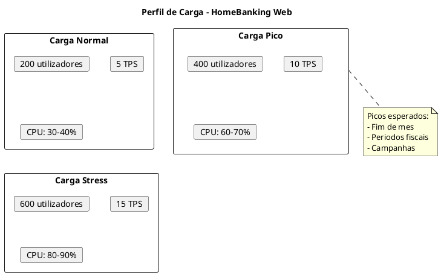
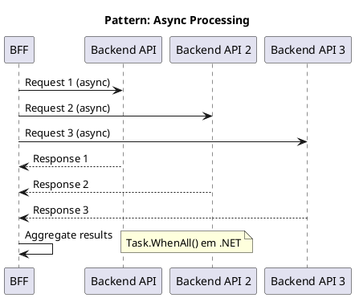

# 12. Desempenho & Fiabilidade

> **Definicao:** [DEF-12-desempenho-fiabilidade.md](../definitions/DEF-12-desempenho-fiabilidade.md)

## Proposito

Definir os objetivos de desempenho e a estrategia de fiabilidade do HomeBanking Web, incluindo targets de performance, caching, auto-scaling e testes de carga.

## Conteudo

### 12.1 Objetivos de Desempenho

Os targets sao baseados nos requisitos nao funcionais (DEF-02):

| Metrica | Target | Fonte |
|---------|--------|-------|
| **Utilizadores Concorrentes** | 400 | DEF-02 |
| **Throughput** | 10 TPS | DEF-02 |
| **Tempo de Resposta (P95)** | < 3 segundos | DEF-02 |
| **Tempo de Carregamento Inicial** | < 10 segundos | DEF-02 |
| **Disponibilidade** | 99.9% | DEF-02 |
| **Crescimento Anual** | 5% | DEF-02 |

### 12.2 Core Web Vitals

| Metrica | Target | Classificacao |
|---------|--------|---------------|
| **LCP** (Largest Contentful Paint) | < 2.5s | Good |
| **FID** (First Input Delay) | < 100ms | Good |
| **CLS** (Cumulative Layout Shift) | < 0.1 | Good |
| **TTFB** (Time to First Byte) | < 800ms | Good |
| **FCP** (First Contentful Paint) | < 1.8s | Good |

### 12.3 Perfil de Carga

### 12.4 Estrategia de Cache

#### Niveis de Cache

| Nivel | Dados | TTL |
|-------|-------|-----|
| **Browser** | Assets estaticos (JS, CSS, imagens) | Longo (com cache busting) |
| **Browser** | Local Storage (sessao, prefs) | Sessao |
| **CDN** | JS, CSS, imagens, fontes | 24 horas |
| **BFF (Redis)** | Sessoes, tokens, dados partilhados | Variavel |

#### TTL por Tipo de Dado (Redis)

| Dado | TTL | Justificacao |
|------|-----|--------------|
| Sessao do utilizador | 10 min | Inatividade timeout |
| Tokens OAuth | Variavel | Alinhado com expiracao |
| Configuracoes do sistema | 5 min | Baixa frequencia de mudanca |
| Dados de referencia (paises, bancos) | 1 hora | Dados estaticos |
| Cotacoes/Taxas | 1 min | Dados volateis |

**Principio:** Dados sensiveis (contas, transacoes) NAO sao cacheados.

#### Cache Invalidation

| Evento | Acao |
|--------|------|
| Logout | Invalidar sessao no Redis |
| Transacao executada | Invalidar cache de saldos (se aplicavel) |
| Deploy | Versionar assets (cache busting) |
| Configuracao alterada | Invalidar cache de config |

### 12.5 Otimizacao Frontend

#### Bundle Optimization

| Tecnica | Implementacao | Impacto |
|---------|---------------|---------|
| Code Splitting | React.lazy() + Suspense | Reduz initial bundle |
| Tree Shaking | Webpack/Vite config | Remove codigo nao utilizado |
| Lazy Loading | Componentes e rotas | Carrega sob demanda |
| Minification | Terser (JS), CSSNano | Reduz tamanho |
| Compression | gzip/Brotli | 70-90% reducao |

#### Budget de Bundle

| Metrica | Limite | Acao se exceder |
|---------|--------|-----------------|
| Initial JS | < 200KB (gzipped) | Code split |
| Initial CSS | < 50KB (gzipped) | Purge CSS |
| Largest chunk | < 100KB | Split ou lazy load |
| Total assets | < 1MB | Review dependencies |

#### Otimizacao de Assets

| Asset | Estrategia |
|-------|------------|
| Imagens | WebP format, lazy loading, srcset |
| Fontes | WOFF2, font-display: swap, subset |
| Icons | SVG sprite ou icon font |
| CSS | Critical CSS inline, defer restante |

### 12.6 Otimizacao Backend (BFF)

#### Connection Pooling

| Conexao | Pool Size | Timeout |
|---------|-----------|---------|
| Redis | 10-20 | 5s |
| HTTP Client (Backend) | 100 | 30s |

#### Compressao

| Tipo | Configuracao |
|------|--------------|
| Response | gzip (nivel 6) |
| Threshold | > 1KB |
| Content-Types | application/json, text/html |

#### Async/Non-blocking

### 12.7 Auto-Scaling

| Aspecto | Abordagem |
|---------|-----------|
| **Mecanismo** | Horizontal Pod Autoscaler (HPA) |
| **Metricas** | CPU, Memory |
| **CPU Target** | 70% |
| **Memory Target** | 80% |

#### Configuracao por Componente

| Componente | Min Replicas | Max Replicas | CPU Target | Memory Target |
|------------|--------------|--------------|------------|---------------|
| Frontend | 2 | 6 | 70% | 80% |
| BFF | 2 | 10 | 70% | 80% |

#### Scale-up vs Scale-down

| Evento | Tempo | Acao |
|--------|-------|------|
| Scale-up | 60s estabilizacao | Duplicar replicas |
| Scale-down | 300s estabilizacao | Reduzir 50% |

> **Nota:** Scale-down mais conservador para evitar oscilacoes.

### 12.8 Capacity Planning

#### Resource Requests/Limits

| Componente | CPU Request | CPU Limit | Memory Request | Memory Limit |
|------------|-------------|-----------|----------------|--------------|
| Frontend | 100m | 500m | 128Mi | 256Mi |
| BFF | 250m | 1000m | 256Mi | 512Mi |

#### Estimativa de Recursos (400 users)

| Componente | Pods | CPU Total | Memory Total |
|------------|------|-----------|--------------|
| Frontend | 2 | 1 vCPU | 512Mi |
| BFF | 4 | 4 vCPU | 2Gi |
| **Total** | 6 | **5 vCPU** | **2.5Gi** |

### 12.9 Resiliencia

| Padrao | Implementacao |
|--------|---------------|
| **Circuit Breaker** | Polly (.NET) |
| **Retry** | Exponential backoff (3 tentativas) |
| **Timeout** | Configuravel por endpoint |
| **Bulkhead** | Limite de conexoes |
| **Health Checks** | Liveness + Readiness probes |

#### Pod Disruption Budget

| Aspecto | Configuracao |
|---------|--------------|
| minAvailable | 50% |
| Proposito | Garantir disponibilidade durante manutencao |

### 12.10 Load Testing

#### Ferramenta

| Ferramenta | Uso | Justificacao |
|------------|-----|--------------|
| **k6** | Load testing principal | Scripting em JS, integracao CI/CD |

#### Cenarios de Teste

| Cenario | Users | Duracao | Objetivo |
|---------|-------|---------|----------|
| Smoke | 10 | 5 min | Validar ambiente |
| Load | 400 | 30 min | Validar capacidade nominal |
| Stress | 600 | 15 min | Identificar limites |
| Soak | 200 | 4 horas | Identificar memory leaks |

#### Criterios de Aceitacao

| Metrica | Criterio | Fail |
|---------|----------|------|
| Response Time P95 | < 3s | > 5s |
| Error Rate | < 0.1% | > 1% |
| Throughput | >= 10 TPS | < 8 TPS |
| CPU (peak) | < 80% | > 90% |
| Memory (peak) | < 80% | > 90% |

## Decisoes Referenciadas

- [DEC-006-estrategia-containers-openshift.md](../decisions/DEC-006-estrategia-containers-openshift.md) - Containers e auto-scaling
- [DEC-007-padrao-bff.md](../decisions/DEC-007-padrao-bff.md) - BFF (cache, resiliencia)
- [DEC-009-stack-tecnologica-frontend.md](../decisions/DEC-009-stack-tecnologica-frontend.md) - Stack frontend
- [DEC-010-stack-tecnologica-backend.md](../decisions/DEC-010-stack-tecnologica-backend.md) - Stack backend

## Definicoes Utilizadas

- [DEF-12-desempenho-fiabilidade.md](../definitions/DEF-12-desempenho-fiabilidade.md) - Detalhes completos
- [DEF-02-requisitos-nao-funcionais.md](../definitions/DEF-02-requisitos-nao-funcionais.md) - NFRs de performance
- [DEF-05-padroes-resiliencia.md](../definitions/DEF-05-padroes-resiliencia.md) - Padroes de resiliencia
