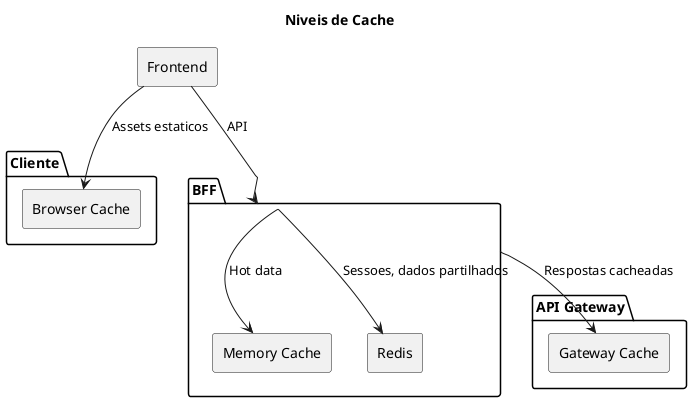

# 12. Desempenho & Fiabilidade

## Proposito

Definir os objetivos de desempenho e a estrategia de fiabilidade do HomeBanking Web, incluindo targets de performance, caching e auto-scaling.

## Conteudo

### 12.1 Objetivos de Desempenho

Os targets sao baseados nos requisitos nao funcionais (DEF-02):

| Metrica | Target | Fonte |
|---------|--------|-------|
| **Utilizadores Concorrentes** | 400 | DEF-02 |
| **Throughput** | 10 TPS | DEF-02 |
| **Tempo de Resposta (P95)** | < 3 segundos | DEF-02 |
| **Tempo de Carregamento Inicial** | < 10 segundos | DEF-02 |
| **Disponibilidade** | 99.9% | DEF-02 |
| **Crescimento Anual** | 5% | DEF-02 |

### 12.2 Core Web Vitals

| Metrica | Target | Descricao |
|---------|--------|-----------|
| **LCP** | < 2.5s | Largest Contentful Paint |
| **FID** | < 100ms | First Input Delay |
| **CLS** | < 0.1 | Cumulative Layout Shift |

### 12.3 Estrategia de Cache

| Nivel | Dados | TTL |
|-------|-------|-----|
| **Browser** | Assets estaticos (JS, CSS, imagens) | Longo (com cache busting) |
| **Memory** | Configuracoes, hot data | Curto |
| **Redis** | Sessoes, tokens, dados partilhados | Conforme tipo |
| **API Gateway** | Respostas de API | A definir |

**Principio:** Dados sensiveis (contas, transacoes) NAO sao cacheados.

### 12.4 Auto-Scaling

| Aspecto | Abordagem |
|---------|-----------|
| **Mecanismo** | Horizontal Pod Autoscaler (HPA) |
| **Metricas** | CPU, Memory |
| **Escopo** | Frontend e BFF |

A configuracao especifica (min/max replicas, thresholds) sera definida no assessment.

### 12.5 Resiliencia

| Padrao | Implementacao |
|--------|---------------|
| **Retry** | Exponential backoff (3 tentativas) |
| **Timeout** | Configuravel por endpoint |
| **Health Checks** | Liveness + Readiness probes |
| **Circuit Breaker** | A definir (proposta: Polly) |

### 12.6 Load Testing

| Aspecto | Abordagem |
|---------|-----------|
| **Ferramenta** | A definir (k6, JMeter, Locust) |
| **Cenario base** | 400 utilizadores concorrentes |
| **Frequencia** | Pre-release |

#### Criterios de Aceitacao

| Metrica | Criterio |
|---------|----------|
| Response Time P95 | < 3s |
| Error Rate | < 1% |
| Throughput | >= 10 TPS |

## Itens Pendentes

| Item | Responsavel | Prioridade |
|------|-------------|------------|
| Definir configuracao HPA | Infraestrutura | Alta |
| Definir TTLs de cache | Arquitetura | Alta |
| Definir ferramenta de load testing | QA | Media |
| Configurar circuit breaker | Desenvolvimento | Media |

## Decisoes Referenciadas

- [DEC-006-estrategia-containers-openshift.md](../decisions/DEC-006-estrategia-containers-openshift.md) - Containers
- [DEC-007-arquitetura-bff.md](../decisions/DEC-007-arquitetura-bff.md) - BFF (cache, resiliencia)
