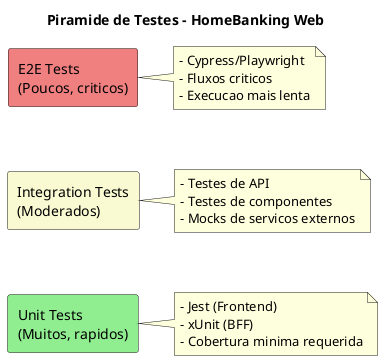
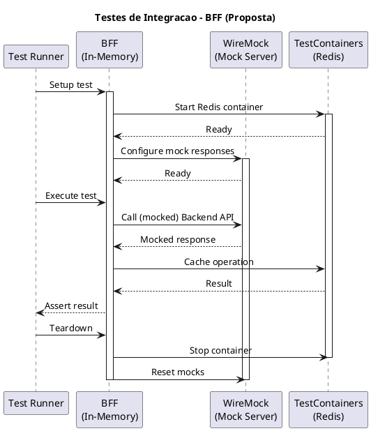
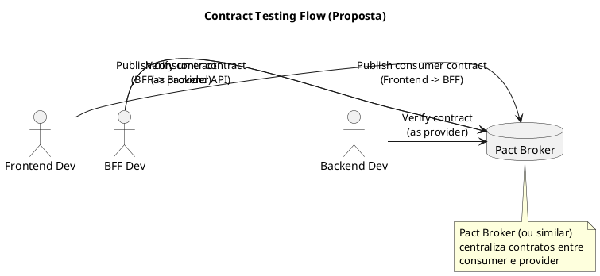
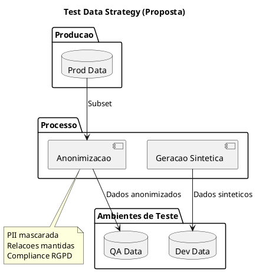

# 13. Estrategia de Testes

> **Required definitions:** [DEF-13-estrategia-testes.md](../definitions/DEF-13-estrategia-testes.md)
> **Related decisions:**
> - [DEC-009-stack-tecnologica-frontend.md](../decisions/DEC-009-stack-tecnologica-frontend.md) - Status: accepted
> - [DEC-010-stack-tecnologica-backend.md](../decisions/DEC-010-stack-tecnologica-backend.md) - Status: accepted

## Proposito

Definir a estrategia de testes do HomeBanking Web, incluindo testes unitarios, integracao, contrato, E2E, performance, seguranca, acessibilidade, test data management e matriz de responsabilidades.

## Conteudo

### 13.1 Piramide de Testes

A estrategia de testes segue o modelo da piramide de testes, priorizando testes unitarios e de integracao.



### 13.2 Testes Unitarios

_Os detalhes de testes unitarios necessitam aprofundamento._

#### Frontend (Proposta)

| Aspecto | Proposta | Status |
|---------|----------|--------|
| **Framework** | Jest + React Testing Library | Necessita aprofundamento |
| **Cobertura Minima** | Necessita aprofundamento | Pendente |
| **Bloqueia Pipeline** | Necessita aprofundamento | Pendente |

#### BFF (Proposta)

| Aspecto | Proposta | Status |
|---------|----------|--------|
| **Framework** | xUnit / NUnit | Necessita aprofundamento |
| **Cobertura Minima** | Necessita aprofundamento | Pendente |
| **Bloqueia Pipeline** | Necessita aprofundamento | Pendente |

#### Boas Praticas

- Testes isolados e independentes
- Nomes descritivos (Given-When-Then)
- Mocking de dependencias externas
- Execucao rapida (< 100ms por teste)

### 13.3 Testes de Integracao

_Os detalhes de testes de integracao necessitam aprofundamento._



#### Ferramentas (Proposta)

| Componente | Ferramenta | Uso |
|------------|------------|-----|
| **Mock Server** | WireMock | Mock de Backend API |
| **Containers** | TestContainers | Redis, outros servicos |
| **HTTP Client** | WebApplicationFactory | Testes in-memory |

#### Ambiente

| Aspecto | Status |
|---------|--------|
| Ambiente dedicado | Necessita aprofundamento |
| Dados de teste | Necessita aprofundamento |
| Isolamento | Necessita aprofundamento |

### 13.4 Testes de Contrato

_Os detalhes de contract testing necessitam aprofundamento._

| Aspecto | Status |
|---------|--------|
| Implementacao (Pact, Spring Cloud Contract) | Necessita aprofundamento |
| Responsabilidade pelos contratos | Necessita aprofundamento |
| Validacao com Backend API | Necessita aprofundamento |

#### Proposta de Fluxo



### 13.5 Testes E2E

_Os detalhes de testes E2E necessitam aprofundamento._

#### Framework (Proposta)

| Opcao | Pros | Contras |
|-------|------|---------|
| **Cypress** | API simples, bom debug | Apenas Chromium |
| **Playwright** | Multi-browser, Microsoft | Mais complexo |
| **Selenium** | Tradicional, amplo suporte | Mais lento, flaky |

#### Cenarios Criticos (Proposta)

| Cenario | Prioridade | Status |
|---------|------------|--------|
| Login/Logout | Alta | Necessita aprofundamento |
| Consulta de saldo | Alta | Necessita aprofundamento |
| Transferencia | Alta | Necessita aprofundamento |
| Pagamentos | Alta | Necessita aprofundamento |
| Gestao de perfil | Media | Necessita aprofundamento |

#### Configuracao

| Aspecto | Status |
|---------|--------|
| Ambiente de execucao | Necessita aprofundamento |
| Bloqueia pipeline | Necessita aprofundamento |
| Paralelizacao | Necessita aprofundamento |
| Retry em caso de falha | Necessita aprofundamento |

### 13.6 Testes de Performance

Os testes de performance estao detalhados na [SEC-12 - Desempenho & Fiabilidade](SEC-12-desempenho-fiabilidade.md).

| Aspecto | Referencia |
|---------|------------|
| Ferramenta | SEC-12 |
| Cenarios | SEC-12 |
| Criterios de aceitacao | SEC-12 |
| Frequencia | SEC-12 |

### 13.7 Testes de Seguranca

_Os detalhes de testes de seguranca necessitam aprofundamento._

#### SAST (Static Application Security Testing)

| Aspecto | Status |
|---------|--------|
| Ferramenta | Necessita aprofundamento |
| Integracao CI/CD | Sim (DEF-10) |
| Bloqueia pipeline | Necessita aprofundamento |
| Severidade minima para bloqueio | Necessita aprofundamento |

#### DAST (Dynamic Application Security Testing)

| Aspecto | Status |
|---------|--------|
| Ferramenta | Necessita aprofundamento |
| Frequencia | Necessita aprofundamento |
| Ambiente | Necessita aprofundamento |

#### Penetration Testing

| Aspecto | Status |
|---------|--------|
| Frequencia | Necessita aprofundamento |
| Escopo | Necessita aprofundamento |
| Responsavel | Necessita aprofundamento |

#### Gestao de Findings

| Aspecto | Status |
|---------|--------|
| SLA para correcao (Critical) | Necessita aprofundamento |
| SLA para correcao (High) | Necessita aprofundamento |
| SLA para correcao (Medium) | Necessita aprofundamento |
| SLA para correcao (Low) | Necessita aprofundamento |

### 13.8 Testes de Acessibilidade

_Os detalhes de testes de acessibilidade necessitam aprofundamento._

| Aspecto | Status |
|---------|--------|
| Guideline (WCAG 2.0/2.1) | Necessita aprofundamento |
| Nivel (A, AA, AAA) | Necessita aprofundamento |
| Ferramenta automatizada | Necessita aprofundamento |
| Testes manuais | Necessita aprofundamento |

#### Ferramentas (Proposta)

| Ferramenta | Uso |
|------------|-----|
| axe-core | Testes automatizados |
| WAVE | Validacao manual |
| Lighthouse | Auditoria geral |
| Screen Reader | Testes manuais |

### 13.9 Test Data Management

_Os detalhes de test data management necessitam aprofundamento._

| Aspecto | Status |
|---------|--------|
| Estrategia de dados | Necessita aprofundamento |
| Dados anonimizados de prod | Necessita aprofundamento |
| Fixtures/Factories | Necessita aprofundamento |
| Reset entre testes | Necessita aprofundamento |

#### Proposta de Estrategia



### 13.10 Testes de Regressao

_Os detalhes de testes de regressao necessitam aprofundamento._

| Aspecto | Status |
|---------|--------|
| Smoke tests | Necessita aprofundamento |
| Suite de regressao completa | Necessita aprofundamento |
| Frequencia | Necessita aprofundamento |
| Automatizacao | Necessita aprofundamento |

### 13.11 Testes de Aceitacao (UAT)

_Os detalhes de testes de aceitacao necessitam aprofundamento._

| Aspecto | Status |
|---------|--------|
| Responsavel | Necessita aprofundamento |
| Ambiente UAT | Necessita aprofundamento |
| Criterios de aceitacao | Necessita aprofundamento |
| Processo de sign-off | Necessita aprofundamento |

### 13.12 Matriz de Responsabilidades (RACI)

_A matriz de responsabilidades necessita aprofundamento._

| Tipo de Teste | Responsible | Accountable | Consulted | Informed |
|---------------|-------------|-------------|-----------|----------|
| **Unit (Frontend)** | Necessita aprofundamento | Necessita aprofundamento | Necessita aprofundamento | Necessita aprofundamento |
| **Unit (BFF)** | Necessita aprofundamento | Necessita aprofundamento | Necessita aprofundamento | Necessita aprofundamento |
| **Integracao** | Necessita aprofundamento | Necessita aprofundamento | Necessita aprofundamento | Necessita aprofundamento |
| **Contrato** | Necessita aprofundamento | Necessita aprofundamento | Necessita aprofundamento | Necessita aprofundamento |
| **E2E** | Necessita aprofundamento | Necessita aprofundamento | Necessita aprofundamento | Necessita aprofundamento |
| **Performance** | Necessita aprofundamento | Necessita aprofundamento | Necessita aprofundamento | Necessita aprofundamento |
| **Seguranca** | Necessita aprofundamento | Necessita aprofundamento | Necessita aprofundamento | Necessita aprofundamento |
| **Acessibilidade** | Necessita aprofundamento | Necessita aprofundamento | Necessita aprofundamento | Necessita aprofundamento |
| **UAT** | Necessita aprofundamento | Necessita aprofundamento | Necessita aprofundamento | Necessita aprofundamento |

### 13.13 Quality Gates

Os quality gates sao verificados no pipeline CI/CD (DEF-10).

| Gate | Criterio | Pipeline Stage |
|------|----------|----------------|
| **Unit Tests** | Necessita aprofundamento | Build |
| **Coverage** | Sim (DEF-10) | Build |
| **SAST** | Sim (DEF-10) | Build |
| **Integration Tests** | Necessita aprofundamento | Test |
| **E2E Tests** | Necessita aprofundamento | Test |
| **DAST** | Necessita aprofundamento | Pre-Prod |

## Diagramas

### Integracao com CI/CD

```plantuml
@startuml
!include https://raw.githubusercontent.com/plantuml-stdlib/C4-PlantUML/master/C4_Container.puml

LAYOUT_WITH_LEGEND()

title Test Integration with CI/CD Pipeline

System_Boundary(cicd, "Azure DevOps Pipeline") {
  Container(build, "Build Stage", "Pipeline", "Compile, Unit Tests, SAST")
  Container(test, "Test Stage", "Pipeline", "Integration, E2E")
  Container(qa, "QA Stage", "Pipeline", "Deploy QA, Smoke")
  Container(prod, "Prod Stage", "Pipeline", "Deploy Prod")
}

System_Ext(sonar, "SonarQube", "Code Quality")
System_Ext(sec, "Security Scanner", "SAST/DAST")

Rel(build, sonar, "Report")
Rel(build, sec, "SAST")
Rel(build, test, "Pass")
Rel(test, qa, "Pass")
Rel(qa, prod, "Approve")

@enduml
```

## Entregaveis

- [ ] Configuracao de testes unitarios (Frontend + BFF)
- [ ] Configuracao de testes de integracao
- [ ] Suite de testes E2E (cenarios criticos)
- [ ] Integracao SAST no pipeline
- [ ] Testes de acessibilidade
- [ ] Documentacao de test data management

## Definicoes Utilizadas

- [x] [DEF-13-estrategia-testes.md](../definitions/DEF-13-estrategia-testes.md) - Status: structure
- [x] [DEF-10-arquitetura-operacional.md](../definitions/DEF-10-arquitetura-operacional.md) - Status: structure

## Decisoes Referenciadas

- [x] [DEC-009-stack-tecnologica-frontend.md](../decisions/DEC-009-stack-tecnologica-frontend.md) - Status: accepted
- [x] [DEC-010-stack-tecnologica-backend.md](../decisions/DEC-010-stack-tecnologica-backend.md) - Status: accepted

## Itens Pendentes

| Item | Responsavel | Prioridade |
|------|-------------|------------|
| Definir frameworks de teste | Arquitetura | Alta |
| Definir cobertura minima | QA | Alta |
| Definir cenarios E2E criticos | QA | Alta |
| Configurar SAST | DevSecOps | Alta |
| Definir estrategia de test data | QA | Media |
| Contract testing (se aplicavel) | Arquitetura | Media |
| Testes de acessibilidade | QA | Media |
| Matriz RACI | PM | Media |
