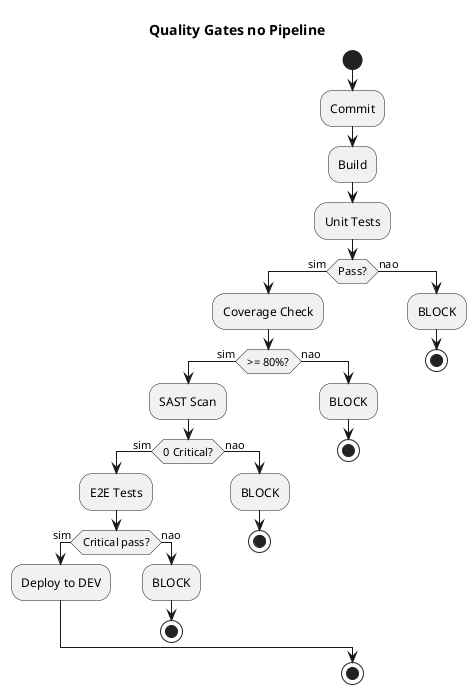

# 13. Estrategia de Testes

> **Definicao:** [DEF-13-estrategia-testes.md](../definitions/DEF-13-estrategia-testes.md)

## Proposito

Definir a estrategia de testes do HomeBanking Web a nivel arquitetural, estabelecendo os tipos de testes, frameworks, quality gates e integracao com o pipeline CI/CD.

## Conteudo

### 13.1 Piramide de Testes

A estrategia de testes segue o modelo da **piramide de testes**, priorizando testes automatizados nos niveis inferiores.

| Nivel | Distribuicao | Frameworks | Escopo |
|-------|--------------|------------|--------|
| **Unit Tests** | 70% | Vitest (FE), xUnit (BFF) | Funcoes, componentes isolados |
| **Integration** | 20% | WireMock, TestContainers | APIs, servicos, contratos |
| **E2E** | 10% | Playwright | Fluxos criticos de utilizador |

### 13.2 Cobertura de Codigo

| Tipo de Codigo | Cobertura Target |
|----------------|------------------|
| Componentes criticos | >= 90% |
| Hooks customizados | >= 90% |
| Utils/helpers | >= 80% |
| Servicos | >= 80% |
| **Codigo geral** | **>= 80%** |

### 13.3 Frameworks de Teste

#### Frontend (React + TypeScript)

| Aspecto | Especificacao |
|---------|---------------|
| Framework | Vitest |
| Assertions | Vitest expect |
| Component Testing | React Testing Library |
| Mocking | Vitest mocks |
| Coverage | Istanbul |

#### BFF (.NET 8)

| Aspecto | Especificacao |
|---------|---------------|
| Framework | xUnit |
| Assertions | FluentAssertions |
| Mocking | Moq / NSubstitute |
| Coverage | Coverlet |

#### E2E

| Aspecto | Especificacao |
|---------|---------------|
| Framework | Playwright |
| Browsers | Chromium, Firefox, WebKit |
| Execution | CI/CD (headless) |
| Reports | HTML + Screenshots |

### 13.4 Tipos de Testes

| Tipo | Objetivo | Responsabilidade | Frequencia |
|------|----------|------------------|------------|
| **Unitarios** | Validar logica isolada | Desenvolvimento | Cada commit |
| **Integracao** | Validar comunicacao entre componentes | Desenvolvimento | Cada commit |
| **Contrato** | Validar API contracts (Pact) | Desenvolvimento | Cada commit |
| **E2E** | Validar fluxos criticos de negocio | QA + Dev | Cada PR |
| **Performance** | Validar NFRs de carga | QA | Pre-release |
| **Seguranca (SAST)** | Analise estatica de codigo | Pipeline | Cada commit |
| **Seguranca (DAST)** | Analise dinamica | SecOps | Pre-release |
| **Acessibilidade** | Validar conformidade WCAG 2.1 AA | QA | Cada PR |
| **Penetration Test** | Testes manuais de intrusao | Externo | Antes go-live |

### 13.5 Cenarios E2E Criticos

| Fluxo | Prioridade | Criticidade |
|-------|------------|-------------|
| Login via QR Code | Alta | Critico |
| Login tradicional (fallback) | Alta | Critico |
| Consulta de saldos | Alta | Critico |
| Transferencia nacional | Alta | Critico |
| Pagamento de servicos | Alta | Critico |
| Logout | Media | Alto |
| Alteracao de dados | Media | Alto |

### 13.6 Testes de Seguranca

| Tipo | Ferramenta | Quando |
|------|------------|--------|
| SAST | SonarQube / Checkmarx | Cada commit |
| DAST | OWASP ZAP | Pre-release |
| Dependency Scan | Snyk / Dependabot | Diario |
| Penetration Test | Manual (externo) | Antes go-live |

### 13.7 Testes de Acessibilidade

| Aspecto | Especificacao |
|---------|---------------|
| Standard | WCAG 2.1 AA |
| Tool | axe-core |
| Integration | Playwright + axe |
| Reports | HTML |

### 13.8 Quality Gates no Pipeline

| Gate | Threshold | Bloqueante |
|------|-----------|------------|
| Unit Tests | 100% pass | Sim |
| Code Coverage | >= 80% | Sim |
| SAST | 0 Critical, 0 High | Sim |
| Lint | 0 errors | Sim |
| E2E Critical | 100% pass | Sim |
| E2E Non-critical | >= 95% pass | Nao |
| Accessibility | 0 Critical | Sim |

### 13.9 Test Data Management

| Ambiente | Dados | Fonte |
|----------|-------|-------|
| **dev** | Dados sinteticos (fixtures) | Gerados |
| **qa** | Dados anonimizados de producao | DB anonimizado |
| **prod** | N/A (nao testar em prod) | - |

### 13.10 Matriz de Responsabilidades

| Tipo de Teste | Quem Escreve | Quem Executa | Quando |
|---------------|--------------|--------------|--------|
| Unit Tests | Developers | CI Pipeline | Cada commit |
| Integration | Developers | CI Pipeline | Cada commit |
| Contract | Developers | CI Pipeline | Cada commit |
| E2E | QA + Developers | CI Pipeline | Cada PR |
| Performance | QA | Manual + CI | Pre-release |
| Security (SAST) | Automated | CI Pipeline | Cada commit |
| Security (DAST) | SecOps | Manual | Pre-release |
| Accessibility | QA | CI Pipeline | Cada PR |
| UAT | QA + PO | Manual | Pre-release |

## Decisoes Referenciadas

- [DEC-009-stack-tecnologica-frontend.md](../decisions/DEC-009-stack-tecnologica-frontend.md) - Stack Frontend (Vitest)
- [DEC-010-stack-tecnologica-backend.md](../decisions/DEC-010-stack-tecnologica-backend.md) - Stack Backend (xUnit)

## Definicoes Utilizadas

- [DEF-13-estrategia-testes.md](../definitions/DEF-13-estrategia-testes.md) - Detalhes completos
- [DEF-08-seguranca-conformidade.md](../definitions/DEF-08-seguranca-conformidade.md) - Requisitos de seguranca
- [DEF-04-design-system.md](../definitions/DEF-04-design-system.md) - WCAG requirements
