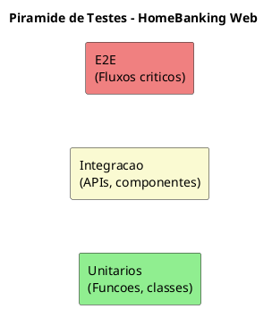
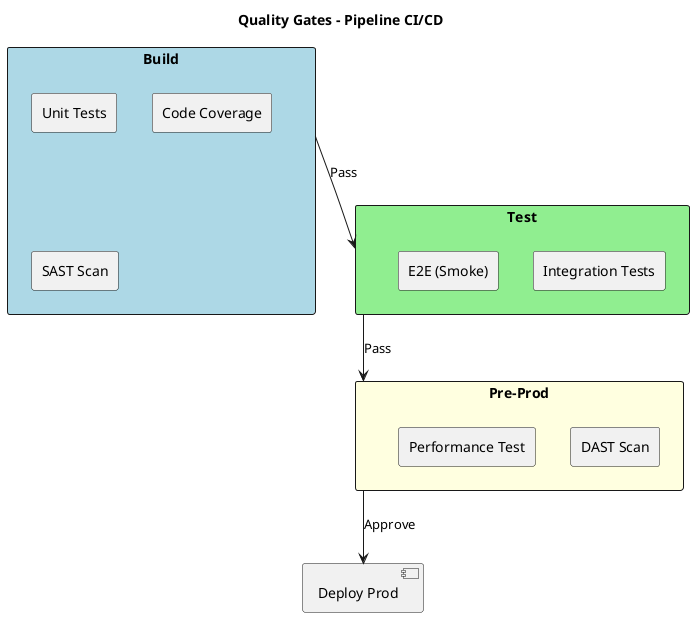

# 13. Estrategia de Testes

## Proposito

Definir a estrategia de testes do HomeBanking Web a nivel arquitetural, estabelecendo os tipos de testes, quality gates e integracao com o pipeline CI/CD.

## Conteudo

### 13.1 Abordagem de Testes

A estrategia de testes segue o modelo da **piramide de testes**, priorizando testes automatizados nos niveis inferiores.

| Nivel | Escopo | Quantidade | Velocidade |
|-------|--------|------------|------------|
| **Unitarios** | Funcoes, componentes isolados | Muitos | Rapidos |
| **Integracao** | APIs, servicos, base de dados | Moderados | Medios |
| **E2E** | Fluxos completos de utilizador | Poucos | Lentos |

### 13.2 Tipos de Testes

| Tipo | Objetivo | Responsabilidade |
|------|----------|------------------|
| **Unitarios** | Validar logica isolada | Equipa de Desenvolvimento |
| **Integracao** | Validar comunicacao entre componentes | Equipa de Desenvolvimento |
| **E2E** | Validar fluxos criticos de negocio | QA |
| **Performance** | Validar NFRs de carga e tempo de resposta | QA / Arquitetura |
| **Seguranca (SAST/DAST)** | Identificar vulnerabilidades | DevSecOps |
| **Acessibilidade** | Validar conformidade WCAG | QA / UX |

### 13.3 Quality Gates no Pipeline

Os quality gates sao pontos de verificacao automatica no pipeline CI/CD que bloqueiam a promocao de codigo que nao cumpra os criterios minimos.

| Gate | Stage | Criterio | Bloqueante |
|------|-------|----------|------------|
| Unit Tests | Build | 100% a passar | Sim |
| Code Coverage | Build | Minimo a definir | Sim |
| SAST | Build | Sem vulnerabilidades Critical/High | Sim |
| Integration Tests | Test | 100% a passar | Sim |
| E2E Smoke | Test | Fluxos criticos a passar | Sim |
| DAST | Pre-Prod | Sem vulnerabilidades Critical | Sim |

### 13.4 Testes de Seguranca

| Tipo | Descricao | Frequencia |
|------|-----------|------------|
| **SAST** | Analise estatica de codigo | Cada build |
| **DAST** | Analise dinamica em ambiente de teste | Pre-release |
| **Penetration Testing** | Testes manuais de intrusao | Periodico (a definir) |

### 13.5 Ambientes de Teste

| Ambiente | Proposito | Dados |
|----------|-----------|-------|
| **Dev** | Testes unitarios e integracao | Sinteticos |
| **QA** | Testes E2E e aceitacao | Anonimizados |
| **Pre-Prod** | Testes de performance e seguranca | Anonimizados |

## Itens Pendentes

| Item | Responsavel | Prioridade |
|------|-------------|------------|
| Definir cobertura minima de codigo | Arquitetura / QA | Alta |
| Definir ferramentas SAST/DAST | DevSecOps | Alta |
| Definir cenarios E2E criticos | QA / Produto | Alta |
| Definir frequencia de penetration testing | Seguranca | Media |

## Decisoes Referenciadas

- [DEC-009-stack-tecnologica-frontend.md](../decisions/DEC-009-stack-tecnologica-frontend.md) - Stack Frontend
- [DEC-010-stack-tecnologica-backend.md](../decisions/DEC-010-stack-tecnologica-backend.md) - Stack Backend
