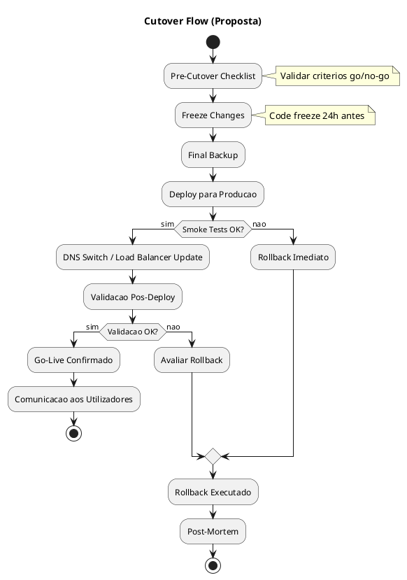
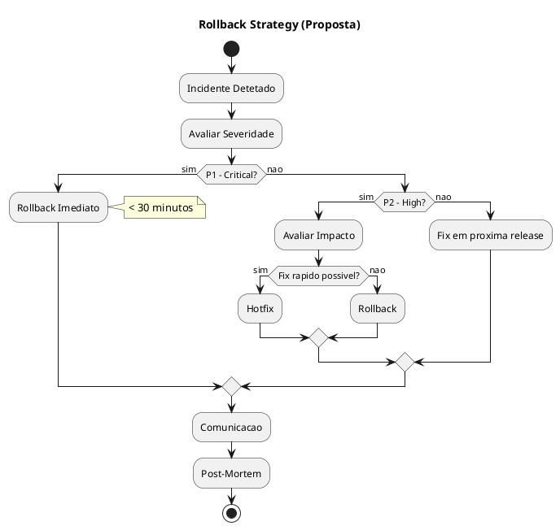
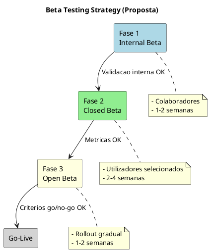

# 14. Plano de Migracao & Implementacao

> **Required definitions:** [DEF-14-plano-migracao-implementacao.md](../definitions/DEF-14-plano-migracao-implementacao.md)
> **Related decisions:**
> - [DEC-006-estrategia-containers-openshift.md](../decisions/DEC-006-estrategia-containers-openshift.md) - Status: accepted

## Proposito

Definir o plano de migracao e implementacao do HomeBanking Web, incluindo roadmap, estrategia de cutover, coexistencia com sistemas legados, migracao de dados, criterios go/no-go, procedimentos de rollback, plano de comunicacao, formacao e periodo de hypercare.

## Conteudo

### 14.1 Roadmap de Implementacao

_O roadmap de implementacao necessita aprofundamento._

| Aspecto | Status |
|---------|--------|
| Data prevista go-live | Necessita aprofundamento |
| Fases de implementacao | Necessita aprofundamento |
| MVP definido | Necessita aprofundamento |
| Dependencias externas | Necessita aprofundamento |

#### Fases (Proposta)

```plantuml
@startuml
skinparam backgroundColor white

title Roadmap de Implementacao (Proposta)

concise "Fase" as F

@0
F is "Setup"

@4
F is "MVP"

@12
F is "Beta"

@16
F is "Go-Live"

@20
F is "Hypercare"

@24
F is "BAU"

@F
0 <-> 4 : Infraestrutura\ne Setup Inicial
4 <-> 12 : Desenvolvimento\nMVP
12 <-> 16 : Beta Testing\ne Ajustes
16 <-> 20 : Lancamento\nGradual
20 <-> 24 : Suporte\nIntensivo

@enduml
```

| Fase | Descricao | Duracao | Status |
|------|-----------|---------|--------|
| **1. Setup** | Infraestrutura, pipelines, ambientes | Necessita aprofundamento | Pendente |
| **2. MVP** | Funcionalidades core | Necessita aprofundamento | Pendente |
| **3. Beta** | Testes com utilizadores reais | Necessita aprofundamento | Pendente |
| **4. Go-Live** | Lancamento em producao | Necessita aprofundamento | Pendente |
| **5. Hypercare** | Suporte intensivo | Necessita aprofundamento | Pendente |

#### MVP - Funcionalidades (Proposta)

_As funcionalidades do MVP necessitam aprofundamento._

| Funcionalidade | Prioridade | Status |
|----------------|------------|--------|
| Login/Autenticacao | Alta | Necessita aprofundamento |
| Dashboard (saldo) | Alta | Necessita aprofundamento |
| Extrato de conta | Alta | Necessita aprofundamento |
| Transferencias | Alta | Necessita aprofundamento |
| Pagamentos | Alta | Necessita aprofundamento |
| Cartoes (consulta) | Media | Necessita aprofundamento |
| Perfil utilizador | Media | Necessita aprofundamento |

### 14.2 Estrategia de Cutover

_A estrategia de cutover necessita aprofundamento._

| Aspecto | Status |
|---------|--------|
| Estrategia (big bang/phased/parallel) | Necessita aprofundamento |
| Janela de cutover | Necessita aprofundamento |
| Tempo estimado | Necessita aprofundamento |

#### Opcoes de Cutover

| Estrategia | Descricao | Risco | Complexidade |
|------------|-----------|-------|--------------|
| **Big Bang** | Substituicao total num unico momento | Alto | Baixa |
| **Phased** | Rollout gradual por funcionalidade | Medio | Media |
| **Parallel** | Sistemas coexistem por periodo | Baixo | Alta |

#### Fluxo de Cutover (Proposta)



### 14.3 Coexistencia com Legado

_Os detalhes de coexistencia necessitam aprofundamento._

| Aspecto | Status |
|---------|--------|
| Sistema legado existente | Necessita aprofundamento |
| Estrategia de coexistencia | Necessita aprofundamento |
| Periodo de transicao | Necessita aprofundamento |
| URLs retrocompativeis | Necessita aprofundamento |

**Nota:** Conforme CONTEXT.md, a aplicacao reutiliza infraestrutura e servicos da app mobile nativa, o que minimiza necessidade de migracao de backend.

### 14.4 Migracao de Dados

_Os detalhes de migracao de dados necessitam aprofundamento._

| Aspecto | Status |
|---------|--------|
| Dados a migrar | Necessita aprofundamento |
| Estrategia de migracao | Necessita aprofundamento |
| Validacao pos-migracao | Necessita aprofundamento |

**Nota:** Os dados de negocio sao geridos pelo Backend API (sistemas core), que ja suporta a app mobile. A migracao de dados do cliente e minima.

#### Dados Potenciais para Migracao

| Tipo de Dado | Origem | Destino | Status |
|--------------|--------|---------|--------|
| Preferencias de utilizador (legado) | Necessita aprofundamento | Necessita aprofundamento | Pendente |
| Configuracoes de app | Necessita aprofundamento | Necessita aprofundamento | Pendente |
| Historico de sessoes | Necessita aprofundamento | Necessita aprofundamento | Pendente |

### 14.5 Criterios Go/No-Go

_Os criterios go/no-go necessitam aprofundamento._

#### Criterios Funcionais (Proposta)

| Criterio | Descricao | Status |
|----------|-----------|--------|
| Funcionalidades MVP completas | Todas as features do MVP implementadas | Necessita aprofundamento |
| Testes E2E a passar | Suite de testes criticos sem falhas | Necessita aprofundamento |
| UAT aprovado | Sign-off do cliente | Necessita aprofundamento |
| Integracao Backend API | Todas as integracoes funcionais | Necessita aprofundamento |

#### Criterios Nao Funcionais (Proposta)

| Criterio | Target | Status |
|----------|--------|--------|
| Performance (P95 < 3s) | DEF-02 | Necessita aprofundamento |
| Load test (400 users) | DEF-02 | Necessita aprofundamento |
| Disponibilidade (ambiente QA) | 99.9% | Necessita aprofundamento |

#### Criterios de Seguranca (Proposta)

| Criterio | Descricao | Status |
|----------|-----------|--------|
| SAST sem findings Critical/High | Scan de seguranca limpo | Necessita aprofundamento |
| DAST sem findings Critical | Testes dinamicos aprovados | Necessita aprofundamento |
| Penetration test | Se aplicavel | Necessita aprofundamento |
| Revisao de seguranca | Sign-off da equipa de seguranca | Necessita aprofundamento |

#### Aprovadores

| Papel | Responsavel | Status |
|-------|-------------|--------|
| Product Owner | Necessita aprofundamento | Pendente |
| Tech Lead | Necessita aprofundamento | Pendente |
| Security | Necessita aprofundamento | Pendente |
| Operations | Necessita aprofundamento | Pendente |

### 14.6 Procedimentos de Rollback

_Os procedimentos de rollback necessitam aprofundamento._

| Aspecto | Status |
|---------|--------|
| Estrategia de rollback | Necessita aprofundamento |
| Tempo maximo para decisao | Necessita aprofundamento |
| Runbook documentado | Necessita aprofundamento |

#### Estrategia (Proposta)



#### Tipos de Rollback

| Tipo | Descricao | Tempo Estimado |
|------|-----------|----------------|
| **Container rollback** | Reverter para imagem anterior | < 5 min |
| **DNS rollback** | Redirecionar para sistema anterior | < 2 min |
| **Feature flag** | Desativar funcionalidade especifica | Imediato |
| **Full rollback** | Reverter toda a implementacao | Necessita aprofundamento |

### 14.7 Plano de Comunicacao

_O plano de comunicacao necessita aprofundamento._

| Aspecto | Status |
|---------|--------|
| Comunicacao pre-lancamento | Necessita aprofundamento |
| Canais de comunicacao | Necessita aprofundamento |
| Comunicacao pos-lancamento | Necessita aprofundamento |

#### Timeline de Comunicacao (Proposta)

| Momento | Mensagem | Canal | Status |
|---------|----------|-------|--------|
| T-4 semanas | Anuncio de novo HomeBanking | Necessita aprofundamento | Pendente |
| T-2 semanas | Preview de funcionalidades | Necessita aprofundamento | Pendente |
| T-1 semana | Instrucoes de acesso | Necessita aprofundamento | Pendente |
| Go-Live | Lancamento oficial | Necessita aprofundamento | Pendente |
| T+1 semana | Follow-up e feedback | Necessita aprofundamento | Pendente |

### 14.8 Formacao

_O plano de formacao necessita aprofundamento._

| Aspecto | Status |
|---------|--------|
| Formacao equipas internas | Necessita aprofundamento |
| Formacao utilizadores finais | Necessita aprofundamento |
| Documentacao de utilizador | Necessita aprofundamento |

#### Audiencias (Proposta)

| Audiencia | Tipo de Formacao | Status |
|-----------|------------------|--------|
| Equipa de Suporte | Tecnica + Funcional | Necessita aprofundamento |
| Equipa de Operacoes | Tecnica (runbooks) | Necessita aprofundamento |
| Utilizadores Finais | Self-service (guias) | Necessita aprofundamento |

### 14.9 Pilot/Beta Testing

_Os detalhes de beta testing necessitam aprofundamento._

| Aspecto | Status |
|---------|--------|
| Pilot previsto | Necessita aprofundamento |
| Criterio de selecao | Necessita aprofundamento |
| Duracao | Necessita aprofundamento |
| Metricas de sucesso | Necessita aprofundamento |

#### Estrategia (Proposta)



### 14.10 Hypercare Period

_Os detalhes do periodo de hypercare necessitam aprofundamento._

| Aspecto | Status |
|---------|--------|
| Duracao | Necessita aprofundamento |
| Equipa de suporte | Necessita aprofundamento |
| SLAs | Necessita aprofundamento |
| Cobertura horaria | Necessita aprofundamento |

#### Proposta de Hypercare

| Periodo | Cobertura | SLA Resposta | Status |
|---------|-----------|--------------|--------|
| Semana 1 | 24/7 | P1: 15 min | Necessita aprofundamento |
| Semana 2 | 24/7 | P1: 30 min | Necessita aprofundamento |
| Semana 3-4 | Horario alargado | P1: 1 hora | Necessita aprofundamento |
| Apos 4 semanas | BAU | DEF-02 | Necessita aprofundamento |

## Diagramas

### Visao Geral do Processo de Implementacao

```plantuml
@startuml
!include https://raw.githubusercontent.com/plantuml-stdlib/C4-PlantUML/master/C4_Container.puml

LAYOUT_WITH_LEGEND()

title Implementation Process Overview

Person(pm, "Project Manager", "Coordena implementacao")
Person(dev, "Development Team", "Desenvolve solucao")
Person(qa, "QA Team", "Valida qualidade")
Person(ops, "Operations", "Deploy e suporte")
Person(user, "Beta Users", "Testa em producao")

System_Boundary(impl, "Implementacao") {
  Container(mvp, "MVP", "Fase 1", "Funcionalidades core")
  Container(beta, "Beta", "Fase 2", "Testes com utilizadores")
  Container(golive, "Go-Live", "Fase 3", "Lancamento")
  Container(hyper, "Hypercare", "Fase 4", "Suporte intensivo")
}

Rel(dev, mvp, "Desenvolve")
Rel(qa, mvp, "Valida")
Rel(ops, beta, "Deploy")
Rel(user, beta, "Testa")
Rel(pm, golive, "Coordena")
Rel(ops, hyper, "Suporta")

@enduml
```

## Entregaveis

- [ ] Roadmap detalhado com datas
- [ ] Checklist de go/no-go
- [ ] Runbook de cutover
- [ ] Runbook de rollback
- [ ] Plano de comunicacao
- [ ] Material de formacao
- [ ] Criterios de beta testing

## Definicoes Utilizadas

- [x] [DEF-14-plano-migracao-implementacao.md](../definitions/DEF-14-plano-migracao-implementacao.md) - Status: structure
- [x] [DEF-02-requisitos-nao-funcionais.md](../definitions/DEF-02-requisitos-nao-funcionais.md) - Status: completed

## Decisoes Referenciadas

- [x] [DEC-006-estrategia-containers-openshift.md](../decisions/DEC-006-estrategia-containers-openshift.md) - Status: accepted

## Itens Pendentes

| Item | Responsavel | Prioridade |
|------|-------------|------------|
| Definir data de go-live | PM + Cliente | Alta |
| Definir funcionalidades MVP | PO + Cliente | Alta |
| Definir criterios go/no-go | Arquitetura | Alta |
| Estrategia de cutover | Operacoes | Alta |
| Runbook de rollback | Operacoes | Alta |
| Plano de comunicacao | Marketing/PM | Media |
| Estrategia de beta testing | QA + PM | Media |
| Plano de formacao | PM | Media |
| Periodo de hypercare | Operacoes | Media |
