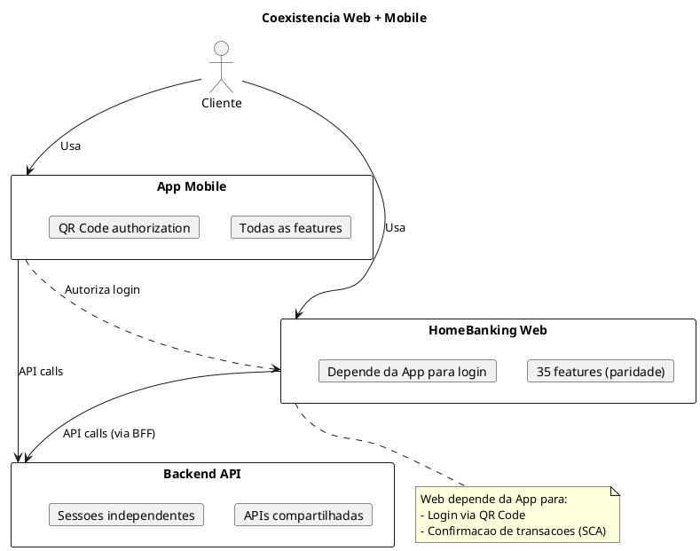
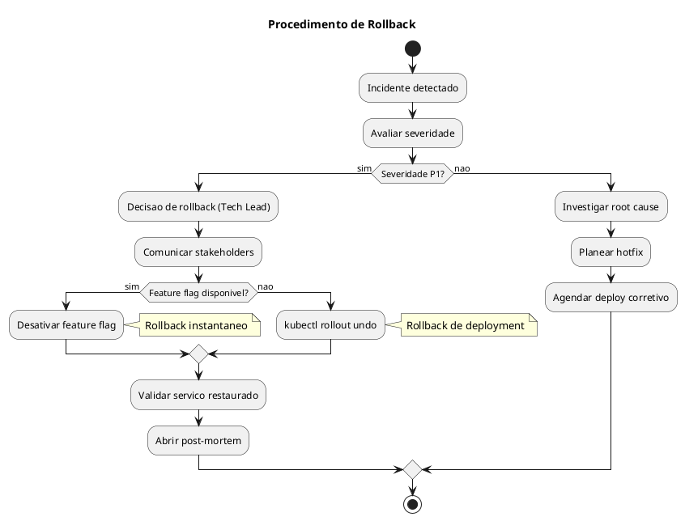

# 14. Plano de Migracao & Implementacao

## Definições e Decisões

> **Definicao:** [DEF-14-plano-migracao-implementacao.md](../definitions/DEF-14-plano-migracao-implementacao.md)

## Proposito

Definir o plano de migracao e implementacao do HomeBanking Web, incluindo roadmap, estrategia de cutover, coexistencia com app mobile, criterios go/no-go, procedimentos de rollback, beta testing e periodo de hypercare.

## Conteudo

### 14.1 Roadmap de Implementacao
| Fase | Entregas |
|------|---------|
| **0: Setup** |  Infraestrutura, pipelines CI/CD, ambientes, design system base |
| **1: Features** |  Restantes 35 funcionalidades (paridade mobile) |
| **2: Beta/UAT** |  Testes UAT, correcoes, pentest |
| **3: Go-Live** |  Cutover, lancamento controlado |
| **5: Hypercare** |  Suporte intensivo, monitorizacao, ajustes |

### 14.2 MVP - Funcionalidades Core

| Funcionalidade | Prioridade | Complexidade |
|----------------|------------|--------------|
| Login QR Code (principal) | P1 | Alta |
| Login tradicional (fallback) | P1 | Media |
| Dashboard / Home | P1 | Media |
| Consulta de contas | P1 | Baixa |
| Consulta de saldos | P1 | Baixa |
| Transferencias nacionais | P1 | Alta |
| Pagamentos de servicos | P1 | Alta |
| Logout | P1 | Baixa |

### 14.3 Estrategia de Cutover
(A Definir)
**Abordagem:** Lancamento Gradual (Phased Rollout) com Feature Flags

### 14.4 Coexistencia com App Mobile

```plantuml
@startuml
skinparam backgroundColor white

title Coexistencia Web + Mobile

actor Cliente

rectangle "App Mobile" as mobile {
    card "Todas as features"
    card "QR Code authorization"
}

rectangle "HomeBanking Web" as web {
    card "35 features (paridade)"
    card "Depende da App para login"
}

rectangle "Backend API" as backend {
    card "APIs compartilhadas"
    card "Sessoes independentes"
}

Cliente --> mobile : Usa
Cliente --> web : Usa
mobile --> backend : API calls
web --> backend : API calls (via BFF)
mobile ..> web : Autoriza login

note bottom of web
Web depende da App para:
- Login via QR Code
- Confirmacao de transacoes (SCA)
end note

@enduml
```

| Aspecto | Comportamento |
|---------|---------------|
| Sessoes simultaneas | Permitidas (Web + Mobile) |
| Logout | Independente por canal |
| Tokens | Separados (App vs Web BFF) |

**Nota:** Ainda estamos a aprofundar a forma como a APP Mobile executar funcionalidades 100% WEB em contexto nativo.

### 14.5 Migracao de Dados

> **Conclusao:** O canal web e **stateless** e nao requer migracao de dados. Todos os dados de negocio estao no backend existente que ja serve a App Mobile.

| Tipo de Dado | Migracao Necessaria? | Notas |
|--------------|---------------------|-------|
| Dados de utilizadores | Nao | Backend existente |
| Contas e saldos | Nao | Backend existente |
| Historico de transacoes | Nao | Backend existente |
| Preferencias de utilizador | Nao | Geridas no backend |
| Configuracoes do sistema | Nao | Novas configs para Web |

### 14.6 Criterios Go/No-Go

#### Checklist Pre-Go-Live

| Categoria | Criterio | Bloqueante |
|-----------|----------|------------|
| **Funcional** | 100% dos testes E2E criticos passam | Sim |
| **Funcional** | UAT aprovado pelo PO | Sim |
| **Performance** | Load test 400 users OK | Sim |
| **Performance** | SLOs validados (99.9%, < 3s) | Sim |
| **Seguranca** | Pentest concluido | Sim |
| **Seguranca** | 0 vulnerabilidades criticas/altas | Sim |
| **Seguranca** | SAST/DAST sem findings criticos | Sim |
| **Operacional** | Runbooks documentados | Sim |
| **Operacional** | Alertas configurados | Sim |
| **Operacional** | Dashboards operacionais prontos | Sim |
| **Operacional** | Equipa de suporte treinada | Sim |
| **Legal** | Aprovacao compliance | Sim |

#### Comite de Aprovacao

| Papel | Responsabilidade |
|-------|------------------|
| Tech Lead | Validacao tecnica |
| PO / Product Manager | Validacao funcional |
| Security Officer | Validacao de seguranca |
| Operations Lead | Validacao operacional |
| Sponsor | Aprovacao final |

### 14.7 Procedimentos de Rollback

```plantuml
@startuml
skinparam backgroundColor white

title Procedimento de Rollback

start
:Incidente detectado;
:Avaliar severidade;

if (Severidade P1?) then (sim)
    :Decisao de rollback (Tech Lead);
    :Comunicar stakeholders;

    if (Feature flag disponivel?) then (sim)
        :Desativar feature flag;
        note right: Rollback instantaneo
    else (nao)
        :kubectl rollout undo;
        note right: Rollback de deployment
    endif

    :Validar servico restaurado;
    :Abrir post-mortem;
else (nao)
    :Investigar root cause;
    :Planear hotfix;
    :Agendar deploy corretivo;
endif

stop

@enduml
```

#### Tipos de Rollback

| Tipo | Tempo | Quando Usar |
|------|-------|-------------|
| Feature Flag | Instantaneo | Problema em feature especifica |
| Deployment | 2-5 min | Problema geral na versao |
| Full Rollback | 15-30 min | Problema sistemico |

### 14.8 Beta Testing

| Fase | Duracao | Participantes | Objetivo |
|------|---------|---------------|----------|
| Alpha | 1 semana | Equipa interna (50) | Smoke testing |
| Beta fechado | 2 semanas | Colaboradores selecionados (500) | Funcional completo |
| Beta aberto | 1 semana | Early adopters (2000) | Stress real |

#### Criterios de Selecao Beta

| Criterio | Justificacao |
|----------|--------------|
| Utilizadores ativos da App | Familiarizados com fluxos |
| Diferentes perfis | Standard, Premium, Empresas |
| Diferentes regioes | Testar latencia |
| Tech-savvy | Feedback qualitativo |

#### Feedback Collection

| Canal | Tipo de Feedback |
|-------|------------------|
| In-app widget | Bugs e sugestoes |
| Formulario dedicado | Feedback estruturado |
| Analytics | Comportamento (heatmaps, funnels) |
| Entrevistas | Qualitativo (amostra) |

### 14.9 Hypercare Period

| Aspecto | Especificacao |
|---------|---------------|
| **Duracao** | 4 semanas apos go-live |
| **Cobertura** | 24/7 na primeira semana, 8-20h restantes |
| **Equipa** | Dev + Ops + Suporte dedicados |

#### Actividades por Semana

| Semana | Foco |
|--------|------|
| 1 | Monitorizacao intensiva, resolucao imediata de bugs |
| 2 | Estabilizacao, ajustes de performance |
| 3 | Optimizacao, resolucao de feedback |
| 4 | Transicao para operacao normal |

#### Criterios de Saida do Hypercare

| Criterio | Threshold |
|----------|-----------|
| Bugs P1/P2 abertos | 0 |
| SLOs cumpridos | 3 dias consecutivos |
| Taxa de erro | < 0.1% |
| Feedback negativo | < 5% |

### 14.10 Comunicacao e Formacao

#### Plano de Comunicacao

| Audiencia | Canal | Mensagem | Timing |
|-----------|-------|----------|--------|
| Utilizadores | Email + App | Lancamento do novo canal | 2 semanas antes |
| Utilizadores | Landing page | Features e beneficios | Go-live |
| Suporte | Training | Novos fluxos e FAQs | 1 semana antes |
| Internos | Intranet | Anuncio de lancamento | Go-live |

#### Formacao

| Grupo | Conteudo | Formato |
|-------|----------|---------|
| Equipa de Suporte | Fluxos, troubleshooting, FAQs | Workshop presencial |
| Gestores de Conta | Demo, beneficios | Video + Demo |
| Equipa Tecnica | Arquitetura, runbooks | Documentacao + Sessao |

## Decisoes Referenciadas

- [DEC-006-estrategia-containers-openshift.md](../decisions/DEC-006-estrategia-containers-openshift.md) - Deploy strategy

## Definicoes Utilizadas

- [DEF-14-plano-migracao-implementacao.md](../definitions/DEF-14-plano-migracao-implementacao.md) - Detalhes completos
- [DEF-02-requisitos-nao-funcionais.md](../definitions/DEF-02-requisitos-nao-funcionais.md) - SLAs
- [DEF-10-arquitetura-operacional.md](../definitions/DEF-10-arquitetura-operacional.md) - CI/CD e Deploy
