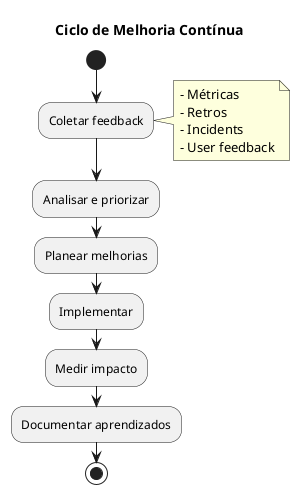

# 15. Governação & Roadmap

## Definições e Decisões

> **Definição:** [DEF-15-governacao-roadmap.md](../definitions/DEF-15-governacao-roadmap.md)

## Propósito

Definir o modelo de governação e roadmap do HomeBanking Web, incluindo modelo de governação, gestão de decisões arquiteturais, roadmap de produto, gestão de dívida técnica, processo de gestão de mudança, KPIs de sucesso e continuous improvement.

## Conteúdo

### 15.1 Modelo de Governação

#### Modelo de Trabalho

| Aspeto | Especificação |
|---------|---------------|
| **Metodologia** | Scrum (2-week sprints) |
| **Cerimónias** | Daily, Planning, Review, Retro |
| **Ferramentas** | Azure DevOps (boards), Teams |
| **Reporting** | Sprint Review + Monthly Report |

#### Papéis e Responsabilidades

| Papel | Responsabilidades |
|-------|-------------------|
| **Sponsor** | Aprovação estratégica, budget, escalação |
| **Product Owner** | Backlog, priorização, aceitação |
| **Tech Lead** | Decisões técnicas, arquitetura, quality |
| **Scrum Master** | Processo, impedimentos, cerimónias |
| **Frontend Lead** | Arquitetura frontend, code review |
| **Backend Lead** | Arquitetura BFF, code review |
| **QA Lead** | Estratégia de testes, qualidade |
| **DevOps** | Infraestrutura, CI/CD, operações |
| **Security** | Validação de segurança, compliance |

### 15.2 Gestão de Decisões Arquiteturais

#### Processo de Decisão

#### Tipos de Decisão

| Tipo | Aprovador | Exemplos |
|------|-----------|----------|
| **Estratégica** | Steering Committee | Stack tecnológica, arquitetura global |
| **Tática** | Tech Lead | Padrões de código, bibliotecas |
| **Operacional** | Lead da área | Configurações, tooling |

#### ADRs do Projeto

| ID | Decisão | Status | Data |
|----|---------|--------|------|
| DEC-001 | Estratégia de autenticação web | Accepted | 2026-01-04 |
| DEC-002 | Gestão de sessões e tokens | Accepted | 2026-01-04 |
| DEC-003 | Modelo de autorização ABAC | Accepted | 2026-01-04 |
| DEC-004 | Controlos de segurança frontend | Accepted | 2026-01-04 |
| DEC-005 | Armazenamento de dados canal web | Accepted | 2026-01-04 |
| DEC-006 | Estratégia de containers OpenShift | Accepted | 2026-01-04 |
| DEC-007 | Padrão BFF | Accepted | 2026-01-04 |
| DEC-008 | Stack de observabilidade ELK | Accepted | 2026-01-04 |
| DEC-009 | Stack tecnológica frontend | Accepted | 2026-01-04 |
| DEC-010 | Stack tecnológica backend | Accepted | 2026-01-04 |

### 15.3 Roadmap de Produto

#### Backlog de Features Pós-MVP

| Feature | Prioridade | Estimativa |
|---------|------------|------------|
| Dashboard personalizável | P2 | M |
| Notificações web push | P2 | S |
| Modo escuro | P3 | S |
| Exportação de extratos PDF | P2 | M |
| Comparador de produtos | P3 | L |
| Chat com assistente | P3 | XL |

#### Release Cadence

| Tipo | Frequência | Conteúdo |
|------|------------|----------|
| **Major** | Trimestral | Novas features significativas |
| **Minor** | Mensal | Melhorias e features pequenas |
| **Patch** | Semanal (se necessário) | Bug fixes, segurança |

### 15.4 Gestão de Dívida Técnica

#### Categorias de Dívida Técnica

| Categoria | Exemplos | Prioridade |
|-----------|----------|------------|
| **Segurança** | Vulnerabilidades, outdated dependencies | Crítica |
| **Performance** | Queries lentas, memory leaks | Alta |
| **Arquitetura** | Code smells, tight coupling | Média |
| **Código** | Duplicação, complexidade ciclomática | Média |
| **Testes** | Baixa cobertura, testes frágeis | Média |
| **Documentação** | APIs não documentadas | Baixa |

#### Alocação de Capacidade

| Sprint | Features | Dívida Técnica | Bugs |
|--------|----------|----------------|------|
| Normal | 70% | **20%** | 10% |
| Pre-release | 50% | 30% | 20% |
| Pós-release | 40% | 20% | 40% |

#### Métricas de Dívida Técnica

| Métrica | Ferramenta | Target |
|---------|------------|--------|
| Code Coverage | Istanbul/Coverlet | >= 80% |
| Cyclomatic Complexity | SonarQube | < 15 por método |
| Duplicated Lines | SonarQube | < 3% |
| Technical Debt Ratio | SonarQube | < 5% |
| Outdated Dependencies | Dependabot | 0 critical |

### 15.5 Processo de Gestão de Mudança

#### Change Advisory Board (CAB)

| Tipo de Mudança | Aprovação | Lead Time |
|-----------------|-----------|-----------|
| **Standard** | Automática (CI/CD) | Imediato |
| **Normal** | Tech Lead | 1 dia |
| **Emergency** | On-call + Tech Lead | Imediato |
| **Major** | CAB | 1 semana |

#### Janelas de Mudança

| Ambiente | Janela | Restrições |
|----------|--------|------------|
| dev | 24/7 | Nenhuma |
| qa | 24/7 | Nenhuma |
| prod (standard) | 9h-18h dias úteis | Evitar sextas |
| prod (major) | Sábados 6h-10h | Comunicação prévia |

### 15.6 KPIs de Sucesso

#### KPIs Técnicos (DORA Metrics)

| KPI | Métrica | Target |
|-----|---------|--------|
| **Disponibilidade** | Uptime % | 99.9% |
| **Latência** | Response time P95 | < 3s |
| **Taxa de Erro** | Error rate | < 0.1% |
| **MTTR** | Mean Time To Recover | < 30 min |
| **Deploy Frequency** | Deploys/semana | >= 2 |
| **Lead Time** | Commit to prod | < 1 dia |
| **Change Failure Rate** | Deploys com rollback | < 5% |

#### KPIs de Produto

| KPI | Métrica | Target |
|-----|---------|--------|
| **Adoção** | Utilizadores ativos | +20% Q/Q |
| **Engagement** | Sessões/utilizador | >= 5/mês |
| **Satisfação** | NPS | >= 40 |
| **Task Success** | Taxa de conclusão de fluxos | >= 95% |
| **Time on Task** | Tempo médio por operação | Baseline -10% |

### 15.7 Continuous Improvement

#### Cerimónias de Melhoria

| Cerimónia | Frequência | Participantes | Output |
|-----------|------------|---------------|--------|
| Sprint Retro | 2 semanas | Equipa | Action items |
| Tech Retro | Mensal | Tech team | Tech improvements |
| Post-mortem | Por incidente | Envolvidos | Lessons learned |
| Architecture Review | Trimestral | Leads + Arquiteto | ADRs, Roadmap |

#### Feedback Loops

#### Métricas de Maturidade

| Área | Nível Atual | Target | Ações |
|------|-------------|--------|-------|
| CI/CD | 3 | 4 | Automação de testes |
| Observability | 3 | 4 | Tracing distribuído |
| Security | 3 | 4 | DAST automatizado |
| Documentation | 2 | 3 | API docs automáticas |

## Decisões Referenciadas

- All architectural decisions (DEC-001 to DEC-010)

## Definições Utilizadas

- [DEF-15-governacao-roadmap.md](../definitions/DEF-15-governacao-roadmap.md) - Detalhes completos
- [DEF-10-arquitetura-operacional.md](../definitions/DEF-10-arquitetura-operacional.md) - CI/CD
- [DEF-02-stakeholders.md](../definitions/DEF-02-stakeholders.md) - Stakeholders
