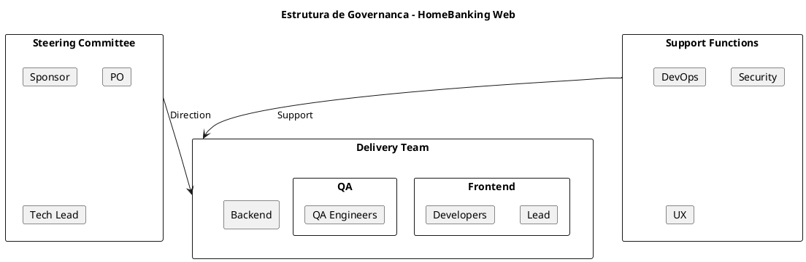
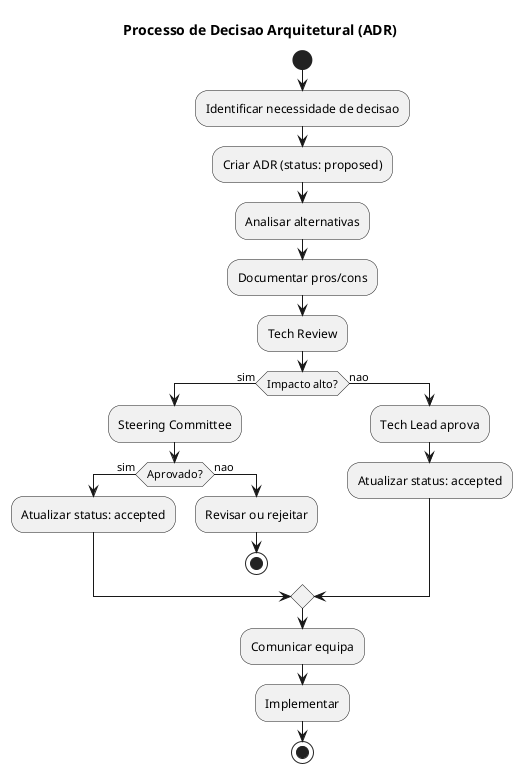
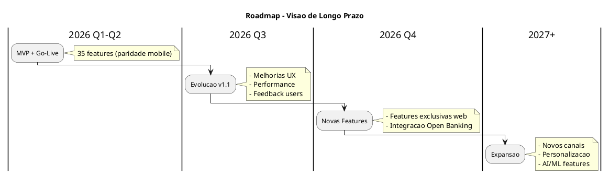
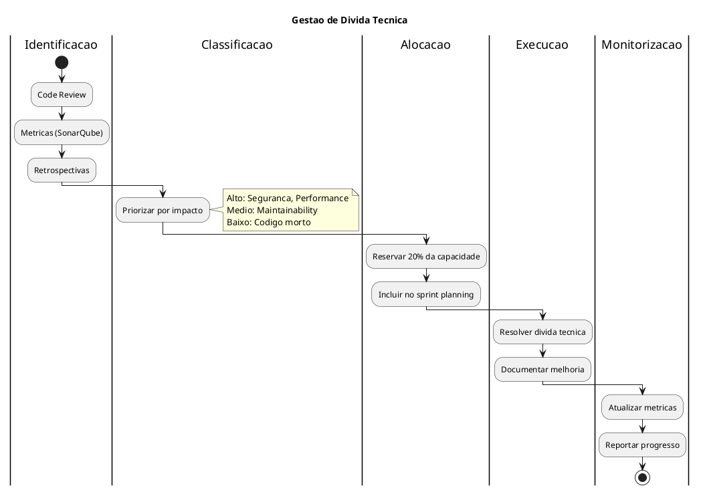
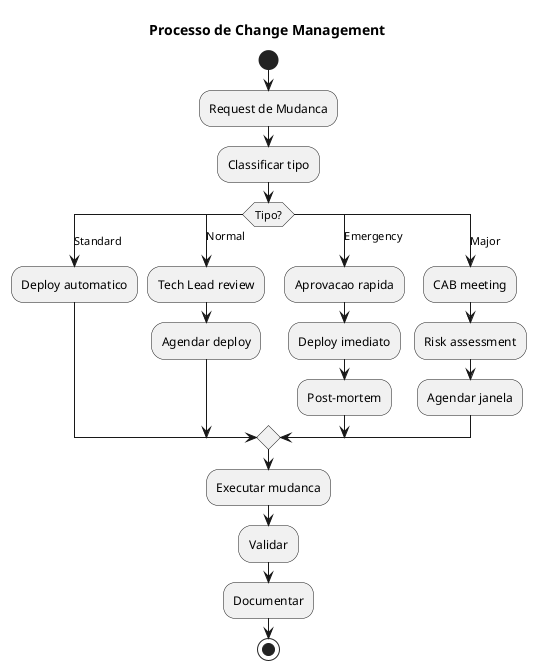

# 15. Governacao & Roadmap

> **Definicao:** [DEF-15-governacao-roadmap.md](../definitions/DEF-15-governacao-roadmap.md)

## Proposito

Definir o modelo de governacao e roadmap do HomeBanking Web, incluindo modelo de governacao, gestao de decisoes arquiteturais, roadmap de produto, gestao de divida tecnica, processo de gestao de mudanca, KPIs de sucesso e continuous improvement.

## Conteudo

### 15.1 Modelo de Governacao

#### Modelo de Trabalho

| Aspecto | Especificacao |
|---------|---------------|
| **Metodologia** | Scrum (2-week sprints) |
| **Cerimonias** | Daily, Planning, Review, Retro |
| **Ferramentas** | Azure DevOps (boards), Teams |
| **Reporting** | Sprint Review + Monthly Report |

#### Papeis e Responsabilidades

| Papel | Responsabilidades |
|-------|-------------------|
| **Sponsor** | Aprovacao estrategica, budget, escalacao |
| **Product Owner** | Backlog, priorizacao, aceitacao |
| **Tech Lead** | Decisoes tecnicas, arquitetura, quality |
| **Scrum Master** | Processo, impedimentos, cerimonias |
| **Frontend Lead** | Arquitetura frontend, code review |
| **Backend Lead** | Arquitetura BFF, code review |
| **QA Lead** | Estrategia de testes, qualidade |
| **DevOps** | Infraestrutura, CI/CD, operacoes |
| **Security** | Validacao de seguranca, compliance |

### 15.2 Gestao de Decisoes Arquiteturais

#### Processo de Decisao

#### Tipos de Decisao

| Tipo | Aprovador | Exemplos |
|------|-----------|----------|
| **Estrategica** | Steering Committee | Stack tecnologica, arquitetura global |
| **Tatica** | Tech Lead | Padroes de codigo, bibliotecas |
| **Operacional** | Lead da area | Configuracoes, tooling |

#### ADRs do Projeto

| ID | Decisao | Status | Data |
|----|---------|--------|------|
| DEC-001 | Estrategia de autenticacao web | Accepted | 2026-01-04 |
| DEC-002 | Gestao de sessoes e tokens | Accepted | 2026-01-04 |
| DEC-003 | Modelo de autorizacao ABAC | Accepted | 2026-01-04 |
| DEC-004 | Controlos de seguranca frontend | Accepted | 2026-01-04 |
| DEC-005 | Armazenamento de dados canal web | Accepted | 2026-01-04 |
| DEC-006 | Estrategia de containers OpenShift | Accepted | 2026-01-04 |
| DEC-007 | Padrao BFF | Accepted | 2026-01-04 |
| DEC-008 | Stack de observabilidade ELK | Accepted | 2026-01-04 |
| DEC-009 | Stack tecnologica frontend | Accepted | 2026-01-04 |
| DEC-010 | Stack tecnologica backend | Accepted | 2026-01-04 |

### 15.3 Roadmap de Produto

#### Backlog de Features Pos-MVP

| Feature | Prioridade | Estimativa |
|---------|------------|------------|
| Dashboard personalizavel | P2 | M |
| Notificacoes web push | P2 | S |
| Modo escuro | P3 | S |
| Exportacao de extratos PDF | P2 | M |
| Comparador de produtos | P3 | L |
| Chat com assistente | P3 | XL |

#### Release Cadence

| Tipo | Frequencia | Conteudo |
|------|------------|----------|
| **Major** | Trimestral | Novas features significativas |
| **Minor** | Mensal | Melhorias e features pequenas |
| **Patch** | Semanal (se necessario) | Bug fixes, seguranca |

### 15.4 Gestao de Divida Tecnica

#### Categorias de Divida Tecnica

| Categoria | Exemplos | Prioridade |
|-----------|----------|------------|
| **Seguranca** | Vulnerabilidades, outdated dependencies | Critica |
| **Performance** | Queries lentas, memory leaks | Alta |
| **Arquitetura** | Code smells, tight coupling | Media |
| **Codigo** | Duplicacao, complexidade ciclomatica | Media |
| **Testes** | Baixa cobertura, testes frageis | Media |
| **Documentacao** | APIs nao documentadas | Baixa |

#### Alocacao de Capacidade

| Sprint | Features | Divida Tecnica | Bugs |
|--------|----------|----------------|------|
| Normal | 70% | **20%** | 10% |
| Pre-release | 50% | 30% | 20% |
| Pos-release | 40% | 20% | 40% |

#### Metricas de Divida Tecnica

| Metrica | Ferramenta | Target |
|---------|------------|--------|
| Code Coverage | Istanbul/Coverlet | >= 80% |
| Cyclomatic Complexity | SonarQube | < 15 por metodo |
| Duplicated Lines | SonarQube | < 3% |
| Technical Debt Ratio | SonarQube | < 5% |
| Outdated Dependencies | Dependabot | 0 critical |

### 15.5 Processo de Gestao de Mudanca

#### Change Advisory Board (CAB)

| Tipo de Mudanca | Aprovacao | Lead Time |
|-----------------|-----------|-----------|
| **Standard** | Automatica (CI/CD) | Imediato |
| **Normal** | Tech Lead | 1 dia |
| **Emergency** | On-call + Tech Lead | Imediato |
| **Major** | CAB | 1 semana |

#### Janelas de Mudanca

| Ambiente | Janela | Restricoes |
|----------|--------|------------|
| dev | 24/7 | Nenhuma |
| qa | 24/7 | Nenhuma |
| prod (standard) | 9h-18h dias uteis | Evitar sextas |
| prod (major) | Sabados 6h-10h | Comunicacao previa |

### 15.6 KPIs de Sucesso

#### KPIs Tecnicos (DORA Metrics)

| KPI | Metrica | Target |
|-----|---------|--------|
| **Disponibilidade** | Uptime % | 99.9% |
| **Latencia** | Response time P95 | < 3s |
| **Taxa de Erro** | Error rate | < 0.1% |
| **MTTR** | Mean Time To Recover | < 30 min |
| **Deploy Frequency** | Deploys/semana | >= 2 |
| **Lead Time** | Commit to prod | < 1 dia |
| **Change Failure Rate** | Deploys com rollback | < 5% |

#### KPIs de Produto

| KPI | Metrica | Target |
|-----|---------|--------|
| **Adocao** | Utilizadores ativos | +20% Q/Q |
| **Engagement** | Sessoes/utilizador | >= 5/mes |
| **Satisfacao** | NPS | >= 40 |
| **Task Success** | Taxa de conclusao de fluxos | >= 95% |
| **Time on Task** | Tempo medio por operacao | Baseline -10% |

### 15.7 Continuous Improvement

#### Cerimonias de Melhoria

| Cerimonia | Frequencia | Participantes | Output |
|-----------|------------|---------------|--------|
| Sprint Retro | 2 semanas | Equipa | Action items |
| Tech Retro | Mensal | Tech team | Tech improvements |
| Post-mortem | Por incidente | Envolvidos | Lessons learned |
| Architecture Review | Trimestral | Leads + Arquiteto | ADRs, Roadmap |

#### Feedback Loops

#### Metricas de Maturidade

| Area | Nivel Atual | Target | Acoes |
|------|-------------|--------|-------|
| CI/CD | 3 | 4 | Automacao de testes |
| Observability | 3 | 4 | Tracing distribuido |
| Security | 3 | 4 | DAST automatizado |
| Documentation | 2 | 3 | API docs automaticas |

## Decisoes Referenciadas

- All architectural decisions (DEC-001 to DEC-010)

## Definicoes Utilizadas

- [DEF-15-governacao-roadmap.md](../definitions/DEF-15-governacao-roadmap.md) - Detalhes completos
- [DEF-10-arquitetura-operacional.md](../definitions/DEF-10-arquitetura-operacional.md) - CI/CD
- [DEF-02-stakeholders.md](../definitions/DEF-02-stakeholders.md) - Stakeholders
