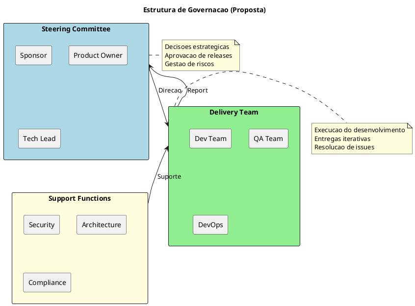
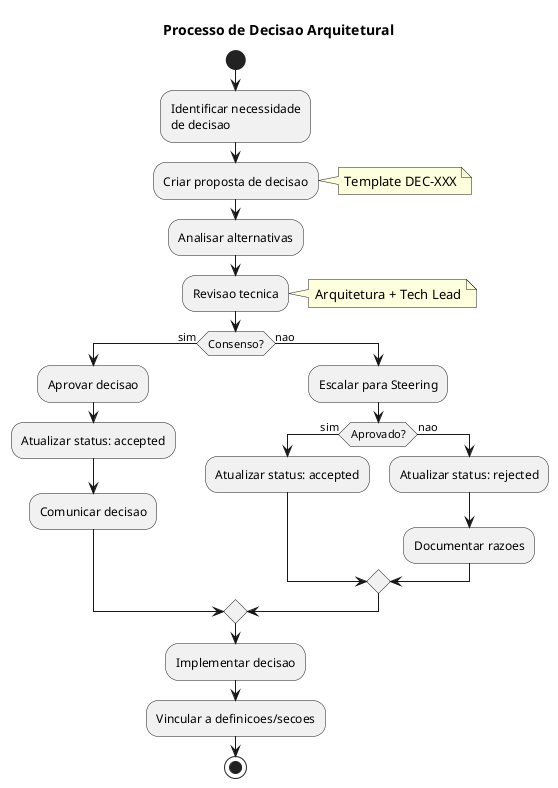
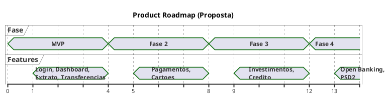
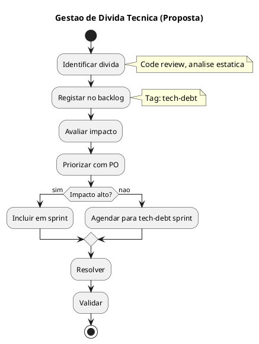
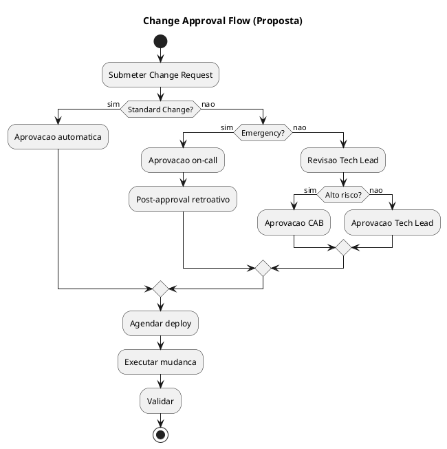
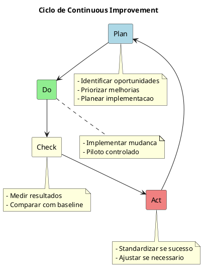

# 15. Governacao & Roadmap

> **Required definitions:** [DEF-15-governacao-roadmap.md](../definitions/DEF-15-governacao-roadmap.md)
> **Related decisions:**
> - All architectural decisions (DEC-001 to DEC-010)

## Proposito

Definir o modelo de governacao e roadmap do HomeBanking Web, incluindo modelo de governacao, gestao de decisoes, roadmap de produto, gestao de divida tecnica, processo de gestao de mudanca, KPIs de sucesso e continuous improvement.

## Conteudo

### 15.1 Modelo de Governacao

_O modelo de governacao necessita aprofundamento._

| Aspecto | Status |
|---------|--------|
| Metodologia (Agile/SAFe/tradicional) | Necessita aprofundamento |
| Papeis e responsabilidades | Necessita aprofundamento |
| Frequencia de steering | Necessita aprofundamento |
| Stakeholders principais | Necessita aprofundamento |
| Processo de escalacao | Necessita aprofundamento |

#### Estrutura de Governacao (Proposta)



#### Papeis (Proposta)

| Papel | Responsabilidades | Status |
|-------|-------------------|--------|
| **Sponsor** | Visao, financiamento, decisoes estrategicas | Necessita aprofundamento |
| **Product Owner** | Backlog, priorizacao, aceitacao | Necessita aprofundamento |
| **Tech Lead** | Decisoes tecnicas, arquitetura | Necessita aprofundamento |
| **Scrum Master** | Processo, impedimentos | Necessita aprofundamento |
| **Dev Team** | Implementacao | Necessita aprofundamento |
| **QA Lead** | Estrategia de testes | Necessita aprofundamento |
| **DevOps Lead** | CI/CD, infraestrutura | Necessita aprofundamento |

### 15.2 Gestao de Decisoes

Este documento utiliza o formato de Architecture Decision Records (ADRs) para documentar decisoes arquiteturais.

#### Processo de Decisao



#### Decisoes Arquiteturais Documentadas

| ID | Titulo | Status | Data |
|----|--------|--------|------|
| DEC-001 | Estrategia de Autenticacao OIDC | accepted | 2026-01-01 |
| DEC-002 | Tokens JWT | accepted | 2026-01-01 |
| DEC-003 | Gestao de Sessoes | accepted | 2026-01-01 |
| DEC-004 | PCI-DSS Web SAQ-A | accepted | 2026-01-01 |
| DEC-005 | Encriptacao AES-256 | accepted | 2026-01-01 |
| DEC-006 | Estrategia Containers OpenShift | accepted | 2026-01-01 |
| DEC-007 | Arquitetura BFF | accepted | 2026-01-01 |
| DEC-008 | Stack Observabilidade ELK | accepted | 2026-01-01 |
| DEC-009 | Stack Tecnologica Frontend | accepted | 2026-01-01 |
| DEC-010 | Stack Tecnologica Backend | accepted | 2026-01-08 |

#### Quem Aprova

| Aspecto | Status |
|---------|--------|
| Aprovador de decisoes tecnicas | Necessita aprofundamento |
| Processo de revisao | Necessita aprofundamento |

### 15.3 Roadmap de Produto

_O roadmap de produto necessita aprofundamento._

| Aspecto | Status |
|---------|--------|
| Funcionalidades pos-MVP | Necessita aprofundamento |
| Frequencia de releases | Necessita aprofundamento |
| Priorizacao de backlog | Necessita aprofundamento |

#### Roadmap (Proposta)



| Fase | Funcionalidades Propostas | Status |
|------|---------------------------|--------|
| **MVP** | Login, Dashboard, Extrato, Transferencias | Necessita aprofundamento |
| **Fase 2** | Pagamentos, Cartoes, Gestao de perfil | Necessita aprofundamento |
| **Fase 3** | Investimentos, Credito, Notificacoes | Necessita aprofundamento |
| **Fase 4** | Open Banking, PSD2 APIs | Necessita aprofundamento |

#### Frequencia de Releases

| Aspecto | Status |
|---------|--------|
| Cadencia de releases | Necessita aprofundamento |
| Calendario de releases | Necessita aprofundamento |
| Release train | Necessita aprofundamento |

### 15.4 Gestao de Divida Tecnica

_A gestao de divida tecnica necessita aprofundamento._

| Aspecto | Status |
|---------|--------|
| Identificacao | Necessita aprofundamento |
| Priorizacao | Necessita aprofundamento |
| % capacidade alocada | Necessita aprofundamento |
| Responsavel | Necessita aprofundamento |

#### Tipos de Divida Tecnica

| Tipo | Descricao | Exemplos |
|------|-----------|----------|
| **Deliberada** | Decisao consciente para entrega rapida | Workarounds temporarios |
| **Acidental** | Resultado de falta de conhecimento | Patterns incorretos |
| **Bit rot** | Degradacao ao longo do tempo | Dependencias desatualizadas |

#### Processo de Gestao (Proposta)



#### Metricas de Divida Tecnica (Proposta)

| Metrica | Ferramenta | Status |
|---------|------------|--------|
| Code coverage | SonarQube | Necessita aprofundamento |
| Code smells | SonarQube | Necessita aprofundamento |
| Complexity | SonarQube | Necessita aprofundamento |
| Dependencies outdated | Dependabot | Necessita aprofundamento |

### 15.5 Processo de Gestao de Mudanca

_O processo de change management necessita aprofundamento._

| Aspecto | Status |
|---------|--------|
| Processo de change management | Necessita aprofundamento |
| Aprovador de mudancas | Necessita aprofundamento |
| Lead time minimo | Necessita aprofundamento |
| CAB existente | Necessita aprofundamento |

#### Tipos de Mudanca (Proposta)

| Tipo | Descricao | Aprovacao | Lead Time |
|------|-----------|-----------|-----------|
| **Standard** | Mudancas pre-aprovadas | Automatica | Imediato |
| **Normal** | Mudancas regulares | Tech Lead | Necessita aprofundamento |
| **Emergency** | Hotfixes criticos | On-call + retroativo | Imediato |

#### Fluxo de Aprovacao (Proposta)



### 15.6 KPIs de Sucesso

_Os KPIs de sucesso necessitam aprofundamento._

#### KPIs de Negocio (Proposta)

| KPI | Descricao | Target | Status |
|-----|-----------|--------|--------|
| Adocao | % utilizadores a usar web | Necessita aprofundamento | Pendente |
| NPS | Net Promoter Score | Necessita aprofundamento | Pendente |
| Transacoes/dia | Volume de transacoes | Necessita aprofundamento | Pendente |
| Erro de utilizador | Taxa de erros em fluxos | Necessita aprofundamento | Pendente |
| Tempo de tarefa | Tempo medio por operacao | Necessita aprofundamento | Pendente |

#### KPIs Tecnicos (Proposta)

| KPI | Descricao | Target | Status |
|-----|-----------|--------|--------|
| Disponibilidade | Uptime do servico | 99.9% (DEF-02) | Definido |
| Latencia P95 | Tempo de resposta | < 3s (DEF-02) | Definido |
| Error rate | Taxa de erros 5xx | < 1% | Necessita aprofundamento |
| Deploy frequency | Frequencia de deploys | Necessita aprofundamento | Pendente |
| Lead time | Tempo do commit ao deploy | Necessita aprofundamento | Pendente |
| MTTR | Mean Time to Recovery | Necessita aprofundamento | Pendente |
| Change failure rate | % deploys com rollback | Necessita aprofundamento | Pendente |

#### Revisao de KPIs

| Aspecto | Status |
|---------|--------|
| Frequencia de revisao | Necessita aprofundamento |
| Responsavel | Necessita aprofundamento |
| Dashboard de KPIs | Necessita aprofundamento |

### 15.7 Continuous Improvement

_O processo de continuous improvement necessita aprofundamento._

| Aspecto | Status |
|---------|--------|
| Retrospetivas | Necessita aprofundamento |
| Implementacao de melhorias | Necessita aprofundamento |
| Lessons learned | Necessita aprofundamento |
| Maturidade do processo | Necessita aprofundamento |

#### Ciclo de Melhoria (Proposta)



#### Mecanismos de Feedback

| Mecanismo | Frequencia | Status |
|-----------|------------|--------|
| Sprint Retrospective | Por sprint | Necessita aprofundamento |
| Release Retrospective | Por release | Necessita aprofundamento |
| Incident Post-Mortem | Por incidente | Necessita aprofundamento |
| Tech Debt Review | Mensal | Necessita aprofundamento |

## Diagramas

### Visao Geral de Governacao

```plantuml
@startuml
!include https://raw.githubusercontent.com/plantuml-stdlib/C4-PlantUML/master/C4_Container.puml

LAYOUT_WITH_LEGEND()

title Governance Overview - HomeBanking Web

Person(steering, "Steering Committee", "Direcao estrategica")
Person(po, "Product Owner", "Backlog e prioridades")
Person(tech, "Tech Lead", "Decisoes tecnicas")
Person(team, "Delivery Team", "Implementacao")

System_Boundary(gov, "Artefactos de Governacao") {
  Container(adr, "ADRs", "Markdown", "Decisoes arquiteturais")
  Container(def, "Definitions", "Markdown", "Definicoes do projeto")
  Container(sec, "Sections", "Markdown", "Documentacao final")
  Container(backlog, "Backlog", "Azure DevOps", "Work items")
}

Rel(steering, po, "Direcao")
Rel(po, backlog, "Prioriza")
Rel(tech, adr, "Documenta")
Rel(team, def, "Preenche")
Rel(team, sec, "Escreve")

@enduml
```

## Entregaveis

- [ ] Modelo de governacao documentado
- [ ] Roadmap de produto
- [ ] Processo de gestao de divida tecnica
- [ ] Processo de change management
- [ ] Dashboard de KPIs
- [ ] Processo de continuous improvement

## Definicoes Utilizadas

- [x] [DEF-15-governacao-roadmap.md](../definitions/DEF-15-governacao-roadmap.md) - Status: structure

## Decisoes Referenciadas

- [x] [DEC-001](../decisions/DEC-001-estrategia-autenticacao-oidc.md) a [DEC-010](../decisions/DEC-010-stack-tecnologica-backend.md) - Status: accepted

## Itens Pendentes

| Item | Responsavel | Prioridade |
|------|-------------|------------|
| Definir modelo de governacao | PM + Cliente | Alta |
| Definir roadmap de produto | PO + Cliente | Alta |
| Definir processo de change management | Operacoes | Media |
| Definir estrategia de divida tecnica | Tech Lead | Media |
| Definir KPIs de sucesso | PM + PO | Media |
| Configurar dashboard de KPIs | DevOps | Baixa |
| Processo de continuous improvement | Scrum Master | Baixa |
