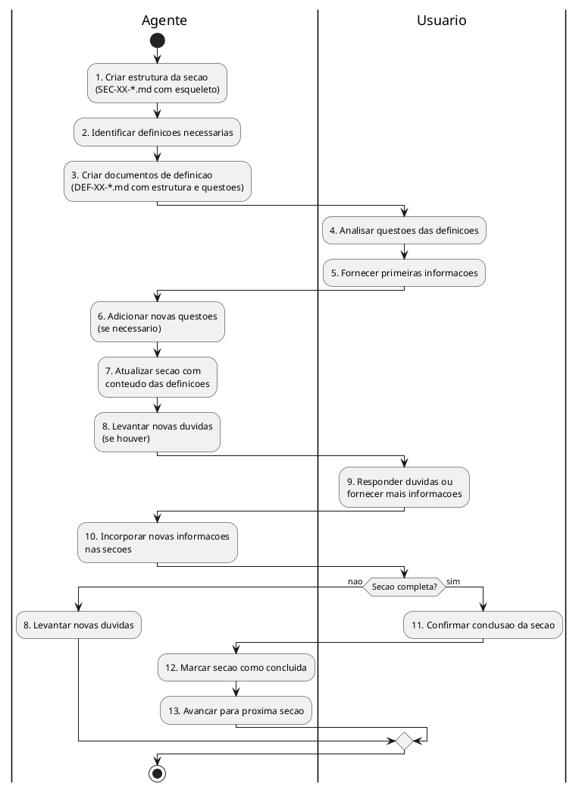
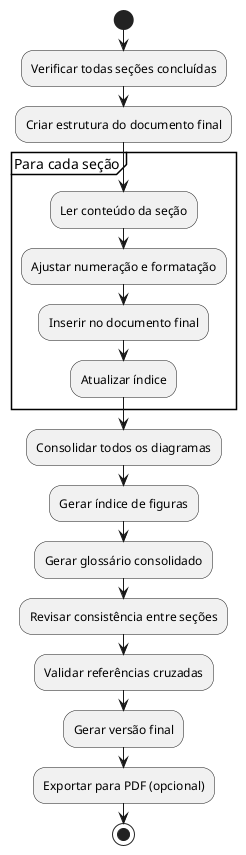

# Plano de Execucao - Documento de Arquitetura Novo Banco Website

## Visao Geral

Este documento define o plano de execucao para a construcao do documento de arquitetura da plataforma web de Homebanking do Novo Banco, seguindo a estrutura definida em `architectural_document_structure_novo_banco.md`.

---

## Estrutura de Trabalho

```
website/
├── TASK_DEFINITION.md              # Este documento
├── architectural_document_structure_novo_banco.md  # Estrutura base
├── definitions/                    # Decisoes e definicoes tecnicas
│   ├── DEF-07-novo_banco_authentication.md   # (existente, renomear)
│   ├── DEF-10-deployment-infrastructure.md   # (existente, renomear)
│   └── DEF-XX-[nome-descritivo].md           # Novos documentos
├── sections/                       # Conteudo de cada secao
│   ├── SEC-XX-[nome-secao].md               # Secao principal
│   └── SEC-XX.Y-[nome-subsecao].md          # Subsecao (opcional)
└── ARCHITECTURAL_DOCUMENT_FINAL.md # Documento consolidado
```

---

## Fase 1: Documentos de Definicao (`definitions/`)

### 1.1 Convencao de Nomenclatura

Os documentos de definicao seguem o padrao:

```
DEF-XX-[nome-descritivo].md
```

Onde:
- `DEF-` : Prefixo obrigatorio indicando documento de definicao
- `XX`  : Numero da secao principal a que a definicao se refere (01-21)
- `[nome-descritivo]` : Nome descritivo em kebab-case

**Exemplos:**
- `DEF-04-frontend-state-management.md` - Definicao sobre gestao de estado para secao 4 (Frontend)
- `DEF-07-oauth-token-strategy.md` - Definicao sobre tokens para secao 7 (Autenticacao)
- `DEF-07-mfa-requirements.md` - Outra definicao para secao 7 (Autenticacao)
- `DEF-10-kubernetes-topology.md` - Definicao sobre K8s para secao 10 (Operacional)

**Nota:** Uma secao pode ter multiplos documentos de definicao. O numero indica a secao principal beneficiada, mas a definicao pode ser referenciada por outras secoes.

### 1.2 Documentos Existentes (a renomear)

| Documento Atual | Novo Nome | Secao |
|-----------------|-----------|-------|
| `1766137349-novo_banco_authentication.md` | `DEF-07-authentication-oauth-flow.md` | 7 |
| `deployment-infrastrucuture.md` | `DEF-10-deployment-infrastructure.md` | 10 |

### 1.3 Definicoes Sugeridas por Secao

A lista abaixo e sugestiva. Novos documentos de definicao podem ser criados conforme necessidade, desde que sigam a convencao de nomenclatura.

| Secao | Definicoes Sugeridas | Prioridade |
|-------|---------------------|------------|
| 01-02 | `DEF-01-business-objectives.md`, `DEF-02-stakeholder-matrix.md` | Alta |
| 03 | `DEF-03-solution-principles.md`, `DEF-03-technology-stack.md` | Alta |
| 04 | `DEF-04-frontend-architecture.md`, `DEF-04-design-system.md`, `DEF-04-state-management.md` | Alta |
| 05 | `DEF-05-backend-patterns.md`, `DEF-05-api-versioning.md`, `DEF-05-service-decomposition.md` | Alta |
| 06 | `DEF-06-data-model.md`, `DEF-06-encryption-strategy.md`, `DEF-06-retention-policy.md` | Alta |
| 07 | `DEF-07-authentication-oauth-flow.md` (existente), `DEF-07-mfa-strategy.md`, `DEF-07-session-management.md` | Alta |
| 08 | `DEF-08-security-controls.md`, `DEF-08-psd2-compliance.md`, `DEF-08-rgpd-procedures.md` | Alta |
| 09 | `DEF-09-integration-catalog.md`, `DEF-09-psd2-apis.md`, `DEF-09-error-handling.md` | Alta |
| 10 | `DEF-10-deployment-infrastructure.md` (existente), `DEF-10-cicd-pipeline.md`, `DEF-10-secrets-management.md` | Media |
| 11 | `DEF-11-observability-stack.md`, `DEF-11-sli-slo-definitions.md`, `DEF-11-alerting-rules.md` | Media |
| 12 | `DEF-12-performance-targets.md`, `DEF-12-caching-strategy.md`, `DEF-12-autoscaling-policies.md` | Media |
| 13 | `DEF-13-testing-framework.md`, `DEF-13-test-coverage-targets.md`, `DEF-13-security-testing.md` | Media |
| 14 | `DEF-14-migration-strategy.md`, `DEF-14-rollback-procedures.md`, `DEF-14-go-nogo-criteria.md` | Media |
| 15 | `DEF-15-cost-model.md`, `DEF-15-infrastructure-sizing.md` | Baixa |
| 16 | `DEF-16-governance-model.md`, `DEF-16-release-cadence.md` | Baixa |
| 17 | (Apendices - consolidacao) | Baixa |
| 18 | `DEF-18-risk-register.md`, `DEF-18-mitigation-strategies.md` | Media |
| 19 | `DEF-19-wcag-compliance.md`, `DEF-19-assistive-tech-support.md` | Media |
| 20 | `DEF-20-i18n-framework.md`, `DEF-20-locale-formatting.md` | Baixa |
| 21 | `DEF-21-sustainability-targets.md`, `DEF-21-green-cloud-selection.md` | Baixa |

### 1.4 Estrutura Padrao de Documento de Definicao

```markdown
# DEF-XX: [Titulo da Definicao]

## Contexto
[Descricao do problema ou necessidade que esta definicao resolve]

## Decisao
[Descricao clara da decisao tomada]

## Justificativa
[Razoes que levaram a esta decisao]

## Alternativas Consideradas
[Outras opcoes avaliadas e porque foram descartadas]

## Consequencias
[Impactos positivos e negativos desta decisao]

## Referencias
- [Links para documentacao externa, RFCs, standards]
```

---

## Fase 2: Documentos de Secao (`sections/`)

### 2.1 Convencao de Nomenclatura

Os documentos de secao seguem o padrao:

**Secao Principal:**
```
SEC-XX-[nome-secao].md
```

**Subsecao (opcional):**
```
SEC-XX.Y-[nome-subsecao].md
```

Onde:
- `SEC-` : Prefixo obrigatorio indicando documento de secao
- `XX`  : Numero da secao principal (01-21)
- `.Y`  : Numero da subsecao (opcional, para secoes extensas)
- `[nome]` : Nome descritivo em kebab-case

**Exemplos de Secoes:**
- `SEC-01-sumario-executivo.md`
- `SEC-07-autenticacao-autorizacao.md`
- `SEC-10-arquitetura-operacional.md`

**Exemplos de Subsecoes (para secoes extensas):**
- `SEC-04-experiencia-utilizador-frontend.md` (documento principal)
- `SEC-04.1-arquitetura-informacao.md` (subsecao)
- `SEC-04.2-design-system.md` (subsecao)
- `SEC-04.3-performance-frontend.md` (subsecao)

**Exemplos de Subsecoes para Secao 7 (Autenticacao):**
- `SEC-07-autenticacao-autorizacao.md` (documento principal)
- `SEC-07.1-fluxo-login.md`
- `SEC-07.2-mfa-implementation.md`
- `SEC-07.3-session-management.md`
- `SEC-07.4-rbac-permissions.md`

### 2.2 Secoes do Documento Final

| Secao | Titulo | Subsecoes Sugeridas |
|-------|--------|---------------------|
| 01 | Sumario Executivo | - |
| 02 | Contexto de Negocio & Requisitos | 02.1 Objetivos, 02.2 Stakeholders, 02.3 Requisitos |
| 03 | Visao Geral da Solucao | 03.1 Principios, 03.2 Casos de Uso |
| 04 | Experiencia Utilizador & Frontend | 04.1 Arquitetura Info, 04.2 Design System, 04.3 Stack, 04.4 Performance |
| 05 | Arquitetura Backend & Servicos | 05.1 Decomposicao, 05.2 API Design, 05.3 Resiliencia |
| 06 | Arquitetura de Dados | 06.1 Modelo, 06.2 Armazenamento, 06.3 RGPD |
| 07 | Autenticacao & Autorizacao | 07.1 Fluxos Auth, 07.2 MFA, 07.3 Sessoes, 07.4 RBAC |
| 08 | Seguranca & Conformidade | 08.1 Threat Model, 08.2 OWASP, 08.3 PSD2, 08.4 RGPD |
| 09 | Integracao & Interfaces | 09.1 Core Banking, 09.2 Terceiros, 09.3 PSD2 APIs |
| 10 | Arquitetura Operacional | 10.1 Infra, 10.2 CI/CD, 10.3 DR |
| 11 | Observabilidade & Operacoes | 11.1 Monitoring, 11.2 Logging, 11.3 Alerting |
| 12 | Desempenho & Fiabilidade | 12.1 Targets, 12.2 Caching, 12.3 Scaling |
| 13 | Estrategia de Testes | 13.1 Piramide, 13.2 E2E, 13.3 Security |
| 14 | Migracao & Implementacao | 14.1 Roadmap, 14.2 Cutover, 14.3 Rollback |
| 15 | Custos & Dimensionamento | 15.1 TCO, 15.2 Sizing |
| 16 | Governacao & Roadmap | 16.1 Modelo, 16.2 ADRs, 16.3 KPIs |
| 17 | Apendices | 17.1 Glossario, 17.2 Diagramas, 17.3 Templates |
| 18 | Gestao de Risco | 18.1 Registro, 18.2 Mitigacao |
| 19 | Acessibilidade Digital | 19.1 WCAG, 19.2 Testes |
| 20 | Localizacao | 20.1 i18n, 20.2 Formatacao |
| 21 | Sustentabilidade | 21.1 Green IT, 21.2 Metricas |

### 2.3 Estrutura Padrao de Secao

**Secao Principal (`SEC-XX-*.md`):**

```markdown
# XX. [Titulo da Secao]

## Proposito
[Descricao breve do objetivo desta secao]

## Subsecoes
[Se houver subsecoes, lista com links]
- [XX.1 - Subsecao 1](SEC-XX.1-nome.md)
- [XX.2 - Subsecao 2](SEC-XX.2-nome.md)

## Conteudo
[Conteudo principal ou resumo se houver subsecoes]

## Diagramas
[Diagramas em PlantUML ou Mermaid]

## Entregaveis
[Lista de entregaveis conforme estrutura base]

## Definicoes Utilizadas
- [DEF-XX-nome.md](../definitions/DEF-XX-nome.md)
```

**Subsecao (`SEC-XX.Y-*.md`):**

```markdown
# XX.Y [Titulo da Subsecao]

> Parte da secao: [XX. Titulo da Secao](SEC-XX-nome.md)

## Conteudo
[Conteudo detalhado da subsecao]

## Diagramas
[Diagramas especificos desta subsecao]

## Definicoes Utilizadas
- [DEF-XX-nome.md](../definitions/DEF-XX-nome.md)
```

---

## Fase 3: Processo de Trabalho Colaborativo

### 3.1 Principio do Trabalho

O trabalho e realizado de forma **colaborativa e iterativa** entre o Agente (Claude) e o Usuario. Nenhum documento e criado completo de uma so vez - todos passam por ciclos de estruturacao, preenchimento e refinamento.

### 3.2 Regras de Interacao Agente-Usuario

#### Quem Responde Questoes
- **Somente o Usuario** pode responder questoes levantadas nos documentos
- O Agente **nunca** deve preencher respostas ou tomar decisoes em nome do Usuario

#### Permissoes do Agente por Tipo de Documento

| Tipo de Documento | Acao | Permissao do Agente |
|-------------------|------|---------------------|
| **Secoes** (`SEC-XX-*.md`) | Criar estrutura | Livre |
| **Secoes** (`SEC-XX-*.md`) | Atualizar conteudo | Livre (conforme pedido do Usuario) |
| **Secoes** (`SEC-XX-*.md`) | Gerar diagramas | Livre |
| **Definicoes** (`DEF-XX-*.md`) | Criar estrutura | Livre |
| **Definicoes** (`DEF-XX-*.md`) | Adicionar perguntas | Livre |
| **Definicoes** (`DEF-XX-*.md`) | Gerar/atualizar diagramas | **Requer aprovacao do Usuario** |
| **Definicoes** (`DEF-XX-*.md`) | Reestruturar textos do Usuario | **Requer aprovacao do Usuario** |
| **Definicoes** (`DEF-XX-*.md`) | Preencher decisoes/respostas | **Proibido** (somente Usuario) |

#### Fluxo de Aprovacao para Definicoes

Quando o Agente precisar fazer alteracoes que requerem aprovacao em documentos de definicao:

1. **Propor alteracao**: O Agente descreve a alteracao pretendida
2. **Aguardar aprovacao**: O Usuario aprova, rejeita ou solicita modificacoes
3. **Executar**: Somente apos aprovacao, o Agente realiza a alteracao

### 3.3 Fluxo de Trabalho por Secao



### 3.4 Etapas Detalhadas

#### Etapa 1-3: Estruturacao (Agente)

O Agente cria:

1. **Documento da Secao** (`SEC-XX-*.md`)
   - Estrutura/esqueleto do documento
   - Topicos principais identificados
   - Placeholders para conteudo
   - Lista de entregaveis esperados

2. **Documentos de Definicao** (`DEF-XX-*.md`)
   - Estrutura do documento
   - Questoes a serem respondidas
   - Campos vazios para decisoes
   - Contexto e dependencias

#### Etapa 4-5: Input Inicial (Usuario)

O Usuario:
- Analisa as questoes propostas
- Fornece informacoes iniciais
- Indica restricoes ou decisoes ja tomadas
- Aponta fontes de informacao adicionais

#### Etapa 6-10: Iteracao Colaborativa (Agente + Usuario)

Ciclo repetitivo ate conclusao:
- **Agente**: Adiciona perguntas nas definicoes, atualiza secoes, levanta duvidas
- **Usuario**: Responde questoes, preenche decisoes nas definicoes, valida conteudo
- **Agente**: Incorpora respostas nas secoes (nao nas definicoes sem aprovacao)

#### Etapa 11-13: Conclusao (Usuario + Agente)

- Usuario confirma que a secao esta completa
- Agente marca como concluida
- Avanca para proxima secao

### 3.5 Estados dos Documentos

| Estado | Descricao | Proximo Passo |
|--------|-----------|---------------|
| `estrutura` | Documento criado apenas com esqueleto | Usuario fornecer informacoes |
| `em-progresso` | Conteudo sendo preenchido iterativamente | Continuar iteracao |
| `revisao` | Aguardando validacao do Usuario | Usuario aprovar ou comentar |
| `concluido` | Usuario confirmou conclusao | Avancar para proximo |

### 3.6 Template de Documento de Definicao (Estrutura Inicial)

Quando o Agente cria um documento de definicao, usa este formato:

```markdown
# DEF-XX: [Titulo da Definicao]

> **Status:** estrutura
> **Secao relacionada:** [XX - Nome da Secao]

## Contexto

[Descricao breve do que esta definicao aborda]

## Questoes a Responder

1. [Questao 1]?
2. [Questao 2]?
3. [Questao 3]?
...

## Decisoes

### [Topico 1]
- **Decisao:** _Pendente_
- **Justificativa:** _Pendente_
- **Alternativas consideradas:** _Pendente_

### [Topico 2]
- **Decisao:** _Pendente_
- **Justificativa:** _Pendente_
- **Alternativas consideradas:** _Pendente_

## Restricoes Conhecidas

- [Se houver restricoes ja conhecidas, listar aqui]

## Referencias

- [Links para documentacao, padroes, etc.]
```

### 3.7 Template de Documento de Secao (Estrutura Inicial)

Quando o Agente cria um documento de secao, usa este formato:

```markdown
# XX. [Titulo da Secao]

> **Status:** estrutura
> **Definicoes necessarias:** [Lista de DEF-XX-*.md]

## Proposito

[Descricao do objetivo desta secao]

## Conteudo

### [Topico 1]
_Aguardando informacoes das definicoes_

### [Topico 2]
_Aguardando informacoes das definicoes_

## Diagramas

_Diagramas serao criados apos definicoes respondidas_

## Entregaveis

- [ ] [Entregavel 1]
- [ ] [Entregavel 2]
...

## Definicoes Utilizadas

- [ ] [DEF-XX-nome.md](../definitions/DEF-XX-nome.md) - Status: estrutura

## Questoes para o Usuario

1. [Questao que surgiu durante estruturacao]?
2. [Questao que surgiu durante estruturacao]?
```

### 3.8 Questoes Orientadoras por Dominio

As questoes abaixo servem de guia para a criacao de documentos de definicao. Nao e obrigatorio responder todas - apenas as relevantes para o contexto do projeto.

#### Secoes 01-02: Negocio e Requisitos
- Quais sao os objetivos de negocio mensuraveis (KPIs)?
- Quais stakeholders devem ser consultados?
- Quais funcionalidades estao no escopo do MVP?
- Quais sao as restricoes de prazo e orcamento?
- Quais requisitos nao-funcionais sao criticos?

#### Secao 03: Visao da Solucao
- Quais principios arquiteturais serao seguidos?
- Qual a stack tecnologica confirmada?
- Quais casos de uso sao prioritarios?

#### Secao 04: Frontend
- Qual framework sera utilizado (React confirmado)?
- Qual biblioteca de gestao de estado (Redux, Zustand, Context)?
- Qual design system sera adotado ou criado?
- Quais sao os requisitos de responsividade?
- Qual estrategia de code splitting e lazy loading?

#### Secao 05: Backend
- Confirmar uso de C# e padrao BFF
- Qual padrao de comunicacao (MediatR confirmado)?
- Quais servicos serao decompostos?
- Qual estrategia de versionamento de API?
- Quais padroes de resiliencia (Circuit Breaker, Retry)?

#### Secao 06: Dados
- Qual SGBD sera utilizado (PostgreSQL/Oracle)?
- Qual estrategia de cache (Redis)?
- Quais dados requerem encriptacao field-level?
- Qual politica de retencao por tipo de dado?
- Qual estrategia de backup (RTO/RPO)?

#### Secao 07: Autenticacao
- Qual fluxo OAuth/OIDC sera implementado?
- Quais metodos MFA serao suportados?
- Qual estrategia de gestao de sessoes?
- Qual modelo RBAC sera aplicado?

#### Secao 08: Seguranca
- Quais controlos OWASP Top 10 serao implementados?
- Qual framework de conformidade PSD2/SCA?
- Quais processos RGPD sao necessarios?
- Qual estrategia de WAF e protecao DDoS?

#### Secao 09: Integracoes
- Quais sistemas externos serao integrados?
- Qual protocolo por integracao (REST, SOAP, MQ)?
- Quais sao os SLAs esperados por integracao?
- Quais APIs PSD2 serao expostas?

#### Secao 10: Operacional
- Qual plataforma de orquestracao (Kubernetes)?
- Quantos ambientes (DEV, UAT, PREPROD, PROD)?
- Qual estrategia de deploy (Blue-Green, Canary)?
- Qual ferramenta de CI/CD?

#### Secao 11: Observabilidade
- Qual stack de monitoring (Prometheus, Grafana)?
- Quais SLIs/SLOs serao definidos?
- Qual estrategia de alerting?

#### Secao 12: Performance
- Qual carga esperada (sessoes, TPS)?
- Quais targets de latencia por operacao?
- Qual estrategia de caching por camada?

#### Secao 13: Testes
- Qual cobertura minima por tipo de teste?
- Quais ferramentas de teste (Jest, xUnit, Cypress)?
- Qual estrategia de security testing?

#### Secao 14: Migracao
- Qual estrategia de cutover?
- Quais criterios Go/No-Go?
- Qual plano de rollback?

#### Secoes 15-16: Custos e Governacao
- Qual orcamento disponivel?
- Qual modelo de governacao (ARB, CAB)?
- Quais KPIs de sucesso?

#### Secoes 18-21: Complementares
- Qual nivel WCAG (2.2 AA)?
- Quais idiomas iniciais (PT, EN)?
- Quais metas de sustentabilidade?
- Quais riscos criticos identificados?

---

## Fase 4: Compilação do Documento Final

### 4.1 Processo de Compilação



### 4.2 Estrutura do Documento Final

O arquivo `ARCHITECTURAL_DOCUMENT_FINAL.md` terá a seguinte estrutura:

```markdown
# Documento de Arquitetura - Plataforma Web Homebanking Novo Banco

## Informações do Documento
- Versão: X.Y
- Data: YYYY-MM-DD
- Status: [Rascunho|Revisão|Aprovado]
- Autores: [Lista]

## Índice
[Gerado automaticamente]

## Índice de Figuras
[Gerado automaticamente]

---

[Conteúdo das seções 1-21]

---

## Glossário
[Consolidado de todas as seções]

## Histórico de Revisões
| Versão | Data | Autor | Alterações |
|--------|------|-------|------------|
```

### 4.3 Script de Compilação

Pode ser utilizado um script para automatizar a compilação:

```bash
#!/bin/bash
# compile-architecture.sh

OUTPUT="ARCHITECTURAL_DOCUMENT_FINAL.md"
SECTIONS_DIR="sections"

# Header
cat > $OUTPUT << 'EOF'
# Documento de Arquitetura - Plataforma Web Homebanking Novo Banco

## Informações do Documento
- Versão: 1.0
- Data: $(date +%Y-%m-%d)
- Status: Rascunho

---

EOF

# Concatenar seções ordenadas
for section in $(ls -1 $SECTIONS_DIR/*.md | sort); do
  echo "" >> $OUTPUT
  cat "$section" >> $OUTPUT
  echo "" >> $OUTPUT
  echo "---" >> $OUTPUT
done

echo "Documento compilado: $OUTPUT"
```

---

## Fase 5: Ordem de Execucao Recomendada

O trabalho e organizado em sprints tematicos. Dentro de cada sprint, a sequencia e:

1. **Levantar questoes** - Identificar o que precisa ser definido
2. **Criar definicoes** - Documentar decisoes em `DEF-XX-*.md`
3. **Redigir secoes** - Escrever conteudo em `SEC-XX-*.md` (e subsecoes se necessario)
4. **Revisar** - Validar consistencia e completude

### Sprint 1 - Fundamentos (Secoes 01-03)

**Objetivo:** Estabelecer contexto de negocio e visao da solucao

**Atividades:**
- [ ] Levantar objetivos de negocio e KPIs
- [ ] Identificar stakeholders e suas necessidades
- [ ] Definir escopo (in/out)
- [ ] Documentar principios arquiteturais
- [ ] Definir stack tecnologica

**Definicoes a criar:** `DEF-01-*`, `DEF-02-*`, `DEF-03-*`
**Secoes a redigir:** `SEC-01-*`, `SEC-02-*`, `SEC-03-*`

### Sprint 2 - Arquitetura Tecnica (Secoes 04-06)

**Objetivo:** Definir arquiteturas de frontend, backend e dados

**Atividades:**
- [ ] Definir arquitetura frontend (React, state management)
- [ ] Definir arquitetura backend (BFF, patterns)
- [ ] Definir modelo de dados e estrategias de armazenamento
- [ ] Criar diagramas C4 Level 2 e 3

**Definicoes a criar:** `DEF-04-*`, `DEF-05-*`, `DEF-06-*`
**Secoes a redigir:** `SEC-04-*`, `SEC-05-*`, `SEC-06-*`

### Sprint 3 - Seguranca e Integracoes (Secoes 07-09)

**Objetivo:** Definir autenticacao, seguranca e integracoes

**Atividades:**
- [ ] Revisar definicao de autenticacao existente
- [ ] Definir estrategia MFA e gestao de sessoes
- [ ] Documentar controlos de seguranca
- [ ] Mapear integracoes externas
- [ ] Definir APIs PSD2

**Definicoes a criar:** `DEF-07-*`, `DEF-08-*`, `DEF-09-*`
**Secoes a redigir:** `SEC-07-*`, `SEC-08-*`, `SEC-09-*`

### Sprint 4 - Operacoes e Performance (Secoes 10-12)

**Objetivo:** Definir infraestrutura, observabilidade e performance

**Atividades:**
- [ ] Revisar definicao de infraestrutura existente
- [ ] Definir pipeline CI/CD
- [ ] Definir stack de observabilidade
- [ ] Estabelecer SLIs/SLOs
- [ ] Definir targets de performance

**Definicoes a criar:** `DEF-10-*`, `DEF-11-*`, `DEF-12-*`
**Secoes a redigir:** `SEC-10-*`, `SEC-11-*`, `SEC-12-*`

### Sprint 5 - Testes e Migracao (Secoes 13-14)

**Objetivo:** Definir estrategia de testes e plano de migracao

**Atividades:**
- [ ] Definir piramide de testes e cobertura
- [ ] Definir ferramentas de teste
- [ ] Criar plano de migracao/cutover
- [ ] Definir criterios Go/No-Go
- [ ] Documentar procedimentos de rollback

**Definicoes a criar:** `DEF-13-*`, `DEF-14-*`
**Secoes a redigir:** `SEC-13-*`, `SEC-14-*`

### Sprint 6 - Custos e Governacao (Secoes 15-16)

**Objetivo:** Definir modelo de custos e governacao

**Atividades:**
- [ ] Criar modelo de custos (TCO)
- [ ] Dimensionar infraestrutura
- [ ] Definir modelo de governacao
- [ ] Estabelecer cadencia de releases
- [ ] Definir KPIs de sucesso

**Definicoes a criar:** `DEF-15-*`, `DEF-16-*`
**Secoes a redigir:** `SEC-15-*`, `SEC-16-*`

### Sprint 7 - Complementares (Secoes 17-21)

**Objetivo:** Documentar riscos, acessibilidade, localizacao e sustentabilidade

**Atividades:**
- [ ] Criar registro de riscos
- [ ] Documentar conformidade WCAG
- [ ] Definir estrategia i18n
- [ ] Definir metas de sustentabilidade
- [ ] Consolidar apendices

**Definicoes a criar:** `DEF-18-*`, `DEF-19-*`, `DEF-20-*`, `DEF-21-*`
**Secoes a redigir:** `SEC-17-*`, `SEC-18-*`, `SEC-19-*`, `SEC-20-*`, `SEC-21-*`

### Sprint 8 - Compilacao Final

**Objetivo:** Consolidar documento final

**Atividades:**
- [ ] Revisar todas as secoes
- [ ] Validar referencias cruzadas
- [ ] Consolidar glossario
- [ ] Compilar documento final
- [ ] Obter aprovacao de stakeholders

**Entregavel:** `ARCHITECTURAL_DOCUMENT_FINAL.md`

---

## Criterios de Aceitacao

### Para cada Documento de Definicao (`DEF-XX-*.md`)
- [ ] Segue a estrutura padrao (Contexto, Decisao, Justificativa, Alternativas, Consequencias)
- [ ] Decisoes documentadas com justificativa clara
- [ ] Alternativas consideradas registadas
- [ ] Validado por stakeholder tecnico

### Para cada Secao (`SEC-XX-*.md`)
- [ ] Segue a estrutura padrao
- [ ] Diagramas criados (PlantUML/Mermaid) quando aplicavel
- [ ] Entregaveis listados conforme estrutura base
- [ ] Referencias a definicoes incluidas
- [ ] Subsecoes criadas se conteudo extenso

### Para o Documento Final
- [ ] Todas as 21 secoes incluidas
- [ ] Indice atualizado
- [ ] Referencias cruzadas validadas
- [ ] Glossario consolidado
- [ ] Formatacao consistente
- [ ] Aprovacao de stakeholders

---

## Controlo de Progresso

### Registro de Definicoes Criadas

| Arquivo | Secao | Descricao | Status | Data |
|---------|-------|-----------|--------|------|
| `DEF-07-authentication-oauth-flow.md` | 07 | Fluxo OAuth (existente) | Revisar | - |
| `DEF-10-deployment-infrastructure.md` | 10 | Infraestrutura (existente) | Revisar | - |
| | | | | |

*Adicionar novas linhas conforme documentos sao criados*

### Registro de Secoes Criadas

| Arquivo | Titulo | Subsecoes | Status | Data |
|---------|--------|-----------|--------|------|
| | | | | |

*Adicionar novas linhas conforme secoes sao criadas*

### Comandos Uteis

**Listar definicoes existentes:**
```bash
ls -la definitions/DEF-*.md
```

**Listar secoes existentes:**
```bash
ls -la sections/SEC-*.md
```

**Verificar estrutura:**
```bash
find . -name "DEF-*.md" -o -name "SEC-*.md" | sort
```

---

## Proximos Passos

1. **Renomear documentos existentes** seguindo a nova convencao
2. **Validar este plano** com os stakeholders do projeto
3. **Iniciar Sprint 1** com foco no contexto de negocio
4. **Criar primeiras definicoes** conforme questoes forem respondidas

---

*Documento criado em: 2025-12-21*
*Ultima atualizacao: 2025-12-21*
