# DEF-02: Catalogo de Requisitos Funcionais

> **Status:** em-progresso
> **Secao relacionada:** 02 - Contexto de Negocio & Requisitos

## Contexto

Este documento cataloga todos os requisitos funcionais da plataforma web de Homebanking, organizados por dominio funcional e priorizados por fase de entrega.

## Questoes a Responder

1. Quais funcionalidades existem atualmente no App Mobile que devem ser replicadas?
2. Existe documentacao das funcionalidades do App Mobile?
3. Quais funcionalidades sao obrigatorias para o MVP?
4. Quais funcionalidades podem ficar para fases posteriores?
5. Existem funcionalidades novas (que nao existem no App) a considerar?
6. Quais funcionalidades tem dependencias criticas de sistemas externos?
7. Quais funcionalidades requerem MFA/autenticacao reforçada?
8. Existem user stories ou casos de uso ja documentados?

## Arvore de Funcionalidades (Mindmaps por Categoria)

### 1. Acesso

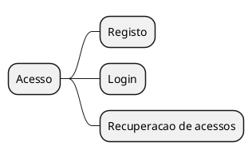

### 2. Home

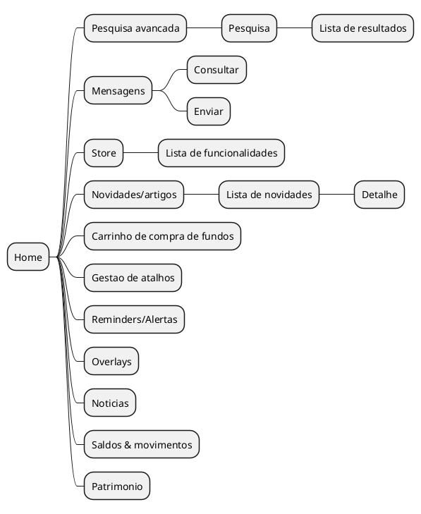

### 3. Área Pessoal

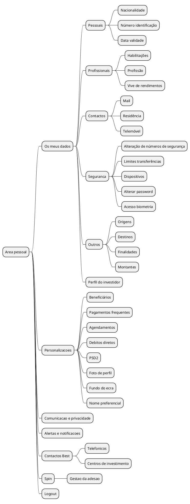

### 4. Patrimonio & Operacoes

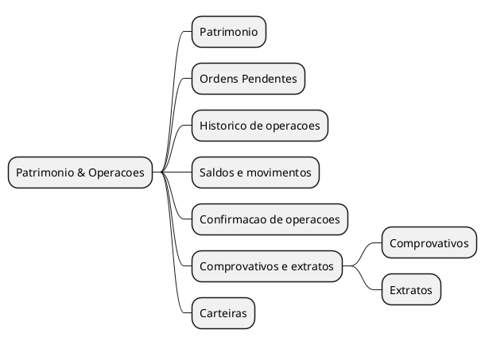

### 5. Dashboard

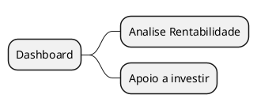

### 6. Outros Bancos

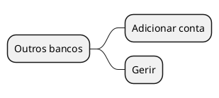

### 7. Investimentos

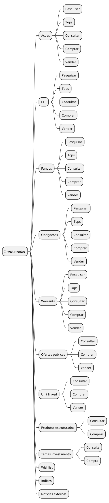

### 8. Poupanca

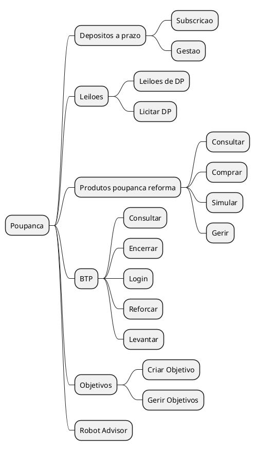

### 9. Credito

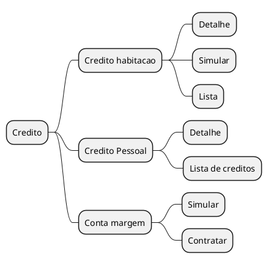

### 10. Transferencias

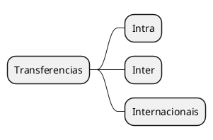

### 11. Pagamentos

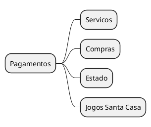

### 12. Carregamentos

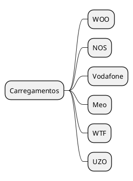

### 13. MBWay

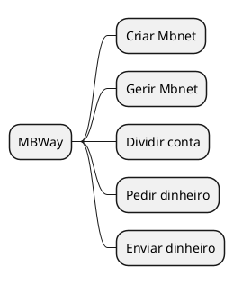

### 14. Cartoes

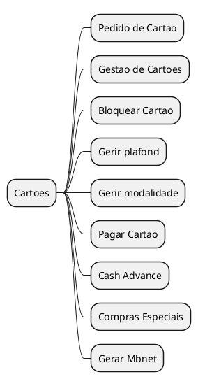

### 15. Eventos Corporativos

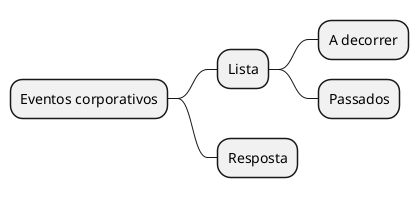

### 16. Outros

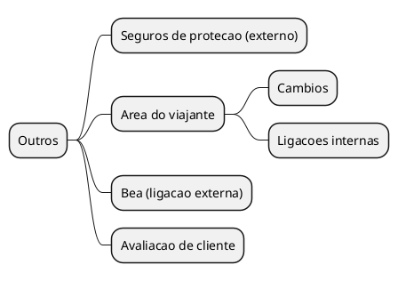

## Catalogo de Requisitos por Dominio

### Autenticacao e Seguranca

| ID | Requisito | Descricao | Prioridade | Fase |
|----|-----------|-----------|------------|------|
| RF-AUTH-001 | Login com credenciais | _Pendente_ | _Pendente_ | _Pendente_ |
| RF-AUTH-002 | Autenticacao MFA | _Pendente_ | _Pendente_ | _Pendente_ |
| RF-AUTH-003 | Recuperacao de password | _Pendente_ | _Pendente_ | _Pendente_ |
| RF-AUTH-004 | Gestao de sessoes | _Pendente_ | _Pendente_ | _Pendente_ |
| RF-AUTH-005 | Logout | _Pendente_ | _Pendente_ | _Pendente_ |

### Contas e Saldos

| ID | Requisito | Descricao | Prioridade | Fase |
|----|-----------|-----------|------------|------|
| RF-ACC-001 | Consulta de saldos | _Pendente_ | _Pendente_ | _Pendente_ |
| RF-ACC-002 | Lista de contas | _Pendente_ | _Pendente_ | _Pendente_ |
| RF-ACC-003 | Detalhes de conta | _Pendente_ | _Pendente_ | _Pendente_ |
| RF-ACC-004 | Extrato de movimentos | _Pendente_ | _Pendente_ | _Pendente_ |
| RF-ACC-005 | Filtros e pesquisa | _Pendente_ | _Pendente_ | _Pendente_ |
| RF-ACC-006 | Export de extrato (PDF) | _Pendente_ | _Pendente_ | _Pendente_ |

### Transferencias

| ID | Requisito | Descricao | Prioridade | Fase |
|----|-----------|-----------|------------|------|
| RF-TRF-001 | Transferencia entre contas proprias | _Pendente_ | _Pendente_ | _Pendente_ |
| RF-TRF-002 | Transferencia nacional | _Pendente_ | _Pendente_ | _Pendente_ |
| RF-TRF-003 | Transferencia SEPA | _Pendente_ | _Pendente_ | _Pendente_ |
| RF-TRF-004 | Transferencia internacional | _Pendente_ | _Pendente_ | _Pendente_ |
| RF-TRF-005 | Agendamento de transferencia | _Pendente_ | _Pendente_ | _Pendente_ |
| RF-TRF-006 | Transferencias recorrentes | _Pendente_ | _Pendente_ | _Pendente_ |

### Pagamentos

| ID | Requisito | Descricao | Prioridade | Fase |
|----|-----------|-----------|------------|------|
| RF-PAY-001 | Pagamento de servicos | _Pendente_ | _Pendente_ | _Pendente_ |
| RF-PAY-002 | Pagamento por referencia | _Pendente_ | _Pendente_ | _Pendente_ |
| RF-PAY-003 | Pagamento ao Estado | _Pendente_ | _Pendente_ | _Pendente_ |
| RF-PAY-004 | Debitos diretos | _Pendente_ | _Pendente_ | _Pendente_ |
| RF-PAY-005 | Pagamentos agendados | _Pendente_ | _Pendente_ | _Pendente_ |

### Cartoes

| ID | Requisito | Descricao | Prioridade | Fase |
|----|-----------|-----------|------------|------|
| RF-CRD-001 | Lista de cartoes | _Pendente_ | _Pendente_ | _Pendente_ |
| RF-CRD-002 | Detalhes do cartao | _Pendente_ | _Pendente_ | _Pendente_ |
| RF-CRD-003 | Movimentos do cartao | _Pendente_ | _Pendente_ | _Pendente_ |
| RF-CRD-004 | Bloqueio/desbloqueio | _Pendente_ | _Pendente_ | _Pendente_ |
| RF-CRD-005 | Alteracao de limites | _Pendente_ | _Pendente_ | _Pendente_ |
| RF-CRD-006 | Consulta/alteracao PIN | _Pendente_ | _Pendente_ | _Pendente_ |
| RF-CRD-007 | MBWay | _Pendente_ | _Pendente_ | _Pendente_ |

### Beneficiarios

| ID | Requisito | Descricao | Prioridade | Fase |
|----|-----------|-----------|------------|------|
| RF-BEN-001 | Lista de beneficiarios | _Pendente_ | _Pendente_ | _Pendente_ |
| RF-BEN-002 | Adicionar beneficiario | _Pendente_ | _Pendente_ | _Pendente_ |
| RF-BEN-003 | Editar beneficiario | _Pendente_ | _Pendente_ | _Pendente_ |
| RF-BEN-004 | Remover beneficiario | _Pendente_ | _Pendente_ | _Pendente_ |

### Notificacoes

| ID | Requisito | Descricao | Prioridade | Fase |
|----|-----------|-----------|------------|------|
| RF-NOT-001 | Centro de notificacoes | _Pendente_ | _Pendente_ | _Pendente_ |
| RF-NOT-002 | Configuracao de alertas | _Pendente_ | _Pendente_ | _Pendente_ |
| RF-NOT-003 | Historico de notificacoes | _Pendente_ | _Pendente_ | _Pendente_ |

### Definicoes e Perfil

| ID | Requisito | Descricao | Prioridade | Fase |
|----|-----------|-----------|------------|------|
| RF-SET-001 | Dados pessoais | _Pendente_ | _Pendente_ | _Pendente_ |
| RF-SET-002 | Alteracao de contactos | _Pendente_ | _Pendente_ | _Pendente_ |
| RF-SET-003 | Preferencias de notificacao | _Pendente_ | _Pendente_ | _Pendente_ |
| RF-SET-004 | Seguranca (alterar password) | _Pendente_ | _Pendente_ | _Pendente_ |
| RF-SET-005 | Gestao de dispositivos | _Pendente_ | _Pendente_ | _Pendente_ |

### Outros Dominios

| ID | Requisito | Descricao | Prioridade | Fase |
|----|-----------|-----------|------------|------|
| RF-OTH-001 | _A identificar_ | _Pendente_ | _Pendente_ | _Pendente_ |

## Decisoes

### Fases de Entrega
- **MVP:** _Lista de IDs_
- **Fase 1:** _Lista de IDs_
- **Fase 2:** _Lista de IDs_
- **Backlog:** _Lista de IDs_

### Funcionalidades Excluidas
_Lista de funcionalidades que NAO serao implementadas e justificativa_

## Restricoes Conhecidas

- Paridade total com App Mobile e requisito
- Autenticacao deve seguir mesmo fluxo OAuth do App

## Referencias

- [SEC-02-contexto-negocio-requisitos.md](../sections/SEC-02-contexto-negocio-requisitos.md)
- [DEF-01-business-objectives.md](DEF-01-business-objectives.md)
- Documentacao do App Mobile (se existir)
